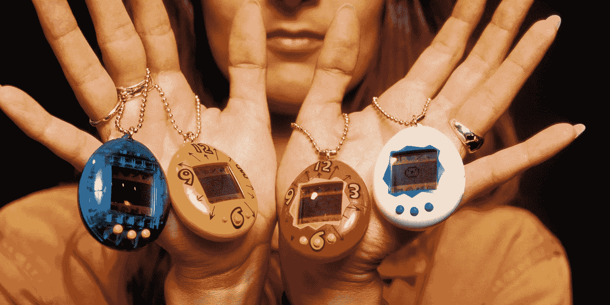
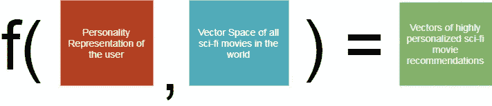

# 你会和你的 AI 有什么样的关系？

> 原文：<https://medium.com/hackernoon/what-kind-of-relationship-will-you-have-with-your-ai-b49dc2a940ee>

## 个性化世界中的友谊。

Photo by — Westworld, HBO

你是如何和一个人成为朋友的？是一个慢慢了解对方的过程还是一瞬间，刚一拍即合？我们是喜欢和已经成为我们生活一部分的人做朋友，还是有时候，因为距离，我们就让他们走了？

我在大学的时候和这个叫克莱尔的女孩是脸书的朋友，我们经常一起讨论科幻电影。虽然我们已经失去了联系，但我怀念我们在一个非常具体的话题上建立起来的友谊——科幻电影。

作为我正在进行的理解人工智能驱动的产品设计的研究的一部分，我发现社会心理学的确是理解世界的一种非常有趣的方式。**十个人可以在开始时阅读问题，并以非常不同的方式回答它们。**

关于人们如何交朋友，没有确切的算法。它实际上是两个人的个性和他们在一起的时间的函数；他们一起经历的经历。

今天，我们生活在一个不仅是个性化的时代，而且是一个极具侵略性的、强迫性的个性化时代。

> 无论我们走到哪里——从在亚马逊上购物还是在网飞上浏览电影，个性化都是伟大的产品用来给用户提供最佳体验的关键而神奇的组件之一。

我发现这源自于我们自己对被理解、被交谈的复杂需求。我们，人类，是一个非常社会化的物种。在某种程度上，有人会想，**为什么我们不理解个性心理学，并用它来制作不仅个性化，而且友好的应用程序呢？**

人们很自然地会想，现在我们与我们的应用程序有什么样的关系？一旦我们的应用变得更加智能和健谈，未来我们将与我们的人工智能机器人建立什么样的关系？

虽然这是一个非常开放的哲学问题，但让我们尝试将其归结为一个我们可以解决的技术问题。但为此，我不得不问自己一些更深层次的问题。

# 软件何时成为朋友？

Photo by — Huffpost

电子鸡？它们是你一直带在身边的电子宠物。这种数码宠物有自己的饥饿和幸福指数，以及生命周期。

它们的设计方式让用户在情感上投入其中。电子鸡是人们与本质上是 1 和 0 的事物建立关系的最好例子之一。软件确实有友谊的先例；我们以前又不是没有尝试过解决这个问题。

我喜欢科幻电影的原因可能和其他人喜欢科幻惊悚片的原因非常不同。当我们想要生成精确到故障的推荐时，协同过滤看到了一个巨大的缺点。但是点对点推荐呢？

克莱尔和我都是科幻迷，老实说，比起网飞推荐的电影，我更有可能去看她推荐的电影。

克莱尔从我的选择中得到了什么主流个性化算法没有的东西？嗯，就我记忆所及:

*   我们就许多科幻电影进行了几个小时的讨论和辩论。
*   她喜欢外星人电影，我不喜欢。
*   我甚至会喜欢她和《无限》这种比较柔和的科幻电影，她不会。
*   我们都喜欢超级英雄小说。我们都讨厌边缘。

回过头来看，我意识到我们已经在最好的神经[网络](https://hackernoon.com/tagged/network)中模拟了我们的共同偏好。我们的大脑。

> 我们为彼此准备的模型甚至可能比我们为自己准备的更好。这就是为什么建议的力量在点对点推荐中如此有效。

**你的密友比你自己更能了解你。**

# 通过友谊学习

Photo by — [rawpixel.com](https://unsplash.com/photos/T_X0O7pRgEE?utm_source=unsplash&utm_medium=referral&utm_content=creditCopyText) on [Unsplash](https://unsplash.com/?utm_source=unsplash&utm_medium=referral&utm_content=creditCopyText)

我对这个问题思考了一段时间，找到了一个可能的解决方案。单词向量[做得非常好的一件事是，它们获取自然语言文本，并为每个单词建立向量形式。理论上，您可以将语料库中的所有单词加在一起，并生成整个语料库的向量表示。](https://en.wikipedia.org/wiki/Word2vec)

是不是听起来很混乱？好吧，让我试着用一个非常简单的单词向量来解释。

*   在你的词汇中有三个词(攻击，防御，攻击)和许多包含这三个词的句子(攻击就像攻击)。进攻是防守的反义词。不攻击就是防御，等等)。
*   现在，当我们使用这些信息生成单词向量时，我们可以看到攻击和被攻击会彼此靠近，而防御会远离它们。

在神经网络的帮助下，单词向量是进行 NLP 的一种非常有效的方法。我可能会建立一个性格测试，甚至使用一些愚蠢的东西，如 [Myers-Briggs](https://en.wikipedia.org/wiki/Myers%E2%80%93Briggs_Type_Indicator) 来获得一些我自己性格的自然语言文本，或者尝试用我多年来在脸书上发送的短信和状态更新来确定同样的事情。**代表人格是问题中第一个已知的未知。**

然后，我所需要的就是[一个相似的电影矢量表示](http://movie2vec.wordpress.com/2016/03/22/clustering-movies-by-plot/)友谊算法可以理解。

The Friendship Function

**这里剩下的第二个已知的未知是神奇的友谊功能，它本身。**

在人工智能的眼中，友谊和理解是什么样的？它会是一个针对个人所有个性化需求而训练的神经网络，还是一个只接受个性作为用户输入的科幻电影通用模型？

> 为了弄清楚这一点，我们必须探索在我们自己眼中什么才是真正的友谊？是移情作用还是我们需要被理解，或者两者都有？

由于这是一次相当新奇的冒险，我找不到任何这方面的前期研究。这伤害了我写这篇文章的初衷。然而，[的人们现在制造了很多仿个性化聊天机器人。](https://www.wired.com/2015/06/chat-services-replace-friends/)

毕竟，这个想法并不那么牵强。

# 超越个人化的友谊

Photo by — Universal Pictures

尽管我试图编写代码并找出一个模型，但我仍然不知所措。我真的想建立这一点，并提出一个工作的个性化模型的基础上建立类似人类的上下文关系与机器人。我试了整整一周，结果毫无进展。当我想到我要解决的问题时，这是意料之中的。

我想我真的不知道那么多数据科学来解决它，但这给了我很多动力来学习更多关于这个主题的知识。如果你真的想试一试，我已经上传了 900 多部科幻电影的数据集[和它们的描述，这些都是我从烂番茄和维基百科搜集来的。](https://github.com/archimedes14/scifi-movies)

如果你在人工智能领域工作，这确实是一个神奇的时代。你只受限于你的想象力和创造力，当然还有你手头的数据。虽然有些想法可能听起来很荒谬，或者有些听起来很危险，但我认为在这种智力刺激的体育课上尝试看看你能举起多少重量是有好处的。

你我不仅仅局限于我们使用的[工具](https://hackernoon.com/tagged/tools)。在人工智能时代，只要有正确的数据集，你想象的任何事情都有可能实现。在我们对人工智能的探索中，我们不应该引入主从二分法，而是应该选择制造能够同情和友好的机器。

谁知道呢，教人工智能成为人类的朋友可能是将来某一天拯救我们于世界末日的唯一方法。；)

# 感谢阅读:)如果你喜欢它，请按下面的按钮，想按几次就按几次！这对我意义重大，鼓励我写更多这样的故事

*让我们也连线上*[*Twitter*](https://twitter.com/braveproductguy)*[*LinkedIn*](https://www.linkedin.com/in/shival-gupta-8b741b72/)*[*邮箱*](mailto:shival.gupta1@gmail.com) *或者在我的博客*[【shivalgupta.com】](http://www.shivalgupta.com)**