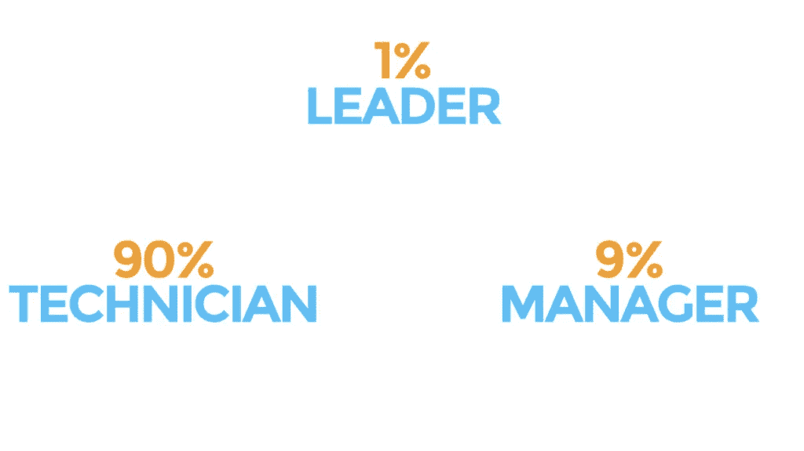

# 怎样才能成为一名优秀的经理？填补管理空白的 4 种方法

> 原文：<https://medium.com/hackernoon/what-makes-a-good-manager-4-ways-to-fill-your-missing-management-gap-709495fca8e7>

怎样才能成为一名优秀的经理，你如何填补你企业中的管理空白？

我们严重低估了当今企业的管理水平。管理是艰难的。不仅对经理如此，对企业也是如此。

我们一直低估了从做工作到管理工作的转变有多困难。

这是一个人职业生涯中最大的变化。很多时候，一个优秀的个人贡献者在没有技能、意愿或理解的情况下被“提拔”到管理层。

我们也尽量减少经理在企业中的重要性。正如我在 [**业务成长生命周期**](http://dandoadvisors.com/business-growth-lifecycle/) 中解释的，公司需要规模化的关键问题有三个:
**1。系统+流程
2。结盟领导团队
3。真正的管理文化**

一种实际的管理文化经常被忽视和摒弃。然而，当你有优秀的经理时，结果是指数级的。

最好的公司对优秀的管理有明确的定义。

其他企业告诉员工，“这些人现在向你汇报工作。”

# 管理的三个角色

要有真正的管理文化，你首先要了解管理的实际作用。如果你有擅长这三个领域的经理，管理将不会成为规模的障碍。

**1。获得结果:**管理层在商定的时间表和质量范围内高效地产生期望的结果。
–质量+时效=满意的客户
–效率(预算内)=利润
–质量+时效+效率=各方共赢。

2.选择和发展人:管理是激发人们发展技能、动机和对工作的承诺的催化剂。管理层需要:
–雇佣有发展潜力的个人。
–培养技术、沟通和判断技能(解决问题)

3.克服障碍:当完成工作遇到障碍时，管理层提供领导:
——将障碍转化为优势
——修改游戏计划以绕过或通过它们

管理的角色相对容易定义，但在实践中仍然很难。事实证明有一个简单的解释。

# 为什么管理人这么难？

“什么 90%的人天生就有成为伟大技术人员的能力。9%的人天生就有成为优秀管理者的能力。只有 1%的人天生就有领导能力。

90%的人有成为优秀技术人员的天赋:作为个人贡献者，在某个特定领域有天赋。它可能在销售、工程、营销、会计或任何其他部门。

如果你擅长你的工作，通常会发生什么？你升职了。然而，大多数情况下，一次“晋升”会导致对其他员工的管理。这不是合法的晋升，而是完全不同的技能组合。

想想你曾经工作过的最好的经理。他们有什么共同点？

# 怎样才能成为一名优秀的经理？

*   出色的人际交往技巧:经理知道如何与人相处，他们也喜欢这样。
*   好的激励者:管理者知道他们仅仅是通过他人获得结果的渠道。
*   好的培训师/老师:伟大的经理会教导和培训，他们不只是发号施令。
*   委派:最好的经理不只是委派他们没有时间做或不想做的事情，他们会委派他们团队的技能。
*   面向系统:系统和过程创造可预测的结果，伟大的管理者恰当地使用它们。
*   有条理:管理者可以同时兼顾许多不同的任务和项目。
*   负责:他们知道如何让别人负责，因为他们首先负责。
*   公平:他们客观并做出公平的决定。
*   伟大的倾听者:伟大的管理者倾听员工的真实需求。
*   计划者:他们计划工作，然后执行计划。
*   优秀的沟通者:伟大的管理者不需要成为有魅力的沟通者，但他们需要清晰的沟通。
*   发展员工:如果经理不发展员工，他们可能不是伟大的经理。
*   通过别人获得结果:以上的产物？伟大的经理通过团队成员取得成果。

现在，想象一个原型工程师。如果他们是一个伟大的工程师，他们总是拥有上述特质吗？通常不会。没关系。然而，一个伟大的工程师不需要“晋升”来管理他人。

# 管理+领导力:与生俱来？

这就是管理如此困难的原因:只有 9%的人具备成为天生管理者的基本基因构成。9%的个体简直是“天生”就有管理能力。

Are managers (and leaders) born — or made?

更少的人天生就有领导能力。只有 1%的人天生是有天赋的领导者。

# 如果有人不是天生的管理者呢？

这是否意味着你 90%的员工不能成为管理者或领导者？

当然不是。如果管理或[领导力](https://hackernoon.com/tagged/leadership)不是天生的，它只是需要额外的努力。

从个人贡献者到管理者或领导者的转变是一个人职业生涯中最困难的转变。因此，许多雇主会让技术人员接受管理培训，希望他们能成为一名出色的经理。没那么容易。

大多数管理培训项目都没有充分阐述培训的结果。此外，没有一个摄入/输出测量来知道程序是否成功。

管理培训可以发挥作用。但是员工需要致力于成为一名伟大的经理。这就是为什么我所有的员工评估都说如果[你没有成长，你就会](http://dandoadvisors.com/the-1-employee-expectation-that-leads-to-incredible-growth/)。

# 填补管理空白的 4 种方法

如果你的企业缺少真正的管理文化，有四种方法可以弥补:

**1。聘请外部经理**
外部招聘通常是缺乏经理的公司的第一步。然而，这是一个危险的问题。

许多其他企业“提升”了不具备管理素质的个人贡献者。你可以轻而易举地雇佣一个头衔泛滥的人——一个有头衔但没有管理技能的人。

如果从外部招聘管理人员，我建议你明确角色[来雇佣合适的人。这项工作的“测试”部分对于雇佣合适的外部经理至关重要。](https://dandoadvisors.com/how-to-give-role-clarity-job-description/)

**2。培养你的经理**
培养你的经理可能是最简单的选择。他们需要有正确的技能，但更重要的是，他们需要有意愿。

管理技能并不像管理意志那样具有挑战性。定义他们作为经理的角色，并对其进行压力测试。不要在“盒子”中定义当前经理的职能定义这个角色应该是什么，然后把这个人的名字编回去。

**3。找到藏在你公司里的经理**
虽然这种情况很少见，但找到“藏”在一个组织里的经理是可能的。一旦你定义了管理在你的组织中的角色，你公司中的某个人可能会立刻浮现在你脑海中，成为最合适的人选。

你需要小心，因为你可能不希望应付账款人员成为新的工程师经理。员工的新角色对个人和企业来说都是有益的。

**4。重新思考你的职业规划。**
如果你想升职，你的唯一路径是管理吗？你可能会重新思考这种哲学。

没有理由把你的优秀员工转移到一个他们无法胜任的新职位。没有书面规定说，在组织结构图中，经理需要比下属做得更多。

作为领导，制定规则灌输管理文化是你的责任。保持简单:确保你正确地定义了角色，并且你有能力和意愿去做这件事。

*本帖原载于 dandoadvisors.com***-*[*怎样才算是一个好的管理者*](https://dandoadvisors.com/makes-good-manager-4-ways-fill-management-gap/) *？**