# 是什么让风险投资家成功了？

> 原文：<https://medium.com/hackernoon/what-makes-a-venture-capitalist-tick-3cba42807993>

## 亲爱的黑客午间读者们:

用心的风投，[史蒂夫·施拉夫曼](https://medium.com/u/e687a7f386b9?source=post_page-----3cba42807993--------------------------------)，[在《黑客正午》](https://hackernoon.com/decoding-the-qualities-of-a-great-vc-d02f2d4da4ae)上解码了一个伟大风投的品质。并且 [AngelList](https://medium.com/u/5f84314adf6?source=post_page-----3cba42807993--------------------------------) 擅自[将其翻译成表情符号](https://twitter.com/AngelList/status/915601291623014401):

🤔好奇心

👩‍🔬专业知识

🚀热情

👩‍💻焦点

🌐网络

💵销售

✌️情商

🦄定罪

你怎么想呢?这是决定风险投资家成功的 8 个品质吗？加入这个 twitter 帖子或者发邮件给 Stories @ AMIpublications.com，在[黑客正午](http://hackernoon.com)上做出回应。

在另一篇[风险投资新闻](https://hackernoon.com/venture-capital/home)，[中，约翰·比格斯](https://medium.com/u/b4ae6a30a5d8?source=post_page-----3cba42807993--------------------------------)认为这个行业即将被颠覆，就像 20 世纪 90 年代末和 21 世纪初的印刷杂志行业一样。在《即将到来的风险投资风暴》中，他写道，“当世界能够用点击的手指投票，金钱像乙醚一样流动时，我们会发现自己身处这样一个世界，在这个世界中，长尾比权势集团知道得更多，做得更多。”

当谈到与投资者沟通时，[创始人集体](https://medium.com/u/f49435c6fa9?source=post_page-----3cba42807993--------------------------------)已经为你提供了[一个为忙碌的创始人](https://hackernoon.com/a-fill-in-the-blank-investor-update-template-for-busy-founders-d431c227347b)提供的投资者更新模板任何得到支持的创始人都可以使用这个省时工具。

## 接下来是本周的 17 个最佳科技故事:

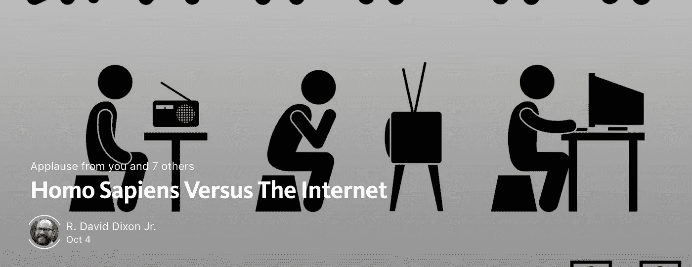

- [R. David Dixon Jr.](https://medium.com/u/92ded1d948a1?source=post_page-----3cba42807993--------------------------------)

- [Daniel van Flymen](https://medium.com/u/e6b17b7c57d5?source=post_page-----3cba42807993--------------------------------)

[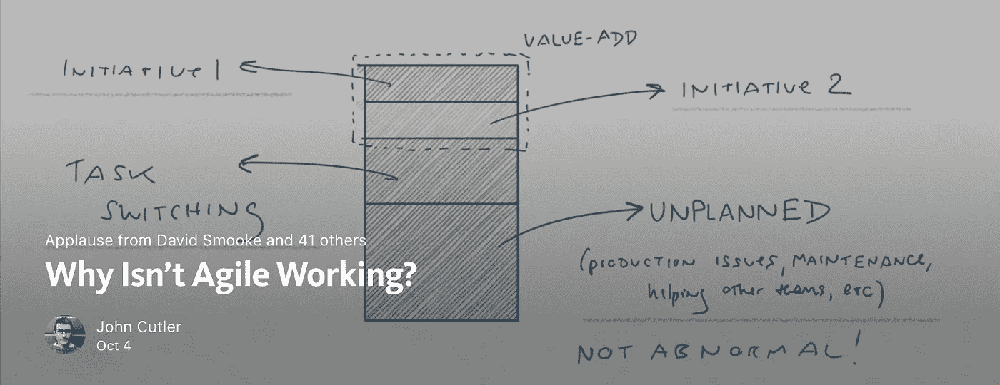](https://hackernoon.com/why-isnt-agile-working-d7127af1c552)

[-John Cutler](https://medium.com/u/4c3f4fe11e6b?source=post_page-----3cba42807993--------------------------------)

> 住在纽约，跟上机器人或比特币等技术趋势？在 10 月 24 日帮助塑造银行业的未来，赚取 500 美元。**感兴趣？拿** [**这个**](https://goo.gl/H3BrzB) **调查。如果你住在帕洛阿尔托，10 月 19 日也会有类似的活动。 [**邮件**](mailto:mnapombejra@cspace.com) 了解更多*。***

[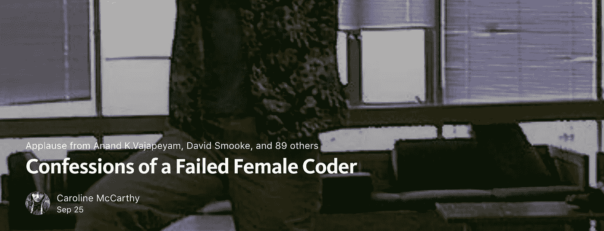](https://hackernoon.com/confessions-of-a-failed-female-coder-956cbe138c69)

- [Caroline McCarthy](https://medium.com/u/465d64c270a8?source=post_page-----3cba42807993--------------------------------)

[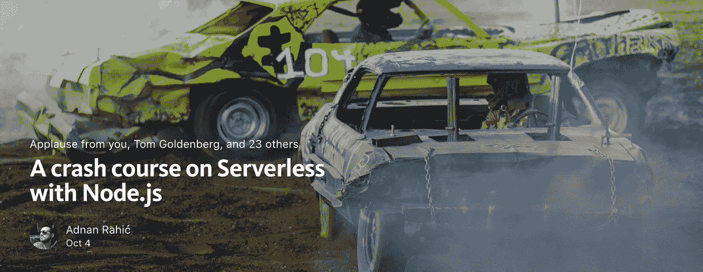](https://hackernoon.com/a-crash-course-on-serverless-with-node-js-632b37d58b44)

- [Adnan Rahić](https://medium.com/u/d1aeac7eadae?source=post_page-----3cba42807993--------------------------------)

[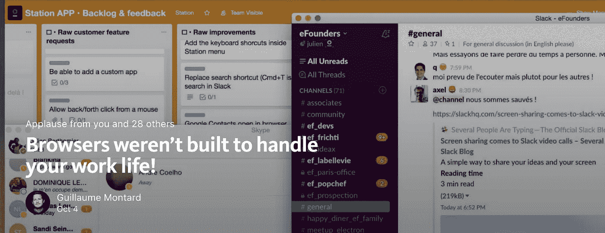](https://hackernoon.com/browser-werent-build-to-handle-your-work-life-b26873a3e4de)

- [Guillaume Montard](https://medium.com/u/cf64cde87a0d?source=post_page-----3cba42807993--------------------------------)

[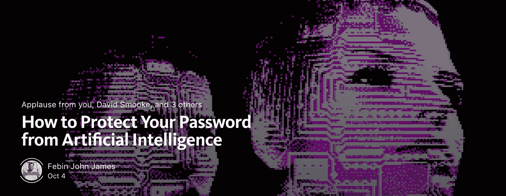](https://hackernoon.com/how-to-protect-your-password-from-artificial-intelligence-e66268bca4e0)

- [Febin John James](https://medium.com/u/75a616711f4e?source=post_page-----3cba42807993--------------------------------). Read more about AI.

[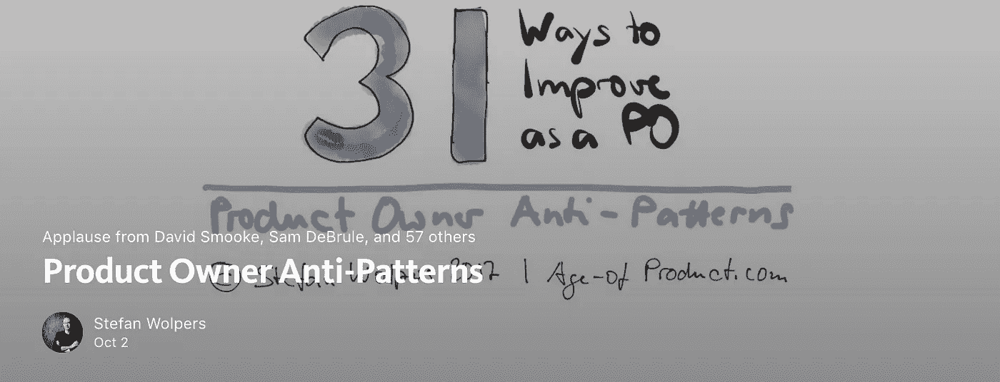](https://hackernoon.com/product-owner-anti-patterns-22ed1f989867)

- [Stefan Wolpers](https://medium.com/u/8ee338df1554?source=post_page-----3cba42807993--------------------------------)

[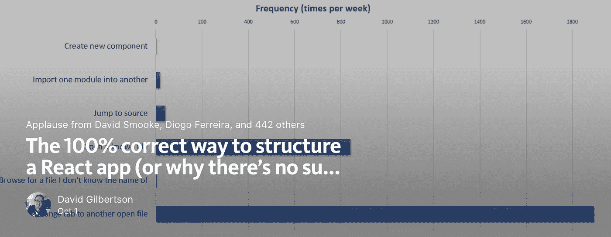](https://hackernoon.com/the-100-correct-way-to-structure-a-react-app-or-why-theres-no-such-thing-3ede534ef1ed)

- [David Gilbertson](https://medium.com/u/f735d3b0f2f3?source=post_page-----3cba42807993--------------------------------)

[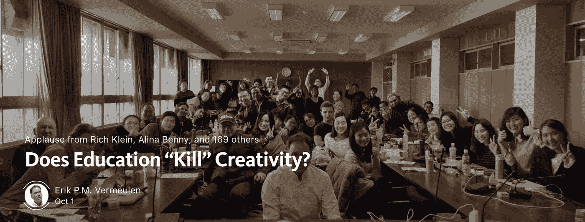](https://hackernoon.com/does-education-kill-creativity-f3178540f5e3)

- [Erik P.M. Vermeulen](https://medium.com/u/9eaa7a0096d3?source=post_page-----3cba42807993--------------------------------)

[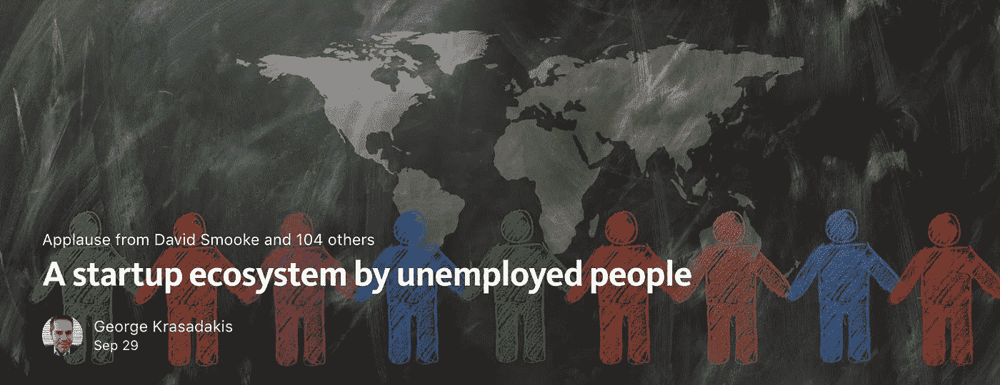](https://hackernoon.com/a-startup-ecosystem-by-unemployed-people-551a42399400)

- [George Krasadakis](https://medium.com/u/f050c7452249?source=post_page-----3cba42807993--------------------------------)

[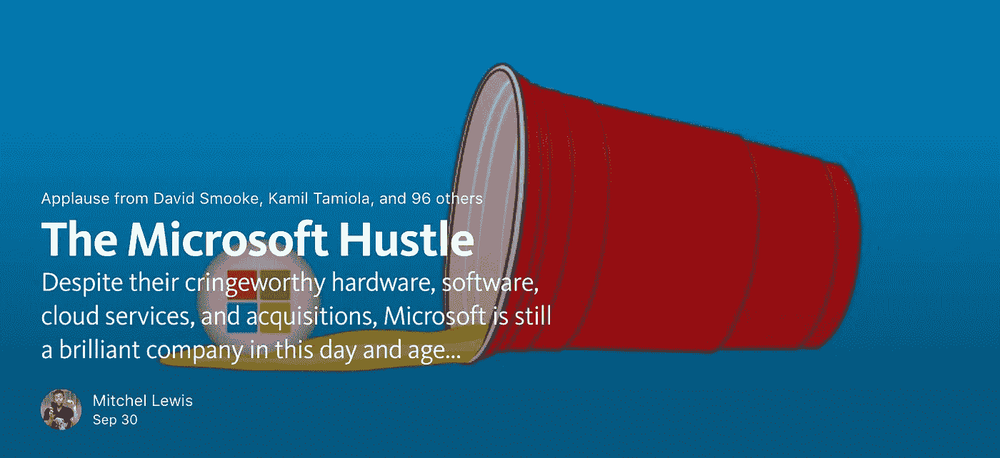](https://hackernoon.com/the-microsoft-hustle-355f818161a6)

- [Mitchel Lewis](https://medium.com/u/cfaf72ce1535?source=post_page-----3cba42807993--------------------------------)

[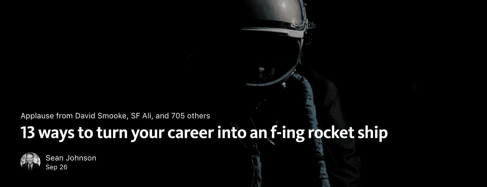](https://hackernoon.com/13-ways-to-turn-your-career-into-an-f-ing-rocket-ship-4c772b7c2642)

- [Sean Johnson](https://medium.com/u/dcc36e66f842?source=post_page-----3cba42807993--------------------------------)

[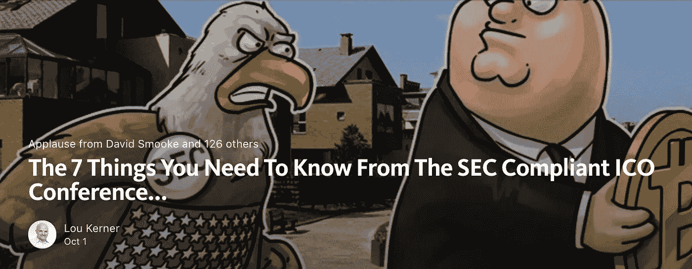](https://hackernoon.com/the-7-things-you-need-to-know-from-the-sec-compliant-ico-conference-call-347822f5419f)

— [Lou Kerner](https://medium.com/u/b01056393401?source=post_page-----3cba42807993--------------------------------)

[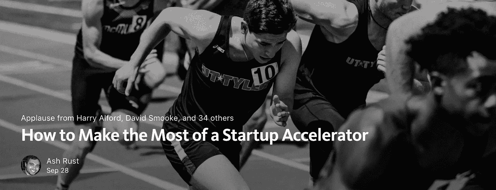](https://hackernoon.com/how-to-make-the-most-of-a-startup-accelerator-222c02b7b5e2)

- [Ash Rust](https://medium.com/u/582c1c98356d?source=post_page-----3cba42807993--------------------------------)

[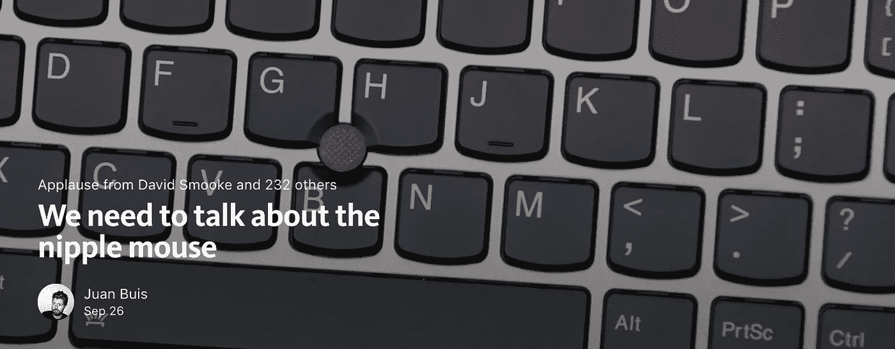](https://hackernoon.com/we-need-to-talk-about-the-nipple-mouse-50fc18cfcebf)

- [Juan Buis](https://medium.com/u/144bf6d44560?source=post_page-----3cba42807993--------------------------------)

[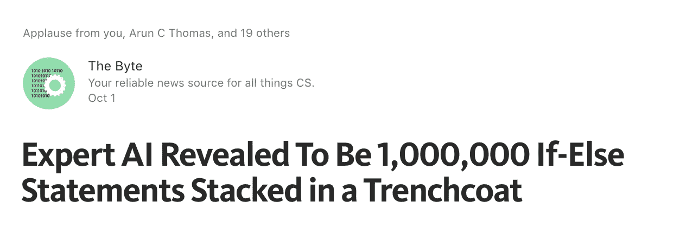](https://hackernoon.com/expert-ai-revealed-to-be-1-000-000-if-else-statements-stacked-in-a-trenchcoat-898e59ce8efc)

- [The Byte](https://medium.com/u/f9dcbc00123a?source=post_page-----3cba42807993--------------------------------)

## 直到下一次，不要把世界的现实想当然。

亲切的问候，

[大卫·斯穆克](http://www.davidsmooke.net/)，[阿米](https://medium.com/u/1fedc8fffada?source=post_page-----3cba42807993--------------------------------)

**附页** *详见**[***最新***](http://hackernoon.com/latest)*[***趋势***](http://hackernoon.com/trending)**和* [***存档*** ](http://hackernoon.com/archive)***