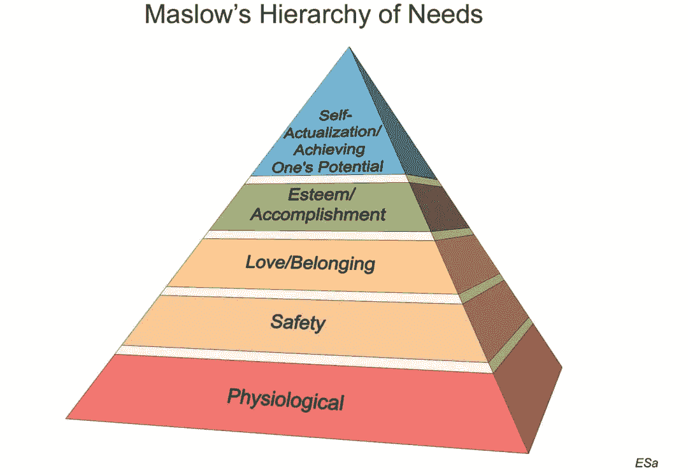

# 关于领导力，马斯洛能教给我们什么

> 原文：<https://medium.com/hackernoon/what-maslow-can-teach-us-about-leadership-a1088198874>

1943 年，亚伯拉罕·马斯洛提出‘人的需求层次’理论；俗称马斯洛金字塔。本质上，马斯洛揭示了人类有一个上升的需求层次，在金字塔的下一个层次的需求被寻求之前，每一个需求都必须被满足。

金字塔的底部是“基本生理”需求，如空气、食物、住所和性冲动等。这对纯粹的生存和繁衍是必不可少的。下一个层次是“安全”，其范围从儿童感到身体安全的需要，到成人以储蓄、保险等形式获得工作保障或经济安全的需要。

在安全之后，是作为群体一部分的“社会归属感”的需求。我们的身份感，无论是属于一个社区、一所学校、一个班级、俱乐部、朋友圈还是一个同事，都源于这种归属感。

第四个层次的需求是“自尊”,马斯洛将其描述为需要感受到外部和内部的重视和尊重。在外部层面，这可以表现为同行的认可、奖励和物质成就。在内部层面，这种需求表现为内心的韧性、自信和对自己的掌控。

马斯洛金字塔的最高层次是“自我实现”的需求。正是在这个层次上，一个人实现其全部潜力的内心愿望才会凸显出来。因此，一个合格的专业人士可能会决定辞职，因为她想成为一个理想的父母。另一位家长可能会忽略作为社会工作者自我实现的其他责任。

虽然我们可能熟悉马斯洛需求层次的概念，但我们可能没有意识到它对未来领导风格的影响。

人类是群居动物，我们生活的每一刻都被成为更大整体的一部分的需求所塑造。不像一些动物在出生后几个月甚至几天内就能自立，人类儿童天生就有讨人喜欢和被认可的能力，因为这些能力一直存在到青春期。因此，从出生开始，人类就受到群体认可或指导其行为的“外部记分卡”的驱使。

随着我们的成长，这种对外部认可的需求也越来越强烈。例如，大多数 40 多岁或 50 多岁的领导人都会认同 20 世纪 70 年代和 80 年代的外部记分卡，当时从事科学很好，从事商业很好，而从事人文学科被认为是最后一步。同样，破解公务员系统，或者进入常春藤盟校，获得“第一天”的职位，在跨国公司获得六位数的薪水，某些品牌的汽车，衣服等等。都是外部记分卡。这些都是马斯洛层级中的“安全”和“社会归属感”级别，其特征是关注薪酬、医疗福利、成为高级领导团队的一部分等因素。

随着领导者在职业生涯中的成长，他们跨越了“安全”和“社会归属感”的层次，进入了“自尊”的层次。这就是为什么他们发现，如果“头衔”或标签没有激励他们，薪酬本身可能不够。这也是大多数领导人意识到金钱本身在某一点之外具有递减回报的水平，这就是为什么有无数的例子表明，领导人选择继续从事报酬相对较低、但更受尊重的工作。

金字塔的最高层次—“自我实现”是领导者第一次必须开发自己的“内部记分卡”。对于那些无法摆脱外部记分卡灌输的人来说，这可能是一个巨大的挑战。这是因为我们的父母、社会、工作场所等都给了我们外部记分卡。但是内部记分卡必须由每个领导者自己开发。外部记分卡由有形的、可测量的且因此可比较的元素组成。例如，两位领导人可以比较他们各自的头衔、报酬或组织内的权力，但不能比较他们何时可以舒适地退休，或者谁更快乐，或者谁更满意。这些都是无形的、定制的，因此无与伦比。

许多领导者犯的第一个错误是继续使用外部记分卡，这在马斯洛金字塔的前四个阶段对他们很有帮助，即使他们已经准备好进入第五个层次。这有点像试图用伦敦地铁的地图在缅甸的丛林中航行。这些领导者不断在外部记分卡上积累“分数”——充其量只能给予外部尊重，而不能给予内部快乐或成就感。事实上，他们无法放下外部记分卡往往是他们无法充分发挥潜力的唯一原因。

第二个错误是，他们认为五个阶段的规模在他们的下属中是线性的。未来的劳动力就不是这样了。虽然在过去，五个层次之间的关系是相对有序的，但后代并不认为需要线性级数。相反，他们中的许多人选择更早地解决自我实现的需要，因此不是纯粹受外部记分卡的激励。对于那些自己的记分卡强调退休后福利、既得股票期权、退休金基金等的领导人来说，这可能令人困惑。

这些领导人必须接受这样一个事实，即未来劳动力的每一次暴露都比他们自己提前数年。年轻一代对技术和信息的获取压缩了体验的时间线以及马斯洛金字塔的层次。今天的年轻人不想等上几十年才寻找自己的内部记分卡。如果年长的领导者没有抓住这一根本转变，他们将继续使用自己的基准作为领导工具，并对其无效性感到困惑。

具有讽刺意味的是，这种转变对那些仍然坚持“外部记分卡”的领导者来说也是一个机会。不仅实行反向指导(这是一种企业行话，指从知道的年轻人那里学习你不知道的东西)，还考虑反向榜样，这将有利于领导者。高层领导可以选择受到年轻员工对自我实现的追求的激励，这种追求通常在比他们更早的阶段就开始了，并通过积极参与来支持这一旅程。这不仅会让他们成为 VUCA 世界(动荡、不确定、复杂和模糊)中的有效领导者，还会让他们更有成就感。

*作者是信实工业公司前首席执行官兼总裁。他发推特@captraman，观点是个人的。*