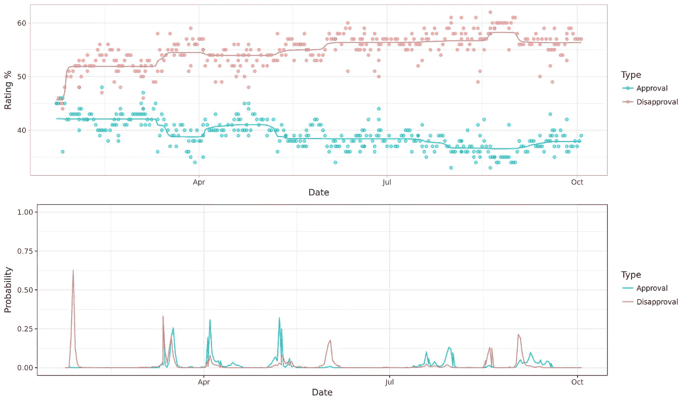
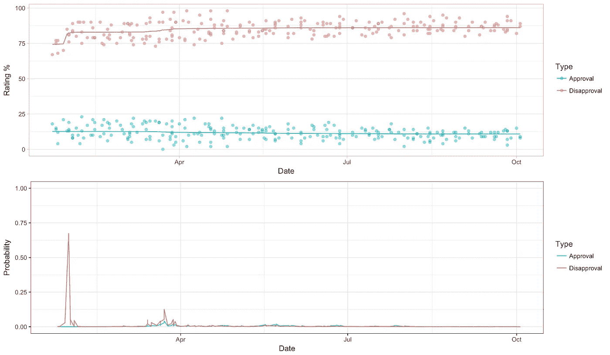
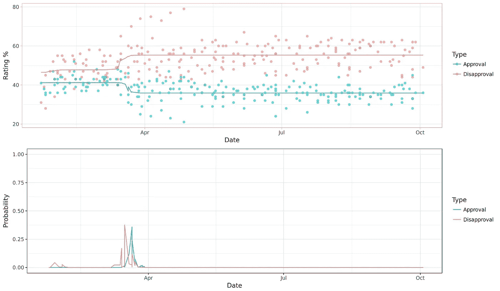

# 特朗普支持者/反对者关心什么？轮询数据的贝叶斯分析

> 原文：<https://medium.com/hackernoon/what-matters-to-trump-supporters-opposers-a-bayesian-analysis-of-polling-data-ab6ab9aaa29d>

几天前，我看到有人试图对特朗普的民调支持率进行相关性分析。这个想法是，可以用另一组数据找到他赞成/反对的预测器吗？

这让我想到——也许理解特朗普支持率变化的最佳方式不是寻找相关性，而是寻找转折点。区别在于——相关性是两个变量之间的关系，而转折点是导致数字上升或下降的独特事件。

幸运的是，这种分析使用贝叶斯推理是可能的。贝叶斯是魔法科学，基本上它允许我们为一个假设事件的发生创造后验概率。它与传统统计学的不同之处在于，它不是一种通过/失败测试，而是一种更新概率的方法。这很复杂，但就目前而言，我们只能说，我们可以通过一个特定事件对未来民调结果的影响来估计它对一群选民有多重要。

Trump’s approval/disapproval with all voters. Red line = disapproval, blue line = approval. Rating % is at the top, while the Bayesian change-point posterior probabilities are below. The spikes in of the graph indicate when important events happened.

特朗普支持率的变化通常不是渐进的。相反，它们发生在对美国人如何看待他有长期影响的短期事件中。首先，注意最左边的最大后验概率——它发生在 1 月下旬。这发生在他就职典礼之后，当时为了吹嘘他在就职典礼上的人数，开了一个紧急新闻发布会。

但是，到底是谁造成了他的民调数字的巨大转变呢？事实证明，那时特朗普失去了为数不多的犹豫不决的民主党人。

Trump lost support from Democrats very early on in his administration, and hasn’t made any progress recapturing their support

他不赞成的变化很大，但他赞成的变化并不大。这告诉我们，在特朗普政府的早期——实际上在几个小时内——特朗普有相当大一部分民主党人，大约 10%左右，他们对他的政府犹豫不决。他失去了他们，一个实际上没有实质内容的问题。有趣的是，这只让他在民主党中付出了代价——独立选民对此并不太担心。

Trump’s performance with independent voters. Someone tapped Trump’s approval

独立人士倾向于不赞成，但在 3 月中旬之前，大部分人保持稳定，当时不赞成，然后赞成，反对特朗普。值得注意的是，这一次没有重大的政策变化——这是在 AHCA 失败(3 月 24 日)之前。这是一个从-8 到-19 点的转变。有可能特朗普在一条推特上失去了独立人士的支持。

有趣的是这里的步进运动。首先，到 3 月 16 日，更多的无党派人士开始表示反对。然后，几天后的 3 月 21 日，他失去了支持。发生了什么事？很难说，但最有可能的情况可能是，特朗普在推特上发泄毫无根据的指控的倾向首先让犹豫不决的独立人士不赞成，然后让更支持的独立人士转向犹豫不决的专栏。这表明特朗普的推文可能会对他在无党派人士中的支持构成生存风险。但是，也有可能在三月份对有说服力的独立人士造成了损害。

共和党怎么样？

GOP has mostly been fine with Trump… …with one exception in May

5 月 9 日，川普解雇了联邦调查局第七任局长詹姆斯·科米。他这么做的原因无处不在——首先是因为科米在臭名昭著的[罗森斯坦备忘录](https://www.theatlantic.com/politics/archive/2017/05/rosenstein-letter-annotated/526116/)中对希拉里的处理。然后，川普在接受莱斯特·赫特采访时削弱了这一点，他说[他解雇科米是因为通俄调查](https://www.nbcnews.com/news/us-news/trump-reveals-he-asked-comey-whether-he-was-under-investigation-n757821)。

 [## 观看莱斯特·赫特对川普总统的长篇采访

### 在 NBC 新闻的独家采访中，川普总统向莱斯特·赫特透露，他准备解雇联邦调查局局长…

www.nbcnews.com](https://www.nbcnews.com/widget/video-embed/941854787582) 

这对共和党人中的特朗普造成了真正的伤害——赞成和反对同时出现。特朗普在共和党的支持率从+72 上升到+64，这明显缩小了他在共和党的支持率。

那么，我们在这里能学到什么呢？

首先，基于贝叶斯转折点分析，我认为特朗普的民调数据中只有三个真正的变化值得大书特书。首先，他在第一天就失去了民主党人，因为他用就职典礼人群的照片挑起争端。第二，根据他在 3 月份发布的奥巴马“tapp”推文，他失去了独立选民。第三，当他解雇詹姆斯·科米时，他失去了一部分共和党人。

让我们花一点时间来考虑什么没有改变特朗普的数字。首先，巴黎气候协议，DACA，奥巴马医改的反复起伏，这些事情对他在美国人民中的支持没有可衡量的影响。我怀疑它们是重要的——但它们应该被视为强化立场，而不是创造立场。

从这些数字中可以学到的最后一课是独立选民和共和党选民的不同反应。对于无党派人士，我们看到了一个两步过程:首先，一部分人走向反对，然后另一部分人远离赞成。相比之下，在科米被解雇后，共和党人的运动非常激烈。我们可以从两个方面来解释这一点。首先，当有争议的事件发生时，独立人士可能会犹豫放弃支持，但共和党人可能不会。第二，特朗普因俄罗斯丑闻和共和党特别顾问罗伯特·穆勒而面临巨大危险。这将按下同样的按钮，适度地——但实质性地——在共和党内转移他的数字。

p.s .如果你用 GitHub，可以在这里用代码[工作。](https://github.com/leedrake5/trumpChangePoint)

参考资料:

1.  艾默生，J.W. 2007。bcp:一个 R 包，用于执行变化点问题的贝叶斯分析。统计软件杂志 23(3):1–13
2.  巴里博士，哈迪根，司法行政官，1993 年。变点问题的贝叶斯分析。美国统计协会杂志 35(3)，309–319