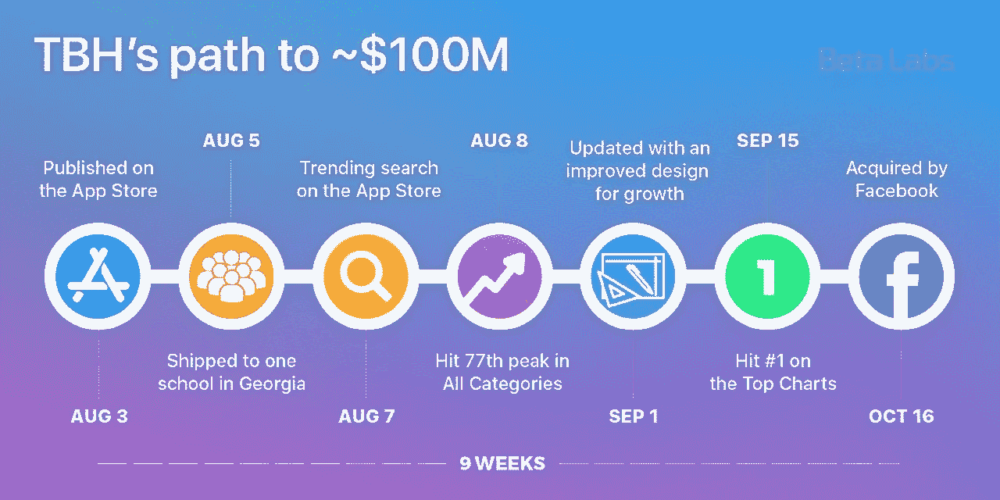
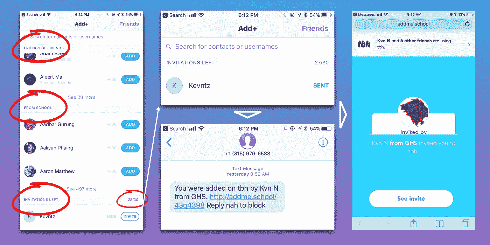
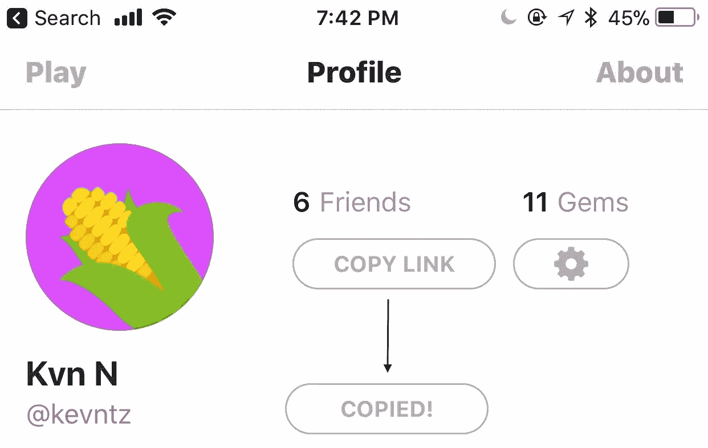
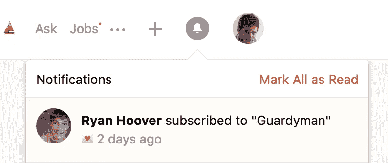
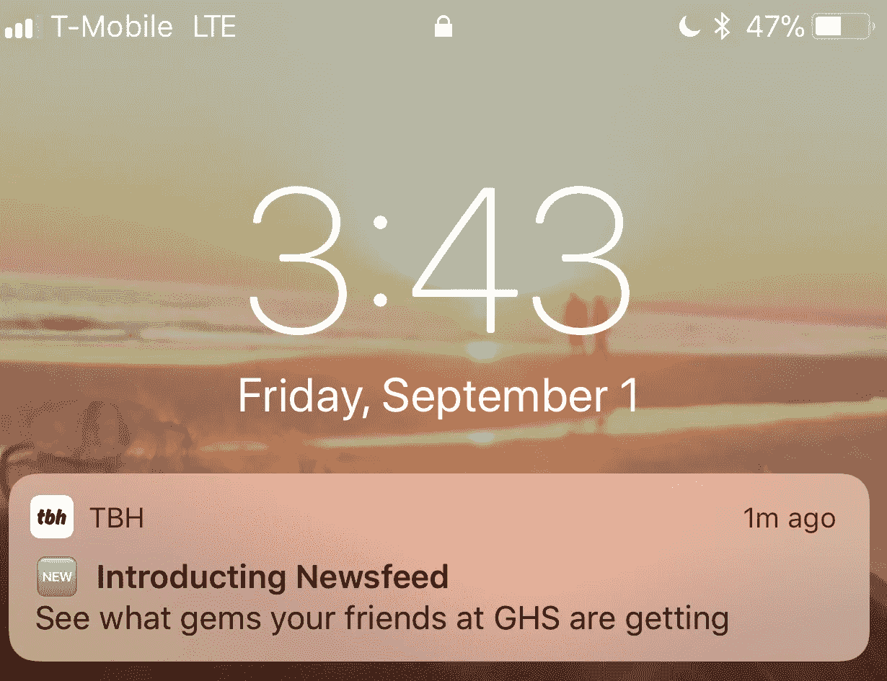
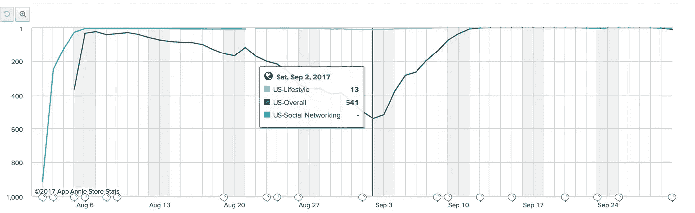

# 大多数人在 TBH 看不到的是，一款售价约 1 亿美元、仅在 9 周前推出的应用

> 原文：<https://medium.com/hackernoon/what-most-dont-see-in-tbh-an-app-sold-for-100m-and-launched-only-9-weeks-ago-f15edd11505f>

## 为急于一夜成名的产品制造商提供的关于 TBH 的三大见解

更新:Woow！感谢所有的掌声！这篇文章不是关于脸书为 TBH 付出的代价的报告。这是对 TBH 成功和被收购的分析。脸书没有透露出售价格，尼基塔也没有告诉我。我在看了[这个 TC](https://techcrunch.com/2017/10/16/facebook-acquires-anonymous-teen-compliment-app-tbh-will-let-it-run/) 爆料报道和很多类似[这个 CNN](https://twitter.com/thetbhapp/status/920477433857318912) 的猜测后写了~ 1 亿美元，说价格接近 1 亿美元。我认为，无论是 1 亿美元还是 1000 万美元，都是疯狂的。

TBH’s path to ~$100M

如果你稍微深入研究一下创建移动应用程序的业务，你会发现你需要找到正确的**获取渠道**，建立你的**盈利战略和合作伙伴**，有一个**清晰的品牌**和**出色的图形**，整合正确的**工具来衡量一切**(从获取到投资回报)，在应用程序商店上取得成功所需的所有努力的清单相当长。

我写了一篇关于其中一些努力的文章，包括一些有趣的见解，如 ASO 的工作如何使[我们的应用“真心话大冒险”每月获得 15000 美元和 60000 新用户](https://blog.beta.uy/we-are-2-9a7318391630),仅仅是为了给在家庭聚会上随机搜索“一个这样的应用”的人定位。我建议你快速阅读一下:

 [## 我们如何在 App Store 上取得成功并获得 400 万用户

### 一年多前，我们成立了 Beta Labs，目标是创建吸引人的移动应用程序，为年轻人量身定制…

hackernoon.com](https://hackernoon.com/our-legacy-to-app-makers-how-we-succeeded-on-the-app-store-and-acquired-4-000-000-users-a66a9e01253d) 

但是，如果你有能力、营销预算或技能将一个应用程序带到前 10 名的排行榜，这并不重要，如果它不是用户喜爱、分享和参与的产品，在小范围内，它不会成功。在 [Beta Labs](https://medium.com/u/2468c5a3f869?source=post_page-----f15edd11505f--------------------------------) ，我们已经开发了许多进入前十名的移动应用。在某些情况下，它可能有很高的利润，但它只持续很短的时间。这就是为什么我们非常赞同山姆·奥特曼的名言:

> “先做一个小部分用户喜爱的产品，比做一个大部分用户喜欢的产品要好得多。”

## 那么 TBH 成功的关键是什么呢？

> 关注有机增长。

作为一个精通技术的读者，你可能会想“WTF？这就是你能提供的全部见解吗？我知道 TBH 火了。问题在于，制造商似乎低估了“为增长而设计”让某样东西像病毒一样传播的力量。如果你看一下 PH 上最近的 1000 个发布，只有不到 10%有增长机制。让一个应用程序像病毒一样传播需要努力，这也是我想谈的。

自从 TBH 登上热门搜索以来，我在研究它的过程中学到了很多。趋势搜索选项卡是查看应用程序的关键指标。热门排行榜可能会被机器人统治，但如果它命中趋势搜索，它一定是在做正确的事情。这是我日常工作的一部分，我向任何在网上建立任何东西的人推荐它。

## TBH 和产品搜寻分享成功的关键

我也从 Product Hunt 和它的社区中学到了很多。我相信产品搜索是一个制造商应该在构建任何东西的过程中使用的第一资源，无论目标受众是否是产品搜索社区，它都将帮助你获得可见性和反馈。

他们的最新工具 [Ship](https://www.producthunt.com/ship) 不仅帮助初创公司启动，还教会制造商如何制造东西，让他们能够利用产品搜寻团队获得的知识。我昨天在 [Ryan](https://medium.com/u/c2146664c8e4?source=post_page-----f15edd11505f--------------------------------) 发了推文，我非常喜欢他的评论，因为我们也有这个共同的目标:

我想分享我从 TBH 学到的三点经验，所以你可能想知道为什么这些经验与产品搜寻有关？因为我相信，虽然 TBH 和 ProductHunt 拥有完全不同的用户群，但他们都优先考虑这三项努力来建立一个令人敬畏的社区，产品制造商也应该如此。

## 1-疯狂地想要从用户那里找到关键的见解

**准确而深入地了解用户的能力是聪明工作与努力构建无用东西的区别。**

这就是为什么没有一夜成功的原因。如果你想做一些有用的东西，反馈循环没有捷径可走。是的，这是一个吸引人的标题。由于从首次出版到被收购的时间，TBH 可以被认为是一个几乎一夜成名的产品。然而，[尼基塔](https://medium.com/u/e0096e889d8b?source=post_page-----f15edd11505f--------------------------------)和他的团队花了 14 个应用程序和 5 年时间，才获得正确的见解，建造出真正有价值的东西。到目前为止，我们已经建造了 10 个，我们仍在按计划进行！

有很多方法可以看出背后的团队是如何不断地寻求反馈、分析行为和实现用户真正想要的。从应用程序内置的反馈请求到不同学校的缓慢推广。“我们把它运到了佐治亚州的一所学校。全校百分之四十的人第一天就下载了”。

就我个人而言，我认为这是脸书购买它的主要原因之一。只有少数人能真正理解 Z 世代(这里是对 [Tiffany Zhong](https://medium.com/u/e0f54ea3c1a5?source=post_page-----f15edd11505f--------------------------------) 的强制大喊)。同样值得注意的是引用来自[的 Josh Elman](https://medium.com/u/3fca1ea3f7bf?source=post_page-----f15edd11505f--------------------------------) 在 TechCrunch 上的爆料:“Nikita 和他的团队已经发现了很多关于青少年如何使用产品的问题。这是为数不多的获得这种认养的作品之一，应该庆祝一下。

他们能够捕捉到的一个关键见解是 Secret、Yik Yak 和 Sarahah 等应用程序无法捕捉到的:虽然青少年喜欢分享和接收匿名评论，但那些积极向上的评论是多巴胺诱导的评论。

就像 TBH 一样，产品搜寻团队付出巨大努力，不断了解用户真正想要的是什么。这样的例子不胜枚举。只看他们的电子邮件文案，你就可以知道他们总是如何要求反馈，电子邮件是从 Ryan 的电子邮件中发出的(建立融洽关系)，首要的行动号召总是加入讨论。

## 2-为增长而设计 it

如果你做了对某些用户真正有价值的东西，他们会愿意分享。然而，如果你不鼓励它，提供可笑的简单机制，病毒式增长就不会发生。

为增长而设计不仅仅是实现增长技巧，它是关于在产品中深度整合传播信息的体验。这是产品设计师需要融入的心态。

举个例子，创建一个“只邀请”的平台从一开始就是为发展而设计的，只要它能为用户提供邀请他人的机制。ProductHunt 和 TBH 都有只接受邀请的功能。这也有助于产生成为拥有访问权限的幸运用户之一的愿望。让我们为他们每个人分解一下。

*   **通讯录访问**

TBH 在实际使用该应用程序之前要求访问地址簿。这是一个很大的要求，并阻碍了增长，但可能口碑足够强大，使这些敏感信息的访问。TBH 通过这种黑客技术成长了很多，但这种[并不意味着滥发用户的通讯录](https://techcrunch.com/2016/12/07/sequoia-backed-video-chat-app-tribe-spammed-its-customers-address-books/)，它只是方便用户邀请他人。

Adding users inside close circles and inviting new users through SMS with only one tap.

*   **个人资料链接**

作为一名 TBH 用户，我想拥有追随者。为什么？因为我想赚更多的宝石。为了实现这一点，我需要在民意调查中被选中。因此，我需要作为一个可能的选择出现在民意调查中。TBH 鼓励用户分享个人资料的方式之一是，创造一种简单的体验，在 Snapchat 上分享你的 TBH 个人资料的链接。

链接到应用程序内部的特定资源(深度链接)是一种很难建立的体验。巨大的担保[分支指标](https://medium.com/u/6d60f0f3146a?source=post_page-----f15edd11505f--------------------------------)在这里，不知道 TBH 是否在使用它们，但它们非常容易提供定制的体验来创造这些类型的体验。

*   **推特自动化**

产品搜索与 Twitter 无缝集成，支持各种自动化。这就是邀请流如何在产品搜索中发挥作用，促进 Twitter 上的口碑传播和社交互动。

Twitter automation on ProductHunt

*   **非技术性增长设计**

增长机制不一定是技术上复杂的东西。例如，照片/视频编辑应用程序可以添加水印，而不会破坏用户将共享的照片。[这正是我们如何进入美国前 10 名排行榜以及 20 多个国家前 9 名排行榜的原因](https://hackernoon.com/how-we-got-300k-users-in-24-hours-and-reached-1-in-the-app-store-c997a8f83756)(我们正在进行 2017 年的更新)。

为增长而设计意味着在广告上花更少的钱，因为你只需要播种第一批用户，他们就会成为大使。这就是影响者营销在营销策略中发挥关键作用的地方；影响者可以使用增长机制。

这是 ProductHunt 帮助制造商出货的另一种方式。当有人订阅即将推出的产品时，它会自动通知所有关注者(只是在通知框上，不要大惊小怪)。这基本上意味着这个人对制造商或产品的认可。检查完即将到来的页面后，您可以清楚地看到他们在做什么。但这很清楚，因为 ProductHunt 教会了制作者如何用标语和占位符文本来解释它。这也有助于展示社会证明显示订户。

## 3-提高记忆力和与触发因素的互动

保留指标是真正揭示产品潜力的指标。内部和外部触发因素是实现高保留率的关键。

理想情况下，作为一个产品制造者，你希望在你的用户心目中有一席之地。我不需要通知或外部触发来登录产品搜索，因为它是我日常工作的一部分，以了解技术方面的新变化。青少年想看看他们的朋友得到了什么宝石。我认为这是 TBH 为提高客户保留率和兴趣所做的最大更新。**本更新发布于 9 月 1 日。**

如果你看看 TBH 从 [App Annie](http://appannie.com) 的下载数据，9 月 1 日，该应用处于最低点。此次更新包括许多其他设计改进，有助于推动增长。在与尼基塔交谈后，他告诉我，新闻供稿并不是让他们再次登上排行榜的真正原因。这只是他们对释放增长感到舒适的时刻。这是他们开始传播病毒的地方。这是图表:

TBH download chart

需要做大量的工作来在用户的头脑中实现一个内部触发器，让他们回到你的产品，没有任何其他东西让他们记住它(一个通知，一封电子邮件，有人谈论它，等等)。).这篇文章并不打算传授如何构建内部触发器。[这本书](https://www.amazon.com/gp/product/081298160X/ref=as_li_tl?ie=UTF8&camp=1789&creative=9325&creativeASIN=081298160X&linkCode=as2&tag=beta04-20&linkId=5940ef04e6ab50527cb84e6c0c59c622)和[钩住了](https://www.amazon.com/gp/product/1591847788/ref=as_li_tl?ie=UTF8&camp=1789&creative=9325&creativeASIN=1591847788&linkCode=as2&tag=beta04-20&linkId=e57efda0a4bbf197514bcf88fa64ecda)会比我可能做的好很多。然而，当谈到内部触发器时，我认为实现条纹是实现它们的一个很棒的方法:

 [## 简介:产品搜寻条纹🎯

### 你们很多人都是日常用户——每天都在搜索、评论、分享和投票。因此，在最近的团队黑客马拉松上，我们…

blog.producthunt.com](https://blog.producthunt.com/a-wild-emoji-appears-fc4de4260a96) 

有无数的例子表明这两个平台如何集成外部触发器，所以我认为没有必要深入研究推送通知、产品搜索简讯、它们鼓励互动的方式以及其他许多让用户回忆起每个产品的方法。

## 我们即将推出的产品；-)

感谢您的阅读！在过去的几年里，我们开发了数百万用户使用的应用程序和网络产品，通过不同的机制进行推广，其中大多数都是有影响力的人和出版商。在我们的旅程中，我们面临着许多其他创业公司常见的挑战，所以我们决定开始为他们建立解决方案。

如果我们能以任何方式帮助你，你可以联系 kevin@beta.uy。我期待着你的来信！

我和我的朋友安迪讨论了这些见解，对他在产品设计上的天才想法赞不绝口！非常感谢 [Beta Labs](https://medium.com/u/2468c5a3f869?source=post_page-----f15edd11505f--------------------------------) 联合创始人 [Carlos](https://medium.com/u/b0c3e1608ab5?source=post_page-----f15edd11505f--------------------------------) 以及每一款产品背后的所有团队。没有他们，我们不可能建造出我们所建造的一切。

喜欢吗？分享一下！我会非常感激。