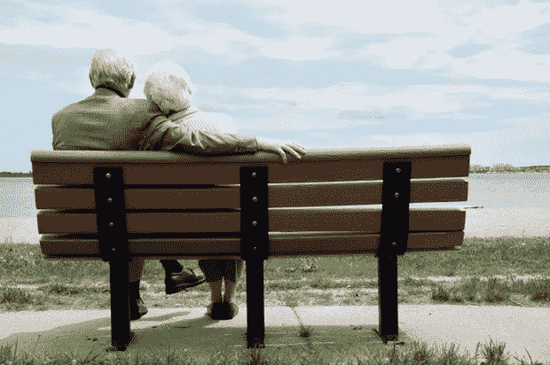

# 我 70 岁的邻居教给我的人际关系和投资银行

> 原文：<https://medium.com/hackernoon/what-my-70-year-old-neighbour-taught-me-about-relationships-investment-banking-7fcbbdf391cb>

It’s work.

最近我在一所大学工作，帮助学生准备暑期实习面试。我们正在讨论一系列在金融面试中经常出现的标准问题，其中一个学生的回答让我措手不及，也让我深思。

我请这位学生告诉我他做过的最艰难的决定。他问我这可能是什么，我告诉他去做。然后他告诉我，他做过的最艰难的决定是和他的女朋友在一起。我对最初的回答感到有点震惊，但随着他的继续，他的回答确实击中了要害。他解释说，他和他的女朋友经历了一段艰难的时期，并就分手进行了辩论。经过深思熟虑，他决定要解决这个问题。这最终成为他最好的决定之一，现在他和他的女朋友相处得很好。现在，每当他面临一个艰难的决定时，他都会回想起他的关系，这提醒他永远不要放弃。

八年前，我住在安大略省邓达斯的一栋多层房子里。当时，我和我的女朋友住在房子的最上面两层。在我们楼下的主楼层上，有一位寡居的女士，每当我回家或出门时，我都会和她长谈。她经常谈论她去世的丈夫，以及她有多么想念他。

一天，在我们的谈话中，她提到了一些关于她丈夫的事情，我说她和她丈夫看起来是天造地设的一对，他们很幸运能有如此好的关系。她严厉地回答说，他们不幸运，没有所谓的完美匹配。她告诉我，至少十年来，她恨她的丈夫，不想再和他在一起一分钟，每天都要工作才能在一起。

我的寡居邻居继续警告我，生活只会越来越艰难。“现在你还年轻，还在恋爱，但随着时间的推移，一切都会改变，唯一能让你们的关系保持下去的就是工作。”她说，在她 70 年的生命中，她工作了 40 多年，养育了两个孩子，但她做过的最困难的事情是保持婚姻。她向我保证，这也是我必须做的最困难的事情。

就像你生活中任何伟大的事情一样，成功的关系需要时间和努力。据我的邻居说，大多数人的问题是他们在知道什么是伟大的关系之前就放弃了。

我们经常听说商业上最成功的人的区别在于那些不成功的人在他们有机会取得伟大成就之前就放弃了。在生活的日常挑战中生存可能是一种折磨，放弃往往比前进更容易，但真正的成功将会授予那些即使在最艰难的时刻也坚持到底的人。

> “困难之中蕴藏着机会”——阿尔伯特·爱因斯坦

> [黑客中午](http://bit.ly/Hackernoon)是黑客如何开始他们的下午。我们是 [@AMI](http://bit.ly/atAMIatAMI) 家庭的一员。我们现在[接受投稿](http://bit.ly/hackernoonsubmission)并乐意[讨论广告&赞助](mailto:partners@amipublications.com)机会。
> 
> 如果你喜欢这个故事，我们推荐你阅读我们的[最新科技故事](http://bit.ly/hackernoonlatestt)和[趋势科技故事](https://hackernoon.com/trending)。直到下一次，不要把世界的现实想当然！

