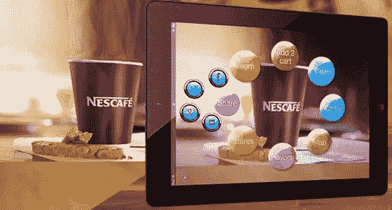
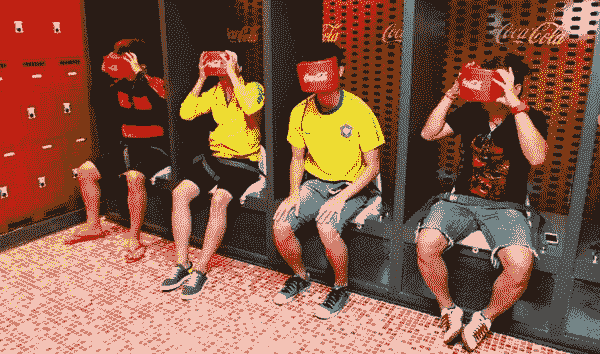
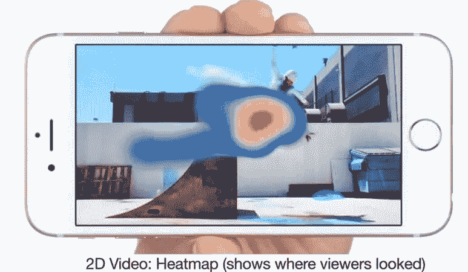

# 增强现实和虚拟现实营销的下一步是什么

> 原文：<https://medium.com/hackernoon/what-next-for-augmented-reality-and-virtual-reality-marketing-1a2e3ebb89b5>

尽管考虑到趋势和商业巨头如脸书、微软和 T2 谷歌的投资，虚拟和增强现实的潜力仍然未知，但所有的赌注都放在虚拟现实和增强现实上，以成为下一个大平台。虚拟现实和增强现实可以在很多领域引发革命，但值得注意的是数字广告。假设你想买一双新的足球鞋，在虚拟环境中让你穿上足球明星内马尔的鞋子怎么样？耐克虚拟现实体验，让人们走进不是别人，正是内马尔的鞋。你可以感受到防守队员飞向你的脚下，运球，当然，进球的感觉——所有这些都是巴西和巴塞罗那球员所熟悉的。

虚拟现实和增强现实营销的主要优势之一是，它可以提供一个你甚至没有意识到你正在消费广告内容的环境。虚拟现实和增强现实广告也可以解决我们在数字广告中陷入的混乱，特别是移动广告，用户体验差和欺诈都很常见，因为 VR 和 AR 广告可以通过从过去的错误中学习来重新开始。

随着增强现实应用 Pokemon go 的巨大成功，全球增强现实市场预计到 2022 年将达到 1174.0 亿美元，全球虚拟现实市场预计到 2022 年将达到 339.0 亿美元。凭借这些令人垂涎的数字，可口可乐和麦当劳等全球品牌开始将时间和资源花在 AR 和 VR 营销上。可口可乐公司公布了一种新的零售包装设计，其中纸板可以折叠成虚拟现实眼镜，用于智能手机，麦当劳自己的虚拟现实耳机已经上市，这种耳机是由折叠快乐餐盒制成的。随着这些商业巨头在 VR 广告领域的引入，AR 和 VR 市场的霸权竞争开始了。

有许多虚拟现实广告和分析平台，其中最重要的是 Retina，它帮助 VR 开发者通过虚拟环境中的虚拟广告赚钱。这是一个简单的工具，可以通过下载 RetinadPlugin Unity 软件包安装在您的 PC 上。

retinad 平台还提供了强大的热图分析功能来跟踪用户的浏览、导航、购买行为和结果。借助这些工具，开发者可以通过 VR 平台轻松追踪和营销品牌。在不同的移动 pop 中，up 和 YouTube 补充说，很难阻止 Retinad 广告并没有阻止用户享受他们的虚拟体验。除了热图之外，该公司表示，他们的插件将跟踪其他有用的数据，如哪些耳机被用来观看给定的 VR 体验，以及玩家玩了多长时间。致力于将沉浸式广告和分析引入虚拟现实的 Retinad 刚刚完成了一轮 50 万美元的早期投资，以将他们的解决方案推向市场。

总之，虚拟和增强现实营销是一种强有力的工具，如果它能够正确管理并从移动和其他数字营销平台的错误中吸取教训，它可以彻底改变数字营销。所以你有它。增强现实将有弹出的广告、新的数据轨迹和重定向行为的新方法。但真正的比赛将是成为下一个脸书和 Whatsapp，一个获胜的增强现实平台，用你品牌的颜色描绘宇宙，并成为下一个布莱恩·阿克顿和扎克伯格。