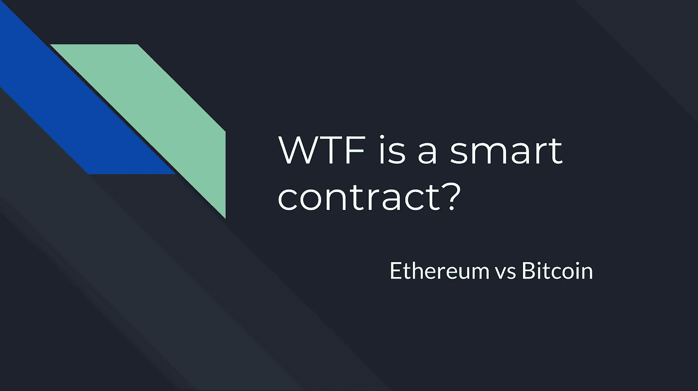
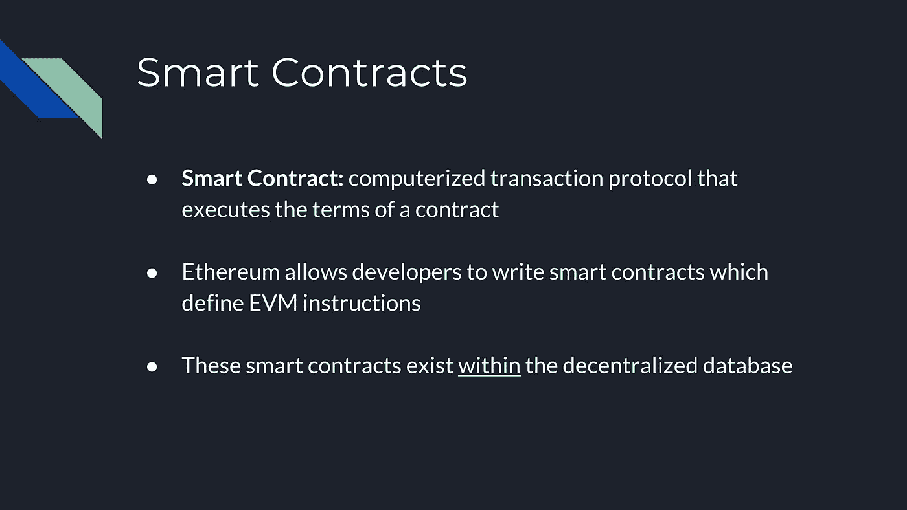
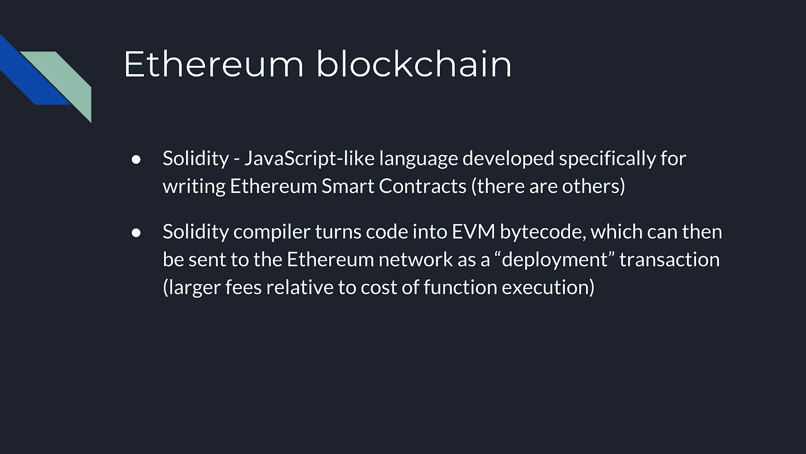
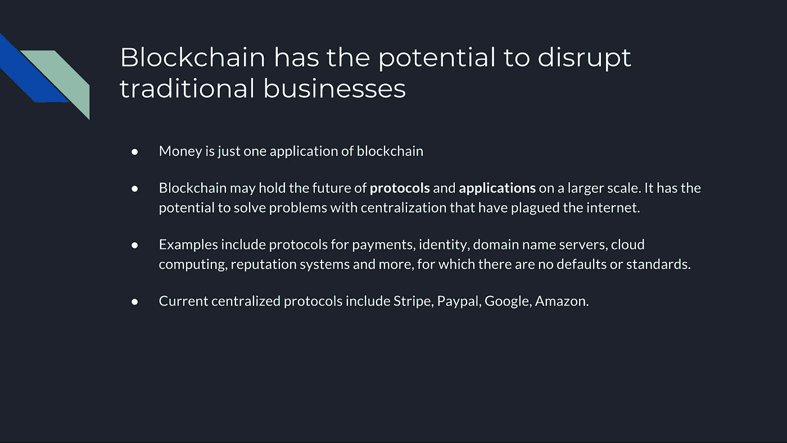

# 究竟什么是智能合约？

> 原文：<https://medium.com/hackernoon/what-on-earth-is-a-smart-contract-2c82e5d89d26>

## 比特币 vs 以太坊

Source: [Rice Blockchain](http://riceblockchain.com)

## 比特币概述

2009 年，中本聪[推出了比特币](https://bitcoin.org/bitcoin.pdf)并震惊了世界，因为它催生了一种价值 1500 亿美元的加密货币，一个比 500 台领先的超级计算机强大 1 万倍的网络，以及一个走向去中心化金融系统的运动。

[比特币](https://hackernoon.com/tagged/bitcoin)是一个不断增长的区块列表，每个区块包含一组交易，这些交易代表比特币所有权的转移**和前一个区块**的**哈希，以链接交易历史并创建一组不可变的记录。网络使用公钥/私钥加密方案来验证这些交易的有效性。比特币使用**工作证明**来生成数据块，需要一个密钥来生成，这个密钥非常昂贵且耗时，但对于[区块链](https://hackernoon.com/tagged/blockchain)中的其他节点来说很容易验证。最后，制作工作证明俗称**挖掘**。**

## 进入以太坊

虽然比特币是一种用于跟踪数字货币所有权的点对点电子现金系统，但以太坊是作为一种点对点系统创建的，用于跟踪分散数据库的状态变化。以太坊也是一个不断增长的块列表:每个块包含一组去中心化数据库的状态变化。此外，以太坊利用类似于比特币的工作证明系统进行挖掘。

以太坊介绍**去中心化数据库**详见以太坊[白皮书](https://github.com/ethereum/wiki/wiki/White-Paper)。它提供了一个去中心化的图灵完全虚拟机，称为**以太坊虚拟机**(或简称 EVM)。与比特币不同的是，以太坊在区块链之上提供的这一新数据层使功能代码沿着分散的节点集分布成为可能。该代码由网络中的每个节点运行，这些节点维护和改变数据库中的状态。这也是以太坊经常被描述成一台“**世界计算机的原因。**”

然而，EVM 必须由一套独立于中央权力机构的规则来管理，这些规则规定了允许哪些状态变化。

## **智能合约**

智能合同是“执行合同条款的计算机化交易协议”这些并不完全是以太坊独有的，因为比特币允许使用智能合约来建立服务，以在比特币交易的基础上添加功能。尽管这些服务使用比特币，但它们本质上是集中式的，因为它们的智能合约必须托管在一个集中式服务器上。

另一方面，以太坊允许开发者编写自己的智能合约来定义 EVM 指令。这些智能契约可以使用友好的编程语言编写，这些编程语言以 JS 和 python 等现有语言为模型。

> 智能合同以字节码的形式存在于分散数据库中。这是以太坊创新和颠覆性潜力的根源

使用 EVM 执行代码的网络上的所有节点必须得出相同的结果，并就下一个块的状态达成共识。任何人都可以将智能合约部署到分散的数据库，费用与包含代码的存储大小成比例。希望使用智能合同的节点必须以某种方式向网络的其余部分指示它们参与的结果。

## 气体

Gas 激励参与网络和计算作业的节点将智能合同部署到数据库中，或者执行与用户和现有合同的交互相对应的作业。在其他作品中，智能合约交易需要操作来执行，但必须有人来执行这些操作，这需要汽油。当用户进行智能合约功能调用时，他们必须声明燃气量并支付该量。这不仅激励矿工计算工作，还激励开发者部署高效的代码来优化用户对已部署协议的使用，并确保为提交给网络的交易支付适当的费用。由于 EVM 可以执行任意复杂度的代码(这就是为什么它是[图灵完全的](https://stackoverflow.com/questions/7284/what-is-turing-complete))，基于事务的长度来选择一个自由并不总是准确的。

## 那么如何写一份智能合同呢？

[Solidity](https://github.com/ethereum/solidity) 是一种类似 Javascript 的语言，专门用于编写智能合同。solidity 编译器将代码转换成 EVM 字节码，然后可以作为*部署*事务发送到以太网。这种部署的交易费用比智能合约交互高，必须由合约所有者支付。

# 为什么这些都很重要？

我们以众筹为例。像 [Kickstarter](https://www.kickstarter.com/) 和 [Gofundme](https://www.gofundme.com/) 这样的流行众筹网站旨在将新颖的产品、事业和使命带入生活，但众筹系统经常受到未能达到预期的创始人的困扰。更糟糕的是，我们都听说过这样的故事，欺诈性的创始人推出了一个有远见的——但在技术上不可能的——产品，并着手筹集数万美元，但很快就放弃了他们的使命，带着钱消失了。这种现象是一种系统性的失败和低效率，其原因是将所有资金控制权都集中在一个中心人物手中，让捐赠者和创始人都承担责任。

> 以太坊可以解决中央集权的低效问题。

如前所述，由以太坊执行的智能合同可以通过执行以下过程来使参与合同协议或交易的各方承担责任:

1.  该数据库从捐赠者那里收集资金，并将资金存储在一个没有所有者的账户中。
2.  在创始人提供令足够比例的捐赠者满意的进展证明之前，他们不会获得资金，这类似于上市公司对股东负责的方式。
3.  当达到里程碑时，资金被释放。
4.  如果创始人未能达到预期，或未能将产品推向市场，资金将返还给捐赠者。

最后，所有四个步骤都是在没有 Kickstarter 或 Gofundme 这样的中央权威机构的情况下执行的。EVM 带来了一个安全、去中心化、声誉和责任的系统，它将扩展并最终革新每个行业中的集中式应用程序。

## **感谢阅读！**

*这篇文章来自 Rice Blockchain 的一个讲座。材料和幻灯片由 Kunal Shah、May Zhong、*[*Yorke Rhodes IV*](/@yorkerhodesiv)*和 Yucheng He 准备。你可以通过访问我们的* [*网站*](http://riceblockchain.com) *来了解更多我们在米区块链做的事情。*