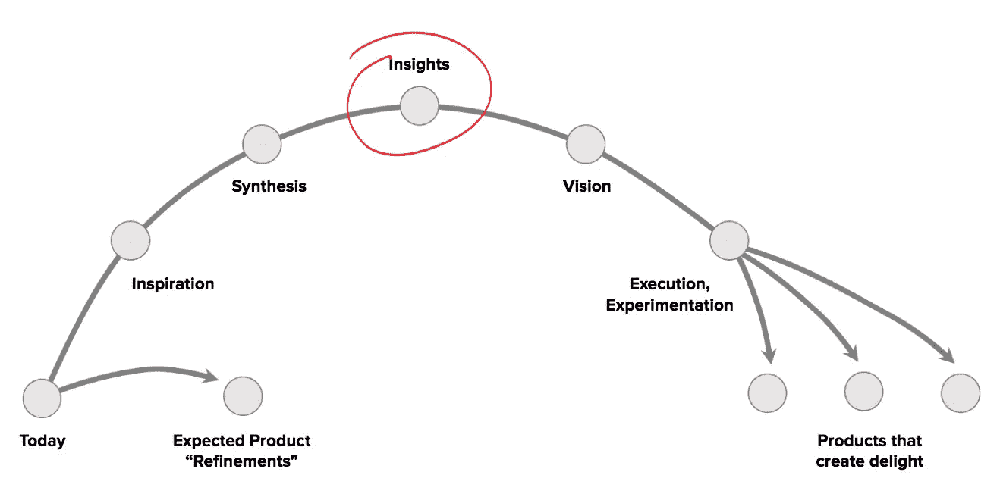
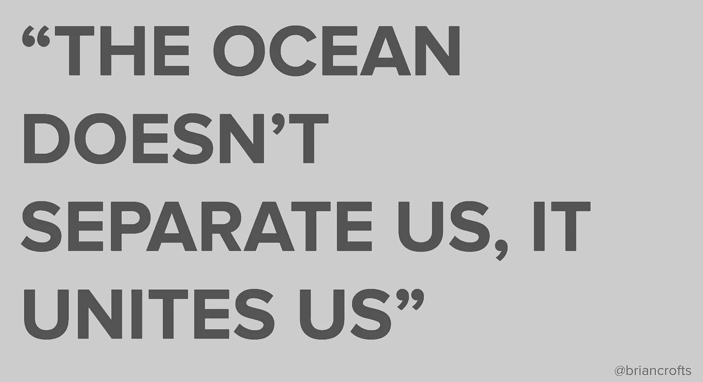
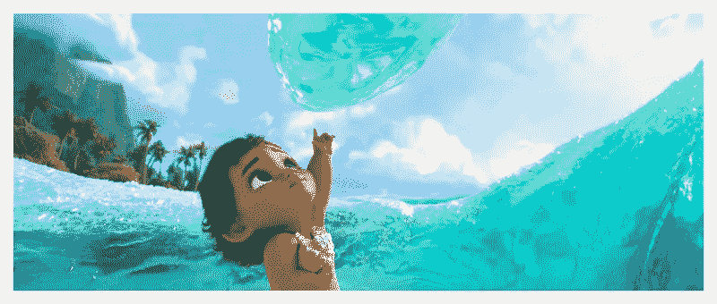
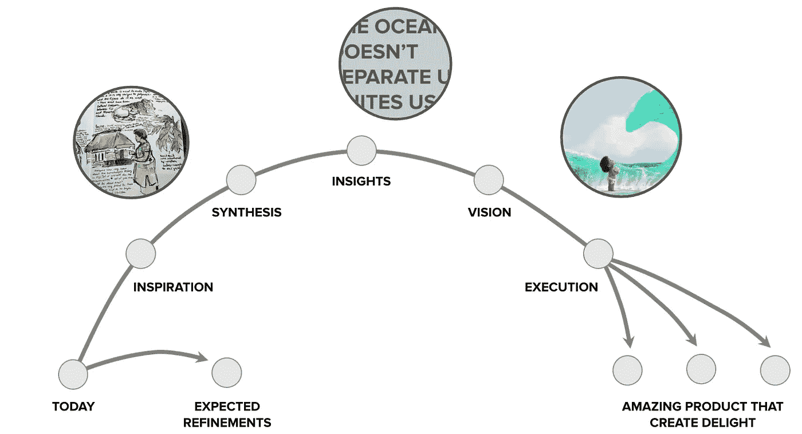
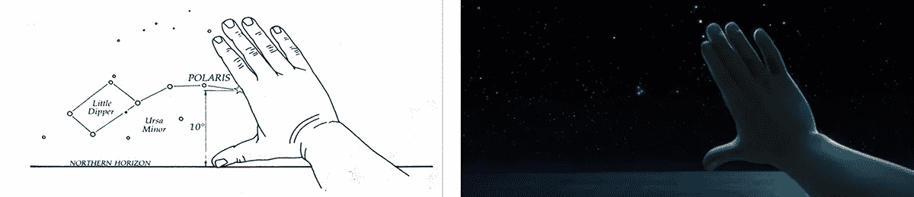
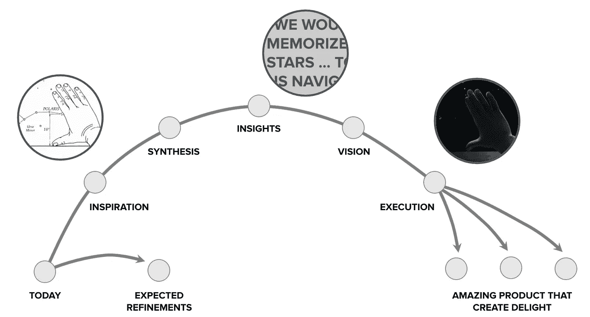
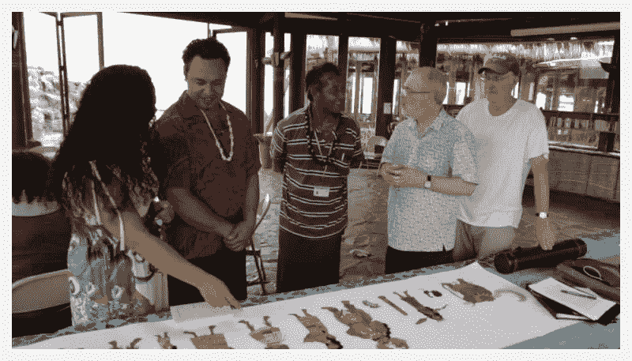
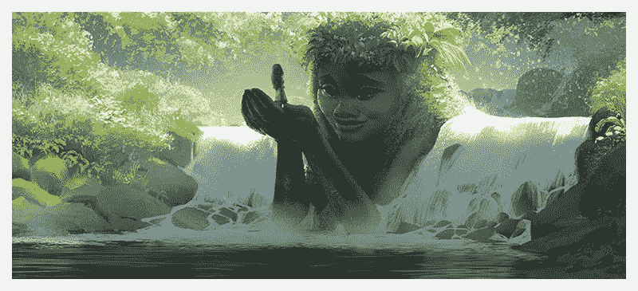
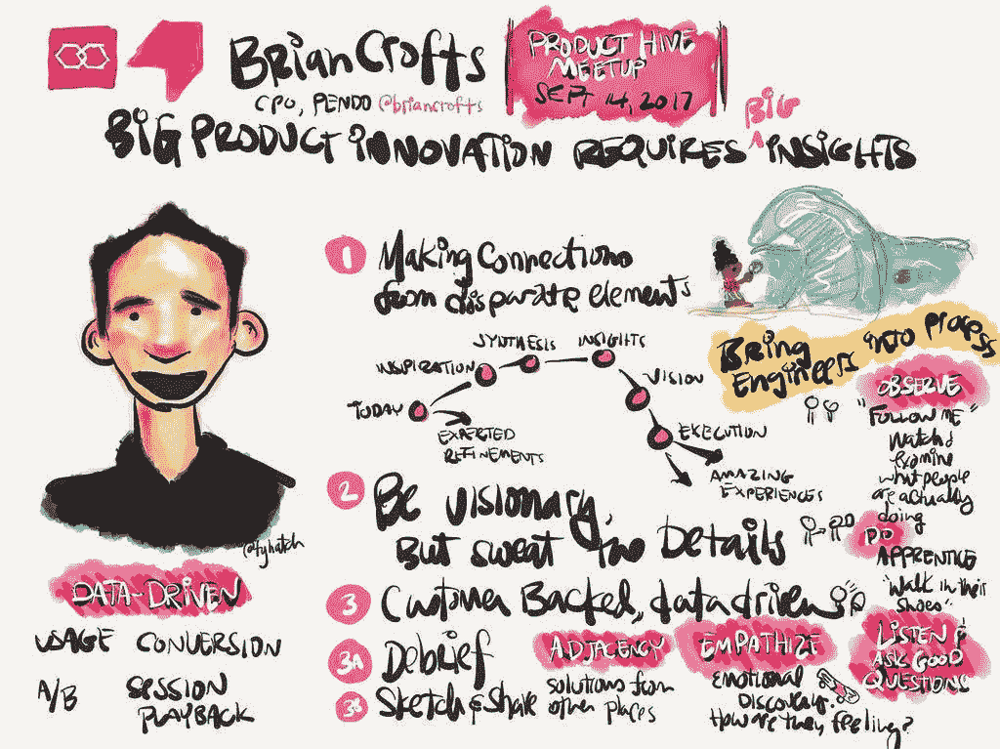

# 有哪些产品团队可以借鉴迪士尼的“海洋奇缘”

> 原文：<https://medium.com/hackernoon/what-product-teams-can-learn-from-disneys-moana-5c5ee713b223>

*运用从身临其境的体验中获得的洞察力来推动创新的能力，或者就迪士尼而言，创造力、远见和精彩的故事讲述*

当联合导演开始为迪士尼的最新大片《海洋奇缘》开发早期故事板时，迪士尼的首席创意官建议团队:“你必须做更多的研究……**你必须更深入地挖掘整个世界。”**

All Images: Disney

这个团队第一次去太平洋群岛是一次为期三周的沉浸式旅行。但是，在五年的发展过程中(11 年到 16 年之间)，该团队多次回来，记录了数万英里的路程，并形成了深刻的见解，直接塑造了这部电影。

> **“多年来，我们一直被你们的文化所吞噬…**
> 
> **有一次，你会被我们的文化所吞噬”——帕帕·马佩(当地长者)**

**见解或“深入挖掘”**

寻求和发展有意义的见解在创新中起着至关重要的作用，无论是构建一个应用程序、解决一个问题，还是在这种情况下，开发一部主要的故事片。洞察力可以帮助团队超越“预期的产品改进”，走向“创造快乐”从灵感中获得的洞察力以及与客户的密切合作是打造更好的产品、创造快乐的顶点。

这篇文章的重点是强调灵感和有意义的见解对产品方向和发展的持久影响。注意到迪士尼工作人员发现的许多主题和见解及其对最终产品的影响是令人鼓舞的。同样重要的是要指出，如果做得正确，这种方法对参与过程的人来说是非常有益的。

以下是一些对这部电影产生了戏剧性或关键性影响的见解。当列出这些见解时，我不禁问自己，我(和我的团队)是否深入到足以发现什么对客户真正重要。我们真的在培养深切的同理心和有意义的洞察力吗？

**洞察力**

**对电影的暗示……**

两位共同主任做了笔记，概述了他们的想法，写下了他们的印象以及他们对萨摩亚人民与海洋之间关系的新见解。

他们都得出结论，“我们需要让海洋成为电影中的一个角色。”它需要一点重新工作，因为它改变了未来的一切。

Introduced to “the ocean as a character” with the child Moana.

在这里，导演看到了一个突出文化(及其与水的联系)的机会，以一种独特而真实的方式为故事添加了新的维度和新的角色。一个发展良好、有意义的人物故事是创造值得分享的东西的基础。基于对客户痛苦的深刻理解的产品同样重要。

**洞察力**

**电影的寓意……**

故事讲述者不仅想尊重作为探险家的萨摩亚人的遗产，他们还想展示海洋奇缘作为一名航海家的成熟，包括古代航海方法的准确细节，如下所示:

这些细节有助于故事变得更加丰富、真实和有趣。

Accurate portrayal of ancient navigation. All Images: Disney

细节很重要。创作故事或开发新产品时。在这里，海洋奇缘的创造者们了解到古代南太平洋的早期探险者是如何在数千年的时间里有效地导航的(没有太多仪器)。电影中的一个小角色——但是一个精确的细节。反复这样做，你的故事或产品就会增加可信度。细节(即使是被忽略的)可以说明你对这个主题的掌握，这可以转化为信任——在构建包含合规元素的产品时尤其重要。

这种洞察力很重要，因为它是通过一系列经验得出的——这是几个月的互动中出现的主题。人们的足智多谋和与岛屿的关系成为冲突的核心——以及文化上的准确性。

重要的是花时间努力观察不太明显的东西，注意你的客户周围的环境或条件，例如他们使用你的产品的环境。这种方法将确保你不解决表面问题，而是建立一个更完整的解决方案。您会发现自己会问这样一个问题，“这是他们真正需要的解决方案吗，还是更大、更基础的解决方案？”

**海洋故事信托**

随着团队进一步发展这个故事，确保对萨摩亚文化和影响的准确或诚实的解释是很重要的。他们成立了一个名为“海洋故事信托”的咨询小组来帮助实现这一目标——并在此过程中提供他们的想法。

> 我们根据得到的反馈进行了修改。
> 
> 我们希望社区里的人们参与到电影的制作中来。他们领域的专家会提供背景和修正。本地人看了电影，就说得通了。

例子:海洋奇缘踢椰子(沮丧的海洋奇缘的早期版本)“…一个孩子绝不会这么做。它是食物来源和社区财产。”——海洋故事信托基金成员

在构建软件时开发“顾问委员会”或“客户委员会”也是非常有价值的。利用专业知识和行业知识是必不可少的，也是意料之中的。但是…不要过度依赖“委员会”通常存在群体思维，他们通常是风险厌恶型的。将您的委员会视为一个共鸣板——作为您在发展过程中的众多来源之一。

# **制作电影(和打造产品)的更好方式**

电影完成后，团队感觉到了变化——他们自身的变化。世界因为他们完成的工作而变得更美好。他们带着对生活和人的不同看法离开了。

> [我们创造的]一个故事，准确地代表了他们的故事…他们的精神…这将有助于给我们的年轻女性一个声音…它承载着价值观，它承载着我们的生活…我希望我们正在努力向我们的孩子讲述我们的故事/文化(眼泪)。

《海洋奇缘》是一部伟大的电影——一个伟大的故事。随着我了解了迪士尼制作这部电影的方法，我也开始更加欣赏这部电影。它提醒我们做出伟大的事情需要付出难以置信的努力。

我认为，没有灵感和有意义的见解，就不会有伟大的电影或伟大的产品。将洞察力和远见转化为现实也需要对执行力的高度关注。自始至终，伟大的产品需要领导来确保团队不会停留在“预期的改进”上，而是推动“客户愉悦”的洞察力

如果你觉得你的团队患上了“预期改进综合症”(我们有时都会这样)，走出办公室，去和你的客户或者潜在客户谈谈。再次立足于你为什么存在，你试图解决什么问题。与您的团队一起听取汇报，您将开始注意到对话、目标和结果将开始改善。

Shout out to [Ty Hatch](https://medium.com/u/2ea9028a52e?source=post_page-----5c5ee713b223--------------------------------) for his notes after my presentation :)