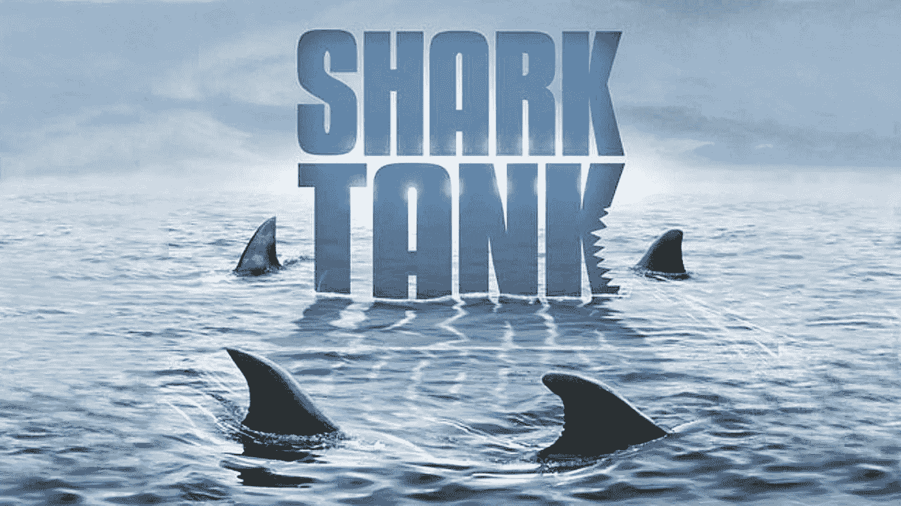
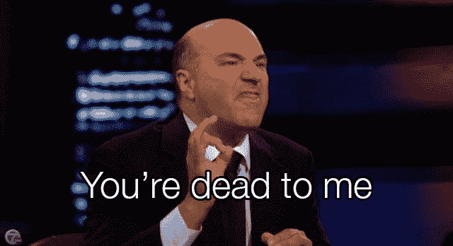

# 鲨鱼坦克出了什么问题:估值

> 原文：<https://medium.com/hackernoon/what-shark-tank-gets-wrong-valuation-a225e9fb8e01>

每周我的 DVR 都会录下*鲨鱼池*的最新一集。每个星期，当我看完它的时候，我会想为什么我还要继续看下去。这个节目并非一无是处，它是一部引人入胜的电视剧。然而，那些对商业的看法主要是通过“鲨鱼池大学”形成的、有抱负的企业家，将不会为成功做好准备。尽管我很想用“鲨鱼池*出错的五件事”来引诱你，但我还是打算一次只关注一件事。在这篇文章中，我们将探讨每集中最有争议的话题:估值。*

## **估价计算有误**

估值，或者说一个企业的财务价值，经常是鲨鱼池里的投资者反对企业家或者甚至在他们之间产生分歧的地方。在这方面，这个节目反映了真实的世界，也就是说，不同的人会不同意某个特定的企业值多少钱。我们可以在另一篇文章中讨论市场动态以及轮次实际上是如何定价的。这里的关键点与基于呈现给观众的数据的估价计算的细节有关。在每一集里，我们都被介绍给新的企业家，每个人都有一个具体的筹款金额，以及投资者作为回报将获得的股权比例。

这两个数字足以得出企业的估值，但节目中使用的公式是错误的。虽然我相信“鲨鱼”知道这一点，但我怀疑制片人要求他们捏造数字，以便让观众更容易在家跟随。这是一个遗憾，因为该节目可以很容易地添加一些图形，通过计算。但是，唉，这个节目与其说是教育，不如说是娱乐。

让我们看看他们在节目中是如何计算估值的，然后与企业家和投资者不在电视上时的做法进行比较。

## **一个例子**

Bob 的公路旅行尿布于 8 个月前推出，Bob 在此期间售出了价值 50，000 美元的产品。Bob 不看好加油站浴室，认为这家公司可以拥有长途司机市场的一部分(尤其令人讨厌),因此他要求 10 万美元收购该公司 33.3%的股份。

奇妙先生侧着头说，“所以你的便便专家的估算价值

啊，但是我还活着

管道是 30 万美元。你疯了！这家公司现在不可能价值超过 20 万美元。“如果你以前从未筹集过资金或做过投资者，奇妙先生的数学很有道理:

$100,000/33.3% = $300,000

这可能有道理，但这是错误的。这是错误的，因为它实际上没有反映注入企业的现金价值。如果你有一个价值 0 美元的企业，有人投资了 10 万美元——暂且不考虑所有权比例——这个企业的新价值是多少？嗯，你从 0 美元开始，增加了 10 万美元，看起来是这样的:0+10 万美元= 10 万美元。这是一个极端的例子，因为企业的所有价值都来自于新的投资。然而，应该清楚的是，在计算中忽略新资金的影响是愚蠢的。

所以让我们重温一下之前的假鲨鱼池场景。奇妙先生正在考虑投资 10 万美元，这样他可以拥有公司 33.3%的股份。该公司的实际估价是多少？

$200,000.

在这一点上，读到这里的你们中的一些人会有一个问题:“嗯？”别担心，数学还是很简单的。但是在我们进入数学之前，现在是时候弄清楚术语了，因为对*鲨鱼池*的估价问题部分是由于他们使用的词语模糊不清。

## **理解术语**

在讨论估值时，实际上使用了两个数字和术语:投资前估值和投资后估值。(为了让你对 [startup](https://hackernoon.com/tagged/startup) 俚语更舒服，我会在下面去掉“估值”这个词。)

*   前期投资:这是在进行新一轮投资之前，企业商定的价值。(查看[https://en.wikipedia.org/wiki/Pre-money_valuation](https://en.wikipedia.org/wiki/Pre-money_valuation)了解更多详情。)
*   后钱:这是最近一轮投资后对业务的估值。价值是这样计算的:钱前估值+投资=钱后估值。(查看[https://en.wikipedia.org/wiki/Post-money_valuation](https://en.wikipedia.org/wiki/Post-money_valuation)了解更多详情。)

## **固定公式**

在*鲨鱼池*上，“估值”一词经常被用来代替“后货币估值”在现实世界中，当投资者和企业家讨论估值时，“前期资金”是绝大多数时间讨论的话题。明白了吗？现在我们可以回到数学上来。当 Bob 走进水箱时，他给自己的企业分配了什么价值？他表示，他想筹集 10 万美元，并放弃 33.3%的所有权作为回报。

这是我们的公式:

**投资人持股比例=投资/(投前估值+投资)**

现在让我们输入数字:

33.3% = 10 万美元/(投资前估值+10 万美元)

如果我们计算投资前的估值，我们会得出一个与奇妙先生不同的数字:20 万美元。现在让我们回头看看假凯文·奥利里的反对意见，虽然是虚构的，但实际上与他的实际方法一致:“所以你的便便产品的估算价值是 300，000 美元。你疯了！这家企业目前的价值不可能超过 20 万美元。”

节目中没有一个鲍勃会说，“在估价的问题上，我完全同意你的观点。300，000 美元相当于在我给公司估价的基础上溢价 50%。所以这将是一次简单的谈判。我将以 20 万美元的投资前估值接受这 10 万美元，并给你 33.3%的回报。”

## **结束**

在《T2》的《鲨鱼池》中有几集，企业家们提到了“投资前估值”，但在一定程度上，有了额外的评论，它似乎已经在剪辑室的地板上结束了。我只能想象一个想要谈判清算优先权的企业家会怎么样！虽然我仍然是这个节目的常客，但我很失望的是,*鲨鱼池*平台没有被用来更主动地揭开[企业家精神](https://hackernoon.com/tagged/entrepreneurship)的神秘面纱。奇怪的是，HBO 的小说《硅谷》在许多方面听起来真实，而“真人秀”则不然。

*最初发表于*[*vendor ful—Buying Made Better*](http://www.vendorful.com/shark-tank-gets-wrong-valuation/)*。*

> [黑客中午](http://bit.ly/Hackernoon)是黑客如何开始他们的下午。我们是 T21 家庭的一员。我们现在[接受投稿](http://bit.ly/hackernoonsubmission)并乐意[讨论广告&赞助](mailto:partners@amipublications.com)机会。
> 
> 如果你喜欢这个故事，我们推荐你阅读我们的[最新科技故事](http://bit.ly/hackernoonlatestt)和[趋势科技故事](https://hackernoon.com/trending)。直到下一次，不要把世界的现实想当然！

