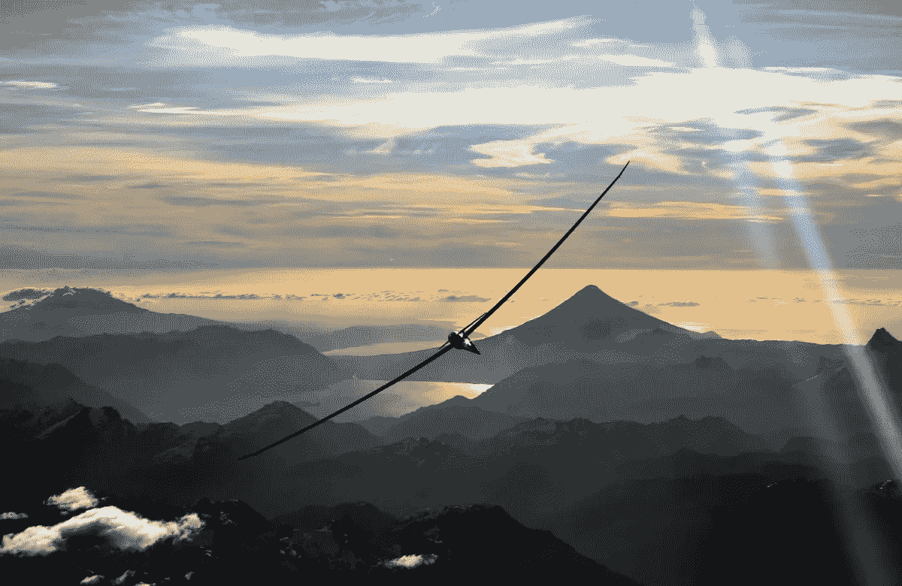
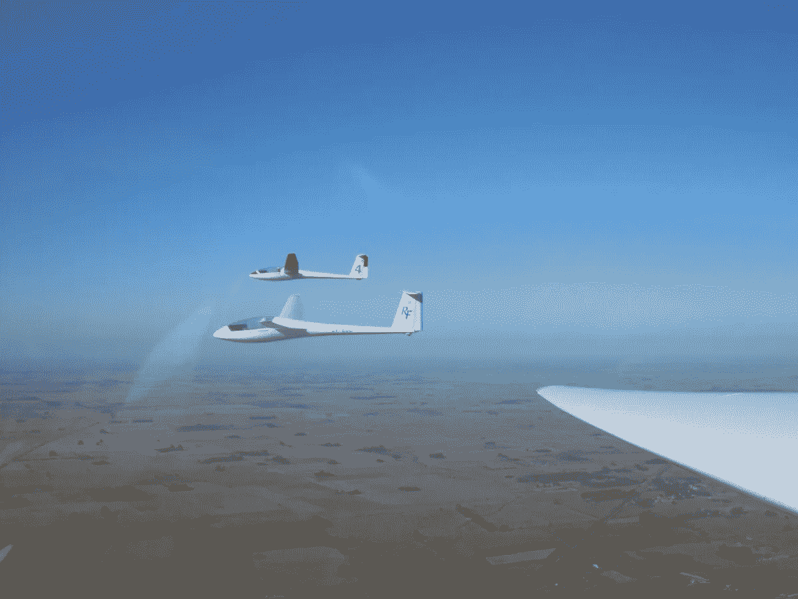
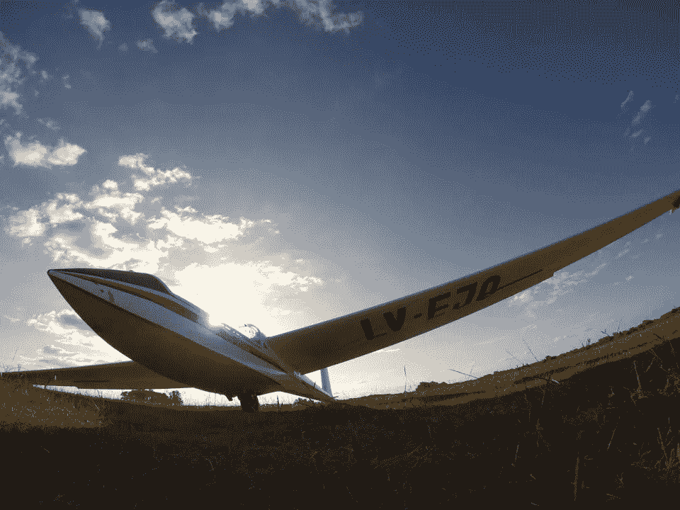

# 软件行业能从航空业学到什么

> 原文：<https://medium.com/hackernoon/what-software-industry-can-learn-from-aviation-ced8aca5fa91>

*Image by* [*Albatros Gliding Club*](http://www.albatros.org.ar/)*. You can find it here:* [*http://www.albatros.org.ar/medios-fotos/*](http://www.albatros.org.ar/medios-fotos/)

谁也不能否认，**科技和航空工业一直在以令人难以置信的速度进步和发展。**

**我相信软件行业可以从其他行业学到很多东西，这就是为什么我想分享一些从航空业学到的东西，这些东西在我开始飞行员生涯后非常有用。**

# *1.错误是由一连串的事件引起的，而不是由孤立的事件引起的*

*在航空领域，如果发生事故，你可能不会听到只有一个原因。相反，所有导致事故的事件都被分析并认为是有责任的。*

*让我们想象一个 bug 出现在生产中的情况。*

*如果你想一分钟，你会意识到问题出现在分阶段推出后，但没有人发现它，它由 QA 测试，但他们没有发现它，它由相关的[开发](https://hackernoon.com/tagged/development)团队测试，但他们没有发现它，在合并它之前提出了一个拉请求并进行分析，但没有人发现它。*

*因此，正如你所看到的，每一次发布都会涉及到许多人和情况。如果您停止了错误链中的任何事件，您就有大量的机会来避免在生产中出现 bug。*

# *2.不要责备，从错误中学习*

*在错误发生后指出某人并责备他或她是很容易的。但是正如你在上面读到的，错误不是任何人的过错，而是一连串事件的结果。*

*由于任何错误或问题都牵涉到许多人，我们能做的最好的事情就是从他们身上吸取教训，并采取行动来改进我们的流程、任务、部门等。*

*天空产业的一个好的实践是避免责备犯错的人，而是从错误中学习如何避免和最小化错误。*

# *3.人类会犯错，这是我们的天性*

*我敢打赌，任何正在阅读这篇文章的人都曾在一生中犯过一次错误。那是因为犯错是我们的一部分。我们并不完美。*

*正如我们所知，错误和失误很可能发生在人类身上，我们应该在软件行业应用的东西是帮助开发人员和工程师避免犯错误或减少他们犯错误的机会。*

*清单、单元和验收测试、代码审查、交叉测试、部署管道、自动化任务等等都有助于减少人为错误。*

**

**Image by* [*Albatros Gliding Club*](http://www.albatros.org.ar/)*. You can find it here:* [*http://www.albatros.org.ar/medios-fotos/*](http://www.albatros.org.ar/medios-fotos/)*

# *4.错误不是故意犯的*

*飞行员明白他们的同事没有一个是故意犯错的。这样想就太傻了。*

*这就是为什么在有人犯了错误后，他们不会感到不安，而是想知道为什么会发生这种情况，然后学习并教授它。*

*所以，下次当你因为一个错误而对某人生气时，想一想所有可能导致错误发生的原因。*

# *5.如果你犯了错误，分享出来学习，下次避免*

*在每次起飞、着陆或其他飞行情况下，错误和失误就在那里等着你。*

*当它们发生时，有经验的飞行员不会隐藏它们。他们交谈、学习和分享这些情况。分享这些故事以避免再次出现问题，并帮助其他同事(和他们自己)避免这些问题，这非常重要。*

*就软件行业而言，我们应该更多地看到人们谈论他们已经或曾经遇到的问题，从传播的错误中学到的知识，以及事后分析文档，其中包含解释和行动，以最大限度地减少再次出现相同错误的可能性。*

# *概括起来*

*错误和失误无时无刻不在发生，没有人会故意犯这些错误。在责备某人之前，我们应该从中吸取教训，并采取行动避免和减少错误。*

*为了不断提高软件和组织的质量，让所有团队理解这些概念是很重要的。*

*你喜欢你读到的东西吗？ *推荐这个故事(按下❤按钮)让其他人也能看！
你也可以在推特上反应:*[*@ santihollmann*](http://www.twitter.com/santihollmann)*

**

**Image by* [*Albatros Gliding Club*](http://www.albatros.org.ar/)*. You can find it here:* [*http://www.albatros.org.ar/medios-fotos/*](http://www.albatros.org.ar/medios-fotos/)*

******

> *[黑客中午](http://bit.ly/Hackernoon)是黑客如何开始他们的下午。我们是 AMI 家庭的一员。我们现在[接受投稿](http://bit.ly/hackernoonsubmission)并乐意[讨论广告&赞助](mailto:partners@amipublications.com)机会。*
> 
> *如果你喜欢这个故事，我们推荐你阅读我们的[最新科技故事](http://bit.ly/hackernoonlatestt)和[趋势科技故事](https://hackernoon.com/trending)。直到下一次，不要把世界的现实想当然！*

**