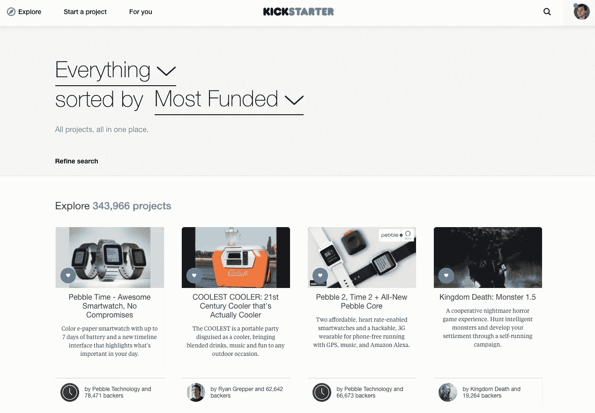
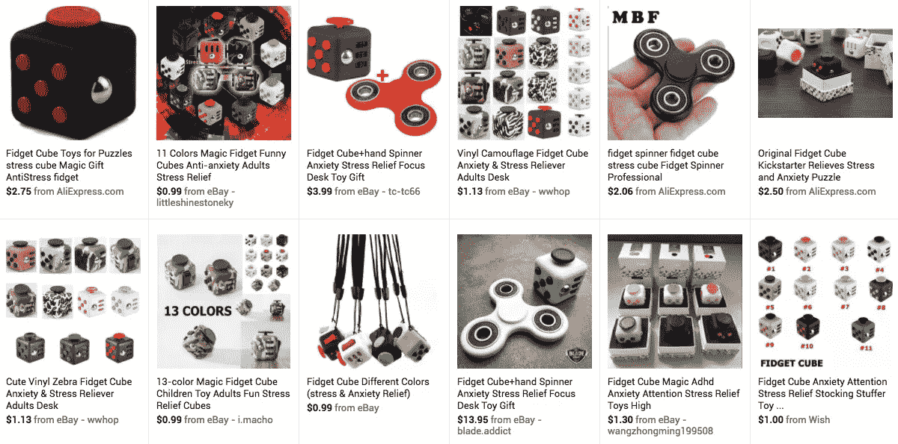
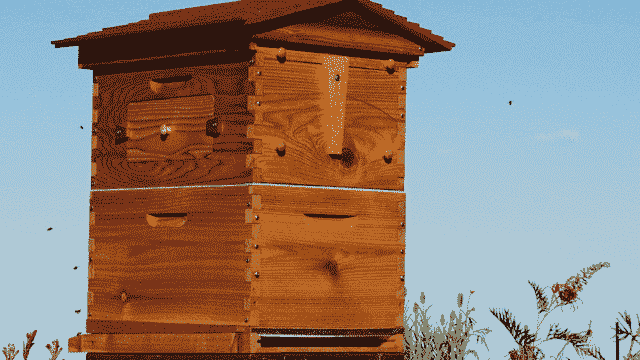

# 尽管众筹了数十亿美元，但只有三家“风险企业”退出

> 原文：<https://medium.com/hackernoon/what-startups-can-learn-from-the-top-100-kickstarter-campaigns-6a0baf5bc31b>

*由* [到*约瑟夫*到](https://twitter.com/josephflaherty)

过去五年科技公司 IPO 的数据显示，筹集大量风险资本的初创公司并不比筹集少量风险资本的公司表现更好。原来“[高效创业](https://techcrunch.com/2016/09/16/venture-capital-is-a-hell-of-a-drug/)”的理念同样适用于众筹。

 [## 风险投资过度:71 次 IPO 的教训

### 埃里克·佩利和约瑟夫·弗莱厄蒂

hackernoon.com](https://hackernoon.com/overdosing-on-vc-lessons-from-71-ipos-f247b8eb0887) 

在 Kickstarter 八年历史的前 100 个项目中，有两个明显的风险投资项目胜出；[脸书以 2B](https://techcrunch.com/2014/07/21/facebooks-acquisition-of-oculus-closes-now-official/) 美元收购 Oculus，伊莱克斯以[2 . 5 亿美元](https://techcrunch.com/2017/02/06/anova-electrolux/)收购 sous vide 制造商[Anova cunical](https://anovaculinary.com/)。令人惊讶的是，这两家公司都没有进入该平台筹集资金的前 50 名。[点击此处查看数据和项目链接](https://docs.google.com/spreadsheets/d/1sNYwQYN6WeP3ziWYXLXPzatTqT2f7AQulpc_BtdOd30/edit?usp=sharing)。

在 IndieGoGo，该网站的[前 100 个项目](https://www.indiegogo.com/explore/all?quick_filter=most_funded&location=everywhere&project_type=all&percent_funded=all&goal_type=all&more_options=false&status=all)中没有一个已经退出，尽管时尚的健身追踪器[不适合](https://misfit.com/)，该网站历史上第 183 个最受资助的项目被 Fossil 以[2 . 6 亿](https://techcrunch.com/2015/11/12/fossil-group-buys-health-tracking-wearable-startup-misfit-for-260m/)美元收购。

除了这三个以外，没有多少令人鼓舞的故事:

*   [Pebble 的时间到了](https://www.theguardian.com/technology/2016/dec/08/kickstarter-pebble-shut-down)和[以 2300 万美元的价格售出](https://techcrunch.com/2017/02/22/fitbit-pebble-acquisition/)，尽管在三次破纪录的活动中从支持者那里筹集了超过 6000 万美元，从风投那里筹集了 1500 万美元。
*   Ouya，Kickstarter 排名中的 [#8](https://www.kickstarter.com/projects/ouya/ouya-a-new-kind-of-video-game-console?ref=most_funded) ，是一个成立两年的游戏平台，拥有[3360 万美元的众筹/风投](https://www.crunchbase.com/organization/ouya#/entity)和[~ 1200 款游戏](https://www.ouya.tv/)，这是相当可观的，除了每周*苹果商店*都会增加同样多的新游戏。
*   尼尔·杨的 [Pono 音乐播放器](https://www.ponomusic.com/) ( [#12](https://www.kickstarter.com/projects/1003614822/ponomusic-where-your-soul-rediscovers-music?ref=most_funded) )还没有在最核心的音响发烧友之外建立起一批听众。
*   微型无人机 Zano ( [#26](https://www.kickstarter.com/projects/torquing/zano-autonomous-intelligent-swarming-nano-drone) )坠毁燃烧的景象如此壮观，以至于 [Kickstarter 委托一名记者检查残骸](/kickstarter/how-zano-raised-millions-on-kickstarter-and-left-backers-with-nearly-nothing-85c0abe4a6cb)。
*   社交机器人 [Jibo](https://www.jibo.com/) 是 IndieGoGo 上第 13 个获得最佳资助的项目，已经从支持者那里筹集了[360 万美元，从投资者那里筹集了约 7000 万美元](https://www.crunchbase.com/organization/jibo#/entity)，两年后还没有发布产品。

公平地说，众筹仍处于早期阶段，一些新兴公司可能会成为效仿的新模式。

*   [Formlabs](https://formlabs.com/) 是 Kickstarter 排行榜上[第 41 个获得资金最多的项目](https://www.kickstarter.com/projects/formlabs/form-1-an-affordable-professional-3d-printer)，随后[从 Foundry Group 和其他公司](https://www.crunchbase.com/organization/formlabs#/entity)(披露:我们也是自豪的投资者)筹集了 5580 万美元，以扩大他们蓬勃发展的业务。
*   在 IndieGoGo，家庭安全系统 [Canary](https://canary.is/) 除了其 120 万美元的宣传活动外，还筹集了 4000 万美元, Y Combinator 支持的智能行李箱制造商 [BlueSmart](https://www.bluesmart.com/) [在 2M 的认捐活动之外，还筹集了 2200 万美元的风险投资。](https://www.crunchbase.com/organization/bluesmart#/entity)

但是冒着过度概括的风险，从这些数据中可以收集到一些教训。

# 大市场比利基市场风险更大

有了众筹，利基持有财富。Oculus 被定位为黑客的开发工具。在满足他们对煮鸡肉的渴望的长度方面，苏维粉丝仅次于交叉食客。这些产品针对的是那些愿意忍受任何第一代产品中发现的漏洞的发烧友——毫不夸张地说，就是在 IndieGoGo 上筹集了 1300 万美元的 [Flow Beehive](https://www.honeyflow.com/) 。

更重要的是，这些产品也代表了几乎没有可行替代品的类别。虚拟现实是 90 年代中期的一个奇迹，水炊具在很大程度上仅限于高端厨房。Kickstarter 让疯狂的探测项目对爱好者来说变得切实可行。

相比之下，智能手表自 90 年代中期就已经出现了。即使在 Pebble 重新激活市场之前，仍然有足够多的智能手表来填写购买指南。同样，Ouya 也试图打开一个拥挤的视频游戏机市场，在这个市场上，现有系统拥有狂热的追随者。也许在过去几年中，六个众筹无线耳机概念中的一个将成为突破，并挑战苹果的 AirPods。然而，迄今为止的数据表明，在众筹领域，激情项目的表现优于精致的消费品。

# 创纪录会让你沉沦

在众筹中，成功可能是一种诅咒。 [Kickstarter 是债务](https://blog.bolt.io/kickstarter-is-debt-e3b6a70ce180#.xjd3a8ld1)。如果产品开发遇到障碍，需要大量研发努力的项目可能会耗尽众筹资金，导致生产资金不足。即使一个产品在活动结束后就可以生产了，生产中的任何一个小问题都会让一个羽翼未丰的公司破产。

几个引人注目的案例说明了过度成功的众筹活动面临的危险。

*   当创始人在履行 Kickstarter 承诺之前开始在亚马逊上销售产品时，这位[最酷的酷人](https://www.kickstarter.com/projects/ryangrepper/coolest-cooler-21st-century-cooler-thats-actually) ( [#2](https://www.kickstarter.com/projects/ryangrepper/coolest-cooler-21st-century-cooler-thats-actually) ) [激怒了支持者](https://www.kickstarter.com/projects/ryangrepper/coolest-cooler-21st-century-cooler-thats-actually/comments)。尽管通过众筹筹集了 1300 万美元，但这位企业家需要销售来产生营运资金，以完成活动的 6 万多份订单，因为生产问题耗尽了他的预算。

A small sample of the knock-off Fidget Cubes based on the original design by [Antsy Labs](https://www.antsylabs.com/products/fidget-cube).

*   制造 150，000 个[小不点](https://www.kickstarter.com/projects/antsylabs/fidget-cube-a-vinyl-desk-toy) ( [#9](https://www.kickstarter.com/projects/antsylabs/fidget-cube-a-vinyl-desk-toy) )花费了比预期更长的时间，并且让一个有更多制造专业知识的企业家[复制设计并击败最初的创造者进入市场](http://www.polygon.com/2017/1/3/14157334/fidget-cube-delay-shippping-date)。筹集更少的资金可能会降低完成这些活动的难度，也不会鼓励模仿者。

## **平衡资本和客户承诺**

许多企业家想在一次活动中筹集尽可能多的资金，却没有充分认识到资本和客户满意度之间的关系。例如， [Pebble 在第一次活动中有 65，607 份产品订单](https://www.kickstarter.com/projects/getpebble/pebble-e-paper-watch-for-iphone-and-android?ref=most_funded)，而 [Formlabs 有 1，028 份](https://www.kickstarter.com/projects/formlabs/form-1-an-affordable-professional-3d-printer)。Pebble 筹集的资金是 Formlabs 的 3.5 倍，但还必须处理订单履行、客户服务等事宜。多了 64 倍的客户。作为一款大众市场产品，Pebble 团队因准备零售发布而进一步分裂。一下子要承担太多了。

资本不会让你更聪明。它没有什么特别的见解，也不能解决问题，除非公司设计合理地部署它。在校准你的竞选抱负时，考虑这一点。

这些故事并不意味着大量资助的项目注定要失败。Flow Beehive 在 IndieGoGo 上筹集了 1300 万美元，拥有 3.8 万名支持者，成功发货，现在是一家持续经营的公司。但这是一个买方组装的扁平包装的木制框架。失败点就这么多，核心技术和现代农业一样古老。

## **不要优化你的活动来创造记录**

这些数据并不是对 Kickstarter 或这些项目创造者的批评。Kickstarter 一直告诉创作者，它“不是商店”，也不是 VC 的替代品。同样重要的是，风投规模的结果不应该是众筹成功的目标，甚至不是主要的衡量标准。尽管如此，许多企业家还是这样认为。

筹款本身并不是目的，也不会决定你最终的成败，所以要专注于真正的使命。请记住，Misfit“only”在 IndieGoGo 上筹集了[84.7 万美元，与其他项目相比，这只是一个小小的成功，但对于一家通过众筹发起的公司来说，这也是第二个最好的退出方式。](https://www.indiegogo.com/projects/misfit-shine-an-elegant-wireless-activity-tracker)

> [黑客中午](http://bit.ly/Hackernoon)是黑客如何开始他们的下午。我们是 [@AMI](http://bit.ly/atAMIatAMI) 家庭的一员。我们现在[接受投稿](http://bit.ly/hackernoonsubmission)并乐意[讨论广告&赞助](mailto:partners@amipublications.com)机会。
> 
> 如果你喜欢这个故事，我们推荐你阅读我们的[最新科技故事](http://bit.ly/hackernoonlatestt)和[趋势科技故事](https://hackernoon.com/trending)。直到下一次，不要把世界的现实想当然！

