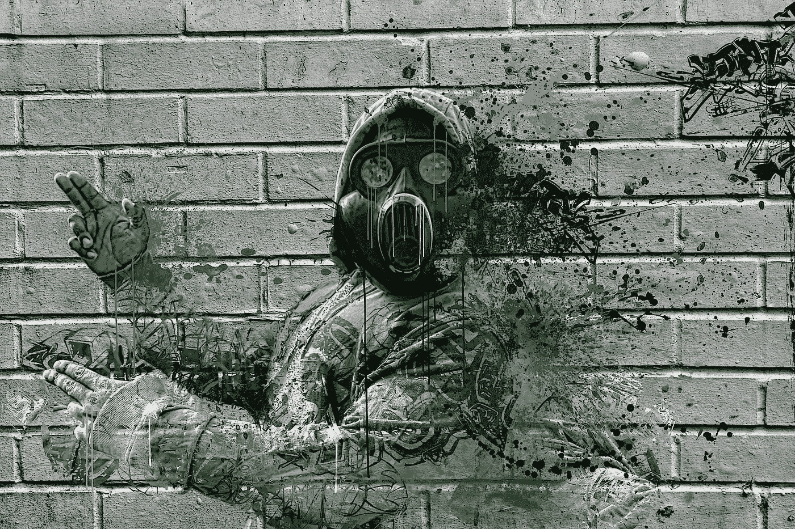
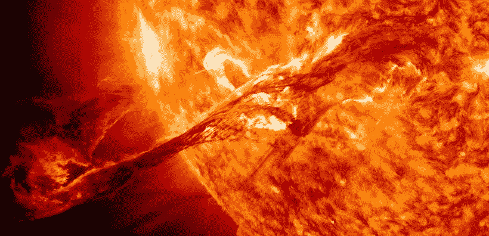
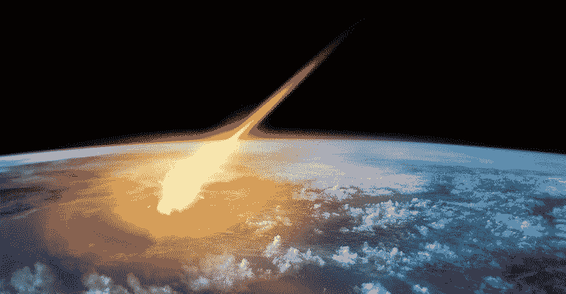
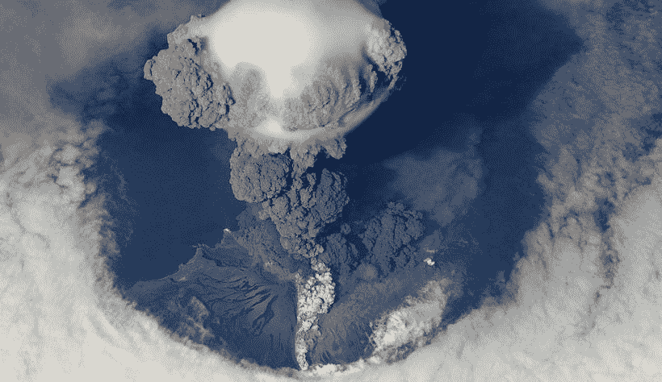
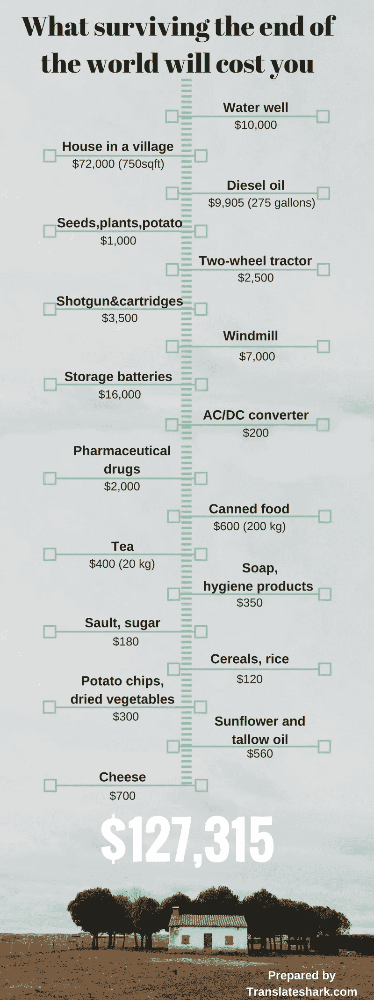

# 在世界末日幸存下来会让你付出什么代价

> 原文：<https://medium.com/hackernoon/what-surviving-the-end-of-the-world-will-cost-you-44d4bd3961b7>

这篇文章不是关于僵尸启示录和你能买到的最好的保护武器。这也不是关于大规模的外星人袭击。我们应该考虑更多可能性更大、更有科学依据的世界末日情景。听起来可能不可思议，生存工具包不会包括你已经听过很多次的任何激光武器或太空火箭。如果我们的星球发生了什么可怕的事情，那些可以拯救我们生命的事情不需要任何广告和全球营销活动，因为它们非常简单。

我们在著名的大学学习，学习外语，并努力获得高薪工作。我们梦想买豪车和大公寓。不幸的是，这些东西不会帮助我们度过人类文明生存的三大威胁。从[科学的角度来看](http://www.sciencemag.org/news/2016/07/here-s-how-world-could-end-and-what-we-can-do-about-it)，我们应该害怕太阳风暴、宇宙碰撞和超级火山。可悲的事实是，这些灾难之一可能会在未来十年发生。

# 太阳风暴

可能对我们的星球造成严重危害的日冕物质抛射(CME)并不经常发生。然而，它们是人类未来最有可能面临的灾难之一。根据最近的研究，未来 10 年内有 12%的可能性会发生大规模风暴。

最大的 CME 事件发生在 1859 年。它破坏了所有的电报电缆，罗马和古巴的人们可以享受观看北极光的乐趣。如果同样的事件发生在今天，大多数变压器将被损坏，使数百万人几个月甚至几年没有电。最糟糕的是，预测下一次事件何时发生非常困难，甚至是不可能的。我们只有 30-60 分钟启动生存模式。

> 后果:电网受损，停水，电信设施瘫痪。缺电将导致大城市的食物和水供应短缺。
> 
> 如何生存:那些在小村庄的某个地方享受平静生活的人将会是幸运儿。生存工具包将包括一个独立的水和能源来源，几个电池，应急口粮，和一把枪，以保护免受入侵者。

# 宇宙碰撞

没人想落得和恐龙一样的下场。但是，如果一颗 1 公里宽的小行星撞击地球，我们就有很大的机会做到这一点。科学界致力于识别地球附近大型物体的方法。他们试图想出更有效的办法来预防可能发生的灾难。好消息是大的小行星几百万年才撞击我们的星球一次。

> 后果:阳光受阻，农作物歉收，大规模饥荒。
> 
> **如何生存**:让我们纳税，并希望当一些太空物体决定与我们的星球相撞时，我们的政府已经有了一个拯救我们所有人的有效计划。

# 超级火山

火山爆发比宇宙碰撞更频繁。我们仍然记得 2010 年冰岛艾雅法拉火山造成的不便和破坏。但是超级火山爆发的结果可能是戏剧性的。其中之一——印度尼西亚的多巴火山爆发——在 74000 年前杀死了大部分人类。北美有 3 座超级火山，南美一座，新西兰一座，印度尼西亚一座，日本一座。现在有办法预测下一次大规模爆发的时间和地点。

> **后果**:由于尘云的影响，平均温度将下降 5 摄氏度至 10 摄氏度。没有植物能够生长。这将导致严重的粮食供应短缺和饥饿。
> 
> 如何生存:科学家们相信我们有足够的植物为我们提供替代食物。但是我们需要一些时间让他们正常运作。所以，再一次，你需要一个水源和能源，食物，和一把枪来保护自己。生存工具包还包括一个播种的地方和一些基本的农业机械。你需要和其他家庭联合起来应对一切并生存下去。

下面的信息图表显示了一个三口之家需要购买什么来维持生计，以及需要花费多少钱。

