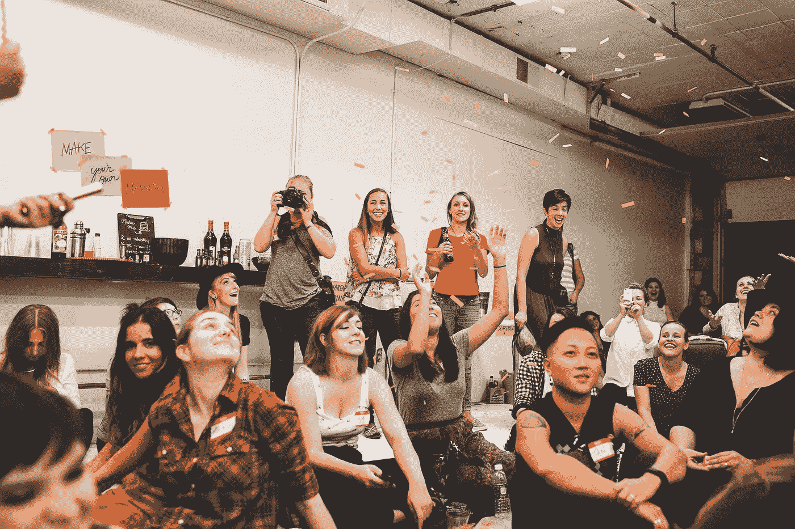

# 宝贝们为我做了什么

> 原文：<https://medium.com/hackernoon/what-the-babes-did-for-me-484481ee337a>

2011 年。我口袋里有一个 BFA，一个正在进行的设计实习。白天有了更多的时间，我的银行账户里也有了一些钱。离开大学是一个繁忙的计划，但是第二天、第一周、第一个月，现实把你推了出去，一个[准备不足的](https://hackernoon.com/tagged/ill-prepared)人进入了等待下一套生活指令的劳动大军。

工作，咖啡，啤酒的例行公事。朝九晚五由自命不凡的咖啡店提供动力，试图找到新的方法让咖啡因进入你的身体。精力充沛的白天需要凉爽、放松的夜晚。酒精，跳舞，花钱的时间。很难建立稳固持久的友谊。友谊不再是我生活中真正的东西了。教室不见了。坐在那里的 30 个人保证至少有一点和你相同。现在，你在一个嘈杂的酒吧里和你同事的邻居谈论[你不知道，因为声音太大了]。

2014.[脸书](https://hackernoon.com/tagged/facebook)略读带我去了一个活动。俄亥俄州哥伦布炎热潮湿的夏天，创意女性在后院聚会？是的。

一个新事物，创意宝贝收集了一大堆来自不同职业、不同人生阶段的女士，以及我们的书面意见。我们能做什么，我们需要什么，你对什么有热情？我很少参加社交活动，握手和闲聊时不紧张地诅咒填充符，那么为什么这会更好呢？

更多的会议，更多的活动。女人们听了我的笑话后大笑，看着网飞喜欢我，在啜饮一口梅洛葡萄酒后分享紫色的牙齿，爱着鲍伊。自信心爆棚。我不仅喜欢和女人在一起，还可以打电话约她们出去玩。我粗俗的语言，我对基本发型和 youtube 明星的无知，我的小肌肉，未涂指甲油的指甲，太多 X 档案和星际迷航的知识都没有让他们相象！亲爱的小耶稣，成年女性——我能理解她们！

我不仅可以做我自己，还可以学习如何成为一个更好的人。

这个团体越来越强大。如此多的积极围绕着他们，如此多我一生中从未遇到过的积极。没有成见，没有抱怨，没有仇恨，没有扯淡。我们正在烤那该死的蛋糕，然后吃掉它。

> [黑客中午](http://bit.ly/Hackernoon)是黑客如何开始他们的下午。我们是 [@AMI](http://bit.ly/atAMIatAMI) 家庭的一员。我们现在[接受投稿](http://bit.ly/hackernoonsubmission)，并乐意[讨论广告&赞助](mailto:partners@amipublications.com)机会。
> 
> 如果你喜欢这个故事，我们推荐你阅读我们的[最新科技故事](http://bit.ly/hackernoonlatestt)和[趋势科技故事](https://hackernoon.com/trending)。直到下一次，不要把世界的现实想当然！

