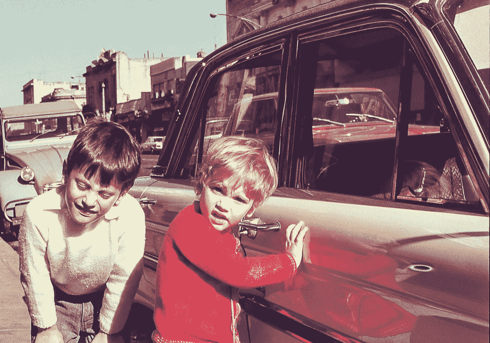

# 美元刮脸俱乐部能教给汽车业什么

> 原文：<https://medium.com/hackernoon/what-the-dollar-shave-club-can-teach-the-car-industry-9b4cdfbc30fa>

Photo credit: Shanina on istockphoto.com

联合利华最近斥资 10 亿美元收购了 [**美元剃须俱乐部**](https://try.dollarshaveclub.com/try-the-club/) 。对于一个四岁的初创公司来说，这已经不错了，它以每月一美元的价格出售刀片。谁会想到剃须也是一种服务？

我的学校生活和其他 70 年代的郊区孩子一样。我们不得不在早上 7 点 15 分准时离开家，以免在往南进入德班时被堵在乌姆格尼桥的瓶颈上。在匆忙中，我父亲经常会用他的威尔金森双刃安全剃刀划伤自己，并在早餐桌上用一块卫生纸粘在下巴上。下午，我母亲用家里的第二辆车来接我们，因为没有交通堵塞，我们用了一半的时间完成了回程。

200 年来，男人们使用一种单刃的割喉剃刀，这种剃刀在下巴周围很难刮，因此古代流行山羊胡子。1904 年，吉列申请了安全剃须刀的专利，在接下来的 70 年里，这种剃须刀给了人们相对安全的剃须体验。当我在 80 年代初开始刮胡子的时候，所有的东西都被打破了:一次性刀片、双刀片、三刀片、四刀片、弹性刀片、润滑条等等。消费主义的逻辑意味着像吉列和希克这样的人不断在不必要的技术进化山上滚动西西弗巨石，以剃掉自直立人时代以来几乎没有变化的下巴。

美元剃须俱乐部的创始人马克·莱文和迈克·杜宾得到了讽刺——他们不仅仅得到了它，他们的广告活动就是建立在它之上的。正如迈克在网络广告中所说:“你喜欢每月花 20 美元买名牌剃须刀吗？罗杰·费德勒获得 19 美元……你认为你的剃须刀需要一个振动手柄、一个手电筒、一个挠背器和十个刀片吗？你英俊的祖父有一把刀片，还有小儿麻痹症。”

因此，两个年轻人颠覆了一个由三个品牌主导了近百年的行业。他们不是通过创造更好的产品来做到这一点，而是通过向消费者提供更简单、更便宜的提议——订阅模式，或者，如果你喜欢的话，“剃须即服务”。

同样，汽车行业一直被少数几个品牌所主导，它们通过为一个至少 50 年来都没有改变的问题制造更好的产品来竞争:送孩子上学、上班、购物、回家。对大多数人来说，往返路程不超过 15 公里。对于这样一个简单的任务，几乎任何汽车都可以做到；但是为了获得市场份额，汽车公司让广告人创造我们还没有想象到的需求。为了满足这些新的需求，每年花费大约 9000 美元，金融和保险公司想出了如何扩展适度的工资，这样我们就可以驾驶我们梦想中的汽车。结果是:四十年过去了，我的同龄人开着两吨重的 SUV 送孩子去学校，这辆 SUV 可以参加巴黎达喀尔拉力赛，而瓶颈比以往任何时候都更严重。

在创造 [**Autonomy**](http://www.autonomy.paris/?utm_source=referral&utm_medium=linkedin&utm_campaign=100-dollar-car-club) 的过程中，我开始遇到了移动世界的美元刮脸俱乐部，这将颠覆老爷车行业。上周，我遇到了一家中国初创公司的创始人，该公司筹集了 5 亿美元建立了一家工厂，生产联网的串联电动通勤车。价格:4500.00 美元；射程:100 公里；最高时速:80 公里。非常适合城市通勤。想象一下把它放到一个点对点的共享平台上。结果将是每个用户每年花费大约 100 美元的城市移动资产。

汽车工业开始明白，像迈克·杜宾这样的聪明孩子可能很快就会做一个广告，说:“你喜欢每年花 9000 美元买一辆名牌汽车吗？其中 8000 美元花在了你不需要也永远不会用到的技术上。你英俊的祖父在马背上有更好的机动性——而且是半跛的……欢迎加入 100 美元汽车俱乐部……

(我已经注册了域名 *100 美元汽车俱乐部*，并对合作提议持开放态度)

> [黑客中午](http://bit.ly/Hackernoon)是黑客如何开始他们的下午。我们是 [@AMI](http://bit.ly/atAMIatAMI) 家庭的一员。我们现在[接受投稿](http://bit.ly/hackernoonsubmission)并乐意[讨论广告&赞助](mailto:partners@amipublications.com)机会。
> 
> 如果你喜欢这个故事，我们推荐你阅读我们的[最新科技故事](http://bit.ly/hackernoonlatestt)和[趋势科技故事](https://hackernoon.com/trending)。直到下一次，不要把世界的现实想当然！

