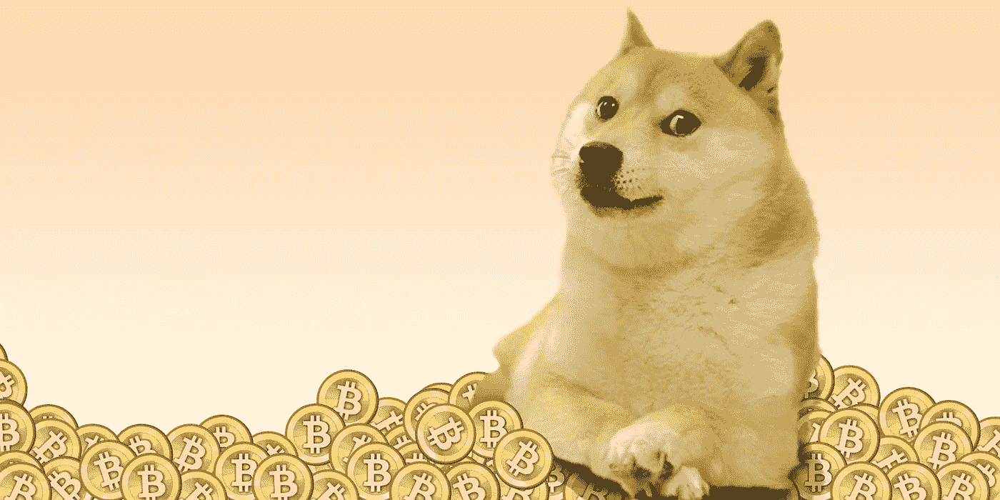
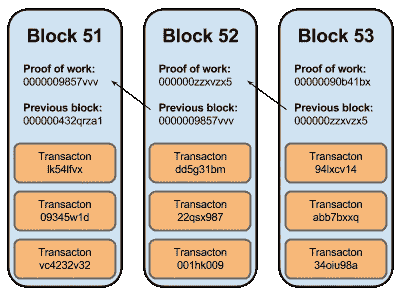

# 区块链到底是什么？

> 原文：<https://medium.com/hackernoon/what-the-f-is-blockchain-anyways-6b09277d9620>

听着，我明白。每天都有这么多疯狂的术语摆在你面前。

*比特币。以太坊。区块链。道。权力下放。ICO。虚拟代币。分布式分类帐。矿工。密码。Dogecoin？*

这令人难以置信地难以承受，很难跟上——特别是因为技术每天都在快速变化*。*

*这篇文章从头开始，今天，我只想帮你回答这个问题:*

> ****什么是区块链？(…我保证我不会把它描述成‘一种分布式账本——因为那到底是什么？)****

## *SHA-256:不是夜·夏马兰先生…*

*你以前见过这种数字——它们看起来像:34 Fe 9 f 09 e 27 cc 9057 e 03d 29 e 5 ebde 996 be 2869 ac1a 412 e 9188 f 023165 df 39 e 74(不要害怕…继续阅读)。我们大多数人只是把它归结为“计算机的东西”。*

*但远不止如此。这是一个由美国国家安全局创建的程序，名为安全哈希算法(SHA-256)。为什么是 SHA-256？继续阅读…*

## *想想指纹。*

*指纹是你的唯一标识。我们都知道。简而言之，如果你通过这个令人印象深刻的项目(比如 SHA-256 项目，可能是两个词，一篇 10，000 页的文章，一张图片，等等)。)，它会给你这个所谓的“数字指纹”(也就是我上面吓唬你的那个超长数字)。很酷，对吧？*

*所以，想象一下，如果有人在搞乱你辛辛苦苦写的一万页的论文。为了验证它没有被修改——你必须检查所有的页面，确保没有一个逗号出现在错误的位置。或者……如果你通过 SHA-256 程序运行这篇原创文章，你会得到一个“数字指纹”,如果有人改变了哪怕一个空格，你也会得到一个完全不同的“指纹”。*

*这是描述所谓的**加密散列**的一个很长的方法。哈希(不是*那种*的哈希)就是“数字签名”。这又让我们回到了你最初令人挠头的问题:什么是区块链？*

*既然您是加密哈希方面的专家，从这里开始就容易多了。*

*先从**块**开始。取一堆交易，并散列它们，即给整个“块”交易一个唯一的指纹！完成了。*

***链条**。你刚刚完成了你的第一次盖帽。您的下一个事务块包含新的事务— *加上来自前一个块的*。*

*明白了吗？ ***区块链*** (技术爆笑)。*

*很酷，对吧？现在你明白这些图像实际上在说什么了。*

**

*(附注:破解 SHA-256 算法几乎是不可能的。)*

*256 意味着有两种⁵⁶可能性*

*2⁵⁶=115792089237316195423570985008687907853269984665640564039457584007913129639936…耶*

*请记住，哈希只是一种方式。你不能提取指纹并取回文章——它只是验证了它。这意味着，如果有人想改变你的区块链，他们将不得不回去编辑你的每一个块中的每一个东西，并重新创建它们…如此继续下去。相信我，一旦我们进入这个兔子洞——这是一条很长很长的路。*

*这是我第一次尝试用简单的方式解释这个问题。如果这有帮助，并且容易理解，我会写更多，我们可以一起下兔子洞！留下评论，让我知道你的想法，或者什么话题让你夜不能寐——我会写下来。*

**这里有一个即将到来的预告…**

**-为什么是区块链**

**-Cryptocurrenci 简介
-* [*可替代性时代*](https://hackernoon.com/the-era-of-fungibility-a2b521ad28b2)*

**-* [*以太坊&道之道*](https://hackernoon.com/ethereum-the-tao-of-the-dao-fa561b2f6b54)*

*还有很多很多。我们生活在有趣的时代！*

*在 Twitter 上关注我的日常想法 [@qayyumrajan](http://twitter.com/qayyumrajan)*