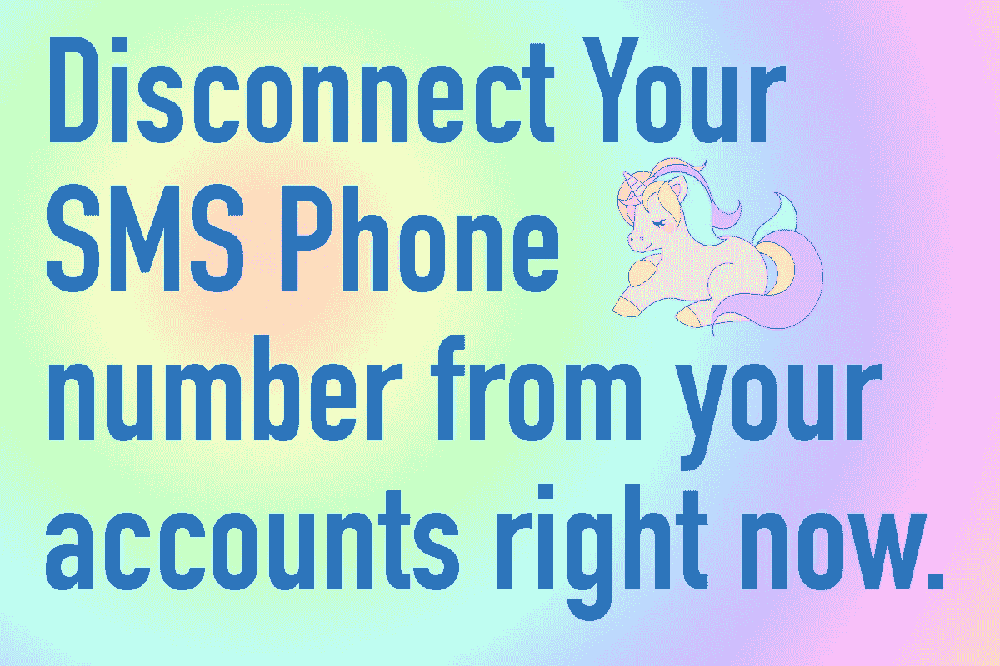

# U2F 是什么鬼？

> 原文：<https://medium.com/hackernoon/what-the-heck-is-u2f-35cb68082dbe>

# 我刚刚读完一个叫科迪·布朗的家伙在 15 分钟内从比特币基地输掉了 T2 8k 美元的比特币。

这是怎么发生的？他的比特币基地账户不是设置了双重认证吗？

# 是的。

# 但他用错了:SMS 短信。

SMS 文本消息作为双因素认证是非常不安全的。现在的黑客可以很容易地打电话给你的电话供应商，并冒充你。他们不需要证明任何身份。他们需要做的就是让员工相信他就是你。有些黑客真的很擅长这个。这是目前存在的最薄弱的环节，普通人仍然不了解其中的风险。

作为最大的区块链风险投资公司之一，[的博深最近被一名黑客窃取了 30 多万美元](http://www.coindesk.com/hackers-stole-300k-blockchain-investor/),使用的是同样的薄弱环节:短信。这是一个很多人都没有意识到的巨大问题。

## 如果你有短信作为你的 2FA，现在就把你的手机从你的账户上断开。我将解释您应该做什么来代替它，这实际上是安全的。

# 现在就做。

有时一段视频比阅读文本更能解释这一切，所以请观看这段视频。里面小伙子用的是 Yubikey，我没用过。我用一把 Trezor 作为我的 U2F(或者物理钥匙)。

# 那么，U2F 到底是什么？

> **通用第二因子** ( **U2F** )是一种[开放](https://en.wikipedia.org/wiki/Open_standard)认证标准，它使用基于[智能卡](https://en.wikipedia.org/wiki/Smart_card)中类似安全技术的专用 [USB](https://en.wikipedia.org/wiki/USB) 或 [NFC](https://en.wikipedia.org/wiki/Near_field_communication) 设备来加强和简化[双因子认证](https://en.wikipedia.org/wiki/Two-factor_authentication)。[【1】](https://en.wikipedia.org/wiki/Universal_2nd_Factor#cite_note-Google_security_keys-1)[【2】](https://en.wikipedia.org/wiki/Universal_2nd_Factor#cite_note-Using_Security_Key-2)[【3】](https://en.wikipedia.org/wiki/Universal_2nd_Factor#cite_note-USB_key_drive_could_remove_the_hassles-3)[【4】](https://en.wikipedia.org/wiki/Universal_2nd_Factor#cite_note-FIDO_Universal_2nd_Factor-4)[【5】](https://en.wikipedia.org/wiki/Universal_2nd_Factor#cite_note-Google_Wants_To_Make_Passwords_Obsolete-5)最初由 [Google](https://en.wikipedia.org/wiki/Google) 和 [Yubico](https://en.wikipedia.org/wiki/Yubico) 开发，并有[恩智浦半导体](https://en.wikipedia.org/wiki/NXP_Semiconductors)的贡献，现在该标准由 [FIDO 联盟](https://en.wikipedia.org/wiki/FIDO_Alliance)主持。[【6】](https://en.wikipedia.org/wiki/Universal_2nd_Factor#cite_note-FIDO_Alliance_standards-6)[【7】](https://en.wikipedia.org/wiki/Universal_2nd_Factor#cite_note-Google_Accounts_Now_Support_Security_Keys-7)
> 
> U2F 安全密钥从版本 40 开始由[谷歌 Chrome](https://en.wikipedia.org/wiki/Google_Chrome)[【2】](https://en.wikipedia.org/wiki/Universal_2nd_Factor#cite_note-Using_Security_Key-2)支持，从版本 40 开始由 Opera 支持。U2F 安全密钥可以在支持 U2F 协议的在线服务上作为两步验证的附加方法，包括 [Google](https://en.wikipedia.org/wiki/Google) 、[【2】](https://en.wikipedia.org/wiki/Universal_2nd_Factor#cite_note-Using_Security_Key-2)[Dropbox](https://en.wikipedia.org/wiki/Dropbox_(service))、[【8】](https://en.wikipedia.org/wiki/Universal_2nd_Factor#cite_note-8)[GitHub](https://en.wikipedia.org/wiki/GitHub)、[【9】](https://en.wikipedia.org/wiki/Universal_2nd_Factor#cite_note-9)[git lab](https://en.wikipedia.org/wiki/GitLab)、[【10】](https://en.wikipedia.org/wiki/Universal_2nd_Factor#cite_note-10)[bit bucket](https://en.wikipedia.org/wiki/Bitbucket)、[【11】](https://en.wikipedia.org/wiki/Universal_2nd_Factor#cite_note-11)[【14】](https://en.wikipedia.org/wiki/Universal_2nd_Factor#cite_note-14)
> 
> Chrome 和 Opera 是目前唯一原生支持 U2F 的浏览器。微软正在致力于 FIDO 2.0 对[Windows 10](https://en.wikipedia.org/wiki/Windows_10)[【15】](https://en.wikipedia.org/wiki/Universal_2nd_Factor#cite_note-15)和[Edge](https://en.wikipedia.org/wiki/Microsoft_Edge)[【16】](https://en.wikipedia.org/wiki/Universal_2nd_Factor#cite_note-16)浏览器的支持，但尚未宣布任何包含 U2F 支持的计划。 [Mozilla](https://en.wikipedia.org/wiki/Mozilla) 正在将其集成到 [Firefox](https://en.wikipedia.org/wiki/Firefox) 中，目前可以通过插件- [Wikipedia](https://en.wikipedia.org/wiki/Universal_2nd_Factor) 启用支持

## 我将简化这个定义:

U2F 是一个物理密钥，您可以将其插入电脑的 USB 端口。你输入密码后把这个放进去。U2F 设备使用加密，因为它包含一个与您的公钥匹配的私钥，以便解锁您的帐户，如 Gmail 和脸书。没有物理密钥，任何人都无法访问您的帐户。因此，黑客，甚至键盘记录器将无法窃取您的密码，因为 U2F 加密的数据。

还有其他更便宜的选择，比如亚马逊售价 18 美元的 Yubikey。我从来没有用过 Yubikey，只是最近做了一些调查后才知道它。一个好主意是将几个 U2F 设备连接到您的帐户，以确保您在丢失一个密钥时不会失去访问权限。

第一次这么做让人不知所措，但是一旦你这么做了，你晚上就能睡得着了。随着时间的推移，黑客变得越来越高级和狡猾，所以你越早获得这些物理 U2F 密钥越好！车和房子需要实体钥匙，户口也是！

这里有一个操作视频，向您展示如何使用您的 gmail 帐户设置一个 U2F 物理设备，如 Trezor 或 Yubikey:

# 你可以这样做……现在。

> [黑客中午](http://bit.ly/Hackernoon)是黑客如何开始他们的下午。我们是 [@AMI](http://bit.ly/atAMIatAMI) 家庭的一员。我们现在[接受投稿](http://bit.ly/hackernoonsubmission)，并乐意[讨论广告&赞助](mailto:partners@amipublications.com)机会。
> 
> 如果你喜欢这个故事，我们推荐你阅读我们的[最新科技故事](http://bit.ly/hackernoonlatestt)和[趋势科技故事](https://hackernoon.com/trending)。直到下一次，不要把世界的现实想当然！

