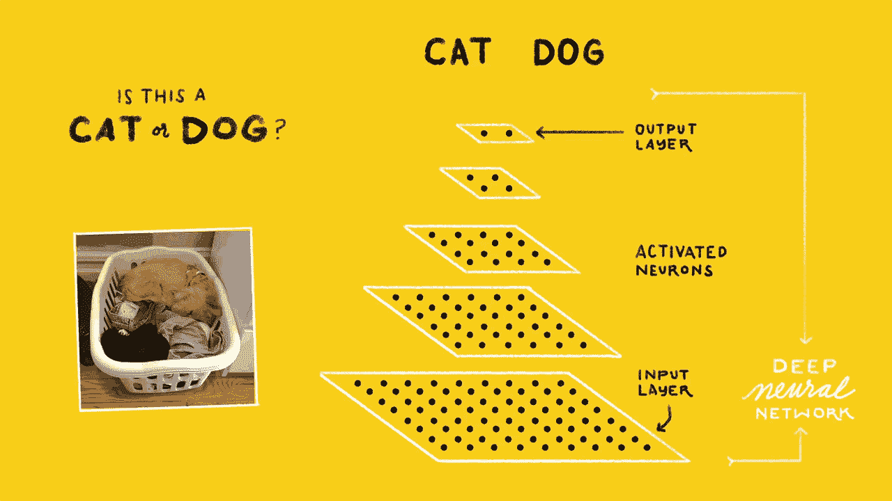

# “TensorFlow”里的“Tensor”是什么鬼？

> 原文：<https://medium.com/hackernoon/what-the-hell-is-tensor-in-tensorflow-e40dbf0253ee>

## 我不知道…


我们都知道如何与 tensorflow 库合作，并制作一些像“下面的猫狗 gif”这样的惊人模型，从而实现伟大的预测💯。但是张量到底是什么？

也许你知道…但我不知道。

> 更新-深度学习是试图复制人脑的模式检测能力，模式检测的主要原因是我们大脑中的神经网络。



[Source](https://www.google.co.in/url?sa=i&rct=j&q=&esrc=s&source=images&cd=&cad=rja&uact=8&ved=0ahUKEwitmOfMwJjWAhUEuI8KHaC0B70QjRwIBw&url=https%3A%2F%2Fsourcedexter.com%2Fquickly-setup-tensorflow-image-recognition%2F&psig=AFQjCNECC-bU3aVXpskLqFb5wTh9hC5KSg&ust=1505059427589200)

## 张量是什么？

它只是数据单元的一个通用术语。咄…我们都知道…

它也用一个**等级**来表示，就像**矩阵中的**一样。它们是几何对象，描述几何向量、标量和其他张量之间的线性关系。

更新-张量由一组原始值组成，形成任意维数的数组。

## 但是哪种类型的数据，标量还是矢量？

如果你和我一样认为，它是向量的升级，就像向量是标量的升级一样。那么不，你错了。标量和矢量都是张量。

## 什么是秩或张量的秩？

用于[表示](https://hackernoon.com/tagged/represent)数据的**维数**称为其秩。

## 看起来怎么样？

更新-

**秩/维零张量**或一个**标量。**

```
 5        # The **shape is []**
```

一个**秩/维 1** **张量**或一个**向量**。

```
 [ 1., 2., 3., 4\. ]     # The **shape is [4]**
```

一个**秩/维 2 张量**或一个**矩阵**。这是 2D *，就像一张有 X 轴和 Y 轴的照片。*

```
 # Matrix of **shape [ 2, 4]**

 [ [ 1., 2., 3., 4\. ], [ 5., 6., 7., 8\. ] ] 
```

一个**秩/维 3 张量**或一个**张量**。这是 3D *就像真实世界一样有 X，Y，Z 轴。*简单来说，就是一个更大的矩阵里面的*矩阵。*

```
 # Tensor of **shape [ 2, 1, 4 ]** **[** [ **[** 1., 2., 3., 4. **]** ]**,** [ **[** 5., 6., 7., 8. **]** ] **]** 
```

这就是增加张量维数的方法。😃

> 张量:一种数学对象，类似于向量，但比向量更一般，由一系列分量表示，这些分量是空间坐标的函数。

如果你有任何意见或问题，请写在评论里。

我将每周发布 **3** 个帖子，所以不要错过教程。

所以，跟着我上[中](/@sagarsharma4244)、[脸书](https://www.facebook.com/profile.php?id=100003188718299)、[推特](https://twitter.com/SagarSharma4244)、 [LinkedIn](https://www.linkedin.com/in/sagar-sharma-232a06148/) 、 [Google+](https://plus.google.com/u/0/+SAGARSHARMA4244) 、 [Quora](https://www.quora.com/profile/Sagar-Sharma-71) 看看类似的帖子。

**鼓掌吧！分享一下！跟我来。**

乐意帮忙。荣誉……..

# 你会喜欢的以前的故事:

1.  [交叉验证代码可视化:有点意思](/towards-data-science/cross-validation-code-visualization-kind-of-fun-b9741baea1f8)

2.[线性回归:更简单的方法](/towards-data-science/linear-regression-the-easier-way-6f941aa471ea)

3. [DIY Arduino 无线键盘](/towards-data-science/linear-regression-the-easier-way-6f941aa471ea)

4.[激活函数解释:神经网络](/towards-data-science/activation-functions-neural-networks-1cbd9f8d91d6)