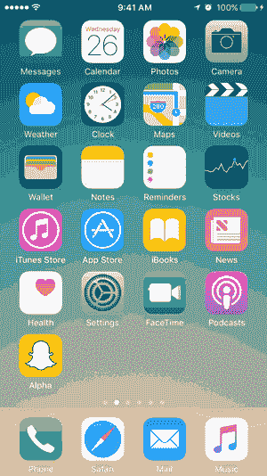
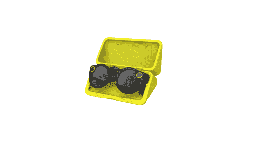
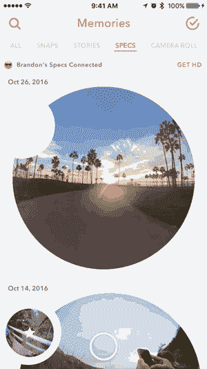

# 物联网要向 Snapchat 学习什么

> 原文：<https://medium.com/hackernoon/what-the-internet-of-things-has-to-learn-from-snapchat-d198fe10dc69>

## Snapchat 刚刚在自己的游戏中击败了所有联网设备制造商。每一家制造联网设备的公司都可以从 Snapchat 眼镜中吸取教训。

实话实说吧；Snapchat 的眼镜并不真的对 T2 的生活有重大意义。他们很酷。不过，我觉得这才是重点。

虽然眼镜没有给我的生活增添什么，但它是迄今为止我使用任何联网设备的最佳体验。自从第一次使用它们，我就心生敬畏。 **Snapchat 刚刚在自己的游戏中教会了每一个联网设备制造商。**每一个做硬件产品的公司都可以从眼镜中学到东西。

Snapchat 如何解决一些常见的物联网问题不会从眼镜上转移到其他设备上，但他们应该把眼镜作为灵感的来源。如果所有设备都像这样工作，物联网会带来更少的麻烦。

# 几乎没有设置

首先，[设置过程](https://support.spectacles.com/en-US/article/how-to-pair)简直太美了。我所要做的就是拿出我的 iPhone，打开蓝牙，看看我的 Snapchat 代码。就是这样。很快，我就可以录制并发布一段视频了。发生得太快了，我以为我做错了。

Snapchat 值得一片掌声。每个设备的设置过程都应该力求简单快速。我不应该花 30 分钟来配置我的新智能玩具。

Snapchat 有一个巨大的、值得注意的优势。我们不需要下载新的应用程序。大多数人在戴眼镜之前就已经有了 Snapchat 应用。

# **分享就是关爱**

你有没有让朋友用手机控制你的 Alexa 上的音乐开派对？或者更好的是，尝试过让别人借你的 Apple watch 来试用吗？实际上，您必须再次经历他们的设置过程，这是没有人愿意做的。

当我的一个朋友想用眼镜时，我突然开始担心了。在我内心深处，我只知道有些东西必须被重置。但令我惊讶的是，她只是戴上它们，看着她的 Snapchat 代码，开始记录。

我很震惊。对我来说，和朋友分享就像自己设置一样简单。我差点哭了。这对其他设备有多好？

# **电池寿命**

电池寿命是购买新的连接设备时最令人讨厌的部分。没有人愿意给十五台设备充电。眼镜没有解决这个问题，但解决方案很巧妙。

这款眼镜的电池可以支持大约 100 个视频片段，对我来说，这相当于一天的使用时间。最棒的是，眼镜盒可以给眼镜本身充电。因此，我可以在不连续充电的情况下获得 3 倍的电池寿命。

电池寿命肯定是一个技术限制。但 Snapchat 能够思考人们如何使用该设备来减轻这种限制的痛苦。

# 如果我想要更多，我必须做更多。

眼镜几乎没有配置。人们会很快注意到，当你使用眼镜时，质量还可以。然后我注意到一个“获取高清”按钮。一旦按下，它就会触发眼镜上方便打开的 wifi 接入点。我连接上，然后嘭，我所有的视频开始以高清格式导入。

我敢肯定这只是蓝牙的一个局限，但是 Snapchat 并没有让我想到这一点。如果我想要更多，我必须做更多。我没意见。设备应该轻松地完成它们的工作，如果需要的话，让用户感觉超级棒。

# **Snapchat 没想到开发者第一**

> [如果你想做一些很酷的东西，首先不要把它给极客。](https://techcrunch.com/2016/11/15/spectascobles/)

我理解开发者第一的方法。它允许开发人员社区构建很酷的特性，其他人也可以从中受益。然而，很多人，主要是千禧一代，如果它不酷，就不会使用它。

我们需要 360 视频吗？绝对不行。然而，如果你在 Snapchat 上看到它，你会觉得不可思议。除了“哇”之外，我没有得到任何回应

他们可以很容易地拥有更多的功能，如更长的视频，一个 API 等。相反，这种眼镜很简单，而且能很好地完成一项工作。

# **如何从中吸取教训？**

Snapchat 和其他设备制造商面临着同样的问题。在创造智能眼镜方面，他们甚至比谷歌做得更好。眼镜是简单的，他们的体验是奇妙的。

Snapchat 能够通过观察人们如何实际使用设备并利用这些场景来解决常见的物联网问题。

今天，整合一切仍然是绝对的痛苦。但是，奇怪的是，眼镜给了我希望。我希望有一个世界，每个设备都像这样工作。

最重要的是，即使它们对我的生活没有太大用处，我也会继续使用它。他们酷毙了。😎

> [黑客中午](http://bit.ly/Hackernoon)是黑客如何开始他们的下午。我们是 [@AMI](http://bit.ly/atAMIatAMI) 家庭的一员。我们现在[接受投稿](http://bit.ly/hackernoonsubmission)，并乐意[讨论广告&赞助](mailto:partners@amipublications.com)机会。
> 
> 如果你喜欢这个故事，我们推荐你阅读我们的[最新科技故事](http://bit.ly/hackernoonlatestt)和[趋势科技故事](https://hackernoon.com/trending)。直到下一次，不要把世界的现实想当然！

