# 媒体没有告诉你的印度风险投资业

> 原文：<https://medium.com/hackernoon/what-the-media-doesnt-tell-you-about-the-vc-industry-in-india-dc2c993ac933>

作为企业家，你需要知道的是

The mythical unicorn or what is supposed to be the holy grail

投资者和创业公司之间的关系很微妙。在某种程度上，这两家公司都有足够的动力来发展业务。其中一个通过执行获得微观层面的视图，另一个通过曝光获得宏观层面的视图。

这是一位在一家资产 1 亿美元的公司担任投资经理的熟人所说的。基金告诉我:

> 当我每天醒来时，我所想的都是如何为我的投资组合公司增加价值。如果他们成功了，我也成功了。

但是情况并不总是一帆风顺。除了少数个人和团队试图保持公开对话的例子之外，仍然存在一种创始人小心翼翼的氛围。

他们资助那些不能反映印度需求的模仿模式。

他们资助时下流行的生意。

一个人不能简单地会见一个风险投资家

一个企业家对风投的不满导致了这些滑稽的漫画。

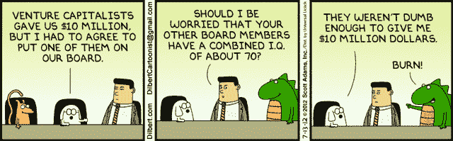

Dogbert’s wikipedia entry says he is a megalomaniac intellectual dog. We can see why!

*(顺便说一句，如果你对漫画/讽刺风投如何工作感兴趣，***应该会让你喜笑颜开！)**

*我意识到的一点是，这可能部分源于这样一个事实，即大多数企业家不知道经营一家风投公司需要什么，也不知道为什么在印度这样的国家更难。*

*对彼此的公平理解将大大有助于培育创业场景，尤其是在一个刚刚步入正轨的生态系统中。*

*我在一个早期天使投资网络中负责启动投资和投资组合管理，所以我主要从以下经历中得出我的假设:*

*   *我的公司目前正在探索筹集小额风险投资基金/天使基金的选择(*
*   *General conversations with Principals/ Managers at funds across India after long discussions involving positioning of our current portfolio of startups for their next round of fundraise.*
*   *The constant chatter you hear in investor circles and the information flow you are exposed to by virtue of being in the industry*

****完整免责声明*** *):早期天使网络提供策划投资机会，并从个人天使投资者那里获得投资资金。我们通过收取服务年费来运营。投资优质创业公司，然后管理投资组合，成为推动网络业务和建立信誉的关键。**

> *风险投资行业是一个 100%离群值的游戏——这是极端的例外。
> - *马克·安德森**

*在一个月的时间里，我浏览了有助于我们筹款的文章和资源，并与几个人见了面，如果有一个推论让我印象深刻，那就是:*

*要进入风投行业，你要么需要绝对的自信，要么需要疯狂。*

*就风险回报衡量标准而言，没有其他业务如此倾斜。*

*在我们开始之前，这里有一个关于全球风险投资公司商业模式的快速入门:*

*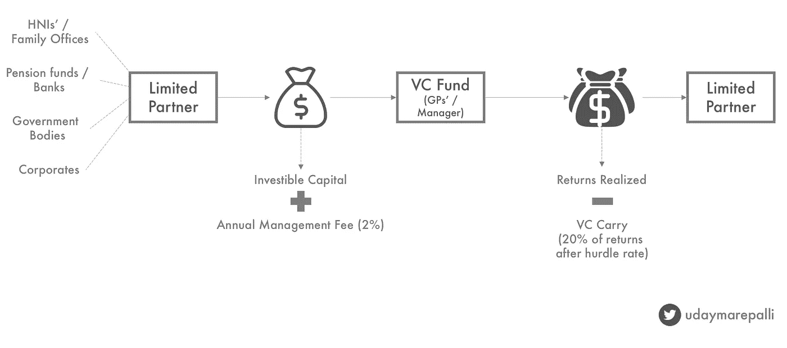*

*Working of a VC Fund*

***有限合伙人** (LP):投资风险投资基金。可以是个人/机构(养老基金/银行/ HNI 家族理财室)。*

*根据经验，以下是风投心目中的优先顺序*

*外国机构>印度机构(SIDBI 等。) >外国个人>印度个人*

*(*你的投资者名单决定了你下次融资时的血统/机构投资者有兴趣成为多只基金的一部分**

*(基金本金的)2%的年度管理费用于支付风险投资基金经理团队/运营的费用。*

***最低预期回报率**:风险投资基金经理希望从有限合伙人岗位获得的利润份额的最低保证年回报率。8%应该是行业标准，但第一次风投通常会将这一数字定得更高，以使他们的基金更具吸引力。*

***Carry** :风险投资经理有权获得的未来利润份额。通常是在产生超过最低回报率的回报后金额的 20%。第一次可以提高到 15%。*

***持有期**:基金产生收益的运营期限。*

***IRR** :基金在其生命周期内计划的平均年收益率*

*风险投资基金经理的角色可以归结为三点:*

*   *根据你的血统(投资/运营)并通过承诺回报从你的有限合伙人那里筹集资金。*
*   *寻找、投资和管理能够产生足够回报以满足有限合伙人的创业公司。*
*   *尽一切努力实现这些收益，并将现金汇回给有限合伙人。*

*(*注意，LPs 的进来全是三分！*)*

*那么失败的代价是什么？*

*   *风险投资与有限合伙人的关系有点类似于企业家与风险投资的关系(诚然，在 8-10 年的时间框架内有更多的回旋余地)。LP 失败了，你就可以和他吻别了，他是你下一个基金的一部分。*
*   *大多数基金开始准备在 3-4 年内募集下一只基金。第一只基金的资本配置应该开始显示出一些成果，以吸引下一批有限合伙人。*
*   *印度的风险投资行业还不到 10 年。但在我看来，基金经理没有可转让的角色。这是一个一英里宽——英寸深的角色，需要大量的注意力和多面手技能。*

*一个恰当的例子是 Helion Venture Partners，该公司无法筹集其第四只基金，原因是管理团队和投资组合之间的差异无法激发信心。由于缺乏第一手资料，我不想发表任何评论，但这篇文章很好地分析了问题所在。*

*就我个人而言，我认为用定量的方法来看待事物是有帮助的。这一部分还将包含一个电子表格，以了解投资和回报时间表，以及最重要的组成部分，内部收益率。*

*在继续讨论之前，让我们以 5000 万美元为例。以风投公司(Imagine Ventures)为例。它有 10 年的持有期。让我们假设该基金在早期运作，并兑现超过 75 万美元的支票。典型的基金支付结构如下所示:*

*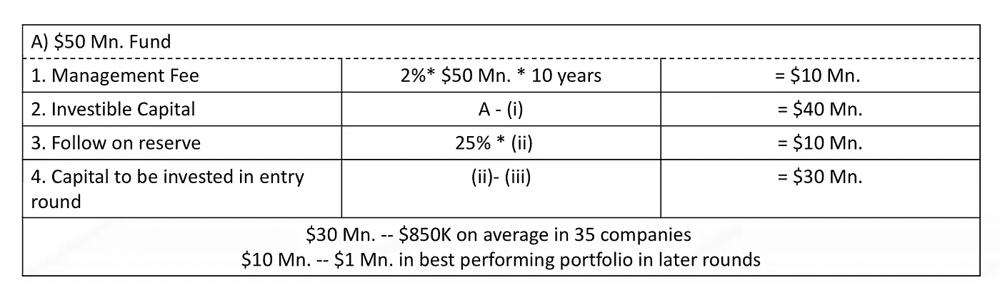*

*Fund disbursal of a VC with a corpus of $50 Mn.*

*现在，有一个学派认为风险投资的回报遵循一个[幂律](http://jackealtman.com/pay-attention-to-power-law-distributions)，最好的公司有潜力产生全部资金。*

*下一个最好的公司将产生相当于它之后所有公司回报总和的回报，以此类推。这在成熟的生态系统(美国/以色列)中基本上是一种趋势。*

*在像印度这样的生态系统中，我们很少有例子来确定一种模式。最好的情况是，大约有 2-3 只基金(SAIF 合伙公司、Saama Capital、Accel India)成功兑现了承诺的回报。*

*但我们能看到的是倍数。*

*任何雄心勃勃的基金经理都希望产生至少 4 倍的可投资资本，粗略估计，他的基金本金是 3 倍(减去管理费支出后)。*

*假设 10 年的时间框架和资本回报时间表的某些假设，这应该转化为 25%的内部收益率。*

*(IRR 数字总是有争议的，有人说 18-20%应该是可以接受的。但是一些共同基金在更短的时间内给出了超过 20%的回报。黄金和股票市场的收益率一直在 15%左右。如果我是一名有限合伙人，抛开战略原因，我会为流动性损失寻找溢价)*

*我在这里添加了我的数字和假设。你可以摆弄这些数字来理解 IRR 是如何产生的。*

*我们的 Imagine Ventures 将需要大约 1.6 亿美元的收入。*

*假设该基金在退出时持有 7-10%的股份，合并后的投资组合价值应该在 16-22 亿美元之间。美元。*

*从统计上来说，大约 50%的公司会失败，接下来的 30%会获得平均回报(约 2 倍)，而最顶尖的 20%会获得不成比例的回报。*

*让我们看两个案例。*

*第一个是你的投资组合中有一两个大赢家的概率(这个理论引出了幂律)。*

*让我们把这个放在上下文中。印度有 10 家公司的估值为 10 亿美元。美元。我会做一个明智的猜测，再投入 10-15 亿美元，估值为 5 亿美元。*

*从 2007 年开始， [4000 余家](https://blogs.economictimes.indiatimes.com/et-commentary/venture-capital-industry-in-india-is-a-flourishing-one/)公司中，最多有 30 家公司可能有能力提供这些回报，如果我们的基金(以及其他 50-80 余家风险投资基金)希望有一种最可靠的方式提供回报，那么持有其中 1-2 家公司的股份是很重要的。*

*另一种方法是列举几个小的成功故事。将这些拼凑在一起，保护你的股份，小心航行水域实现出口。你的投资组合中有大约 20%(大约 7 家公司为 Imagine Ventures)达到 2 亿到 2.5 亿美元。估值达到 1.5 亿美元。图。*

**(帽尖到* [*此处 Blume 冒然*](http://blume.vc) *。这是他们的退出重点，他们称这样的公司为蓝天鹅)**

*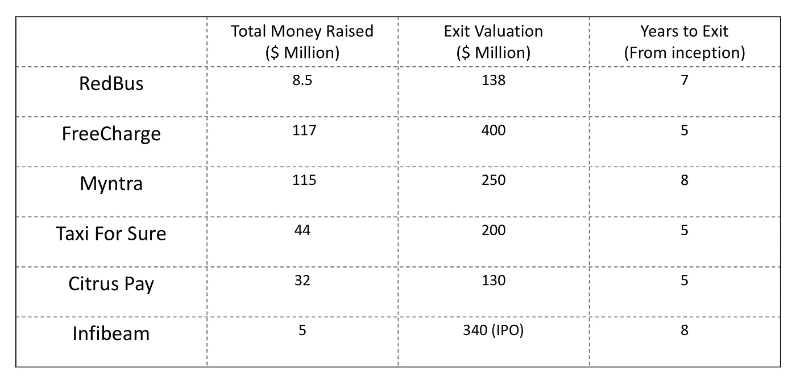*

*Some (most?) of India’s top exit stories*

*提醒一下，这些成功案例分布在几只基金中。对于每一个风险投资基金来说，在这个范围内产生类似的回报本身就是一个高要求(尤其是当好公司有限的时候)，这就是市场条件发挥作用的地方。*

*如果你还明白我的意思，我们正在谈论 5000 万美元。基金。有 AUM 超过 1 亿美元的基金。赌注越来越高，也越来越难实现。*

*在这种背景下，让我们来谈谈基金面临的其他几个挑战。*

# *时机就是一切*

*那是 2006 年。两位创始人刚从美国回来，他们想建立一个餐馆推荐平台，或者印度版的 Yelp。经过一轮小规模的种子融资后，它筹集了 200 万澳元。来自网络 18 的系列 A。*

**

*竞争隐约出现在销售更积极的 Zomato 身上。当 Zomato 筹集资金时，Burrp 意识到它必须采取一些措施来保持自己的优势。它在 2009 年以 425 亿卖给了 18 号网络。*

*到 2017 年，经过多次管理层调整，缺乏方向和无力对抗竞争对手，Burrp 以微不足道的 6.7 升出售，无论以什么标准衡量，这都是一个巨大的下降。*

*或者是 Snapdeal 以之前估值的六分之一出售，其之前的投资者竭尽全力保护自己利益的新闻。*

**(你持有 65 亿美元的 10%股份。公司价值 6.5 亿美元。如果你是一个 2 亿美元的投资者，它能给你 3-4 倍的资金本金。基金。当它贬值到 9000 万美元时。，你会奋起反抗)**

*或者免费服务以 6000 万美元的价格被出售。在以 4 亿美元被收购后..*

*或者 TutorVista 被 Byju 以不到 Perason 收购价格的 5% 的价格[收购。](https://yourstory.com/2017/05/byjus-edurite-tutorvista/)*

*如前所述，这些交易中的大部分都会涉及大量股票。但是看看价值变化有多快。*

*印度的消费市场并不是同质的。Haresh Chawla 的这篇了不起的[文章](http://www.foundingfuel.com/article/how-indias-digital-economy-can-rediscover-its-mojo/)给了你一个关于互联网创业公司反对什么的印度。创业公司向发达市场销售要比向印度公司销售好得多。此外，从人才的角度来看，我们对工作和就业的心态使招聘有点挑战性。*

*基本上，价值被侵蚀的速度和它被创造的速度一样快。*

*这就是风险投资者必须依赖时机的地方。*

*你投资组合中的最佳选择需要持续监控。*

*重症监护室的病人需要更多。*

*你真的不能在以后的阶段兑现你的价值。*

*从本质上讲，一旦这种心态形成，你就在一场以冒险为荣的游戏中处于不利地位。*

**有趣的事实:一只早期基金在 Snapdeal 的* [*投资*](http://www.livemint.com/Companies/LEvnjTvVU4aaR01p8es15N/Why-Saama-sold-its-Snapdeal-stake.html) *获得了约 48 倍的回报。足以回报总基金规模的约 5 倍。**

# ***所有权%高于一切***

*在任何比赛中，选出一个赢家都会给任何投机者带来一笔横财。*

*但在风险投资竞赛中，你不仅需要选出一个赢家，还需要不断对你的选择下双倍/三倍的赌注。*

*作为一名投资者，当下一轮融资发生时，你对自己持有该公司股票的比例稀释持开放态度。通常，在 5 年的时间里，预计至少会有 2-3 轮融资。*

*而且每一轮你都稀释了一部分所有权。*

*你处在一个进退两难的境地。你的资产在增值，但你的所有权比例在下降。*

*理想情况下，这不会成为问题。但当退出发生时，它们通常发生在融资的最后一次估值或折价时。一旦你加入了后期投资者的清算偏好，你的回报会进一步下降。*

*在一家公司的早期阶段，估值的上升速度更快。随着股价走高，后期投资者不再看重增长潜力，而是倾向于传统的市盈率。*

*在赢家身上持有少量股份意味着不管你的信念如何，你都是输家。*

*你不会想拥有一家价值 2 亿美元的公司的 2%的股份。你第一次倒车的时候没有。*

*持有收购公司的股票也不是一个理想的选择。你永远不知道回报会如何。同样，投资组合退出 Snapdeal 的小投资者和基金(藏在其他部分)的痛苦证明了这一点。*

*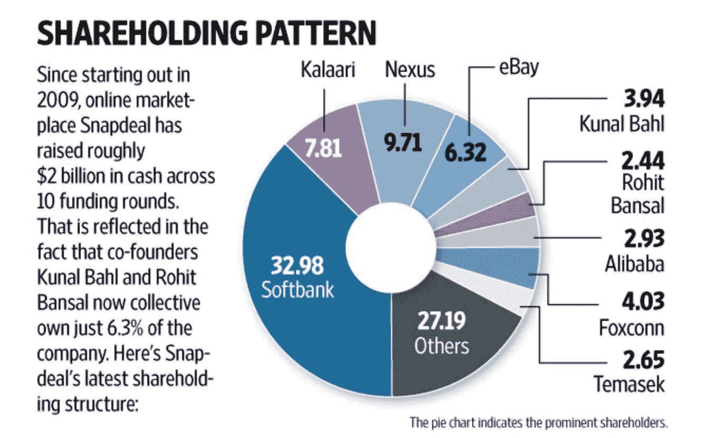*

*Snapdeal’s shareholding pattern. Source: Livemint*

*更糟糕的是，在像印度这样一个日益成熟的生态系统中，出口(合适的出口)既远又少。即使发生了，现金支出也很少(退出价值的 20~30%)。*

*出于这个原因，风投们会从他们的基金中拿出一部分(约 25%)来参与他们明星投资组合公司的后续融资。这就减少了投资新基金的干粉，因为它们完成了 2-3 年的基金周期。*

*任务是明确的。每个公司都想在胜出的公司中拥有两位数的股份。任何不足都是不可接受的。*

*参与权、下行保护、对未达到目标的惩罚和其他条款主要是为了满足这一目的。*

# ***交叉结构***

*维持所有权结构并从早期阶段就与投资组合相关联的需要，使得风险投资者比他们通常投资的阶段更早进入。*

*像红杉这样的基金(本金> 9 亿美元。)开出价值 2000 万美元的支票。以及以上。他们需要一定规模的回报来证明他们不仅投入了金钱，而且投入了时间和精力，*

*与此同时，你看到他们开出 100 万美元左右的支票。对于他们来说，这在很大程度上是“让我们测试一下”的资本，因为失去这一点不会改变他们的想法。*

*但这也可能带来丰厚的回报。红杉投资了 200 万美元。柑橘类圆形。它补充了 1000 万美元。2500 万美元的 C 轮融资支票。看看这些数字，很明显，当 1.3 亿美元时，他们至少拥有 35%的资本表。收购了 PayU，获得了大约 4 倍的回报。*

*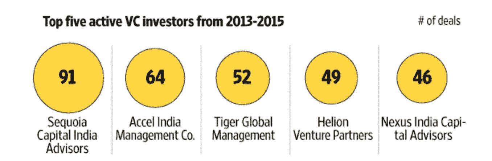*

*Funds of large sizes investing across the spectrum. This explains the huge portfolio sizes. Source: Livemint*

*但从好的方面来看，对于开小额支票的基金经理来说，这是一笔交易的损失。*

*同样，即使是高达 300-500 万美元的基金。在一笔交易中，他们推出了专门的[项目](https://yourstory.com/2016/02/kalaari-kstart-launch/)，以迎合种子期/首轮融资前的水平。在某些情况下，他们[指定](http://economictimes.indiatimes.com/small-biz/startups/venture-capital-firm-ventureast-on-an-investment-hunt/articleshow/57320493.cms)一部分仅用于早期投资。总而言之，大多数玩家都在竞相成为一家公司的最早投资者。*

*当好的交易很少，而你有大量的资金追逐这几笔交易时，你需要有超强的竞争力来开拓利基市场。*

*除非你表现出色或被公认为你所在领域的最佳玩家，否则收集优质交易流将成为一个棘手问题。建立这种优先目的地地位需要时间。*

*对于少数几笔好交易，大约 50 多家风险基金正在敞开大门，这使得抓住好交易流变得异常困难。当 Matrix [将](http://tech.economictimes.indiatimes.com/news/startups/matrix-partners-expands-to-delhi-ncr/60301135)扩展到德里，或者 Lightspeed [在班加罗尔开设](https://www.vccircle.com/vc-firm-lightspeed-opens-second-india-office-in-bangalore/)办事处时，这都是为了让他们睁大眼睛、竖起耳朵，更接近高质量的企业家。*

# ***出口在哪里？***

*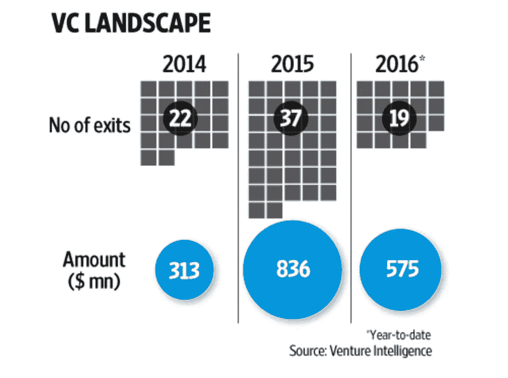*

*在世界范围内，退出被视为生态系统成熟的标志。一份 Crunchbase 报告提到，2016 年 H1 奥运会，印度的出境人数位居第三。*

*但是为什么我们在新闻中没有听说过他们，或者在任何名单中都没有看到他们呢？*

*因为相当一部分不是(甚至不是？)风险投资支持的企业。大多数风投支持的公司都是不良收购。*

*企业家们意识到很难独立经营他们的企业。*

*那种风险投资公司由于市场不景气或发现这不是一项“适合风险投资”的投资而不愿为企业提供资金的情况。*

*收购者通过花投资者的钱来达到他们的增长数字。*

*Foget 一个基金产生 4 倍的倍数，这个行业的投资资本回报率是 0.8 倍。*

*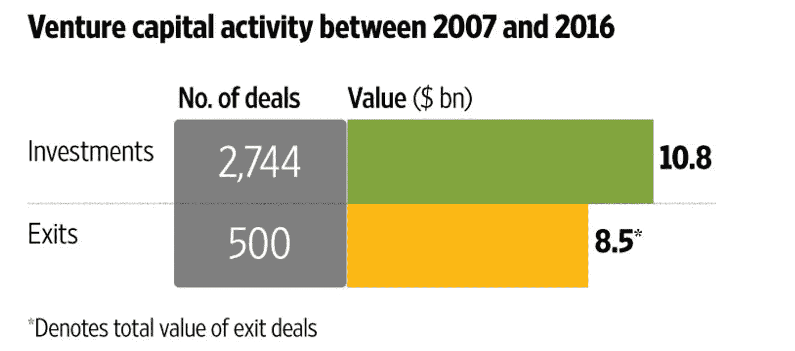*

*10 年的时间框架可能也太乐观了。大多数投资者高估了印度在线交易的潜力。不只是浏览，而是购买。这也是红杉和 Nexus 等大型基金试图在美国/新加坡市场配置资本的原因之一。此外，2006 年至 2007 年成立的风险基金正在寻求有限合伙人协议的延期。*

**看看 seedfund 的* [*投资组合*](http://seedfund.in/our-portfolio.html) *。他们仍有一些在 2006 年至 2008 年期间投资的公司，但尚未实现回报。**

# ***它是一个进料漏斗***

*理想情况下，我希望我们的投资组合公司筹集一轮机构资本。大约 50 万美元。*

*这个 50 万美元的家伙(姑且称他为 A 轮融资前的家伙)会希望 A 轮融资发生。*

*A 轮融资的人会希望公司募集 B/C 轮融资。*

*在 B/C 运营的人会希望风投/私募基金的人接过接力棒。*

*理想情况下，私募股权投资人希望初创公司上市，但如果他的假设失败了呢？*

*他会希望软银参与进来！*

*这里的要点是，每个人都想进入一个更高的漏斗，因为你需要现金来运营业务。(在牌桌上盈利是一种选择，但同样，有些市场/业务领域你必须花钱才能赢。如果你是 B2C 玩家，就更是如此。还是那句话，还记得 Flipkart 收购 Jabong 和 Myntra 吗？)*

*如果你能看到当前市场的发展状况，那么“首次公开募股”还有很长的路要走。*

*因此，在每次投资之前，价值链中的每个参与者都应该弄清楚一家公司需要从他那里获得多少资金，持续多长时间，之后公司需要如何/多快增长，以及公司是否会为下一个人的到来进行有吸引力的押注。*

*此外，后期投资者总是更有选择性，如下图所示:*

*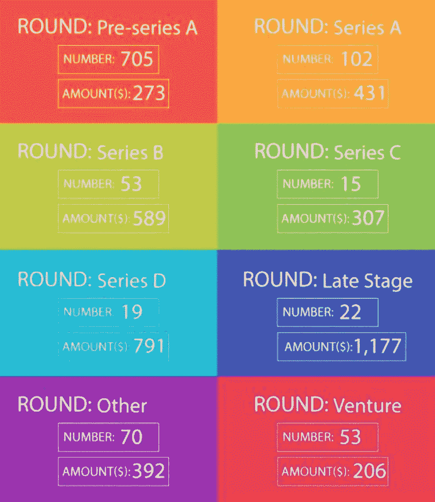*

*Funding according to stage of the company for 2016\. Source: Yourstory Research*

*有时候，一个企业家可能有一个逐月增长的伟大企业，但是如果它不符合这个框架，它将被忽略。*

# ***顶部重型结构***

*成功不在于投资，而在于完成一个完整的周期，实现退出(并将资金汇回给有限合伙人)。*

*公司通常依靠普通合伙人或风险合伙人，利用他们的经验和关系，为公司的发展贡献他们的时间。不同规模的基金都必须创造回报，这导致了头重脚轻的结构。*

*管理合伙人调查交易，但也与有限合伙人沟通，并不断为下一只基金寻找新的合作伙伴。*

*与 AUM < $20 Mn. will just have two-three partners supported by one junior staff, funds between $20–40 mn. will have a couple of analyst/ associates helping them and funds >的基金:5000 万美元。会不断增加人手来干预投资组合和评估交易。*

> *风险资本是不可扩展的。产量等于每个合伙人拥有的时间。
> - *比尔·格利**

*让我们以我作为投资团队的一员所做的活动为例。*

*在任何一周，我都会与已经向我们提出申请/被推荐给我们的初创公司交谈，协调与投资渠道中的公司的谈判，监控我们投资组合公司的运营空间及其进展，或者对正在形成的预期趋势进行自己的研究。除此之外，还有一些与管理/运营相关的任务，这些任务对于公司的发展至关重要。*

*现在，将此转化为对高质量交易流的风险和需求更高的基金。*

*假设有两个分析师，每个人可以在一个月内彻底审查大约 4 笔交易(相信我，这四笔是在缩小漏斗后)，他们可以处理大约 8-10 家这样的公司。*

*我们每月收到大约 30 份资料。在我看来，一个基金获得的数字更高。*

*这是他们开始关门的时候，一般的应用方式如网站链接/链接不再重要。最好的交易来自现有投资组合创始人的推荐、密切的个人联系和其他专有渠道。*

*事后看来，这也是减少噪音的好方法。*

*我想用最后一个想法来结束我的发言。*

# ***投资是非常主观的***

*在批判眼光的引导下，部分是因为市场条件和不利条件，风险投资者会寻找公司失败的原因。对此的委婉说法是，“我认为你无法扩展”。*

*投资没有一成不变的规则。*

*从全球范围来看，克里斯·萨卡(Chris Sacca)超过了 Dropbox、Pinterest 和 Snapchat。*

*投资了谷歌、PayPal 和 Reddit 的硅谷超级天使罗恩·康韦放弃了 Salesforce，因为他认为他们的 3000 万美元。估价太高了。Salesforce 价值 700 亿美元。现在。*

*事实上，Bessemer 通过公布其[反投资组合](https://www.bvp.com/portfolio/anti-portfolio)(或者可能是其投资组合的一部分)的完整列表，将这一点提升了一个档次。在其漫长的历史中，该公司已经错过了投资技术公司的机会，包括苹果、脸书易贝、谷歌、Intuit 和许多其他公司。*

*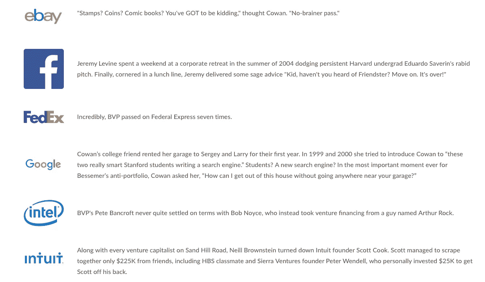*

*A part of Bessemer’s anti-portfolio*

*在我的家乡，被 GoIbibo 收购的公共汽车票务服务 RedBus 被几家风投公司转手。考虑到我们还没有公开我们的失误，我们需要时间来了解名单上的其他人(准备好迎接新的风险投资 twitter 挑战了吗？)*

*但这告诉我们一个风投的决策是什么？*

*人们对机遇的看法不同。*

*这是一个用有限的信息进行赌博的行业。*

*对于早期投资者来说，情况变得更加模糊。公司试图根据他们从基层听到的信息，迅速寻找适合市场的产品或商业模式。*

*当我们投资的时候，我们投资组合中的一家公司对虚拟耳机感兴趣。大约 12 个月后，他们开始尝试为 BFSI 公司提供智能解决方案。让他们的首轮投资者心动的是他们正在开发的智能游戏开发项目。*

*另一家公司根据商业计划和市场假设筹集了一定数量的资金。随着 3-4 名参与者的加入，市场迅速发展，他们的发起人愿意投入自己的资金。*

*不用说，不管付出多大努力，它都必须关闭。*

*除了通常的执行风险，还有监管问题、招聘问题、创始团队分裂和负面新闻，这些问题随时都可能困扰你。关于风险世界发生的一切的喋喋不休和夸大其词更是雪上加霜。这些因素的不同组合确保了对于一家公司的发展方向没有正确的看法。*

*伙计们，这件事到此为止。下次当你坐在风投面前时，一定要明白他们也是企业家，面临着大量的挑战。*

*这幅漫画可能不是最好的方法-*

*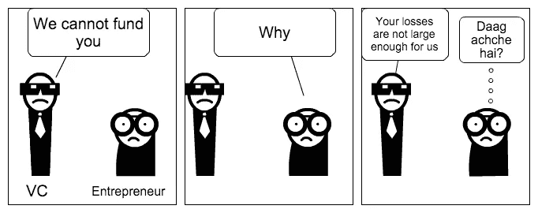*

***感谢阅读！如果你喜欢这篇文章，请点击拍手图标。***

**我计划写第二部分，旨在为企业家在这些条件下定位他们的创业提供一些具体的想法。请订阅以获得通知。**