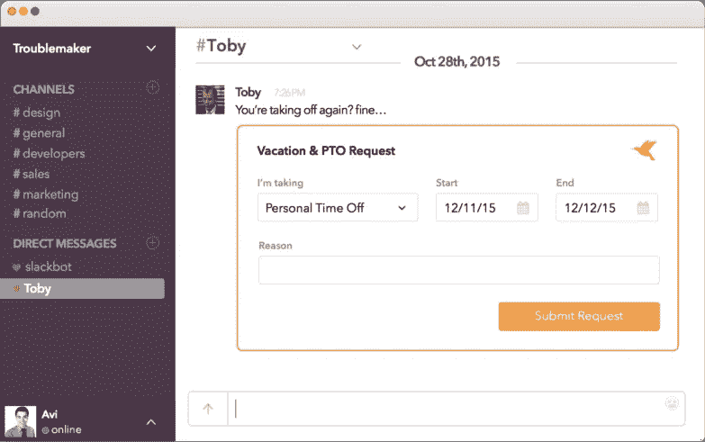
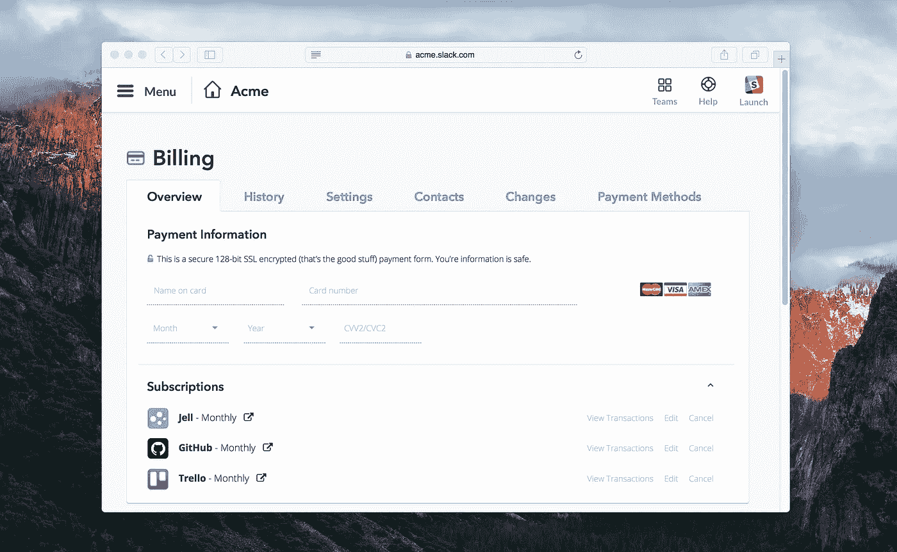

# Slack 平台应该是什么样子

> 原文：<https://medium.com/hackernoon/what-the-slack-platform-should-look-like-5d30e42a11be>

Slack 有一个令人难以置信的产品，令人兴奋的增长，并且正在大步将自己打造成一个有意义的平台。看到[预测](/@kevinrose/five-tech-predictions-for-2016-d1435d9423b4#cf5a)今年将有超过 1 亿美元的业务建立在 Slack 平台的基础上，这并不奇怪。

我相信这将会发生——我是该产品的超级粉丝，该公司似乎有人才、文化和资金来建立一个平台，在重要性和规模上与像 [Salesforce](https://hackernoon.com/tagged/salesforce) 这样的公司相匹敌。

事实上，我敢打赌，当我在制作 [Jell](https://jell.com/) 的时候，它就会发生。我们的增长很大程度上是因为我们的 Slack 集成——超过 70%的活跃公司已经集成了 Jell 和 Slack，而且这个数字还在继续增长。

也就是说，该平台仍然存在许多弱点，使用户无法获得一流的体验。如果这些问题得到解决，这也将促使开发者在 Slack 上进行开发，并增加 Slack 作为一个平台的整体价值。

以下是如何让 Slack 平台更好的方法:

# 申请卡

在 Slack 平台上构建机器人的能力非常棒，但是在用户体验方面有很多不足。

我们距离开发人员拥有构建真正可靠的人工智能的工具还有很长的路要走，这样用户就可以使用自然语言与 Slack 机器人对话。而且，大多数用户不可能学会大多数机器人理解的深奥语法，或者高级斜杠命令的所有参数。

我们剩下的是许多应用程序，要么做非常简单的事情，要么快速将你送到浏览器与应用程序互动，远离 Slack。

如果 Slack 应用程序可以将“卡片”直接嵌入 Slack 对话中供用户交互，那么它们会有多强大？因此，开发人员可以嵌入一个简单的表单或显示一组您可以执行的操作，而不必学习一系列关键字或命令。

几个月前，Avi Eisenberger [完美地描述了这个想法](/@aeisenberger/messaging-bots-and-slack-a52c894a4b2d),并给出了一个很好的例子来说明这如何与人力资源应用程序一起工作:

[Image by Avi Eisenberger](/@aeisenberger/messaging-bots-and-slack-a52c894a4b2d)

对比一下开发人工智能的另一种选择来理解这一点:

> 我明天必须去看牙医。我能请半天假吗？

或者使用如下所示的斜杠命令:

> /pto 请求 2016 年 1 月 29 日 2016 年 1 月 29 日 4 小时“牙医预约”#病假

是的，在 Slack 中构建这一点可能会很复杂，但即使卡片最初仅限于几个简单的属性，这也可以极大地提高 Slack 应用的可用性。

# 用户设置

Slack 应用目前受到限制，因为缺乏 API 和允许无缝用户供应和认证的用户体验。

大多数有意义的商业应用程序都需要通过各自的服务对每个用户进行身份验证。如今，每个用户都需要通过一个单独的注册过程来创建他们的帐户和设置 Slack 身份验证。不可避免的是，团队中的一些人不会经历这个过程，这会损害新应用的采用和效用。

相反，想象一下，作为一名 Slack 管理员，当向您的帐户添加应用程序时，您可以自动为团队中的每个人提供帐户。随着你向你的团队增加更多的人员，在你的每个 Slack 应用程序上设置适当的帐户和权限的挂钩已经就位。或者，如果有人从你的 Slack 帐户中删除，也可以无缝处理。

这意味着作为一个最终用户，您可以在第一天使用 */pto* 命令，而不必考虑如何将您的 Slack 帐户与 pto 服务连接起来。

# 货币铸造

Slack 处于一个独特的位置，通过处理其平台上应用程序的订阅服务来实现生态系统的货币化。很简单，他们可以为开发者创造一种方式来构建付费或免费增值应用，从你在 Slack 上的信用卡中收费。

对于开发者来说，有一个清晰的盈利途径是很有吸引力的。这应该会导致 Slack 平台上开发出更大、更好的应用。

作为一名最终用户，它将为我提供一种非常需要的方式，在一个中心位置管理我的一长串软件订阅，列在一张发票上。
Slack 应该能够汇总我的团队成员中有多少人在积极使用我们的 Slack 应用程序，并据此计费。

对于在 Slack 之外拥有大量功能的应用来说，肯定存在一些障碍，出于战略原因，他们中的许多人可能不希望 Slack 处理他们的账单流程。但有可能认为一个萧条的应用商店会提高转换率，足以让它成为一个有价值的盈利渠道。

# 更大的

我肯定有我还没想到的潜力。我知道 Slack 平台团队才刚刚起步。

这将是激动人心的一年。

*注:这篇文章最初出现在* [*Jell 博客*](https://jell.com/blog/slack-platform) *。*

> [黑客中午](http://bit.ly/Hackernoon)是黑客如何开始他们的下午。我们是 [@AMI](http://bit.ly/atAMIatAMI) 家庭的一员。我们现在[接受投稿](http://bit.ly/hackernoonsubmission)，并乐意[讨论广告&赞助](mailto:partners@amipublications.com)机会。
> 
> 如果你喜欢这个故事，我们推荐你阅读我们的[最新科技故事](http://bit.ly/hackernoonlatestt)和[趋势科技故事](https://hackernoon.com/trending)。直到下一次，不要把世界的现实想当然！

