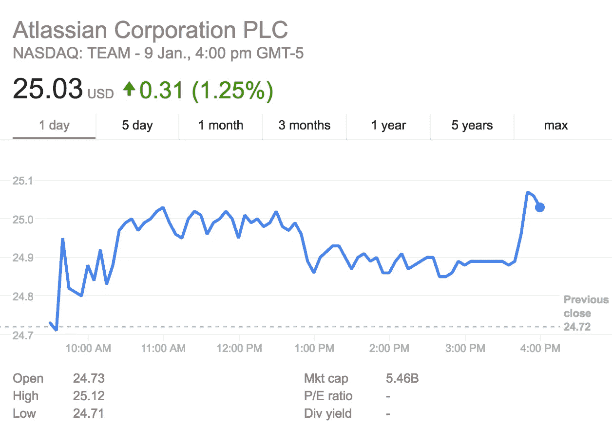

# 收购 Trello 对 Atlassian 意味着什么

> 原文：<https://medium.com/hackernoon/what-the-trello-acquisition-means-for-atlassian-6a21ef7ac169>

免责声明:我曾经是 Atlassian JIRA 团队的高级产品经理，在那里我为业务团队推出了一个新的项目和任务管理工具——JIRA 核心。这些想法和观点都是我自己的。

以 4.25 亿美元的价格， [Trello](https://hackernoon.com/tagged/trello) 是 [Atlassian](https://hackernoon.com/tagged/atlassians) 的[迄今为止最大的收购](http://www.smartcompany.com.au/finance/80987-atlassian-picks-productivity-app-trello-577-million/)——这个数字代表了他们总市值的 7.7%，看看[最近报告的](https://investors.atlassian.com/financials-and-filings/financial-statements/default.aspx)他们的现金资产(2016 年 9 月 30 日为 2.66 亿美元)，可以公平地说，3.6 亿美元的现金部分几乎让银行破产。2017 年 1 月 19 日的收益电话会议应该非常有趣，但股东似乎对此持积极态度。

问题是，为什么 Atlassian 会花那么多钱买一个在某些方面与他们已经拥有的产品非常相似的产品？毕竟，特雷罗帮助团队以可视化的方式管理任务，但 JIRA 已经有两种类型的电路板不仅做同样的事情，而且在功能和底层技术方面更加复杂。

# 云优先

当 Atlassian 在 2002 年首次发布 JIRA 时，企业仍然倾向于运行自己的服务器来保证软件和数据的安全。虽然 Atlassian 确实有云产品，但客户确实表示有一定的改进空间。

Trello 于 2011 年首次发布，当时 IT 格局和时代精神已经发生了变化，它是专为“云优先”和“只为云”而构建的。这使得 Trello 能够更快地进行试验和迭代，避免了同时维护云和服务器产品带来的大量复杂性，并且还允许他们建立一种更简单的方法来连接其他应用程序。

Atlassian Marketplace 列出了大约 330 个可用于 JIRA 云的附加组件，但是有超过 100 个可用于 JIRA 服务器。与 JIRA 服务器相比，JIRA 云有限的 API 集可能是问题的一部分。对于 trello 来说，没有办法公开看到有多少整合已经建立，但鉴于较低的障碍，难怪“Trello 整合”在谷歌上带来的搜索结果几乎是“jira 整合”的两倍。

Trello 正在拥抱云，他们团队的经验无疑将提升 Atlassians 其他产品的游戏。

我们会看到 Atlassian 像他们开发 hip chat 一样开发 Trello 的服务器版本吗？只有时间会证明，但是有一个重要的原因让我很怀疑。

# 简单性>特性列表

Atlassian 传统上遵循自下而上的采用模式。这是他们业务的一个基本部分，团队可以简单地采用软件，修改它以适应他们的需求，并运行它——不需要企业销售周期。当 Atlassian 开始时，他们的客户喜欢这种新模式，尤其是技术团队，他们只想继续改变世界，而不是坐在销售会议上。Atlassian 在没有任何销售人员的情况下工作了最长时间——尽管如此，但正因为如此，他们的主要产品，如 JIRA，才如此知名，并受到世界各地团队的喜爱。

然而，由于我自己已经开发了几个不同的产品，我知道有一件事随着时间的推移已经发生了变化——人们愿意修补新产品。如今，如果某样东西不能“正常工作”，人们会很快失去兴趣。我们的生活越来越快，我们几乎没有时间浪费在搞清楚事情是如何运作的。与此同时，JIRA 的功能急剧扩展。在我看来，JIRA 最大的优势在于它的灵活性和适应性。但同时，这也是它最大的弱点。

在 Atlassian 的年度客户大会 Summit 上，我们展示了一些最常见的使用案例。尽管 JIRA 最初是为软件团队构建的，但也有许多营销、法律、人力资源、销售和其他团队采用它。

现在，在 Atlassian 的[收购公告](https://blogs.atlassian.com/2017/01/atlassian-plus-trello/)中，他们提到了 Trello 的“卡系统是如何直观、易于使用和立即熟悉的，这使得它在营销、法律、人力资源、销售等团队中非常受欢迎。”。

看起来模式是一样的——这些团队需要灵活的任务管理工具，但是新一代的团队希望使用“管用”的工具。想知道亚特兰蒂斯人认为这是未来吗？在他们自己的公告中，他们鼓励他们的客户创建一个 Trello 帐户。但是在 [Trello 的公告](http://blog.trello.com/trello-atlassian)中，并没有要求创建一个 JIRA 账户(尽管从收入角度来看，这可能是一个追加销售，因为 JIRA 没有免费版本)。

# MAU —每月活跃用户

正如收购公告所指出的，Atlassian 和 Trello

> 在实现我们的使命方面有相同的里程碑:让我们的工具被 1 亿人使用。

在一个对任务管理解决方案有着基本需求的市场中，卓越的体验和较低的采用门槛创造了神奇的增长和动力。随之而来的是营销能力——所以难怪许多公司将 MAU 作为他们的首要指标。凭借 Trello 的用户基础，不仅仅是原始数据，还包括他们的人口统计数据，Atlassian 可以通过具有前瞻性思维的小型团队来确保其地位。他们还可以向使用 Trello 进行个人项目的个人用户展示他们的产品。这些人现在将接触到 Atlassian 的其他产品，并能够将这些产品带入他们工作或合作的公司。

消费者使用的品牌产品越多越好——这就是苹果、谷歌、微软和脸书成为世界上最有价值的公司的原因。看到 Atlassian(一家早期的多产品公司)走上这条道路并不奇怪。

# 裁决

不管亚特兰蒂斯人、JIRA 和特雷罗的未来如何，这都是令人兴奋的消息，对每个人来说都有很多机会和好处。现在，其他几家公司将不得不提高他们的游戏来跟上。Asana 很晚才引入像 Trello 和 JIRA Core 这样的董事会，当 Atlassian 将 Trello 与 HipChat 结合起来，创建一个完全集成的任务管理和通信体验时，他们可能会处于更加困难的境地——这是他们已经宣布的事情。

对于 Atlassian 来说，我相信这是完全正确的举动。仍然存在的一个问题是:他们的工具之间有这么多的重叠，一个既没听说过特雷罗，也没听说过 JIRA 或服务台的用户如何找出对他们最好的呢？一旦产品被整合，JIRA 的用户将如何在 JIRA 敏捷董事会和特雷罗之间做出选择？毕竟我们可能需要做更多的修补，但是不管你最终使用哪一个，这些工具都会变得更好——这对每个团队来说都是好事！

*PS:我定期分享我在 www.productrise.com***打造、管理和成长产品的经验教训。此外，如果您在产品、团队或个人产品管理之旅中遇到困难，请随时联系我。我总是很乐意只是聊聊天。**

******

> *[黑客中午](http://bit.ly/Hackernoon)是黑客如何开始他们的下午。我们是 [@AMI](http://bit.ly/atAMIatAMI) 家庭的一员。我们现在[接受投稿](http://bit.ly/hackernoonsubmission)，并乐意[讨论广告&赞助](mailto:partners@amipublications.com)机会。*
> 
> *如果你喜欢这个故事，我们推荐你阅读我们的[最新科技故事](http://bit.ly/hackernoonlatestt)和[趋势科技故事](https://hackernoon.com/trending)。直到下一次，不要把世界的现实想当然！*

**