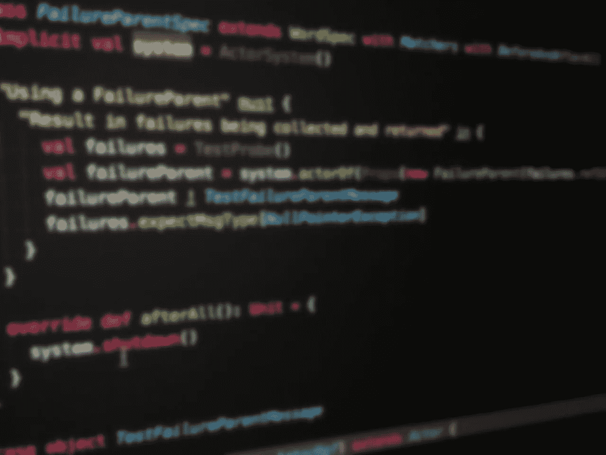

# 在科技面试中问面试官什么

> 原文：<https://medium.com/hackernoon/what-to-ask-an-interviewer-during-a-tech-interview-865a293e548c>

我确实相信求职面试是一个双向的过程，也就是说，作为一名被面试者，你应该能够轻松地向未来的雇主询问你所关心的所有问题。

在准备申请软件工程师职位时，我决定列出我想问的问题，以帮助了解一家公司是否适合我。

作为起点，我参加了[的乔尔测验](https://www.joelonsoftware.com/2000/08/09/the-joel-test-12-steps-to-better-code/)和[的这篇文章](http://ru-programming.livejournal.com/1307107.html)(俄语)，我对它们进行了修改和更新，并添加了来自我个人经历的问题。

结果是一份全面的清单，涵盖了成为公司软件工程师的不同领域，如技术堆栈、开发流程、教育和发展机会。

在 Expedia 的系列采访中，我用这个列表作为参考。我没有向一个面试官问所有的问题，但我根据面试官的角色选择了一些问题。

# 技术细节

1.  编程语言和框架
2.  你的项目有多粗糙？微服务/整体架构
3.  构建工具(构建时/编译时)
4.  数据库(SQL 和 NoSql)
5.  源代码控制系统
6.  ide，其他常用工具
7.  流/消息队列/分布式缓存/RPC
8.  提交到存储库的代码多久会部署到生产环境中？CI/CD？集装箱？配置管理工具？
9.  您的应用程序在什么负载下运行？
10.  什么是服务水平协议？API？应用程序的输入和输出？
11.  你使用什么新技术/框架/工具？最后一个整合到项目中的是什么？采用新框架的流程是怎样的(法律要求、安全要求、预算等)。)
12.  你用什么工具来分析你的软件？

# 过程

1.  描述开发过程。你使用什么软件开发方法，例如敏捷、Scrum、看板？代码审查实践？最近一年是如何改进的？你想在你的团队中提高什么
2.  你的团队有多少人？你的团队中有哪些角色？SDEs/高级/测试人员/QA/devo PS/分析？描述一个软件工程师典型的一天？非典型日？
3.  经理在团队中的职责是什么？你有团队领导吗？科技领袖？技术项目经理？工程经理？那些职位之间有什么区别？
4.  如何理解一个项目/sprint 是成功完成了还是失败了？您使用什么绩效指标？
5.  谁支持项目文档？他们多久更新一次？
6.  你如何评估任务？谁做的评估？你如何衡量任务？谁对大的变化负责？

# 疯狂的

1.  你如何测试你的代码:并发/异步/数据库/GUI？性能测试？A/B 测试？走廊测试？回归测试？基准测试？测试覆盖率统计。
2.  你有测试环境吗？集成环境？有可能在本地验证应用程序吗？
3.  你用的是哪个 bug 追踪器？你使用异常跟踪器吗？
4.  谁以及如何对新问题进行分类？请描述一个可以重新考虑优先级的案例。你有多少公开的高优先级错误？
5.  你会开一个 [bug bash](https://en.wikipedia.org/wiki/Bug_bash) 吗？
6.  你有时间修复低优先级的 bug 或吹毛求疵的 TODOs 吗？

# 随叫随到

1.  谁负责现场问题？如果半夜发生了不好的事情怎么办？你有闹钟吗？您使用什么工具来监控应用程序运行状况和使用统计数据？
2.  你有[随叫随到的轮值](https://www.pagerduty.com/resources/learn/call-rotations-schedules/)吗？一次旋转是多长时间？是 24/7 吗？
3.  待命员工的职责是什么？如果员工处于待命状态，这是否意味着她会暂停当前的工作，直到轮班结束？
4.  待命员工多久监控一次系统状态并报告一次？

# 教育和提高专业技能

1.  贵公司是否为工程师提供培训(讲座、研讨会等)。)?多久一次？最近是关于什么的？谁指挥的？
2.  贵公司是否支付公司外的课程/培训/研讨会/会议费用？有什么条款或要求吗？
3.  你的公司鼓励作为演讲者参加会议/聚会吗？
4.  你参加了多少次会议？你喜欢它的什么，不喜欢它的什么？
5.  公司提供大学留学的赞助吗？
6.  公司有指导政策吗？
7.  你关注哪些专业博客/供稿？它对你的工作有什么帮助？还记得上一个有趣的帖子吗？
8.  去年你读了几本专业书？你最喜欢的科技书籍是什么？为什么？
9.  你如何管理你的个人时间？你如何管理自己的动力？GTD？时间管理？

# 冲突

1.  如果一名员工公开冒犯了另一名员工，同事/经理/公司会怎么做？
2.  如果我在与队友交流时感到不舒服，我该怎么办？和一个经理？

# 工作时间表

1.  工作时间表有多灵活？有没有可能偶尔在周日工作而不是周五？管理层和同事如何看待它？
2.  团队里有人周末工作吗？心甘情愿/强行？加班有工资吗？
3.  你有 WFH 日吗？
4.  工程师出差吗？多久一次？在哪里？

# 职业发展和机会

1.  我被考虑的职位的期望是什么？
2.  就技能和职位而言，职业发展的前景如何？有奖金吗？他们因什么而获奖，获奖频率如何？
3.  你的公司有工作轮换计划吗？
4.  你的公司举办黑客马拉松吗？贵公司是否预留时间进行实验(新库、新编程语言等)。)?你的公司有开源项目吗？

# 公司公众形象

1.  你能评论一下该公司对 Glassdoor 的评价吗(X 星，满分 5 分)？你的公司追踪它的公众形象吗？采取什么步骤来解决负面评价？

# 在公司的个人经历

1.  最有趣和最具挑战性的项目是什么？
2.  自从你加入公司以来，你学到了什么？
3.  你最喜欢在这里工作的什么？