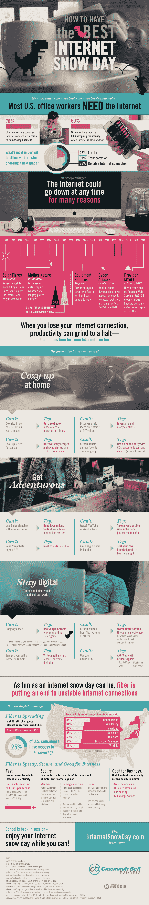

# 网络雪天该做什么

> 原文：<https://medium.com/hackernoon/what-to-do-on-an-internet-snow-day-dcb7095932>

对于许多企业来说，互联网接入是日常活动的重要组成部分。没有它，我们的生产力会嘎然而止。几乎 80%的办公室工作人员认为互联网连接对完成工作至关重要，但是当互联网关闭时会发生什么呢？今天是我们的[网络雪日](http://internetsnowday.com/)。

我们都知道在办公室的那些日子。拿着一杯新鲜的咖啡在我们的办公桌前坐下，准备开始我们的一天，你瞧，我们的电子邮件无法加载。在大多数情况下，“关闭并再次打开它”可以做到这一点，但有时它会变得更加复杂。

早在 1998 年 5 月，几颗卫星被太阳耀斑损坏，切断了互联网(更不用说我们的寻呼机了！)全球范围。后来，人们知道自然力量会导致停电，你猜对了，还有网络连接问题。

今天，我们的担忧不同了。随着许多互联网电缆建造得越来越坚固，有些甚至被放置在地下，网络攻击和提供商错误是我们互联网问题的常见嫌疑人。

但当然，当所有其他方法都失败时，总有谷歌 Chrome T-rex 游戏可以玩。你在[网上做什么雪天](https://info.cincinnatibell.com/ehcs2-0)？

