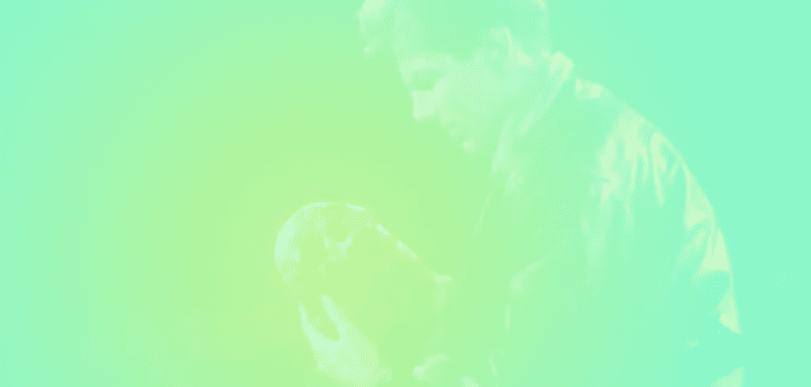
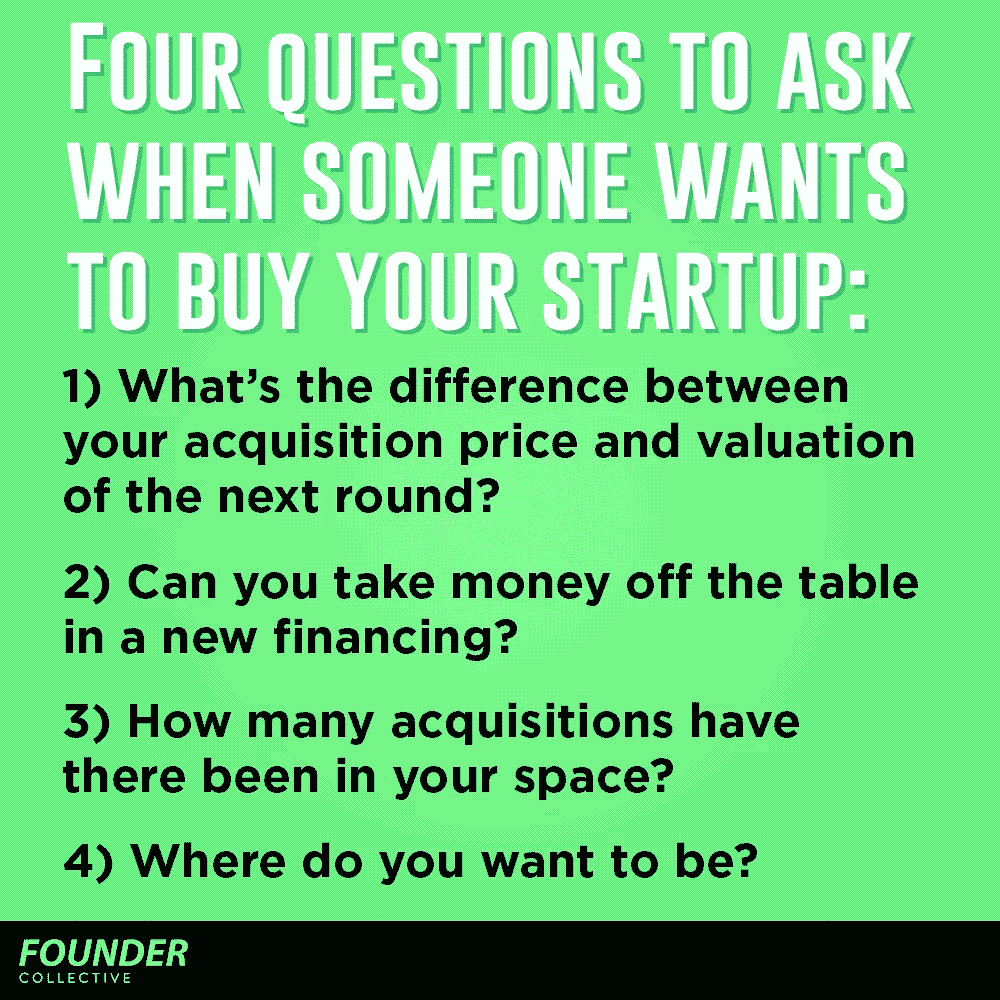

# 当你被一家“十亿美元”的初创公司出价 1 亿美元时，该怎么办？

> 原文：<https://medium.com/hackernoon/what-to-do-when-you-get-a-100m-offer-for-a-billion-dollar-startup-3e08b0723d8f>

想象一下，你花了几年时间在一家初创公司工作，希望并有一个可信的计划来建立一个 10 亿美元的企业，并在此过程中获得 1 亿美元的报价？你仍然相信自己的愿景，但基于你的吸引力和早期收入增长，九位数的销售额将代表丰厚的溢价。

你应该接受吗？

企业家们花了数年时间梦想着有一天他们可以“退出”，但当面对实际的销售机会时，这个决定很难做出。M&A 的兴趣往往会鼓励投资者提供 B 轮或 C 轮融资，这些融资很快结束，估值也更高。投资者的投资兴趣和轻松赚钱的组合让企业家觉得他们正在做一件大事。许多人决心筹集更多的钱，并“荡秋千”，而没有充分考虑他们将出局的更大统计可能性。

我有幸为许多创业者提供咨询，他们接到的邀请更多的是“安打”而不是本垒打。有时候，创始人似乎很失望地分享这个消息，而事实上，这是令人难以置信的验证。我从来不告诉创始人该做什么，相反，我会带他们回答一系列问题，帮助他们在筹集更多资金和出售公司之间做出决定:

## 1)你的收购价格和下一轮的估值相差多少？

你是否得到了一笔等于或大于你下一轮融资价值 2-3 倍的金额？例如，如果收购你的公司的出价是 1.2 亿美元，而在下一轮融资中，你最多能以 3000 万美元的投资前估值融资 1000 万美元，那么考虑出售或许是有道理的。尤其是当你考虑到新投资带来的稀释以及初创公司固有的风险时。

我的合作伙伴埃里克·佩利已经解释过这个逻辑背后的数学原理，但是关键的一课是创业公司的估值是非线性的。正如埃里克所写的，“创业公司有价值显著增加的拐点，有意义的未来进展被认为是公司的价格。”

同样重要的是要记住，一旦筹集到新一轮资金，目前正在评估的退出机会将被搁置。任何未来的退出都需要是新估值的倍数。适应这些估值往往比看起来更难。

## 2)你能在新的融资中把钱拿走吗？

如果你能够在新的融资中获得几百万美元，还清学生债务，买房子，并为未来孩子的大学基金存点钱，通过筹集更多的钱来“破产”是一个理性的选择。否则，创始人需要平衡他们对个人流动性的需求和对风险的承受能力。

## 3)您所在的领域发生过多少起收购？

在你的领域有很多收购吗？谁在制造它们？根据他们的现金状况和市场实力，他们可以为初创公司支付多少钱？

除非你在客户获取方面有突破性进展(WhatsApp)或一种新颖、可防御的技术(Oculus)，否则你收到的大多数报价将基于你收入的几倍，以及考虑“战略价值”的可变因素。

在这里，现实一点很重要。如果没有很多收购价格高于你的出价，也许你应该接受这笔钱。如果你被一家科技生态系统之外的公司收购，这一点尤其正确，在科技生态系统之外，收购往往更多地基于传统会计而非技术雄心。

有时候，你会发现自己已经得到了你能得到的最高报价，然后你就只能去 IPO 了。这可能是一个特别棘手的决定，因为 IPO 之路充满了各种宏观经济风险。

在某一点上，一家初创公司承诺成为他们行业中最大的参与者，纯粹是因为他们已经变得太大，任何公司都无法收购。当你跨过那个门槛时，一定要意识到。

## 4)你想去哪里？

围绕是否出售的决策，很多考虑都涉及财务因素，尤其是对投资者而言。然而，创始人对他们的企业充满热情，并经常感觉他们的工作尚未完成。对创始人来说，更大的问题是企业属于哪里，创始人想去哪里？

一些创业公司在拥有大机构的分量、资本和品牌的大机构中更有意义。一些创始人厌倦了运营公司的一些世俗机制，希望得到集中的会计、人力资源、销售等方面的帮助，以便他们能够继续建设——或者开始思考他们的下一件“事情”

然而，其他人则认为有太多的好处可以考虑出售。扎克伯格、斯皮格尔和其他许多人都做过这样的计算。创始人需要对他们的财务模式进行压力测试，此外还要测试他们内在的毅力，以确保他们觉得自己可以做大，这样他们就不会最终后悔不出售的决定。出售的决定既与数量因素有关，也与质量因素有关。

## 记住时机很重要——阅读茶叶

时机在 M&A 进程中起着至关重要的作用。公开市场是否存在泡沫，上市公司是否有大量股票“货币”可花？行业是否发生了重大变化，促使现任者收购科技公司？虽然预测未来是不可能的，但试图了解你的公司和行业在周期中的位置是至关重要的。

很多人指责 Instagram 的创始人卖得太早。他们“只”赚了 10 亿美元，而独立的估计认为其当前价值为 350 亿美元。

但是这个故事有两种方式。看看 Oculus。自从该公司被 2B 公司以 1000 万美元收购后，虚拟现实市场及其伴随而来的大肆宣传已经明显疲软。如果帕尔默·拉基决定碰运气，用 2 亿美元的 1B 预发行资金筹集资金，会怎么样？很容易想象这家公司会步 Pebble 的后尘——热情冷却，资金枯竭，一家曾经很有前途的公司被收购进了历史的垃圾堆。

> [黑客中午](http://bit.ly/Hackernoon)是黑客如何开始他们的下午。我们是 [@AMI](http://bit.ly/atAMIatAMI) 家庭的一员。我们现在[接受投稿](http://bit.ly/hackernoonsubmission)并乐意[讨论广告&赞助](mailto:partners@amipublications.com)机会。
> 
> 如果你喜欢这个故事，我们推荐你阅读我们的[最新科技故事](http://bit.ly/hackernoonlatestt)和[趋势科技故事](https://hackernoon.com/trending)。直到下一次，不要把世界的现实想当然！

