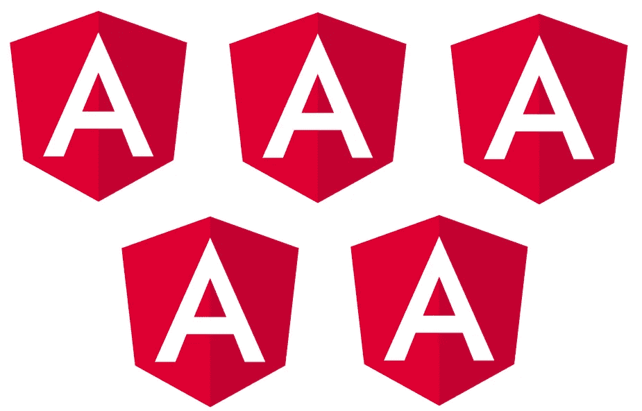

# Angular v5 有什么值得期待的？

> 原文：<https://medium.com/hackernoon/what-to-expect-for-in-angular-v5-6e0fc9c4b13e>

***本*条** ***原本出现在***[***dormoshe . io***](https://dormoshe.io/articles/what-to-expect-for-in-angular-v5-4)

当我们忙于[学习和探索 Angular v4](/@6107923b20dc/ff2c1b42020a) 的时候，Angular 的团队正在展望和规划我们可爱的 Angular 平台的第五个版本。上周，主要的 Angular 会议 ng-conf 2017 在犹他州举行，令人惊叹。"**您可以和我们一起建造！**”是 Angular 团队今年给开发者社区的总体信息😍

Angular 的团队总是在思考他们需要在下一个版本中做什么，怎样才能把 Angular 推向正确的方向，怎样才能有所作为。

在本文中，我们将体验一下版本 5。

# 将 AOT 设为默认

Angular 的团队目标之一是简化我们编译应用程序的方式。在开发模式中，我们经常使用所谓的实时(JIT)编译。JIT 是一个非常快速的编译过程，有助于实现快速的开发生命周期。然后，当你准备投入生产时，使用优化编译器，我们称之为超前(AOT)编译器。有时，这两者之间存在差异，这可能会令人沮丧，因为您正在开发一个应用程序，当您准备好发布时，您会意识到在实际构建应用程序并将其投入生产之前，还有一些事情需要做。

该团队将使 AOT 编译成为默认编译。这将通过加快速度和**支持增量编译来实现。**这意味着我们将有一个**单一的编译过程**，我们将在整个应用程序开发中使用它。这个过程会减少发展中的摩擦。另一件事是关注大小和速度。我们已经听说了很多关于“将**捆绑包**大小或应用程序大小全面缩减 60%”的说法。这是一个很好的成就，但团队意识到他们还可以做得更多。

# 观看模式

由于我们可以运行`tsc —-watch`，我们希望 Angular 的编译器(ngc)也能运行，并将其与 Angular-CLI 集成。我们希望尽快意识到我们的代码是好是坏。

Time is money

# 模板中的类型检查

他们实际要做的另一件事是模板中的类型检查。如果我们使用了提前编译并且我们拼错了属性，那么在我们的 **中将会有一个类型检查错误。ngfactory* 文件。对于不是专家的人来说，这说明不了什么，因为当看到这些 **时。ngfactory* 档案我们不知道 Angular 在引擎盖下做什么。因此，团队将把它变成一个类型检查器，它将**报告关于我们的模板**，所以它将说“第 2 行，第 3 列，你在属性 x 中犯了一个错误”,并且它也将与 Typescript 严格空检查一起工作。

# 更灵活的元数据

AOT 只允许顶级函数作为工厂出现在`useFactory`属性中，所以当我们构建 provider 对象时，我们不能使用闭包。这将在未来得到支持。

# 删除*.ngfactory.ts 文件

Angular 的离线编译器将模板编译成扩展名为 *.ngfactory.ts* 的 Typescript 文件。Typescript 编译器将这些文件编译成 JavaScript。因此，它(类型)检查和检测模板中的错别字和类型错误(如果有的话)。团队会将编译后的管道改为**内联*。当我们编译它的时候，把工厂放进我们的代码**，。

# 更好的错误消息

版本 4 在错误信息方面给我们带来了巨大的改进，但是它仍然不是完美的。该团队在数量、质量和更多细节方面改进了错误消息。

# 平稳升级

平滑升级，就像第 4 版一样，令人惊叹。他们想让**变得超级简单，让我们可以跳到**上使用它。只有确保没有障碍，并且没有理由坚持使用版本 4 或 5，才能做到这一点。听起来像是自动升级吗？😱

Smooth upgrade

# 可摇树组件

树摇动器遍历依赖图，从上到下，并且**像树中的枯叶一样摇动掉未使用的代码**。通过移除源代码和库代码中未使用的部分，树抖动可以极大地减少应用程序的下载大小。该团队关注的另一件事是确保当我们使用组件库时，如角状材料、离子或材料设计，我们将能够彻底改变所有组件。

# 混合升级应用程序

谷歌在应用升级领域投入大量资源。不可避免的是，要为那些没有从零开始并使用基于 AngularJS 的应用程序来到 Angular 的开发人员提供一条[升级路径。该团队不会停止工作，并将继续帮助这些开发者保持领先地位，享受新功能。版本 5 将为我们带来以下改进。](/@6107923b20dc/73d5afba1e01)

*   **惰性加载**为 AngularJS/Angular
*   更少的样板文件和更好的工具
*   提高混合应用程序的性能
*   更好的**双路由器**
*   改进测试
*   更多文档和示例

# 结论

v5 还很遥远，但是它的一些好处已经显现出来了。大事情将在 angular 编译器和混合升级应用程序中发生。它仍然没有锁定，计划中的一些变化可能会完成。看起来核心团队有很多工作要做，同时，[我们可以继续享受 v4](/@dormoshe/angular-v4-practical-countries-application-f866b567ead1?source=linkShare-6107923b20dc-1491914383) 。因此，2017 年 9 月至 10 月将会很有趣😁

***您可以关注我的***[***dormo she . io***](https://www.dormoshe.io)***或***[***Twitter***](https://twitter.com/DorMoshe)***阅读更多关于 Angular、JavaScript 和 web 开发的内容。***