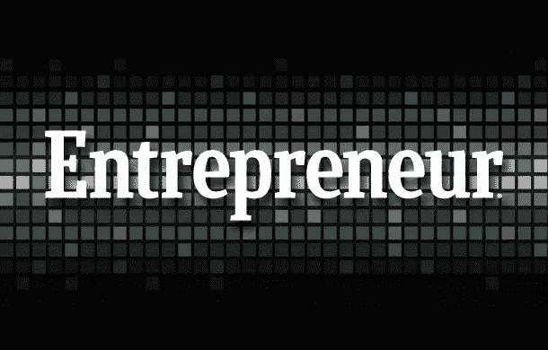

# 你是哪种类型的企业家？

> 原文：<https://medium.com/hackernoon/what-type-of-entrepreneur-are-you-dc700a2a17dd>

通常有两种类型的企业家。字典对企业家的定义是“建立一个或多个企业，承担金融风险以期获利的人。”

第一种，这些不一定按重要性排列，是那些创造全新产业或发明的。在我看来，这些是非常罕见的类型…他们创造了在形式和功能方面前所未有的产品和服务。例如，优步无论如何都不存在，无论是形状还是形式。这完全是虚构的，并催生了一个新的产业。

第二种类型是利用现有的业务/行业，并在某种程度上使其变得更好。手机存在了，然后史蒂夫·乔布斯过来说我可以让用户体验更好！他没有去发明手机技术，他只是把一个缺乏方向、用户体验、审美的业务，给它一些。

他让使用手机的体验变得更好。然后他年复一年地增加这种经历。另一个例子是 Napstar。这是一个真正的发明，然后 iTunes 出现了，只是让它变得更好更合法。

我告诉你这些是因为我想让更多的人成为企业家。你不需要觉得你必须发明一些东西才能成为一个。我有一个朋友是个伟大的发明家，而我不是。我擅长做得更好，创造价值，知道如何让企业起步并取得成功。我知道我擅长什么。

所以，如果你正在考虑开始你一直梦想的事业，先弄清楚你是什么类型的人，然后弄清楚你如何能比其他人做得更好。你必须有竞争优势。

我希望这有所帮助，我很想听听你的故事。

Vick Tipnes，企业家兼黑石医疗服务公司首席执行官

> [黑客中午](http://bit.ly/Hackernoon)是黑客如何开始他们的下午。我们是 [@AMI](http://bit.ly/atAMIatAMI) 家庭的一员。我们现在[接受投稿](http://bit.ly/hackernoonsubmission)，并乐意[讨论广告&赞助](mailto:partners@amipublications.com)机会。
> 
> 如果你喜欢这个故事，我们推荐你阅读我们的[最新科技故事](http://bit.ly/hackernoonlatestt)和[趋势科技故事](https://hackernoon.com/trending)。直到下一次，不要把世界的现实想当然！

