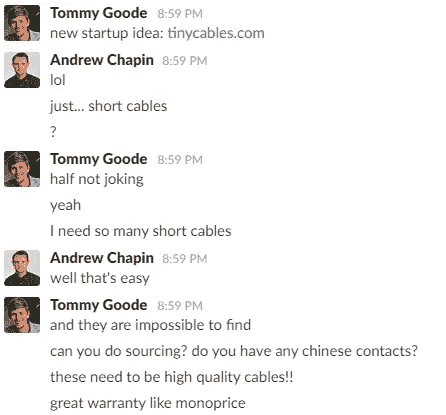
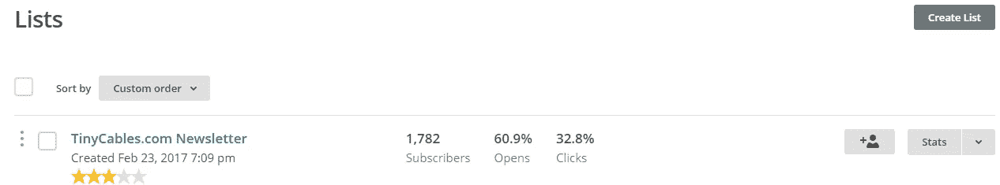
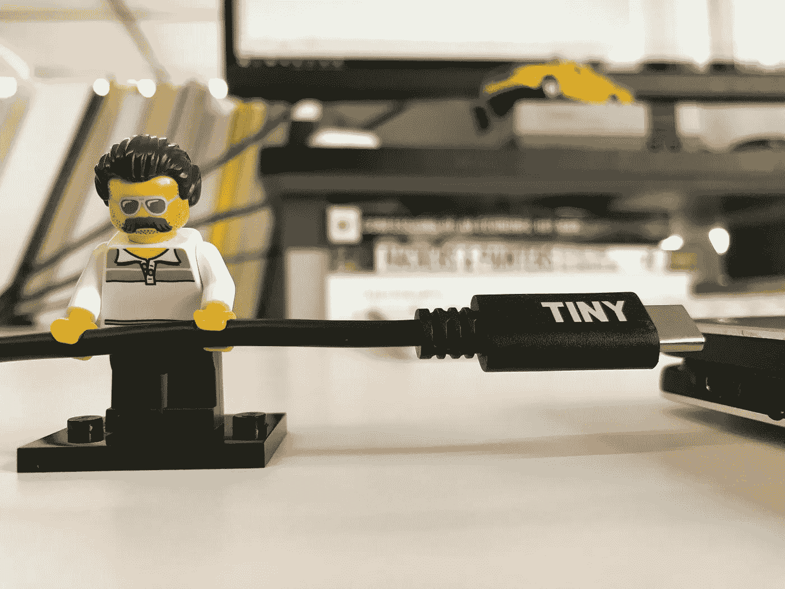

# 我们学到了如何在户外建立一家公司

> 原文：<https://medium.com/hackernoon/what-we-learned-launching-an-open-source-company-c58983a69da>

当我在咖啡店等着点菜的时候，我会坐下来试着完全解构生意。

我会算出房间里有多少人，他们每份订单花了多少钱，以及他们在店里花了多少时间。我会考虑星期几，一天中的时间，以及该地区的房地产。

最终的结果是:一个快速和肮脏的企业损益表。

不仅仅是咖啡店——当你在我们的早餐会上去洗手间的时候，当我在购物中心的商店里感到无聊的时候，或者当我独自一人在看棒球比赛的时候，我都会这样做。

我*一直*试图了解我周围的企业。**我是个超级商业呆子。这是我的工作。**

这就是为什么当我听到(通常是潜在的第一次)创业者要求潜在投资者或早期员工在分享他们的想法之前签署一份保密协议时，我总是感到惊讶。

你的企业将走向世界，像我这样的人很可能会解构它。你在保护什么？

今年早些时候，我的商业伙伴兼朋友汤米向我提出了一个商业想法:

他知道自己在做什么。他占用了我大脑中我喜欢居住的那部分，现在我们在这里，几个月后，有了一个全面运作的企业:**。**

**我们的高品质，免费送货和终身保修的 8，8”充电电缆不是这篇文章的重点。除非你喜欢那样的电缆。在这种情况下，直接去 TinyCables.com 下订单，然后回来。**

**我会等的。**

# **这篇文章的重点是，我们开始了这项业务，并分享了过程的每一步——完全公开——这是一个伟大的决定。**

**没有想到保密协议，没有什么要保护的，也没有兴趣隐瞒什么。逻辑很简单:**

*   **有很多充电电缆公司，在全无线的一切变得无处不在之前，未来会有更多。我们的产品，一根为你的设备充电和同步的电缆，和你在美国任何城镇的 Staples、CVS 或加油站已经能买到的没有任何不同。**有什么好保护的？****
*   **我们相信企业家精神。我们的故事可能会帮助未来试图解决类似问题的企业家或制造商。这一点尤其正确，因为我们作为软件企业家，进入这个领域时并不知道如何推出一个实体产品。当我们把这些放在一起时，我们真的在学习。我们希望 [**我们的媒体刊物**](http://medium.com/tiny-cables) **作为资源。****
*   **既然我们要在如此拥挤的空间推出一款产品，**我们需要尽可能地脱颖而出**。如果人们喜欢阅读我们的创业历程，他们可能会购买我们的电缆。也许吧。**

**学到的东西很多而且很快:[履行](https://tinycables.com/blogs/our-story/lets-figure-out-fulfillment)很难，[采购](https://tinycables.com/blogs/our-story/lets-source-some-tiny-cables)很难，[价值主张](https://tinycables.com/blogs/our-story/lets-give-everyone-a-lifetime-warranty)很难，[包装](https://tinycables.com/blogs/our-story/lets-talk-about-our-package)和 [UPC 代码](https://tinycables.com/blogs/our-story/lets-crack-the-universal-product-code)很难，[质量保证](https://tinycables.com/blogs/our-story/lets-break-some-cables)很难，[向海外汇款](https://tinycables.com/blogs/our-story/lets-kvetch-about-sending-money-overseas)可能很难，[构建软件栈](https://tinycables.com/blogs/our-story/lets-choose-an-online-shop-platform)很难，[产品摄影](https://tinycables.com/blogs/our-story/lets-photograph-some-tiny-cables)很难，还有**

**创业是艰难的，但我们知道。然而，有三个惊喜是我们没有预料到的:**

## **你认为你会找到你的主要客户。你不知道。**

**我们认为微小的电缆会吸引像我们这样的人:总是把手机插在办公桌上笔记本电脑上的科技工作者。我们认为，这个群体会把质量看得比什么都重要，并认为终身保修很有吸引力。**

**没那么快。**

**当我们在脸书各种科技和创业团体中分享[微型电缆](http://tinycables.com)时，排名第一的评论(到目前为止)是类似于“但是我可以在(x)以 1 美元买到一根短电缆！”**

**即使在我指出我们的电缆在 3 天内到达(相比之下，易贝上市的电缆需要数周的运输时间)，我们对我们的电缆的耐用性进行了终身保证，并且我们已经进行了质量测试，以确保我们的电缆不会烧毁你的设备(就像[亚马逊上市的电缆烧毁了谷歌工程师 Benson Leung 的一个设备](https://tinycables.com/blogs/our-story/lets-do-a-little-quality-control))，他们也没有让步。**

**原来书呆子不止一种。**

## **电子邮件(仍然)是王道。**

**电子邮件首次使用是在 20 世纪 60 年代。尽管随后个人通信领域出现了各种创新——短信、视频、社交媒体、即时消息等等——但没有什么能像电子邮件一样主导数字通信领域。**

**想一想:有什么比电子邮件更有穿透力？你很难找到一个没有电子邮件地址的互联网用户，这是任何其他渠道都找不到的。**

**不仅仅是市场采用，尽管我们在 2017 年采用了所有的个性化技术，但最有可能导致最终用户行动的仍然是电子邮件。**

**这些新闻订阅算法根本不会分享你的信息，即使是对那些渴望接收的人。有一定程度的干扰。我在网上搜索了主要社交网络的有机阅读率——运气不好。不过，很难想象他们能超越这一点:**

****

**我们知道通过分享故事来推出我们的产品会培养观众并有助于获得曝光，但我们不知道我们会有这样的参与。我们没有从我们的推特粉丝(800 多)或脸书粉丝(T7)中看到这一点。**

## **总会有办法的。**

**我们进行了一周半的试运行，分享了我们现在每天接受一到两个新渠道的新订单的消息。这就是我们如何了解到，尽管我们做了很多事情，但仍有各种各样奇怪的小问题需要解决，包括:**

*   **我们不小心将(仅供内部使用/伪造的)跟踪号码发送给了我们的第一批 15–20 个客户。**
*   **如果您购买了多台设备，我们会意外地发送多封“您的订单正在路上”的电子邮件。**
*   **我们认为我们已经做了围绕国际航运需要做的一切。我们没有。**

**没什么灾难性的，但肯定是我们在大范围发布期间不想发生的事情。哎呦。**

**我很高兴我们试运行了。如果我们走得很远，试图在第一天就卖出 100 万份电报，我们会被重重地绊倒。**

**在户外发射微小的电缆是一个巨大的实验。通过与我们的观众互动，我们学到了很多东西，我们的业务增长速度超过了预期，我们还结交了一些新朋友。**

****这是办公室里相当不错的一天。****

****

**[*微小电缆*](http://tinycables.com) *是由* [*安德鲁·查潘*](http://andrewjchapin.com) *和* [*汤米·古德*](http://twitter.com/airdrummingfool) *两个完全不知道自己在做什么的家伙做的项目。***

************

> **[黑客中午](http://bit.ly/Hackernoon)是黑客如何开始他们的下午。我们是这个家庭的一员。我们现在[接受投稿](http://bit.ly/hackernoonsubmission)并乐意[讨论广告&赞助](mailto:partners@amipublications.com)机会。**
> 
> **如果你喜欢这个故事，我们推荐你阅读我们的[最新科技故事](http://bit.ly/hackernoonlatestt)和[趋势科技故事](https://hackernoon.com/trending)。直到下一次，不要把世界的现实想当然！**

****