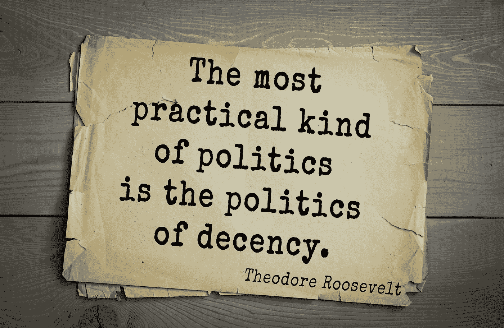
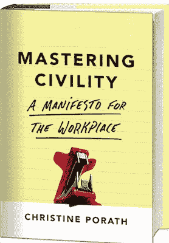

# 我们现在需要的是一点礼貌

> 原文：<https://medium.com/hackernoon/what-we-need-now-is-a-little-civility-1b600fc18042>

## *一场不文明的运动让我们倒退了*

*一场不文明的运动让我们倒退了。如果我们想变得伟大，我们必须做得更好。* *我们现在需要的是一点礼貌。*

在 Diana Mutz 和 Byron Reeves 进行的一系列实验中，发表在美国政治科学评论上，政治话语中的不文明对公众对政治的看法有负面影响。那些目睹电视转播的候选人之间不文明行为的人的政治信任度下降了。不仅对政治家和国会的态度受到影响，对政府机构的支持也受到影响。

毫不奇怪，随着过去的选举充满了不文明，我们已经变得分裂，螺旋下降，并目睹人们互相抨击，抛出侮辱，回击。数千万人因种族、宗教、文化和/或性别而感到被轻视。那些感到不被尊重的人可能会对我们的地位感到沮丧、失望或恐惧。我们的肩膀上有一个芯片，可能会把这些感觉带到与他人的互动中。我们不准备插手。作为一名在过去二十年里研究不文明行为的研究人员，我非常担心不文明行为给我们的政府和社会带来的后果。

我相信你已经亲眼目睹了，不文明的行为会让人分心和虚弱。

> 仅仅是不礼貌的行为就会让我们偏离轨道，而且我们经常意识不到这一点。

我们无法有效地集中注意力、记忆或处理信息。当面对相对较小的事件时——当人们轻率地贬低我们，或质疑我们的能力——我们会留下一个印记，削弱我们的表现和我们的整体福祉。

此外，无礼会阻碍合作、深思熟虑的辩论、理解和解决问题。在实验中，我发现那些只是暴露在粗鲁中的人帮助别人的可能性降低了三倍，他们分享的意愿下降了一半以上。此外，正如耶鲁大学心理学家 Adam Bear 和 David Rand 开发的数学模型所示，被混蛋包围的人凭直觉学会自私，即使合作会有回报，T2 最终也会自私行事，这正是因为他们不会停下来思考。

> 不文明行为是一种高度传染性和侵入性的病原体，它可以迅速和无声无息地使一个团队、政党、组织和国家生病。

大多数人可能没有意识到他们是多么的易受感染，以及他们是病毒携带者的程度。当然，我们不一定要做一个混蛋。我们想要保护自己，让某人闭嘴，或者让某人站在自己的位置上的欲望压倒了我们。

对于解决我们国家所面临的令人生畏的经济、人类、健康和国际关系问题来说，这些都不是好兆头。我们不能允许无礼行为进一步分裂我们，或者危及那些有助于我们国家和人民的协议。

不管是好是坏，我们每个人对彼此和我们的情感的影响都比我们想象的要大得多。在他们的书《T4》中，尼古拉斯·克里斯塔克斯和詹姆斯·福勒展示了快乐不仅在两个人之间传播，还通过一个由有联系的人组成的网络传播。礼貌和粗鲁以同样的方式传播。

幸运的是，文明有传播和积极改变我们环境的力量。一个看似微小的善举可以在社区中产生涟漪效应，并积极影响我们网络中那些我们可能会或可能不会直接互动的人。所以，我们应该尽我们所能向我们周围的人传播尊重、善良和快乐。我们每个人，通过哪怕是最微小的行动，都有能力变得积极、热情、肯定和充满活力。正如我的嫂子莎拉所说的那样，我们可以改变一个人一天的轨迹。它不需要宏大的姿态或巨大的时间投入。小行动真的很重要。我们可以:

—努力更用心地听。这是掌握礼貌的基础，是通往健康、有意义、持久关系的途径。

—认可他人。打个招呼。

—多笑笑。(对你有好处！)

—感谢他人。

—表达欣赏。告诉你的朋友、导师、教练和其他支持者，他们对你有多重要。

—突出人的贡献。告诉人们他们的工作或行为如何有意义。它对你或他人产生了怎样的影响？

—关注他人，尤其是那些被遗忘的人或需要我们理解和帮助的人。

—联系人们。想想那些对你的朋友或同事来说更有帮助的人。你的人脉可能会帮助他们发展事业或结交新朋友。

> 通过良好的营养、睡眠、压力管理和锻炼来照顾自己也可以帮助抵御不文明的有害影响。

以这些方式管理你的精力有助于防止你变得不文明，并在面对无礼或刁难时做出良好的反应。睡眠尤为重要；研究表明，缺乏这种能力会增加你分心的可能性，剥夺你面对粗鲁时的自制力。锻炼帮助我们更好地应对不文明行为，使我们能够对抗不文明行为通常导致的愤怒、恐惧和悲伤。你锻炼得越多，你就越能建立起你的认知潜力，并抛弃那些让你感到压抑的无益的想法和情绪。以其他方式保持精力，比如健康饮食，有助于你在面对无礼时保持最佳状态。当你感到饥饿时，你对挫折的反应如何？我们大多数人倾向于抨击(或“hangry”)；我们缺乏耐心回应所需的自制力。同样，当你感到沮丧并准备对某人发泄时，正念——将你的意识转移到更慢、更周到地处理情况，并更有目的地做出回应——可以让你平静下来。

虽然这有助于遏制不文明行为，但我们也需要做好应对粗鲁行为的准备，并在出现不文明行为时予以有力回击。我们将面临挑战，但我们能够克服。当试图与持有不同观点的人(在线或面对面)进行政治对话时:

—遵循基本原则:不要被吸进去。认识到情绪是会传染的，愤怒会很快升级。给自己一些空间来决定做什么。

最重要的是，避免报复的诱惑。这样做可能会要求你屈尊于他人的水平，这反过来可能会损害你的声誉。

—关注问题—而不是个人—以及特定行为如何损害您和他们的绩效。记住，他们的行为可能会让你在工作和其他方面偏离正轨。值得吗？如果不是，就脱离。

—运用你的倾听技巧。不仅要注意你的语言，还要注意你的非语言交流，尤其是你的语气。

—想一想是否有办法尊重不同意见，进行健康、建设性的对话，或者让它过去。

分歧不仅仅是政治上的，在其他情况下也会出现。例如，许多我们根本不同意的人是我们需要一起工作的人。正如社会神经科学家杰伊·范·巴维尔和威尔·坎宁安所展示的，限制无意识偏见的一个有效策略是花点时间关注相似性和共同身份。想想你和人们的联系。强调你们作为父母、城市居民、运动队球迷、宗教团体成员等的共同身份。对自己群体的成员有积极的感觉是人类的天性，所以关键是找到一个共同的身份或群体。提醒自己，你们都希望自己的国家有一个更好的局面(尽管你们可能对如何最好地实现这个目标有非常不同的观点)。

我们所有人，不管我们过去表现如何，都可以改进。如果我们关心我们自己、我们的工作、我们的组织和我们的社会，我们*必须*改进。在接下来的四年里，让我们努力更加关注自己的行为，与他人建立联系，以任何微小的方式，给他们的生活带来积极的改变。你是要把人举起来还是压住他们？你想如何影响人们？你希望*产生什么影响？我们会变得更强或更弱，这取决于我们如何对待彼此。如果我们想要强大起来，我们需要相互扶持。*

所以不要等了。让我们从今天开始。

*作者:* [*克里斯汀·波拉斯*](http://www.christineporath.com/the-author/) *《掌握文明礼仪:职场宣言》* *(大中央出版社，2016)作者，乔治敦大学麦克多诺商学院教授。*

[*亚马逊*](https://goo.gl/ytSnKJ) *，* [*巴恩斯&贵族*](https://goo.gl/uJczuO) *，* [*iBooks*](https://goo.gl/D4LpFP)

> [黑客中午](http://bit.ly/Hackernoon)是黑客如何开始他们的下午。我们是 [@AMI](http://bit.ly/atAMIatAMI) 家庭的一员。我们现在[接受投稿](http://bit.ly/hackernoonsubmission)，并乐意[讨论广告&赞助](mailto:partners@amipublications.com)机会。
> 
> 如果你喜欢这个故事，我们推荐你阅读我们的[最新科技故事](http://bit.ly/hackernoonlatestt)和[趋势科技故事](https://hackernoon.com/trending)。直到下一次，不要把世界的现实想当然！

