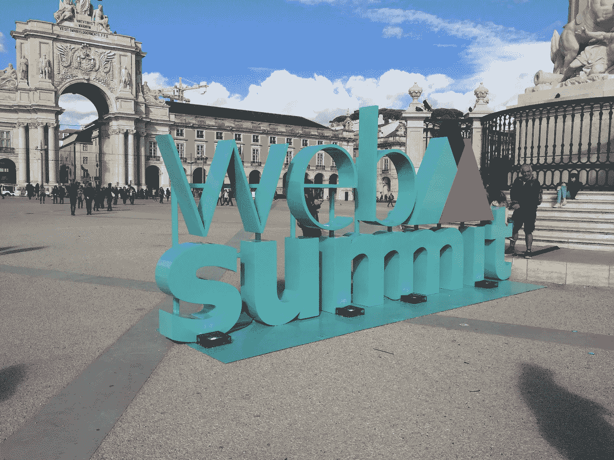
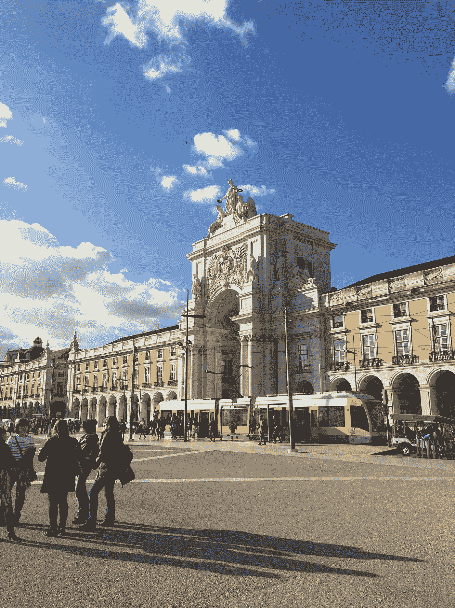
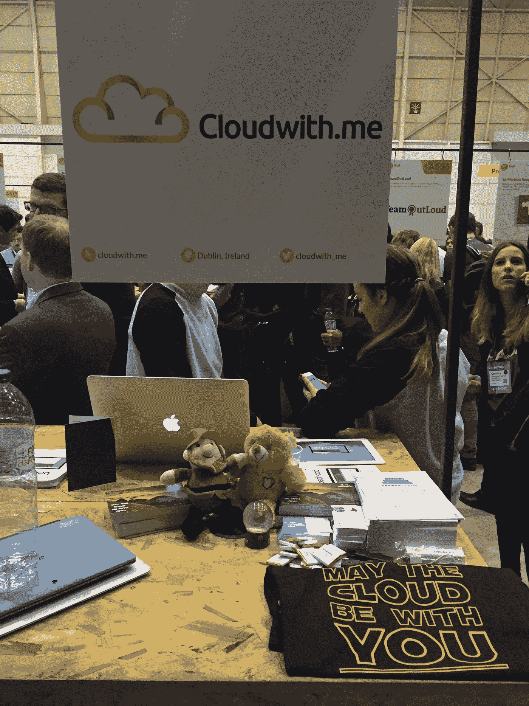
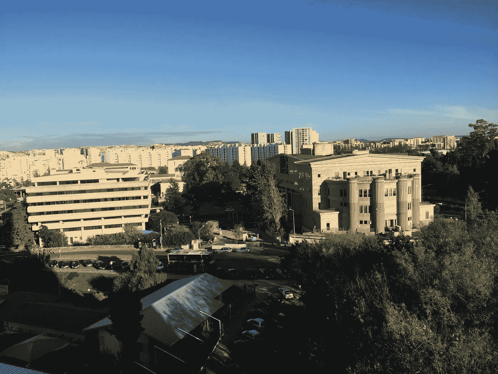
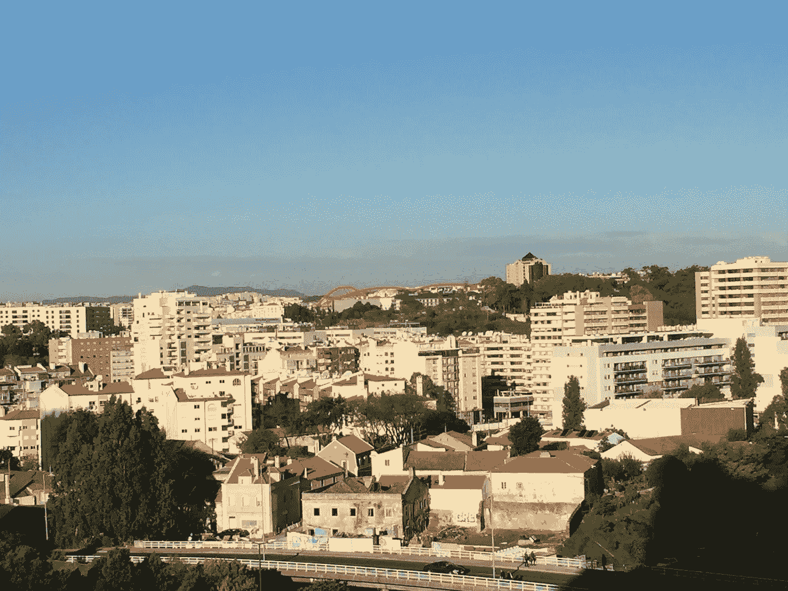
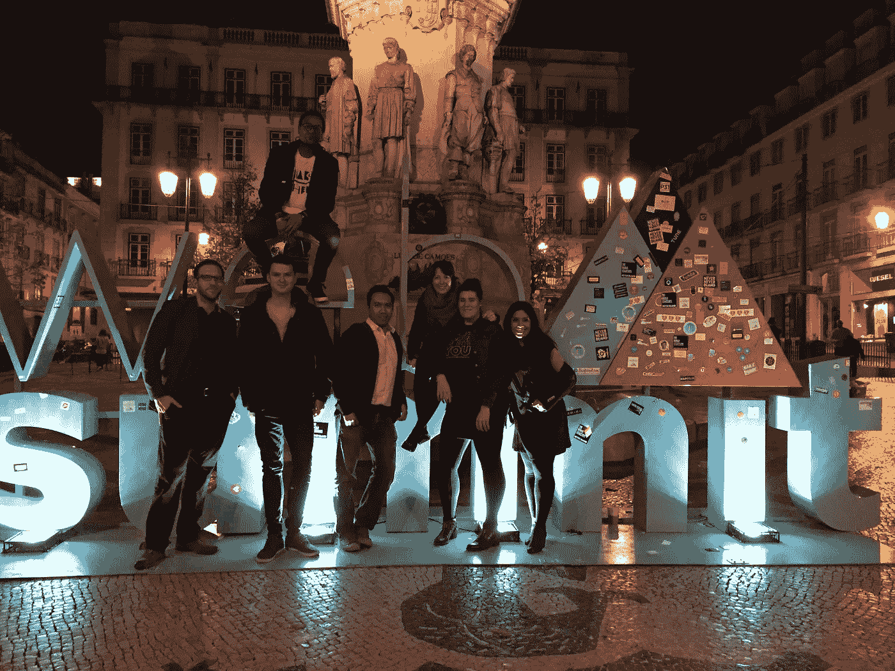

# 网络峰会教会了我什么是科技

> 原文：<https://medium.com/hackernoon/what-web-summit-taught-me-about-tech-289e36db666c>

由于这是我第一次参加网络峰会，我决定自由风格，而不是研究它，以至于我的经验充满了约会。美国大选结果正好发生在活动中间，这引发了一些非常有趣的话题，因为每个人都如此肯定克林顿会打一个本垒打！里斯本本身是一个令人惊叹的城市，天气对一个喜欢下雨的稻田来说刚刚好，达到 18 摄氏度，对我不喜欢晒太阳的皮肤来说几乎是热带。

尽管我是祖母绿岛人，并且住在网络峰会的诞生地(都柏林)，但实际上我从来没有任何理由去参加。科技从来不是我的最爱…但是一年的变化真大！作为简化 AWS 采用的在线解决方案 Cloudwith.me 的首席运营官，网络峰会突然成为我今年活动清单上的“必做之事”。我们非常荣幸被选为阿尔法计划，并在活动的第一天有一个展位。这一天几乎有 10 个小时不停地交谈，有时我们有几个人等着与我们交谈，他们来自与会者、投资者、开发人员和 ALPHA 的同事。我们很酷的 t 恤可能与此有关(谢谢玛丽亚😉).

各行各业的人都在 Web Summit 应用程序上发出无尽的邀请，邀请他们参加专属派对和晚宴，并希望会面讨论可能的合作伙伴关系。事实上， [Cloudwith.me](http://www.cloudwith.me) 简化了许多初创公司、开发人员以及大型企业不可或缺的东西，使其他人很容易欣赏我们解决方案的价值。

总之，这是充满乐趣的五天，一天晚上，我们在一个多层停车场的屋顶上的酒吧结束，我们在晚餐上被传统的 Fado 歌手款待，这是一个惊喜。我带着许多令人兴奋的前景离开，然而这并不是我从 Web Summit 中得到的最大的东西。我学到的是，即使生活和工作在一个由[技术](https://hackernoon.com/tagged/technology)驱动的行业，你形成的人际关系也会有所不同。如果没有这种面对面的交流，这个我们都非常热爱的科技行业将会变得不一样。只是能够分享想法，在某种程度上获得对你正在做的事情、你是如何做的、高潮和低谷以及挑战的认可。一些你最亲近的人可能永远无法理解的事情(幸运的是，对我来说并非如此)。

我认为网络峰会把重点放在夜间峰会上，真是一针见血。如果没有这一点，网络峰会将只是另一个大型会议机器，产生成千上万的与会者，他们离开时会得到一些免费的笔作为他们访问的亮点。尽管遇到了一些非常高调的人和那些显然是为了金钱而经商的人，但真正给我留下深刻印象的是那些充满激情、每天忙碌的人，因为他们相信自己的梦想！虽然肯定有机会主义者会利用那些急于启动自己的创业项目的人，但也有真正真诚的人愿意支持你的旅程——你所要做的就是倾听。你可能没有获得你所希望的投资，但是如果你花时间倾听和你处境相同的人，你可能会发现你一直缺少的秘密成分。这可能是成功和失败的区别。

> 从错误中吸取教训是明智的。借鉴别人的更聪明。

我们生活在一个全球事物都在变化的时代，人们希望改变(正如最近的英国和美国选举结果所表明的)。我坚信，事物越是变化，就越是保持不变。人们只是想被倾听、被尊重、被鼓励、被欣赏、被重视，而做到这一点的最好方法很简单……友善一点，你的旅程就不会白费。网络峰会是一个令人难以置信的平台，可以结识来自生活各个角落的人们，这是一个从他们的旅程中获得灵感的机会。可悲的是，他们中的许多人可能没有实现他们的潜力，但对于少数几个内心有不灭之火的人来说，再多的挫折也不会让他们偏离正轨。

> 当你说话时，你只是在重复你已经知道的东西。但是如果你听，你可能会学到一些新的东西~达赖喇嘛

正是像艾伦、阿图罗、埃迪、乔治娜、格雷格、伊兰娜和托马斯这样的人让我的经历如此神奇，如果没有他们，这可能只是另一个事件。

> [黑客中午](http://bit.ly/Hackernoon)是黑客如何开始他们的下午。我们是 [@AMI](http://bit.ly/atAMIatAMI) 家庭的一员。我们现在[接受投稿](http://bit.ly/hackernoonsubmission)并乐意[讨论广告&赞助](mailto:partners@amipublications.com)机会。
> 
> 如果你喜欢这个故事，我们推荐你阅读我们的[最新科技故事](http://bit.ly/hackernoonlatestt)和[趋势科技故事](https://hackernoon.com/trending)。直到下一次，不要把世界的现实想当然！

