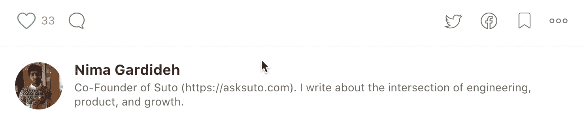

# 我们在产品分析中遗漏了什么

> 原文：<https://medium.com/hackernoon/what-were-missing-in-product-analytics-928984c2e36a>

经常有人问我应该使用哪种分析工具。这通常会导致对市场上数量极其庞大的工具的大辩论。我一直大力倡导分析领域的一些产品，之前是 [Taplytics](https://taplytics.com) (YC W14)的产品负责人。

这不是一篇关于你应该使用哪种分析工具的帖子，而是根据我作为创始人、项目经理和工程师在分析方面的经验，为你今天应该如何考虑构建和销售分析工具提供一些素材。

如果你今天正在考虑创办一家分析公司，我会这样考虑。

# 当今的分析格局

我经营着一家[产品公司](https://thebriefapp.com)，为了处理产品分析，我们可以走几条不同的路线。

## 1.**使用现成/规范的分析工具**

像 Mixpanel，Google Analytics，Amplitude 等工具。

**优点:**

*   非常容易/快速实施，维护成本相当低。
*   可以使用 GTM 或 Segment 之类的标签管理器来避免局限于一家供应商。

**缺点:**

*   对自定义报告的控制能力较低。
*   几乎没有预测分析(尽管[振幅](https://amplitude.com)正在做一些有趣的事情)。
*   难以结合内部数据进行更深入的分析。
*   不会超过某一点。

## 2.**使用分析/数据作为服务的公司**

帮助你进行数据收集+仓储的公司(如 [Taplytics BigQuery](https://taplytics.com/bigquery/) 或 [Segment Warehouse](https://segment.com/warehouses) )结合可视化工具，如 [Looker](https://looker.com) 、 [Mode](https://modeanalytics.com) 或[潜望镜](https://www.periscopedata.com/)，或帮助你做一切事情的平台/API plays(如 [Keen IO](https://keen.io) )。

**优点:**

*   产品数据和公司内部数据的整合要容易得多。
*   对成长中的公司来说，这更是一个现实的长期解决方案。
*   轻松收集数据(使用客户端 SDK)和快速集成。
*   更多定制的深度分析可用，包括预测分析。

**缺点:**

*   您要么需要分析师(对于带有可视化工具的仓库解决方案)，要么需要开发人员(对于像 Keen IO 这样的分析 API 解决方案)来构建报告和仪表板。
*   数据完整性部分取决于您发送正确的事件。

## 3.**自己收集和存储数据**

使用一个数据仓库/湖，也许可以购买可视化工具，如 [Looker](https://looker.com) 、 [Mode](https://modeanalytics.com/) 等。

**优点:**

*   完全控制数据收集和分析，包括预测分析。

**缺点:**

*   从零开始“重新发明”车轮。
*   您可能需要一个 1-3 名工程师的团队来适当地维护整个收集和分析管道，包括您自己的客户端 SDK(如果有人告诉您这很容易，他们可能从未大规模地这样做过)。
*   数据完整性落在你身上，这不是一件容易的事。

# 关于处理数据，我学到了什么

在上面的选项中做决定是我和创始人/项目经理经常进行的对话，他们试图清楚地了解他们的用户并做出更好的决定。

这主要归结为“**遵循规定**”还是“**遵循习惯**”，这是一个很难做出的决定。结果是，最终，你会在一定程度上变得习惯，我已经开始接受这一事实。

另一个事实是，创建一个功能齐全的分析渠道很难，但肯定不像过去那么难。因为:

1.  当大多数分析公司起步时(大约 3-8 年前)，能够大规模处理事件数据的现成数据库还不存在。现在不是这样的了: [Citus](https://www.citusdata.com/) ， [Druid](http://druid.io/) ， [BigQuery](https://cloud.google.com/bigquery/) ，[红移](https://aws.amazon.com/redshift/)。
2.  计算和存储已经变得便宜得多，使你能够每月存储数万亿个数据点并分析它们，而不必支付巨额费用。

分析管道绝不是一个已解决的问题，但我认为数据管道业务是一个脆弱的商业模式。

> 随着存储和计算变得越来越便宜，价值更多地转移到对数据的分析和洞察上。

# 那么少了什么呢？

大多数分析公司在几年前就开始了。除了数据基础设施方面的技术进步，科技行业对产品成功指标的理解也有所进步。有[大量关于如何思考产品的文献](https://www.amazon.com/Lean-Analytics-Better-Startup-Faster/dp/1449335675)，但我们基本上没有做任何事情来解决这些学习，也没有将它们融入现代分析工具和系统中(除了一些例外，如[的回答](https://answers.io/))。

# **我认为我们需要一个支持结构化和非结构化数据的平台，以及一个分析市场，以实现洞察和民主化的产品分析。**

让我们把它分成两部分:

## 1.结构化和非结构化数据

鉴于我们已经了解了许多使公司有可能成功的关键绩效指标(KPI ),新的分析产品应该整合这些知识，并立即支持不同行业的一些结构化事件和实体。

Answers 很好地处理了结构化事件，它们有不同的事件类型:注册、购买、内容查看等。

当它与连接“实体”(如用户、产品、帖子和其他常见实体数据)的方法相结合时，它使分析师能够创建特定于其业务的报告和指标。

但是，正如我前面提到的，如果我们假设每个公司最终都需要定制，那么非结构化数据也需要被接受。

## 2.分析市场

如果我们已经成功地为常见事件和 KPI 创建了一个标准数据结构，那么拥有一个计算平台就变得不可避免且显而易见，该平台使分析师能够创建带有预定义查询的报告模板，并通过市场分发它们。

然后，首席技术官、分析师、营销人员、产品经理和企业所有者可以选择满足其业务需求的报告包，并帮助他们发现对其产品的见解。

例如，假设你是一名营销人员，需要一份广告支出回报报告。你可以简单地搜索市场，找到一个。需要做长期的用户增长预测？对此有一份报告。需要对用户活动进行群组分析吗？将它添加到您的报告购物车中。丢了什么吗？建立自己的报告，并在平台上销售。

我还没有看到任何人意识到创建这样一个产品分析市场的技术和知识已经存在了很长时间。对于公司和商业用户来说，这将是一个非常有价值的产品。

你可能想知道为什么我不自己开发这个产品。毕竟——这应该是一项伟大的事业！我真心相信这一点。

但是，唉，我意识到我更喜欢为消费者解决问题。至少现在是这样。

感谢 [@alexakmeyer](https://twitter.com/alexakmeyer) 的点评。

> 你可以关注我 [@ngardideh](http://twitter.com/ngardideh) 或者订阅我的邮件列表，获取更多关于移动、实验和产品管理的帖子[这里](http://eepurl.com/O2E0X)。

> [黑客中午](http://bit.ly/Hackernoon)是黑客如何开始他们的下午。我们是 [@AMI](http://bit.ly/atAMIatAMI) 家庭的一员。我们现在[接受投稿](http://bit.ly/hackernoonsubmission)并乐意[讨论广告&赞助](mailto:partners@amipublications.com)机会。
> 
> 如果你喜欢这个故事，我们推荐你阅读我们的[最新科技故事](http://bit.ly/hackernoonlatestt)和[趋势科技故事](https://hackernoon.com/trending)。直到下一次，不要把世界的现实想当然！

