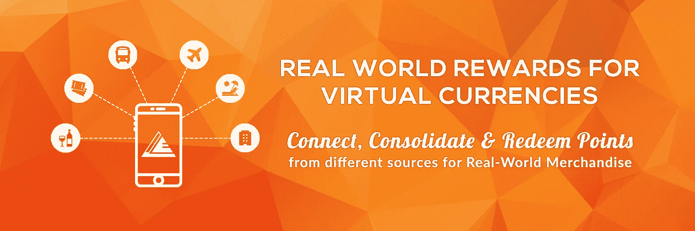

# 什么，为什么，谁，何时何地，如何！任何 ICO 的必备要素

> 原文：<https://medium.com/hackernoon/what-why-who-where-when-and-how-the-essentials-for-any-ico-5a2cee0afe91>

**现在是** [**合金**](https://alloy.rewards.network/) **提问&回答小时**

Caption: [ALLOY](https://alloy.rewards.network/)

你们一定对[合金 ICO](https://alloy.rewards.network/) 有很多疑问。我们总是在这里回答你的所有问题。但是，一个普通的问答环节有点平淡无奇！

在这里，我们根据你的特点、你的兴奋程度和好奇心对我们的问答环节进行了分类。让我们参与一个有趣的问答博客帖子会话，以了解更多关于 [ALLOY ICO](https://alloy.rewards.network/) 的信息，并检查您和您的问题将属于哪一类。

# **1。以实用性为动力**

你更关心执行力，让自己更多的停留在生活实际的一面。如果你是一个，然后通过这一部分来了解这个项目的实用性。

***问——为什么需要区块链和加密货币？***

使用区块链&推出我们自己的加密货币将使奖励网络真正全球化。通过使用智能合约品牌，交易的执行可以近乎即时、无缝和安全。最重要的是，它将允许对奖励积分流程进行审计，这是对发行奖励积分的品牌的强制性要求。

问:Codemojo 是否有足够的经验来执行这个项目？

[**Codemojo**](http://codemojo.io/) 是一家自 2015 年开始运营的客户参与公司，其全球客户包括 SkyScanner、OYO、BigBasket India 等大型客户。它由 Paypal 孵化器 Reliance(财富 500 强公司)GenNext Hub 加速器&微软加速器提供支持。目前，Codemojo 运营着世界上第一个机器学习驱动的奖励网络，通过持续和即时的奖励来解锁用户参与、获取和保留。截至目前，该平台在一个平台上连接了 100 多个品牌和 2000 多个出版商(应用程序&网站),为全球数百万用户带来了&回报。

***问 ALLOY 会怎么赚钱？***

**兑换奖励积分期间:**当合作品牌或发行商的用户在全球奖励网络上兑换积分时，将向相应的品牌或发行商收取兑换价值的费用，以及实现兑换的交易费。交换的价值将传递给在奖励目录中展示产品的品牌，用于兑换，并从他们那里收取一小部分佣金，用于推动相应的销售。

**在兑换目录的小额兑换部分实施批量购买模式:**对于小额兑换，奖励目录中还会有一个产品列表，这些产品采用批量购买节省模式，最低节省 15%至 20%的兑换成本。

***问 Codemojo 将如何使用在令牌发布期间提出的 ETH？***

Codemojo 将使用众包销售中获得的 ETH 在其现有的奖励网络上实施区块链技术，并在目标地区推出新的全球奖励网络。详细的资金使用情况已经在主页和白皮书中给出。

# **2。热情的布道者**

你乐于接受新的可能性，喜欢支持那些激励你的想法。好吧，那就看看这个。

***问——全球奖励网络有什么好处？***

**对于用户:**高度多样化商品&订阅的全球奖励目录，换取不同品牌&发行商累积的奖励积分。

**对于品牌:**这是一个在全球范围内成倍扩大忠诚度/兑换合作关系并通过增加兑换来减少账面负债的机会。

**对于出版商:**一种新的切实可行的方式来奖励用户的参与，而无需自己构建和管理奖励引擎或退出目录。

**问——众卖接受哪些加密货币？**

瑞士联邦理工学院和 BTC 将被接受在人群出售。为了参与，潜在投资者必须将以太坊或比特币钱包指向代币/众筹销售地址，以参与众筹销售。合金是以太坊衍生的代币。

***问——奖励目录包括哪些内容？***

全球奖励目录将分为两个部分，由寻求推动交易或获得新用户的合作品牌列出的产品/服务订阅组成。用户可以通过面向消费者的移动应用程序和网站访问这些内容。

小额兑换部分:公共汽车票、电影预订、储值礼品卡、药房、咖啡厅等..

宏兑换:机票、酒店预订、活动和景点、假期预订、租赁等..

***问——常客如何访问奖励网络？***

用户下载 ALLOY 应用程序→登录→链接不同的会员帐户→查看当地菲亚特等值的奖励积分总价值→访问奖励区→选择产品结账。

# **3。调查员**

你总是探查、分析，然后做出决定。如果你更喜欢探索，这里是你的问答部分！

***问——合金代表什么？***

ALLOY 是一个新的基于区块链的奖励平台的令牌。它们不可退还，也不是用于投机的证券。没有对未来业绩的承诺；没有暗示或承诺合金具有或将具有特定价值。合金在公司没有权利，也不代表参与公司。合金是作为功能性商品出售的。公司收到的任何价值都可以无条件使用。ALLOYs 只面向加密令牌和基于区块链的软件系统的专家。

***问 Codemojo 将如何存储 ETH？***

Codemojo 将使用标准以太坊 multisig(多签名)钱包来存储 ETH。

***问 Rewards Network 接受哪种虚拟货币？***

在全球奖励目录的初始阶段，品牌和出版商的现有奖励积分可用于兑换，在第二阶段，ALLOY 和其他加密货币可用于在奖励网络中进行交易。

***问——初始令牌供应是基于什么决定的？***

全球价值 3600 亿美元的奖励积分尚未兑换，我们正在部署 ALLOY & Global Rewards Network 来调动这些积分。代币除了用于众筹外，还将有助于消费者和商家在后端使用 REPAC 进行跨境交易，因此我们达到了一个固定的一次性供应率，随着我们规模的扩大，这个供应率可以逐渐适应整个市场的需求。

# **4。好奇的个体**

你很好奇，总是问为什么，什么和如何！那么不要错过这一部分，因为您正在寻找的答案可能就在这里。

***问——合金*** 有什么用

合金代币是整个生态系统的储备/锚定货币，将成为在全球奖励网络上进行任何交易的交换媒介。类似于美元是全球储备货币或锚定货币，通过一个共同的兑换因素促进国际贸易，使用 ALLOY TOKEN，合作品牌和出版商可以为他们的奖励积分设置兑换值，这将管理生态系统中的兑换。

***Q —什么是 REPAC，用在什么地方？***

从表面上看，REPAC(实时积分接受和转换)支持各方之间的本地菲亚特交易，使所有业务都无摩擦。在引擎盖下，REPAC 使用区块链和合金实现全球跨境交易。这为所有三个利益相关方(即品牌、出版商和消费者)保留了价值，通过将不同价值的货币和内部点数实时转换为一个通用的 ALLOY 基线(基于市场价值)，使用智能合同来促进安全和可审计的交易。

***问——哪些国家/地区参与了奖励网络推广计划，何时参与？***

奖励网络将从 2018 年 Q2 奥运会开始，分阶段在新加坡、印度、印尼、加拿大、西班牙、英国、美国、EMEA、马拉西亚、日本等地推广..有关详细计划，请查看我们网站上的路线图。

***问——合金的价格是多少？代币的上限是多少，预计筹集的资金总额是多少？***

合金与 ETH 的比例是固定的。兑换率是每 ETH 575 合金。我们的目标是加薪 86，956 瑞士法郎。我们将分配 50%的代币用于集体销售。

你找到你的问题类型了吗？如果你喜欢这篇博文，请发表评论并点击赞。如果你还有问题要问，你可以在这个帖子下面给我们留言，或者在 [**电报**](https://t.me/joinchat/GLxiyg2vHj6CwLl3-yydGw) 中 ping 我们。并准备成为 ALLOY Pre ICO 的一员，该活动定于 10 月 15 日**举行。**

如果你想加入 ALLOY ICO，请登录我们的 [**网站**](https://alloy.rewards.network/)**！**