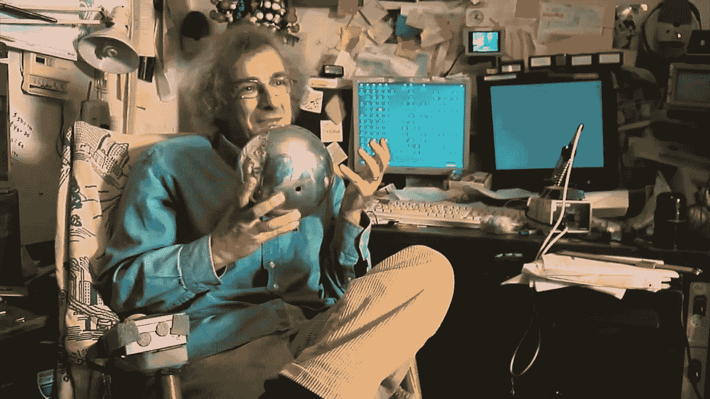
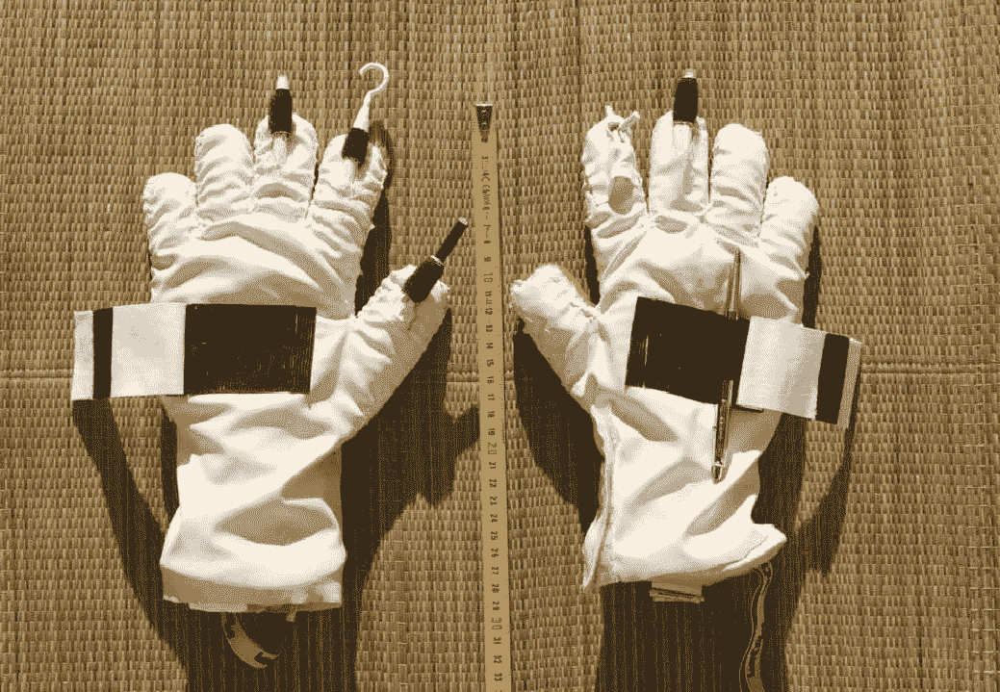
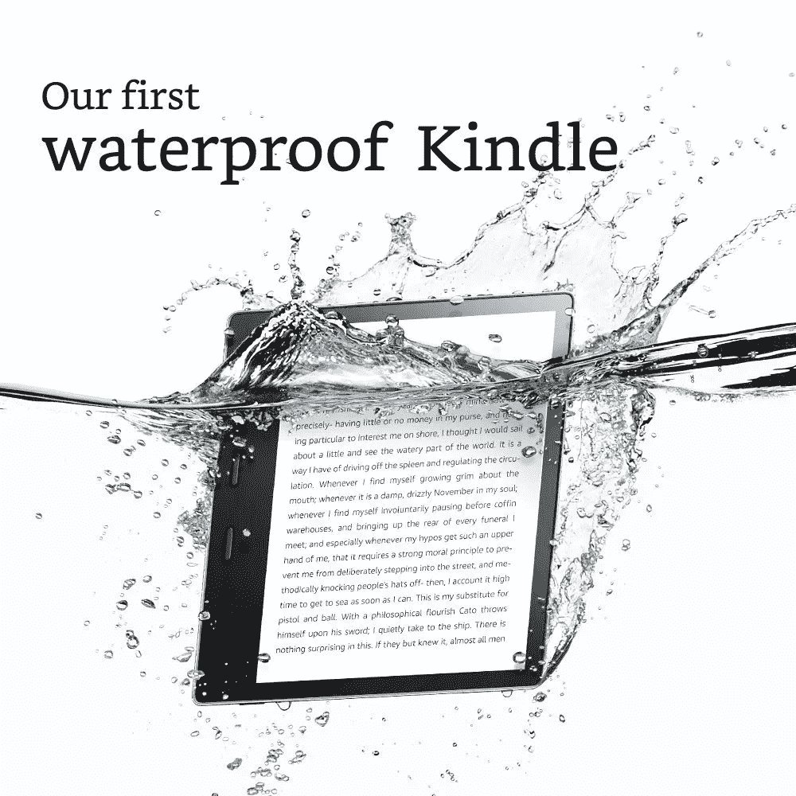
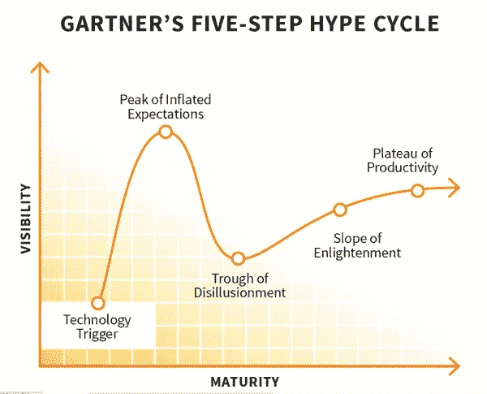
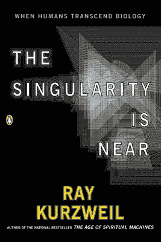
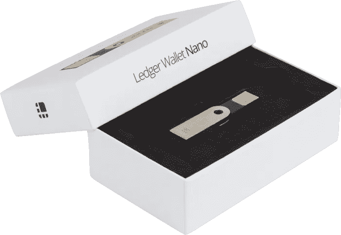
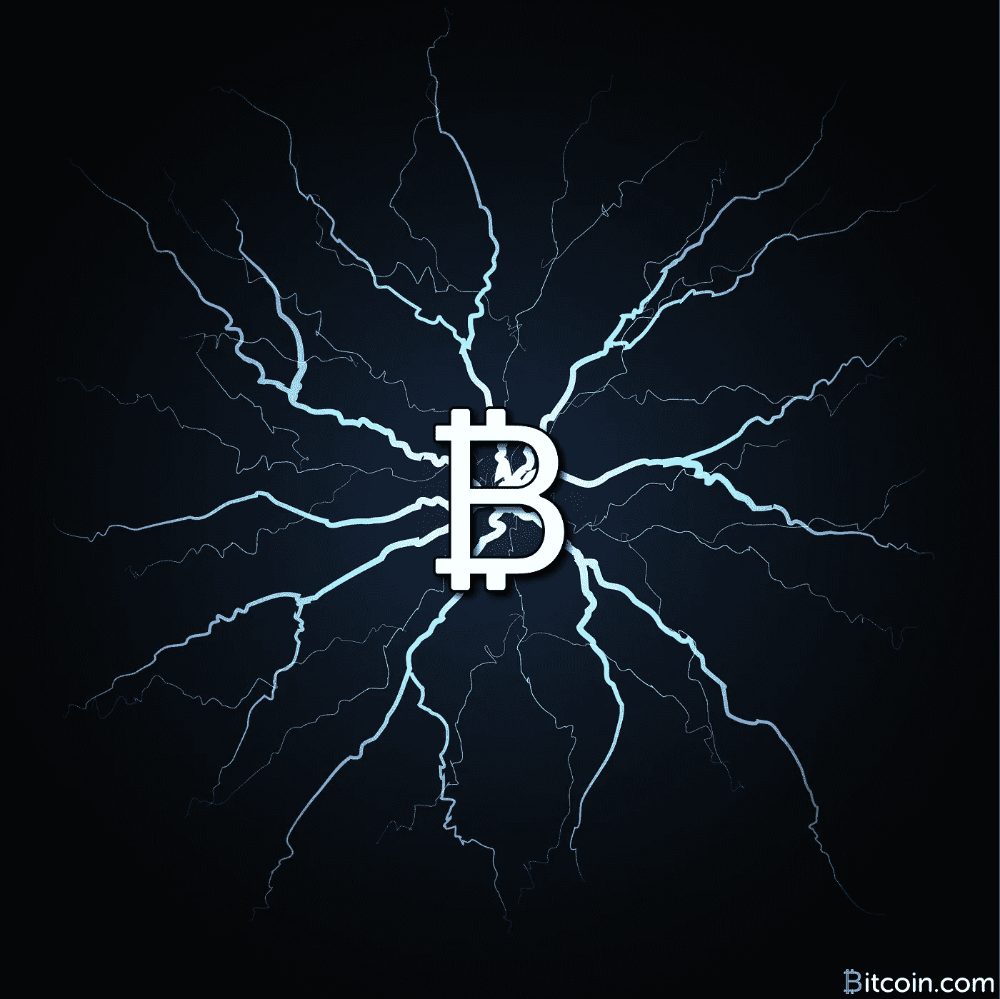
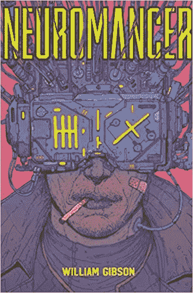
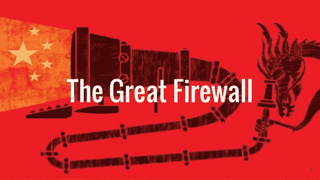

# 比特币二十年后会是什么样子？

> 原文：<https://medium.com/hackernoon/what-will-bitcoin-look-like-in-twenty-years-7e75481a798c>

预测是一件棘手的事情。

犯错很容易，做对却很难。

但这正是我们在这里要做的。由于我们很快就要迎来比特币白皮书发布十周年，我将尝试预测未来二十年比特币、区块链、替代加密货币和去中心化的发展。

当我老了，头发花白的时候，这类文章看起来会愚蠢得令人难以置信，或者聪明得令人难以置信。

我不在乎。无论如何我都要去争取。

我也将比“比特币将归零”或“比特币将成为储备货币，价值 100 万美元”深入得多。这并没有说太多，任何人都可以做到。

相反，我们将着眼于技术将如何转变，以及社会将如何随之转变。

我有一个不错的[成功预测未来趋势和技术的记录](https://hackernoon.com/steal-this-idea-and-make-a-billion-dollars-ai-video-game-accelerator-cards-cf5f09fd84e8)，但是没有人能做到 100%正确。亚瑟·C·克拉克，有史以来最伟大的科幻作家之一，见证了[卫星和 GPS](https://gizmodo.com/5597169/arthur-c-clarke-wrote-a-letter-predicting-gps-and-satellite-tv-in-1956) 的到来，以及[云、互联网和远程办公](https://www.wired.com/2013/03/tech-time-warp-arthur-c-clarke/)的到来，但他自己承认，他高估了火箭的重要性，没有看到一家公司赠送给他的原型笔记本电脑的重要性，以供他写下一部小说。

*Magnum Chaos* represented by [Lorenzo Lotto](https://en.wikipedia.org/wiki/Lorenzo_Lotto), at the [Basilica di Santa Maria Maggiore](https://en.wikipedia.org/wiki/Santa_Maria_Maggiore,_Bergamo) in [Bergamo](https://en.wikipedia.org/wiki/Bergamo).

混沌理论告诉我们不可能预测未来。

但这并不完全正确。

我们永远看不到[黑天鹅事件](http://www.investopedia.com/terms/b/blackswan.asp)或完全意想不到的技术(试着向一个 18 世纪的农民解释计算机和互联网),但我们可以对明天做一种[蒙特卡洛分析，并看到主要路径旋转到无穷远处。](/applied-data-science/alphago-zero-explained-in-one-diagram-365f5abf67e0)

很少有人能做好。

事实上，大多数人对未来的预测都是可笑的错误，所以在我们做出预测之前，我们需要了解原因，这样我们才能避免犯同样的错误。

# 互联网这件事永远不会成功

人们对未来如此误解的第一个原因是，在他们形成看法之前，他们会花大约五分钟去看一些事情。

那不是思考。

Homer’s brain.

那是[原始蜥蜴脑](https://www.psychologytoday.com/blog/where-addiction-meets-your-brain/201404/your-lizard-brain)在运行一种绝对无法理解任何新的和新奇的事物的精神启发式。它只擅长攻击，防御，寻找食物和庇护所，避免无聊。这是生存机器。

不幸的是，许多人几乎一生都生活在这个水平上，当看到新的趋势和发展时，他们的意见一文不值。

**人们对未来如此误解的第二个主要原因是，它违背了他们对世界的一切理解。**想想像[柯达这样的公司，他们拒绝看到数字胶片的威力](http://mashable.com/2012/01/20/kodak-digital-missteps/#nAgI.6uueiq7)，因为他们依靠化学胶片建立了一百多年的业务。他们拥有一切优势，却搞砸了。他们把过去误认为未来，当市场从他们身边呼啸而过时，他们付出了破产的沉重代价。要看到未来，你必须能够超越自我，忘记过去的成功，超越你目前的理解。

人们看不到未来的第三个主要原因是因为未来挑战了他们的权力地位。这就是为什么[寡头银行家杰米·戴蒙](https://www.cnbc.com/2017/09/12/jpmorgan-ceo-jamie-dimon-raises-flag-on-trading-revenue-sees-20-percent-fall-for-the-third-quarter.html)和一位来自上个月刚刚允许女性开车的国家的[王子](https://stepfeed.com/saudi-prince-alwaleed-suggests-bitcoin-is-a-fraud-9965)都将比特币和加密货币视为“欺诈”或“骗局”。

他们实际上看不清楚，因为他们是当前系统的主要受益者。他们*不想让*看到。所以他们参与了一种信息战，即使是无意识的。这只不过是一种精神防御机制。运行世界的新方式的兴起意味着他们的地位受到攻击，他们感到恐惧。

向这些人询问比特币就像问出租车司机对优步的看法，或者问马车制造商对汽车的看法。他们的意见毫无价值。

人们搞砸预测的第四个主要原因是因为他们把自己的观点误认为现实。你对世界的看法和现实是不同的，但它们往往不是一回事。一个是地图，一个是版图。不要把地图误认为是领土。

就拿克利夫·斯托尔 1995 年在《新闻周刊》发表的这篇臭名昭著的文章来说吧，这篇文章宣称互联网彻底失败 即将崩溃。斯托尔写道:

> “远见者看到了远程工作者、交互式图书馆和多媒体教室的未来。他们谈到了电子城镇会议和虚拟社区。商业将从办公室和商场转向网络和调制解调器。数字网络的自由将使政府更加民主。**胡扯**【强调我的。]

Clifford Stoll: I see nothing but the shadow of my opinions in Plato’s cave.

读到这句话，当巨大的优越感涌上心头时，你不可能不咧着嘴笑。真是个白痴！谁没有看到互联网的到来？

回答:几乎没有人。

后知后觉是 20/20。

我敢打赌，几乎所有嘲笑这个可怜家伙的人都没有预见到它的到来，如果他们一开始就知道互联网是什么的话。如果他们这样做了，他们几乎肯定没有看到一个工作的维基百科，远程办公的兴起，以及有一天他们会通过亚马逊购买从书籍到杂货的一切。

其实上面引用的 ***最引人注目的不是***多么不准确，而是******，而是*在这么多层面上多么准确。***

***没错。***

***读读这篇文章，你会发现他的很多预测都非常准确！***

***如果你回过头去，去掉斯托尔的所有观点，你会看到一幅未来 20 年互联网的惊人清晰的画面。看看这个:***

> ***"麻省理工学院媒体实验室主任尼古拉斯·尼葛洛庞帝预测，我们很快就会直接通过互联网购买书籍和报纸."***

***我猛地吐出两个字:“呃，当然。”他的意见。***

*****斯托尔看到了未来，他只是拒绝*看到*它。如果他设法走出自己的路，只是观察，而不是解释和过滤他所看到的东西，这篇文章将作为有史以来最具前瞻性和准确性的文章之一而被载入史册。这就引出了我们的下一个原因。*****

**人们错误预测未来的第五个原因是完全缺乏耐心。**

**以斯托尔文章的开篇台词为例:**

> **"在网上呆了二十年后，我很困惑."**

**斯托尔已经和互联网一起生活了 20 年，但它并没有为他走到一起。当这么长时间过去了，很容易认为这永远不会发生。**

**等待是最难的部分。顺其自然需要耐心。**

****耐心。耐心。耐心。****

**创造力需要挫折和失败以及巨大的韧性。一旦你把你的想法暴露在生锈、重力和摩擦的现实中，事情往往会分崩离析。没有计划能在与敌人接触后存活。现实是一块磨刀石，它要么粉碎你，要么磨砺你的思想。**

**事情需要时间。**

**关于真正的创造过程以及需要多长时间的一个经典例子来自[乔治·德·梅斯特尔，Velcro](https://en.wikipedia.org/wiki/George_de_Mestral) 的发明者。**

**他第一次有这个想法是在 1941 年，当时他带着他的狗在树林里散步，看到一堆毛上粘着毛刺。这个概念又过了七年才在他脑海中完全扎根。他从 1948 年开始重新制作这种小钩子，花了十年时间才成功并大规模生产。**

**在那之后，他在 20 世纪 50 年代末开设了自己的公司，他预计需求会很快上升。**

**它没有发生。**

****

**在 20 世纪 60 年代萌芽的太空计划将 Velcro 视为解决宇航员进出笨重的太空服问题的一种方法之前，T4 又花了五年时间。其余的人只关心事情为他们解决的问题，而不是背后的想法或意识形态。不久后，滑雪行业注意到它将在靴子上工作。**

**总而言之，从最初的想法到正常运作、盈利的业务？**

**大约二十五年。**

**最后，在我开始预测 crypto 之前，我们还可以从 Stoll 身上学到一课。**

**他最大的错误是人们对未来视而不见的第六个也是最后一个原因。他采用当前的发明，air 将它们向前推进，并把它们想象成未来问题的解决方案。不对！**

**当前的发明解决当前的问题。未来的问题将采取全新的解决方案。**

**在文章中，斯托尔提到 CD 书籍永远不会取代真正的书籍。他是对的，用蹩脚的 CRT 显示器看 CD 上的书会撕裂你的视网膜，这是一种痛苦的经历。**但是理解这一点有助于我们理解未来解决方案的必要特征。****

****几乎不可能知道这些解决方案将会采取什么形式，但是我们可以弄清楚这些解决方案将会有什么特征**，这样我们就可以在它到来时识别它。**

**让我们看看它是如何工作的:**

**光盘很笨重。当时的显示器模糊不清，难以阅读。它们伤害眼睛。电脑体积庞大，不太便于携带。即使是笔记本电脑也像砖头一样烧着你的腿，没人会想在上面看该死的东西。**

**但他也错过了书的缺点。**

**书也很重。它们是树做的！它们很容易丢失或被自然环境损坏。在你负重前行之前，你只能承受这么多。**

**从那里我们可以看到一个好的解决方案是:**

*   **超级轻便。**
*   **拥有晶莹剔透的显示屏。**
*   **对用户完全隐藏数据存储。**
*   **像书一样容易使用。打开看看。**
*   **保护数据，这样，如果我们丢失或损坏了数据，我们可以恢复数据，而无需再次购买。**
*   **允许你一次拿很多书。**

****

**[The Kindle](http://amzn.to/2ygQ92Z) improved reading and now it’s even waterproof which makes it better than traditional books. New solutions **must offer the same feature set plus new and improved features** to really take off.**

**当然，我们现在知道答案了:Kindle 和 iPad。**

**两者都非常容易使用，对用户完全隐藏存储介质，通过备份来保护数据，并且看起来很舒服。**

**解决方案首先要指出问题所在，提出正确的问题来解决问题，并正确定义我们需要哪些属性来获得更好的体验。**

**综上所述，我们有三个原则来帮助我们预测未来:**

1.  ****忍耐。****
2.  ****观察，不要解读。****
3.  **不要把今天的解决方案移植到明天的问题上。**

**好吧，让我们打破水晶球，窥视比特币和加密的命运。**

**希望我们会比斯托尔更幸运，这篇文章不会被明天的 Boing Boing 替换者拿出来说我是个白痴。**

# **比特币、加密和去中心化的兴起**

**我们将从几个简单的预测开始，然后转向一些更复杂和更深远的预测，以及一些有严重争议的预测。**

**我还会包括一个信心指数，让你知道我对这个场景的感受有多强烈。**

# **1)泡沫破裂**

**进出 crypto 的人都认为它们是泡沫，会破裂，导致价格暴跌。**

**他们是对的。**

****但那又怎样？****

**故事还没结束。这只是开始。**

****

**现在我们正沉浸在极度的兴奋之中。有这么多的潜力。我们几乎可以尝到去中心化的未来。就在眼前！现在任何一天。**

**当然，这几乎肯定不会成功。**泡沫会破裂。** [**维塔利克是对的。90%的令牌会失效**](https://coinjournal.net/vitalik-buterin-90-icos-will-fail/) **。****

**但是流行之后才是真正的工作想法。**

****

**加密实验已经进行了八年，每个人都在研究未来的铁路轨道，但除了投机交易和一些智能合约，我们没有太多东西可以展示。这些应用程序丑陋不堪，几乎无法使用。当你按下“发送”键，通过网络向某人发送 5000 美元时，你会很紧张。最好希望你复制并粘贴了正确的地址，这样你的钱就不会消失不见了！**

**当互联网泡沫破裂时，许多今天的大公司股票暴跌 85%。然而他们活了下来，最好的还在后面。亚马逊和谷歌继续统治世界。**

**同样的事情也会发生在 crypto 上。**

**通过大屠杀的 10%的项目将成为明天的亚马逊、谷歌和脸书，甚至可能是摩根大通和高盛，更不用说甚至是未来的政府，比如数字直接民主或流动民主。**

**创新是一项艰苦的工作。你简直是在试图创造不存在的东西！**

**没有指导方针，没有工作模板，没有可以复制的商业模式。什么都没有。你只能靠自己了！只有你和你的想象。当然，在这种情况下，90%的人和公司都会失败！**

**没关系。**

**[**密码、区块链和三重分录会计可能是过去 500 年来最重要的发明**](https://hackernoon.com/why-everyone-missed-the-most-important-invention-in-the-last-500-years-c90b0151c169) **所以他们不会轻轻走进那个美好的夜晚。****

**泡沫破裂只是下一步。三年后，这项技术将真正成熟并开始运行。**

# **2)政府加密货币将会蓬勃发展**

**社区不会喜欢这个，但这是一个显而易见的。**

****

**许多政府不会坐视不管，不经过一场恶斗就失去对货币供应的控制。现在任何从事项目工作的人都应该预见到对分散式密码的协议级攻击，并设计防御措施。**

**像 [**Gladius**](http://gladius.io) 这样的分布式、分散式 DDoS 拦截网格是很好的第一步，但还有很多工作要做。当我谈到协议的发展时，我们将讨论 cryptos 需要生存的一些额外的防御措施。**

**从长远来看，政府会输掉这场战斗，可能是三十到一百年后(可能会更快，这取决于会发生多少场战争或金融危机)。前提是我们作为一个种族生存下来，不要用核武器攻击自己，并推进太空。但在十年或二十年后，预计非常强大的政府加密货币将会上台，并主导全球许多人(如果不是大多数人)的资金流动。**

**“但是没有人会收养他们！”加密忠实者尖叫吧！**

**当然，他们会。**

**普通人对任何真正重要的事情都一无所知，他们绝对看不到隐私和安全的需要，直到在极端情况下，如战争，隐私和安全从他们身体上被剥夺。当士兵入侵你的房子，拿走你所有的东西时，人们对隐私的需求突然变得非常真实。**

**还记得斯诺登在约翰·奥利弗节目中关于政府监控的采访吗？**

**当斯诺登意识到街上的普通人对隐私一无所知，一点也不在乎时，看看他脸上的表情吧！他们唯一关心的时候就是政府有他们老二的照片存档的时候。说真的。**

**人们会毫不犹豫地采用政府密码，就像乖小绵羊一样。更好的是，他们会认为这是绝对正确的事情，如果被告知这是正确的，他们甚至愿意为此杀人。指望它！**

**当然，从许多方面来看，政府发行的加密货币是完全荒谬的，正如海军拉维坎特在他的史诗般的区块链推特风暴中指出的那样:**

**这些都是无稽之谈，因为区块链的真正目的是在整个系统中分配权力。通过不允许单个小组任意控制或更改规则，**分散的密码和应用程序提供了一套强大的检查和平衡，防止对系统的有害行为。****

**当五个不同的银行拥有一个区块链时，那不是一个区块链，那是一个数据库。只有当银行、监管者、股东和银行的客户同时持有区块链的钥匙，并能相互抵消对方的力量时，它才是真正的区块链。**

**对权力的制衡正是重点！**

**政府秘密将代表着对这一思想的完全彻底的破坏。**

**但这无关紧要。他们无论如何都会做的。**

**事实上，他们将不再分配权力，而是寻求集中更多的权力，赋予自己不受惩罚地跟踪每个公民的支出的能力，并自动从工资和商品及服务销售中征税。这就是为什么独裁政府竞相建立官方国家密码。**他们迫不及待地希望你的口袋里尽快有一大笔钱。****

**他们绝对会宣布实物现金为非法，他们会以三个借口中的一个为借口:**

*   **制止洗钱**
*   **阻止恐怖分子**
*   **阻止犯罪**

**当然，知道你把一半的薪水花在亚马逊上，食品杂货和租金与这些事情没有任何关系，但是嘿，如果你说出上述任何或所有原因，你可以很容易地让一半的人做你想做的任何事情，甚至更好的是，他们会全心全意地相信。**

****

**还记得美国心理学家古斯塔夫·吉尔伯特在纽伦堡审判中与纳粹赫尔曼·戈林的谈话吗？戈林告诉他，无论他们的领导人让他们做什么，不管是民主还是法西斯独裁，大多数人都会毫无疑问地服从。**

**吉尔伯天真地回答说:“有一点不同。在一个民主国家，人民通过他们选出的代表在这件事上有一些发言权，而在美国，只有国会才能宣战。”**

**但戈林只是笑着说:“哦，这很好，但是，不管有没有声音，人民总是可以服从领导人的命令的。这很容易。你所要做的就是告诉他们，他们正在被攻击，并谴责和平主义者缺乏爱国主义，并使国家面临危险。在任何国家都一样。**

**对于目前真正相信加密空间的人来说，政府加密将是一颗非常非常难以下咽的苦药丸，但他们最好习惯于它们。**

**一个更好的办法是假设将会有分散和集中加密的混合系统，并立即进行设计，以避免被即将到来的海啸吞噬。更好的办法是与区块链拥抱当前的体系，然后从内部压倒它，而不是忽视它，让它变得敌对。**

# **3)分散的加密货币将成为地球的并行经济操作系统**

**仅仅因为集中的密码变得突出并不意味着分散的密码会消失。哦，许多政府会尝试，但最终他们不会消灭他们。原因很简单。**

****

****同样的因素使得区块链难以达成共识，也使得世界各国政府难以就任何事情达成一致。**他们做不到。一些政府会喜欢分权，而另一些政府会讨厌分权。**

**尽管一些国家公开反对加密货币，但许多其他国家(T4)将公开欢迎去中心化的加密货币，特别是那些在上个世纪欧洲和美元主导下遭受最严重影响的国家。**

**我看到拉丁美洲国家、新加坡等随心所欲、无拘无束的全球主义者、历史上的银行家瑞士以及许多亚洲和非洲国家张开双臂欢迎去中心化加密，哪怕只是为了坚持当前的帝国。**

**如果所有国家都不同意，那么分散的密码永远不会消失，即使中央集权的密码掌权。**

**但是为了保持相关性，分散的密码需要快速行动。他们需要一款杀手级应用。现在他们很容易受到攻击。为了真正扎根，他们需要这款杀手级应用在全球范围内迅速传播。它一定是不可或缺的东西，以至于人们无法想象没有它的生活。这将把现有的权力参与者带入这个体系，然后他们将利用这种权力来抵御外部力量的攻击。**

**我在我的文章中为 [**概述了一种将金钱分配**](https://hackernoon.com/gamifying-the-delivery-of-money-c55c25cecaee) 游戏化的方法。但这只是一种可能的方式。还有很多很多。如果你现在在一个平台上工作，要知道在中央密码扎根之前，这是一场与时间的赛跑。**

# **4)黑仔加密应用不是浏览器**

****

**这是一个将旧发明嫁接到新系统的经典例子。 [**勇敢浏览器**](https://brave.com/) 非常棒，我敢打赌我会非常喜欢它，因为它与[**【BAT】**](https://basicattentiontoken.org/)和/或**通用支付系统搭配使用，该系统可以自动交换加密货币****而无需进行交易，但我不认为它是区块链的最终接口。我认为这是一个潜在的中间步骤。****

****那么杀手级应用长什么样呢？****

****我不知道。****

****但我知道它是:****

*   ******无处不在******
*   ******好用******
*   ****充当从换钱到买票到保护隐私和信息的所有事情的平台。****
*   ******开源******

****它也是一种全新的原创产品，扩展和延伸了区块链的最佳特性，同时最小化了其最大的缺点。****

****也许是去中心化的 AI 助手或者注意力过滤器？可能性是无限的，所以开始行动吧！****

# ****5)区块链只是去中心化共识的开始****

****区块链系统只是去中心化共识机制的首次成功实现。****

********

****人们已经在发明新的，像 [**IOTA's Tangle**](https://iota.org/) 和 [**HashGraph**](http://hashgraph.com/) 。****

****从长远来看，如果这两个项目都被证明是失败的，这并不重要，因为其他一些项目将创建另一种方法。这几乎是有保证的。****

****在接下来的 20 年里，我预计将会有几十个，如果不是几百个实验性的分布式共识协议，能够在人工智能系统的支持下，在交易级别上击败签证级别的处理。****

****也很有可能这些系统都不是人类设计的。****

****取而代之的是，人工智能将快速重复想法，并提出人类一百年都无法实现的系统。他们将从自然界和昆虫系统或根或其他生物系统如蛋白质中获取灵感。****

****这些系统中的一两个将主宰所有硬币，并成为统治所有硬币的元系统，将许多不同种类的硬币联合起来，像一个巨大的分形一样运行整个系统，使无数的子网络在其中蓬勃发展。****

# ****6)加密将变得更加容易使用****

****今天的用户在加密方面的体验很糟糕。****

****如果我打错了什么或者复制粘贴错了，我的钱就永远消失了。如果有软件故障，我会永远失去我的钱。如果有人黑了我的电脑或电话，我的钱就永远没了。****

****看到那里的趋势了吗？犯任何错误你就完蛋了。这就像在没有铁轨的一英寸山路边缘驾驶摩托车。****

********

****核心钱包又慢又难用，还很丑。当我最后一次升级以太坊时，它忘记保存我的私人密钥，所以我不得不把它们全部恢复。今年早些时候，我有一个旧的比特币卡在 2013 年的一个古老版本的多比特中。在软件错误地认为我发送了一个从未实际广播的交易后，我花了一周时间才将其释放。****

****想象一下，这些钱包被冷藏，五年后再出来。它们还能用吗？当量子计算机问世，我们需要彻底更新强调系统的基本协议时，会发生什么？****

****一般人永远做不到这些程序。零机会。二十年的 IT 经验告诉我，人们可以而且会以技术人员完全无法想象的方式来破坏他们的机器。墨菲定律说。****

****更糟糕的是，没有办法撤销任何交易或防止交易出错。我预见了许多冻结、回滚和保护交易的算法方法，以及自行托管资金和追回被盗资金的方法。可以把它们想象成打电话给银行并宣布卡被盗的自动化版本。****

********

****If grandma can’t do it, forget it. Everyone is not an IT person who can bang away at the Linux terminal.****

******只有提供旧系统所有功能*和全新功能*的系统才能获得大规模采用。******

****再想想 80 年代的光盘书籍。他们有很多新功能，比如图表和颜色，你可以备份它们。****

****但这还不够好，因为 CD 有致命的缺陷。**雷·库兹韦尔**在他的著作 [***中把这种进化发展阶段称为“***](http://amzn.to/2ihZKeQ)***[假伪装者](https://www.technologyreview.com/s/402705/kurzweils-rules-of-invention/)”【奇点临近*** ***。新技术有一些优点，但缺点太多，无法真正适应更广阔的世界并取代旧技术。*******

********

****直到 Kindles 和 iPads 的出现，电子书阅读器才具备了阅读书籍的所有旧功能，比如便携性和美观，加上一些新功能，比如可以一次随身携带一千本书，这是任何枯树都无法比拟的，电子书阅读器才真正开始腾飞。****

****Cryptos 必须遵循一条类似的道路，从致命的缺陷到为个人和企业带来数不清的新力量，再到获得世界主导地位。****

****我也看到了许多我们真正需要的系统，这些系统源于把数字货币传给你的孩子的愿望。为此，我们将需要根据需要由人群组成的特设银行，或者算法银行，以及拥有分散式云或 foglet 服务的防弹多重签名钱包，来充当最终仲裁者。****

****仅仅把你的钥匙碎片化并交给你信任的朋友或爱人是不够的。这是第一步解决方案。朋友不再是朋友，人们离婚或死亡或更糟。我们需要更好的完全自动化的东西。****

******想想现在把你的比特币传给你爱的人会有多难。**如果你明天就死了，或者脑袋被撞了，忘记了密码怎么办？****

****即使你计划好了，也很糟糕。****

********

****你必须立一份遗嘱，把你的私人钥匙和钱包的备份锁在一个保险箱里，把密码交给一个房地产律师，然后希望他不会拿走它或者 u 盘或者 Trezor/Nano 不会死。你也可以和一些朋友和家人一起创建一个多签名钱包，希望有人不会在 Github 上签入一个带有后门或漏洞的不同版本，然后把它搞砸。所有这些都是丑陋和不成熟的。让人无法接受。****

******对了，如果你想创办一个未来人人都需要的密码事业，解决好传承问题。每个人都会很乐意付钱给你。******

****我预见到拖放智能合同和人工智能产生的遗嘱与自我储蓄的钱。从本质上讲，区块链本身将是银行和客户服务部门，可能会使用你的生物特征标记和第三方证据小组或分散的人工智能来验证你的亲人，以及触发像你的末日这样的事件。自动密码和密钥恢复将停止。****

****无论它看起来像什么，我们都需要算法上的近似控制，来把钱给我们想要的人，并且不让那些想要抢劫我们的人拿到钱。我们也需要这个系统来保护我们免受事故、死亡和发疯的伤害。****

# ****7)硬币的协议将从硬币本身中抽象出来****

****现在所有现存的硬币都与它们的协议密不可分。****

******我希望我们能够抽象出交换、发送和接收以及保护、捍卫和储存硬币的协议。******

****这反映了当今服务器从裸机到虚拟化、容器到无服务器的演变。****

********

****首先，大多数硬币不能缩放。我们甚至无法在 chain 上实现 Visa 级别的交易处理，这是任何加密系统的圣杯，也是许多争斗和争议的主题。[比特币高峰时每秒可以做 7 笔交易](https://en.bitcoin.it/wiki/Scalability)。****

****有些人甚至认为这是硬币的一个优点，因为它鼓励人们储蓄和储存硬币，而不是将其寄出。****

****这太荒谬了。****

****我们应该能够尽可能快、尽可能远、尽可能频繁地移动硬币。****

****让我们面对它，1 MB 的限制只不过是一个黑客。**最初比特币没有限制。然后 Satoshi 偷偷把它带了进来，没有提到它，也没有在源代码中做任何解释。这很可能只是阻止 DDoS 攻击的一种笨拙的方法。******

****我们能够也将会提出更好的洪水保护措施。****

****你是 1MB 的追随者吗？SegWit2X 的 2MB 怎么样？也许你会选择比特币现金的 8MB 区块？****

****不对。所有这些都是错误和荒谬的。****

********

****根据闪电网络的人们所说，如果我们有 70 亿人每天只做两笔交易，需要:****

*   ******24 GB 数据块******
*   ******3.5 TB/天******
*   ******每年 1.27 PB******

****我们需要以不同的方式思考，超越琐碎的废话，设计出真正的解决方案。为了生存，比特币和密码必须改变。当量子计算机出现时，集成新的防御、更新的加密算法以及更好的速度和创新是很容易的。****

****我们不能仅仅停留在智识的桂冠上，认为他考虑到了一切。****

****他没有。****

****坦白说，谁他妈的在乎聪怎么想？他离开了这个项目。如果他真的想指导它，他可以像 Linus 在 Linux 上做的那样留下来。但他没有。他让我们其余的人去解决所有的问题。****

****因此，让我们真正开始这样做，因为当前的系统将无法忍受，或者只会像我们现在拥有的系统一样，被超级支付处理器所主宰。****

****一种方法是抽象所有的协议，将所有旧的硬币作为虚拟机或容器来运行。那么规则就和硬币本身分开了。****

****这只是一种方式，但要真正成为承诺的突破性技术，区块链需要真正的创新。****

****无论如何，人们需要快速思考，否则当 CryptoRuble 和 CryptoYuan 从我们身边经过时，我们仍将讨论 1 MB 还是 2 MB。****

****我们还需要它，因为它将成为抵御敌对行为者和 [APTs(高级持续威胁)](https://www.fireeye.com/current-threats/anatomy-of-a-cyber-attack.html)协议级攻击的必要手段。想想中国的防火长城通过篡改数据包和报头来攻击或阻止交易，还有[国家级中间人攻击](https://blog.thousandeyes.com/deconstructing-great-firewall-china/)。 [**NEM** 架构](https://nem.io/technology/)是很好的第一步，因为它包括了类似防火墙的节点保护。****

****但它需要更进一步，以阻止更阴险和破坏性的攻击，它不能花四年时间和一个艰难的分叉来实施解决方案。****

********

****最佳解决方案可能是**将外部化的安全规则链下载到网络中的所有节点，充当入侵检测、防火墙和协议检查器，以及基于人工智能的自动进化规则集和对策。******

****想 [**神经癌的**](http://amzn.to/2hp02Ry) [**冰**](http://williamgibson.wikia.com/wiki/Intrusion_Countermeasures_Electronics) 。****

# ****我们将会有四个主要的元硬币，加上五十到一百个次要硬币，以及这些硬币的无限虚拟变体，再加上国家硬币****

****现在我们为所有东西制造硬币。****

****有思域这样的身份平台吗？做一枚硬币。****

****创建了分散式 DNS？做一个硬币和 ICO！****

****在区块链的应用程序上建立一个抓挠你的屁股？你需要一枚硬币，我的朋友！****

********

****实际上你不需要硬币。****

****硬币将开始被分成各种元类别。在这一点上，我只能看到需要四种类型的硬币，区块链的区块链(或后区块链科技)根据消费服务的需要无缝交换它们:****

1.  ******通货紧缩储蓄币******
2.  ******通货膨胀的消费者币******
3.  ******动作令牌******
4.  ******奖励令牌******

****通缩硬币是用来囤积和投资的。它们将随着时间的推移而上升，并使储户受益。每个人都需要这种投资，这也是比特币诞生的原因。****

****通货膨胀的硬币反映了今天的美元。没有人喜欢在平板电视上花比特币，却发现几年后随着比特币价格飙升，他们为此支付了 17.5 万美元。我们需要稳定的、可消费的硬币。把这想象成保罗·克鲁格曼经常抱怨的经典的“价值储存”，并且知道我们确实需要它来买卖日常商品。****

****动作令牌用于网络上应该总是免费的动作，例如投票或发送文本消息。这些是*而不是*微交易。重置我的密码不应该花费相当于两便士。正如人们所说的“如果你去亚马逊花三美分去加载页面，没有人会加载这个页面。”****

****奖励代币被设计成因果报应的数字表示，在系统中流动，激励好的行为，惩罚坏的行为。****

****你可以用这四枚硬币建造终极宇宙系统。每一枚硬币都可以简单地作为那些元数据不同的硬币的子组件。****

# ****9)我们会发现我们对经济学一无所知****

****你是凯恩斯计划者还是奥地利自由市场的追随者？****

****答案是谁在乎呢？****

********

******我们所有的经济理论都是基于在油墨和木浆的模拟时代用有限数据进行的研究。随着我们在未来几年试验新的经济体系，所有当前的经济理论都将被证明与岩画一样先进。******

****这就是这些新硬币:战争中的微观经济体系。****

****这是达尔文经济学。****

****一些基本的经济学定律将会成立，但其中许多将会被抛弃。这是因为随着区块链主导系统，我们将拥有全球范围的实时经济数据，而不仅仅是一百年前用纸笔做的一堆猜测。****

****随着人工智能在全球范围内实时跟踪统计数据，我们将能够看到一个国家颁布的钢铁关税的真实影响，因为依赖该钢铁的另一个国家的建筑价格飙升。我们将以令人难以置信的精度跟踪全球生产和制造，我们所学到的东西将在许多方面给我们带来惊喜。****

# ****10)刀将成长为财富 500 强****

****最有可能达到这一里程碑的 DAO 将是一个镜像 Visa 开放版本的 DAO，因为它可能会从最具主导地位的网络上的交易和矿工中抽取份额，并帮助为该网络的未来发展和治理提供资金。****

********

****它不会囤积所有资金，而是充当一个纽带，通过智能合同将资金向下流动到其他企业和 Dao，以及州和地方政府以及其他受益于该网络的非政府实体。****

****要做到这一点，道必须进化。****

****现在我们认为道是一个聪明的契约。差远了。****

********

****“How beauteous mankind is! O **brave new world**, / That has such people in ‘t!”****

****一个 DAO 将需要 AI 来帮助管理和减轻其规则集，并且它将需要能够自动生成模板化的**治理模型**。**在 DAOs** 中，治理就是一切，目前还没有良好的可扩展模型来管理像今天的大公司这样规模的公司，作为一个开源的精英工作场所。早期的 DAOs 失败了，因为他们有我所说的 [***【勇敢新世界】***](http://amzn.to/2gNg6fk) 的问题。****

****每个人都以为自己是老大，没人愿意倒垃圾。****

****大家都是一刀中的王者，很难订到回形针。****

****为了有效运作，一个团队需要角色球员和明星。人们还必须理解自己的角色并接受它，即使随着他们在系统中建立功绩和经验，角色会发生变化。****

****在企业环境中，管理已经够难了。怎么炒掉一个在道上不表现的人？你如何确保负责 ICO 安全的家伙实际上是合格的，而不仅仅是因为每个人都喜欢他而当选的？你不能冒险让某人带着 4500 万美元的比特币跑路，因为鲍勃因为他关于火人节的精彩故事和绘画技巧而当选。****

****未来的自动化企业和非营利架构将不得不**发展出难以置信的工具，用于持续管理和决策制定，以及像代码一样发挥作用的运营协议，以成为现实**。****

# ******11)零工经济将大幅增长******

****二战后的一代人一生中有一到两份工作。****

****今天我们有五六个。****

********

******明天的人会同时有五六个。******

****这些收入流的一半将是自动化和被动的，可能是某种加密的 UBI。我们还将看到人工智能工作匹配服务的兴起。这些机器会知道你的能力和技能，并为你匹配短期工作，这样你甚至不用去找工作。****

****想象一下，一个软件项目需要大量的代码，大约十万亿行。软件项目只会变得越来越复杂，并将继续增长。人工智能将编写和测试其中的一半，但人们将编写另一半。该项目将被输入到一个分布式的、分散的系统中，该系统对工作进行分割和解析，就像一个项目经理一样，并根据声誉和技能指纹将工作交付给遍布全球网络的编码人员。****

****把它想象成一个人工智能 Github 与 UpWork 和土耳其机器人系统的结合。****

****它可以适用于制造业，也可以适用于各种蓝领工作，这可以大大缩小我们今天看到的贫富差距。****

****香港地铁 AI 可能是这种网络的第一个原型，尽管这不是一个完美的类比。它预测地铁上什么会出故障，并派工程师提前排除故障。这使得世界上最繁忙的地铁的正常运行时间达到 99%。****

****这其中很大一部分将由外化的 [**信誉银行**](https://github.com/the-laughing-monkey/cicada-platform/blob/master/Identity-Without-Authority-2017.21.3.BETA.pdf) 来管理，它们由区块链驱动，将成为明天的社会信用。****

****这将是好的，也是非常非常邪恶的。****

********

****[Black Mirror’s Social Credit](http://amzn.to/2iNaIgc).****

****在邪恶的一面，我们有中国的社会信用体系，也就是今天的黑镜。随着民族国家利用声誉银行向人们灌输意识形态，情况会变得更加糟糕。****

****但是，开放的、公共管理的代理银行将帮助我们找到关系、工作，并弄清楚在商业和生活中应该信任谁。****

****这将是一把双刃剑。****

****主要的挑战是，很少有人能就一个系统中什么是好什么是坏达成一致，而意识形态往往会将这些概念扭曲成无法识别的混乱。如果我们不小心的话，创建一个奴役我们所有人的规则集是非常容易的。****

# ****争议之王****

****我只是浏览了一些比较容易做出的预测。现在让我们抛出一些可能会在社区中引发激烈辩论和争议的问题。****

# ****12)区块链将启用各种邪恶****

****密码爱好者将不得不接受这样一个事实:区块链能够也将会带来同样多的好处。****

********

****没有什么是全善或全恶的。一切事物都存在于连续统一体中。你可以用枪杀人，但也可以靠打猎养家糊口。水维持生命，但它也能淹死你，甚至毒死你。****

****如果你现在正在用“快速移动和打破事物”的 DevOps 方法设计一个系统，那么要知道，对于那些可以用算法管理我们生活的许多方面的系统来说，这很可能是一场灾难。****

******相反，你应该采取一种慢慢来、想一想而不打破常规的方法。******

****你应该开始考虑摧毁你的系统的所有方法，否则你将无法保护它。如果你没有想象出一个敌对组织会利用区块链的力量的所有方式，一个不同意你关于开放、自由和合作的观点的方式，那么你只是天真。****

********

****我正在看一篇名为“**如果希特勒有区块链会怎样？坦率地说，我不想发表它，因为我不想给坏人任何新鲜的想法，但请放心，这可能无关紧要。他们黑暗的头脑已经在努力想象如何利用区块链作为一个压制和控制系统。******

****我在这里会故意含糊其辞，以便不把所有这些想法都放入集体无意识中，但想想你生活的所有方面的数字跟踪，从你去哪里和你做什么，到关于你行为的统计预测，以及旨在激励你遵守意识形态的行为算法，最后想想牢不可破的数字版权管理和彻底的种族灭绝。****

****种族灭绝？****

****是啊。****

******别忘了** [**IBM 用跟踪受害者的打孔卡帮助纳粹管理大屠杀**](https://en.wikipedia.org/wiki/IBM_and_the_Holocaust) **。******

****他们能把区块链怎么样呢？答:更多可怕的暴行，我们现在只能开始想象。****

****也许你认为一个开放的系统将永远防止滥用？****

****不对。****

****如果互联网教会了我们什么的话，那就是开放的系统倾向于中央集权，只要有足够的时间，中央权力能够并且将会为了他们自己的目的颠覆和腐蚀任何系统。****

****如果你从事加密工作，并且没有考虑滥用加密的所有方法，那么很可能你没有设计一个系统来拯救世界，而是为它创造了一个监狱。****

# ****13)比特币有 50%的生存机会****

****大多数真正的信徒不会喜欢这个，但老实说，50/50 可能真的真的很高。****

********

****我知道，我知道。你以前都听过了！钱獾是挡不住的！新 ATH！！！！永远买和 HODLz！****

****听着，你跟了我这么久，再跟我多呆一会儿，让我解释一下。****

****首先，我支持比特币活到我的末日，但让我们客观地看几分钟，看看为什么它可能会下跌。可能不是你想的那样。****

****比特币具有先发优势。它绝对是同类产品中的第一个，仍然占据着全球市场份额，但它也有许多可能会扼杀它的重大缺陷。****

********

****基本上，这是区块链革命的 T 型车。****

****今天你在街上看到多少辆 T 型车？****

****你能改装一辆 T 型车，让它像兰博基尼一样燃烧橡胶吗？你能添加复杂的电子设备使它成为自动驾驶的特斯拉吗？没有。****

****首先，比特币没有内置的治理机制。这是一个至关重要的缺陷。只有几种方法可以改变它。首先是[提交一份几乎所有人都同意的提案](https://coin.dance/blocks/proposals)，正如我们在 SegWit 看到的那样，这非常困难。这一改变花了四年时间才被采纳。****

****二是开始一个新项目，硬分叉。这可能是最后唯一可行的方法。一个团队可能会分叉并构建治理，但这是一个长期的尝试。****

****一种设计良好、分布广泛、内置治理的硬币将比比特币具有巨大优势，并可能很容易取代比特币，因为它可以无缝平滑地升级。****

****对资金雄厚的敌对势力攻击的升级和应对需要快速进行，并在几小时或几天内渗透整个网络，而不是几年。****

****缩放呢？我们已经谈过那个问题了。改变块大小不会减少它。这需要一些更激进的东西。****

********

****如果中国打开了防火长城怎么办？在这么晚的阶段，是否有可能在系统中加装专用继电器和其他抗干扰代码？****

****如果政府只是决定花 10 亿美元在数据中心上，并秘密设计 ASICs 来运行系统，会怎么样？任何矿工都可以竞争吗？****

****如果敌人决定围捕所有的核心开发者呢？考虑到现在密码界人才的极度短缺，替换他们有多容易？****

****这些只是我最喜欢的密码几乎无法克服的一些问题。我指出它们不是为了扼杀它，而是为了让人们思考。如果你真的能发现问题，你就能找到解决问题的方法。但是，如果我们只打算处理像块大小限制这样的假问题，我们将一事无成。****

****比特币是一个美丽、聪明的想法，它已经改变了世界。它不会失败，因为它是一个欺诈或骗局，而是因为它自己的硬编码规则，内斗和缺乏治理。****

****当然也不一定要失败。我们可以在此时此地开始思考如何拯救它。****

****正如我前面提到的，某种虚拟化或容器化允许比特币通过迁移到一组抽象的协议和防御来适应和发展，这将有助于确保它不仅生存，而且繁荣。****

****我支持它。我敢打赌，如果你正在读这封信，你也是。****

****确保它存活下来的最佳方式是了解它可能失败的所有真正原因，并从今天开始设计这些问题的真正解决方案，以便当它们到来时，我们做好准备。****

# ****最后的边疆****

****我有更多的预测，但我会把它们留到我的小说《T2》中的《T3》。如果这篇文章火了，也许我会跟进。****

****我也留下了一些邪恶的想法，因为我不想看到它们成为现实。如果是别人想出了它们，我也无能为力，但明天蒙特卡洛途径中最糟糕的情景不会来自我的键盘。****

******加密货币代表着世界经济体系的根本性升级。一旦它们完全启动并融入未来的全球和星际网络，这个世界将会变得非常非常不同，我们只能开始理解。******

****数百年后，今天的经济看起来会像过去的封建经济。****

********

****虚拟货币、去中心化应用和 Dao 甚至有可能像后稀缺经济一样引领我们进入星际旅行，但这需要时间。****

****我不打赌奇点水平的加速明天会把我们带到那里，即使我把奇点撒在我所有的科幻作品中，因为它是伟大小说的素材。但很可能不是现实。****

****如果我错了，那么我上传和拍摄的虚拟大脑，运行在 Matrioshka 大脑中的全球计算迷雾中，将不得不处理它。****

****但我对此表示怀疑。****

****那我们该怎么办？****

****加密就像生活中的一切一样，既有好的一面，也有坏的一面。****

****如果你在研究加密，那么你就是在建造明天的世界，但不要指望它会在下周到来。****

****惯性有办法让最快的火箭减速。****

****享受旅程吧，我们大胆地去没人去过的地方。****

****############################################****

****请查看我与令人敬畏的核心媒体团队就#crypto 在 SoundCloud 上的未来所做的采访:****

****############################################****

## ****如果你喜欢我的作品，请访问我的个人主页，因为这是我与所有粉丝分享特别见解的地方。顶级赞助人可以独家访问传奇的硬币表 Discord，在这里您可以找到:****

*   ******市场来电**来自我和其他专业技术分析大师。****
*   ****只能进入**币**的**私聊**。****
*   ******幕后**看看我和其他专业人士是如何解读市场的。****
*   ******你还可以独家参加每月一次的虚拟聚会**，在那里我会分享我正在做的一切，并让你了解我的幕后工作过程。****
*   ****我会在每次谈话后进行一个问答环节。问我任何问题，我都会回答。****

****############################################****

## ****如果你和我一样热爱加密空间，那就来吧，加入 [DecStack，这是一个虚拟的加密货币和分散应用项目的合作场所](http://decstack.com/)，在这里你可以接触到多个项目。永远完全免费。只是进来和社交，一起工作，分享代码和想法。通过反馈让你的想法更好。寻找新朋友。见见你的新家人。****

****############################################****

********

****[Photo credit](https://extranewsfeed.com/the-winds-of-world-war-iii-8bc369584f67)****

****关于我:我是一名作家、工程师和连续创业者。在过去的二十年中，我涉及了从 Linux 到虚拟化和容器的广泛技术。****

*****你可以看看我的最新小说，* [***一部史诗般的中国科幻内战传奇***](http://amzn.to/2gAg249) *在这部小说中，中国挣脱了共产主义的枷锁，成为世界上第一个直接民主国家，运行着一个高度先进、人工智能的去中心化应用平台，没有领导人。*****

## ****当你加入我的读者群，你可以免费得到一本我的第一部小说《蝎子游戏》。读者称之为“神经癌的第一次严重竞争”和“黑色侦探会见约翰尼记忆术。”****

## ****你也可以根据书中的想法查看一下[蝉开源项目](http://iamcicada.com/)，这本书概述了如何立即将这项技术变成现实，你也可以参与其中。****

## ****最后，你可以[加入我的私人脸书小组，Nanopunk Posthuman 刺客](https://www.facebook.com/groups/1736763229929363/)，在这里我们讨论所有的科技、科幻、幻想等等。****

****############################################****

****一如既往，感谢阅读。****