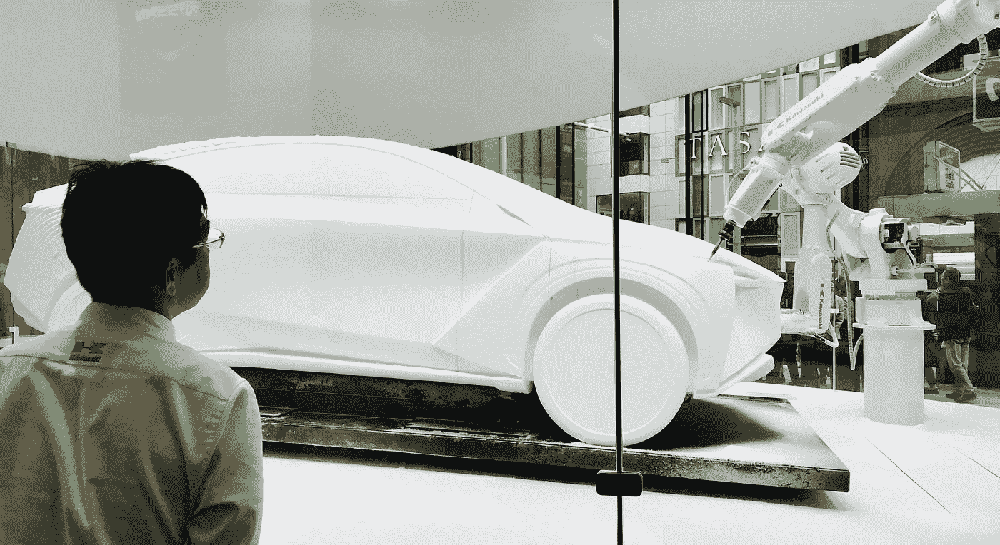

# “明天我们的工作会发生什么”？

> 原文：<https://medium.com/hackernoon/what-will-happen-to-our-jobs-tomorrow-b5aaf1444d44>

## 数字时代任何组织面临的“最大”挑战

> *颠覆性的新技术——如人工智能、区块链和机器人——将如何改变我的***组织？**
> 
> **我是否需要改变工作方式，才能在数字时代与时俱进？**
> 
> **我会被机器取代吗？。。。我会失业吗？**

*当然，这些不是我们大多数人担心的问题。我们通常不相信我们的工作会很快消失。*

*然而，我几乎每天都收到这些和相关的问题。来自学生，来自同事，来自我在各种活动和会议上演讲时遇到的人。*

*值得注意的是，如此多的人——无论国籍、年龄或生活经历如何——都对数字世界的影响表示担忧。*

*这种焦虑的原因似乎相当简单:*

*   *技术变革的步伐和所有公司拥抱新技术的决心，如人工智能和自动化。*
*   *源源不断的故事和书籍——如 ***德乌斯人:明日简史***——预测新技术将在我们的有生之年*改变企业和其他组织的运作方式。**
*   **人类对未知事物与生俱来的恐惧。人们普遍担心，如果新技术没有被完全理解和接受，他们就会落后。**

**我经常被要求概述我对这个问题的想法。所以，这里有五个关于“明天我们的工作会发生什么”的快速预测。这绝不是一个完整的列表，而只是“标题思想”。**

# **#1 —“智能机器将改变一切”**

> **机器人和自动化已经对体力劳动产生了重大影响。**

**预计这一趋势在不久的将来还会增长。司机、收银员、厨房工作人员等。将很可能很快被“机器”取代。**

**有趣的是，在经历人员短缺和人口问题的国家，智能机器人的发展尤其迅速。日本可能是最明显的例子。**

** [## 机器人厨师帮助缓解日本劳动力短缺——日经亚洲评论

### 东京——严重的劳动力短缺正困扰着日本的餐饮业。因此，不仅人员成本…

asia.nikkei.com](https://asia.nikkei.com/Tech-Science/Tech/Robot-chefs-help-alleviate-labor-shortage-in-Japan) 

但是，正如我在另一篇 [*中*](https://hackernoon.com/hello-new-world-of-artificial-intelligence-e49c4010908) 中提到的，智能机器的影响将不仅限于特定部门的手工工作。

知识工作者也会受到影响。

机器和算法已经在更好地执行日常和可预测的活动。想想看，审查法律文件，分析医学图像和处理某些保险索赔。这种活动的范围无疑将继续扩大。

智能机器将改变一切。

至少从这个意义上说，人们有理由担心他们的技能在自动化的世界中会被需要。我们确实需要思考这些问题，并为数字化的未来做好计划。

# #2 —“我们将生活在一个‘机器-2-机器’通信的‘数据驱动’世界”

> 将来我们会看到越来越多的机器相互交流和交易。

区块链技术和智能合约只会进一步刺激这一趋势。

我们已经可以看到物联网是如何在几个行业和领域掀起大浪的。

例如，物联网应用在市政府中非常受欢迎。联网传感器和路灯被视为收集和分析数据的必要工具，以改善交通流量、公共交通、通信和城市基础设施。

 [## 智能城市如何构建未来

### 智慧城市正在到来。全球各地的市政府都在使用大数据和物联网…

www.cnbc.com](https://www.cnbc.com/2017/02/09/how-smart-cities-are-building-the-future.html) 

大量的例子表明，在这个“大数据”的新世界中，人类的经验和投入将变得不那么重要。

大数据分析用于计算家庭价值，进行预测，甚至改善运动队和运动员。

 [## Dodgers v Astros 是第一个全电脑世界大赛吗？

### 世界职业棒球大赛的未来不穿道奇蓝或阿斯特罗橙。它不会投出全垒打或…

www.theguardian.com](https://www.theguardian.com/sport/blog/2017/oct/24/los-angeles-dodgers-houston-astros-analytics-world-series-baseball) 

# #3 —“新技术不会‘取代’人类。它将‘增强’现实”

> 但当前的技术革命不能被简化为简单的失业和压力的反乌托邦叙事。

技术创新总是塑造着我们的未来。

想想灯泡的发明或个人电脑的引入。这两项“创新”深刻地改变了我们的生活和工作方式。但是，我们很快适应了这些变化，它们现在被视为人类经历中不可或缺的一部分。

技术丰富了我们的经验。

作为一个物种，我们非常擅长创造新技术，然后围绕新技术重新发明自己。

显然，数字革命是不同的，因为创新周期更短，创新速度更快。由此带来的社会变革的速度和规模意味着我们常常难以理解和适应。似乎很明显，每个人都需要更多的指导，以便更好地理解我们与技术的关系。

然而，我确实相信新的数字技术与电灯泡或个人电脑的发明没有太大的不同。

新技术增加了我们现有的知识、专长和技能。它们使信任自动化，并帮助我们更好更快地工作。

这些技术有可能促进更健康的工作与生活平衡。最重要的是，新技术创造了一个充满新机会的世界。

# #4 —“将会有(许多)新的工作机会”

> 也许最重要的观察是，数字时代带来了大量新的工作和职业机会。

在这里，我不仅仅指创建自己的企业或成为正在开发惊人技术并将其推向市场的初创企业的一部分的可能性。

大型和成熟的公司越来越多地向数字技术专家提供机会，以雇员或顾问的身份与他们建立工作关系。

 [## 科技巨头正在为稀缺的人工智能人才支付巨额薪酬

### 人工智能研究的前沿是基于一套被称为深度神经…

www.nytimes.com](https://www.nytimes.com/2017/10/22/technology/artificial-intelligence-experts-salaries.html?r=0) 

但是，这些公司不仅仅是在寻找技术专家。

他们也欢迎未来主义者和“千禧年专家”帮助他们解决许多关于新技术的伦理、设计和实施问题。

它们有助于提高对新产品、技术解决方案和应用的认识。或许更重要的是，它们有助于公司品牌和文化的人性化(这在数字化和大数据时代很重要)。

对于其他创作者来说，数字世界也提供了无数的机会和优势。

他们将能够通过互联网更快地分发他们的作品。新技术——尤其是区块链和智能合约——提供了与他们的“粉丝”建立更直接、对等关系的可能性。

他们可以直接分享内容并获得回报，而没有‘中间商’或‘代理人’的干涉。

 [## 区块链技术如何“颠覆”我们所知的艺术经济

### 内容创作充满了为中央集权企业赚钱的艺术和音乐天才。虽然新…

www.forbes.com](https://www.forbes.com/sites/rogeraitken/2017/08/17/how-the-blockchain-is-disrupting-the-art-economy-as-we-know-it/#30cc413d74fe) 

在这个新的数字世界里，那些最“人性化”的技能将会得到额外的奖励。

创造、革新和赋予世界意义的能力。恰恰是那些对机器来说最难复制的技能——不管它有多“聪明”。

# #5 —“技术驱动的社会变革是一个渐进且不为人知的过程”

> 对我来说有趣的是，似乎不是每个人都意识到新的数字技术已经对就业市场产生了重大影响。

人们担心一些想象中的未来，却不一定意识到事情已经改变了多少。

例如，当我和一些同事讨论这些问题时，他们倾向于谈论“未来”就业市场的变化。他们说得好像这是一场科幻小说的讨论，而不是当前的事件。

然而，要记住的是，由于技术的发展，就业市场不断被打乱。新技术的指数级增长已经并将继续对我们的工作方式产生重大影响。

但这一持续渐进的过程很容易被忽视。

 [## 自动化的真实故事从一张简单的图表开始

### 机器人藏在众目睽睽之下。我们该停止忽视他们了。

medium.com](/basic-income/the-real-story-of-automation-beginning-with-one-simple-chart-8b95f9bad71b) 

如果我想想自己，我不记得没有智能手机、电脑或互联网的工作。现在已经不可能想象没有这些设备的工作了。

这听起来可能有点奇怪，但被新技术“捕获”的过程似乎在很大程度上是一个无意识的过程。我们如此沉浸在新技术使之成为可能的活动中，以至于我们几乎没有注意到技术。

> 新技术的奇妙之处在于它如何“消失”在背景中，并促进新的和以前无法想象的活动。

# 那么，下一步是什么？

新的数字技术意味着许多工作将会消失。但这不应该成为绝望的原因。

然而，同样也不是自满的时候。在数字世界中，每个人都需要非常仔细地思考技术的意义和影响，以及它如何影响他们做什么和如何做。

每个人都需要理解和拥抱新技术，才能发现其无限的可能性和机遇。

以及“数字时代任何组织面临的最大挑战？”

创造一种环境和文化，鼓励和欣赏这种对新技术的充满活力和创造性的反应。

*感谢您的阅读！请按住*👏*下面，还是留下评论吧。*

每周都有新的故事。因此，如果你关注我，你不会错过我关于数字时代如何改变我们生活和工作方式的最新见解。**