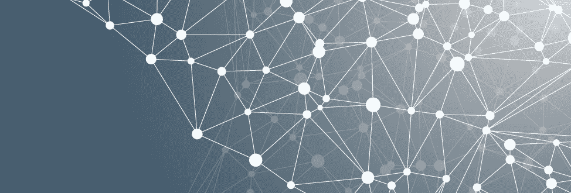

# 当一切都联系在一起的时候会发生什么？

> 原文：<https://medium.com/hackernoon/what-will-happen-when-everything-is-connected-e83c3f923fd3>

连接一切的不仅仅是物联网。这是我们的互联网。

很快一切都将被连接并可寻址——从恒温器到冰箱到门把手。这将实现自动化，甚至更大的数据和目前难以理解的新[技术](https://hackernoon.com/tagged/technology)。

但这仅仅是开始。

**一切都意味着一切，包括我们。**

今天，我们正处于[连接](https://hackernoon.com/tagged/connectivity)的黑暗时代。想想电话:现在我们都在用电报工作，努力用简单的系统做更复杂的事情。技术是有的，但是我们还没有想出如何让它工作。

但是我们已经有了支持 wifi 的[隐形眼镜](http://www.technologyreview.com/s/602035/first-wi-fi-enabled-smart-contact-lens-prototype/)、[沉浸式虚拟现实](http://www3.oculus.com/en-us/rift/)、[人工耳蜗](http://www.nidcd.nih.gov/health/cochlear-implants)。不难想象，我们很快就能把自己的实际部分连接到互联网上。

这将使同时出现在多个地方成为可能。2014 年，爱德华·斯诺登以一台赛格威平板电脑的身份造访温哥华。尽管强大的警察部队正在努力逮捕他，但他参加了这次会议，没有面临逮捕。

当这种“电报”技术发展到我们拥有像 iPhone 一样无处不在的东西时，我们将能够通过将自己投射到化身中去旅行——感觉、触摸、生活就像我们在目的地一样，而无需离开家。

这意味着巨大的影响:依赖人类互动的系统——基本上是所有的系统——变得过时。斯诺登被警方通缉，但他可以走到他们面前，与他们交谈，而不会被逮捕。

我们相互交流和互动的方式正在改变。想想从电报到智能手机的演变。在过去的 100 年里，我们重新发明了交流。由于指数变化，我们很可能在未来 10 到 15 年内看到同样水平的转变，而不是 100 年。

科技也将通过增强我们的感官来揭示新的体验。摄像头植入可能让我们看到新的光谱，也许是新的颜色，当然更详细。我们血液中的标记细胞和植入物可能会在我们感觉到任何症状之前很久就通知我们的医生健康问题。癌细胞甚至在形成肿瘤之前就会给你发送信息。

诸如此类…

**这对你意味着什么？**

在短期内——电报阶段——这意味着您需要考虑如何提高效率和重新构想工作流程。与客户的互动和参与的定义将会改变。公司将变得更加松散和网络化，而不是僵化和等级森严。

信息将更容易获得，因此竞争优势将来自解决问题，而不是控制访问。

就像所有的技术变革一样，如果你没有用新技术重塑你的业务，别人会的。那么你将如何

*   数字化您的业务？
*   如何应对自动化订购和(甚至)供应链透明度等发展？
*   管理海量数据？
*   向前看，预测未来，而不是评估过去，进行调整？

**长期来看，还有更有趣的不确定性:**

*   我们会开发信息边界来控制数据流入和流出国家吗？这些边界可能比我们想象的要早
*   隐私问题将如何处理？从短期来看，业务信息可能变得无法控制。长期来看，随着我们的细胞成为网络节点，我们的个人信息可能变得无法控制。
*   我们将发展什么样的经济体系来应对我们将发展的关于社会和彼此的知识？

这将如何影响您的业务？

**有兴趣了解我们的趋势并加入我们的讨论吗？在这里 **订阅** [我们的趋势和策略列表。](http://www.stratistgroup.com/home)**

> [黑客中午](http://bit.ly/Hackernoon)是黑客如何开始他们的下午。我们是 AMI 家庭的一员。我们现在[接受投稿](http://bit.ly/hackernoonsubmission)并乐意[讨论广告&赞助](mailto:partners@amipublications.com)机会。
> 
> 如果你喜欢这个故事，我们推荐你阅读我们的[最新科技故事](http://bit.ly/hackernoonlatestt)和[趋势科技故事](https://hackernoon.com/trending)。直到下一次，不要把世界的现实想当然！

