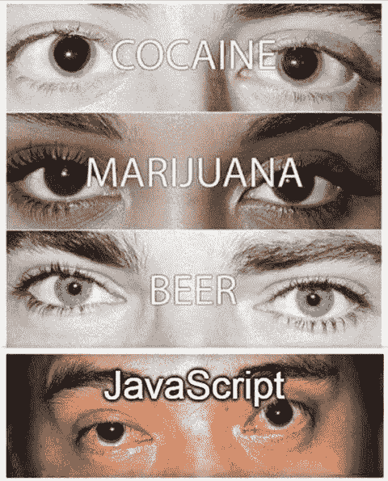
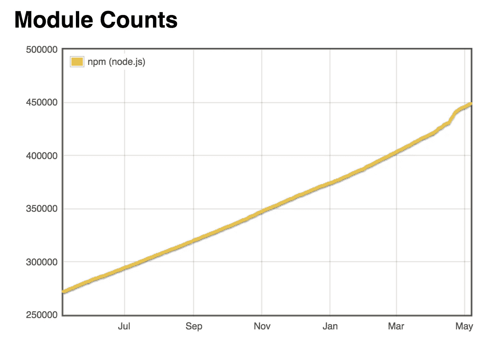

# 当我们用完 JavaScript 框架的名字时会发生什么？

> 原文：<https://medium.com/hackernoon/what-will-happen-when-we-run-out-of-names-for-javascript-frameworks-6d91c6005d40>

你好，我是一名谦逊的开发人员，从事大量的 [JavaScript](https://hackernoon.com/tagged/javascript) 框架、库、模块、插件、插件、浏览器、预处理器、处理器、后处理器、处理器插件( [Autoprefixer](https://github.com/postcss/autoprefixer) )、浏览器插件( [Ember inspector](https://chrome.google.com/webstore/detail/ember-inspector/bmdblncegkenkacieihfhpjfppoconhi) )、库插件( [jQuery](http://jquery.com/) )、框架插件。

难道不是有很多[工具](https://hackernoon.com/tagged/tools)是我们日常工作需要用到的吗？你的 package.json 文件有多大？你知道每个依赖在做什么吗？我在这里假设它们在你的项目中都有用途。所以这是一个假设，而事实是——它们都有名字，你可能需要记住。有些人描述了它的用法——像反生态的[砍树](https://www.npmjs.com/package/tree-kill)，有些人没有。永远猜不到[永远猜不到](https://www.npmjs.com/package/forever)在做什么。有些名称相似但用途不同，如 [pad-left](https://www.npmjs.com/package/pad-left) 和 [lpad](https://www.npmjs.com/package/lpad) 。不点击能猜出来吗？

JavaScript developers pictured trying to find their way around in node_modules directory :(

所以，我们看到——你可以在你的代码中使用很多 JavaScript 第三方代码。而且会越来越多。人们需要找到新的名字。程序员不一定是语言教师。至少人类语言教师。嗯，嗯，好吧，[这家伙是](https://www.italki.com/article/281/learning-english-by-learning-programming)。所以，他可以随意命名他的图书馆，因为他有权这么做。

我们中的其他人不是找到合适的名字，而是经常随机选择一些词作为我们代码的名字。我们程序员更喜欢某些单词。比如[wrapper](https://www.npmjs.com/package/wrapper)([bin-wrapper](https://www.npmjs.com/package/bin-wrapper)、 [do-wrapper](https://www.npmjs.com/package/do-wrapper) 、 [word-wrapper](https://www.npmjs.com/package/word-wrapper) 、 [events-wrapper](https://www.npmjs.com/package/events-wrapper) 、[断路器-wrapper](https://www.npmjs.com/package/circuit-breaker-wrapper) )。甚至还有一个说唱歌手。但不是阿姆那样的普通说唱歌手，更像是:

> 围绕 api RESTful 端点构造包装器(浏览器/角度/节点)

所以基本上说唱歌手会给你包装。

It’s not the kind of rapper you’d expect from [rapper](https://www.npmjs.com/package/rapper)

# 问题是

众所周知，JavaScript 是一种流行的语言。每天使用它的人可能超过 10 万。无论他们是在工作中使用它，还是仅仅用来煮咖啡。它在开发人员(和计算机用户)的日常生活中占有一席之地。

因此，JavaScript 及其早期版本——Java 已经变得足够成熟，不仅仅是通过编程寻找吃玉米煎饼的好地方。

有一个游戏——想一想英语中的任意单词——如果有这样的 JavaScript 库的话——你喝酒。如果你不想太快喝醉，就呆在家里。

将会有越来越多的图书馆，我们迟早会用光它们的名字。我相信它会比 2038 年的问题更早袭击我们。为什么？我们知道 JavaScript 是一种精神状态。程序员有孩子。这是事实，你不能争辩。孩子们通常从他们的父母那里获得精神状态。这意味着 JavaScript 开发人员的数量会快速增长。

JavaScript is more than a language, it’s a drug

# **数学**

今天有 10 万 JavaScript 开发者。他们在 21 年内成功生产了[近 50 万个节点模块](http://www.modulecounts.com/)(JavaScript 诞生于 1995 年，妈的，比我还老)。简单的数学我们拿 20 分(我只完成了高中，不要对我要求更多)。英语中大约有 [20 万个单词](https://en.oxforddictionaries.com/explore/how-many-words-are-there-in-the-english-language)。根据数学，我们已经在劫难逃了。但是让我们假设你可以用单词造句——这给了我们更多的选择。

例子:用**愚蠢**和其他单词，它会成为你的图书馆名。像:**蠢** **+** **字典** = [**蠢-字典**](https://www.npmjs.com/package/stupid-dictionary) 。是啊，字典真的很蠢。同样愚蠢或令人沮丧的是。可能**延迟**。是啊，为什么不呢，等待和延误肯定很糟糕。我们来结合**傻+延迟**。开始了， [**愚蠢——拖延**](https://www.npmjs.com/package/stupid-delay) ！哦，不，都已经有人了！时间在流逝。不好意思，名字跑了！

我们要快！回到数学！10 万开发者，50 万模块，20 年，20 万字。如果平均每个开发者有两个孩子。这意味着再过 20 年，2037 年(2038 年前一年的问题！！！)这些孩子将成为新的 JavaScript 开发者。这意味着我们将有 10 万开发人员+ 20 万新生开发人员= 30 万 JavaScript 开发人员。此外，根据 maths 的说法，在 2037 年之前，目前的 10 万名开发者将生产另外 50 万个模块(就像他们在 1995 年至 2017 年所做的那样)。这意味着我们已经有 100 万个模块，30 万名 JavaScript 开发人员，但仍然只有 20 万个英语单词。再过 20 年(2037–2057)，30 万开发者将生产 3 倍多的模块——150 万。总结一下(͜͡ʖ͡), 2057 年我们会有以下数字:

*   30 万 JavaScript 开发者
*   250 万个节点模块
*   20 万英语单词(不够)
*   名字的一个大问题

我希望你现在同意我的观点，我们需要在我们的孩子之前解决这个问题！我们不能把这个超难解决的问题留给他们！

# 潜在的解决方案

1.  我们可以开始为新的 JavaScript 框架生成散列和 uuids。想象 2 个开发者在对话:
    *——嘿，我是编程新手，哪个框架最适合创建单页面应用？
    -你好，我相信 77c 29 BCB-6422–462 b-bb0f-1 ba 9 FB 1430 CB 是最好的，但在工作中，我们使用 e778a 475–7009–4 FBD-9d 83–16 ebe 6 ef 713d，因为它的速度和灵活性。其他受欢迎的选择有 b 63 e 83 ce-c6e 5–4569-a8dc-b4ad 34 ffbb 7e、C5 b 8999 c-999 f-4c8 a-811 a-d 93 f 77 ef 5687 和 d 33 df 2b 9–9325–434 a-a507–988 CCE 172 CDE。希望我有所帮助！
    -太棒了！非常感谢！*

2.我们可以使用二维码，图像，作者的声音样本，一些独特的东西，并把它而不是名字放在我们的包中。

libraries could be identified by their authors rapping

3.我们可以尝试像罗马人或世界语那样统一一切。将每个模块合并到节点 API 或浏览器 API 似乎是一个不错的开始。我们可以摆脱所有的依赖！

4.人类将会忏悔，抛弃所有的模块，回到普通的 JS，通过极简主义拯救 JavaScript。

选择权在你。

我是丹尼尔·卡马克。如果你喜欢这篇文章，请关注我的博客:[http://danielkmak.com/blog](http://danielkmak.com/blog)。

如果你有任何问题或想法，或者你只是想谈谈，请打电话到 contact@danielkmak.com 找我。

一定不要错过这个故事:[https://medium . com/@ danielkmak/how-I-used-stack-overflow-github-to-get-dream-job-before-19-without degree-8cb 5184 e 2 bec](/@danielkmak/how-i-used-stack-overflow-github-to-get-dream-job-before-19-without-degree-8cb5184e2bec)。

本帖原文可以在我的博客上找到:[http://danielkmak . com/blog/programming/JavaScript/2017/05/06/what-will-happen-when-we-run-out-of-names-for-JavaScript-frameworks . html](http://danielkmak.com/blog/programming/javascript/2017/05/06/what-will-happen-when-we-run-out-of-names-for-javascript-frameworks.html)。

> [黑客中午](http://bit.ly/Hackernoon)是黑客如何开始他们的下午。我们是阿妹家庭的一员。我们现在[接受投稿](http://bit.ly/hackernoonsubmission)并乐意[讨论广告&赞助](mailto:partners@amipublications.com)机会。
> 
> 如果你喜欢这个故事，我们推荐你阅读我们的[最新科技故事](http://bit.ly/hackernoonlatestt)和[趋势科技故事](https://hackernoon.com/trending)。直到下一次，不要把世界的现实想当然！

