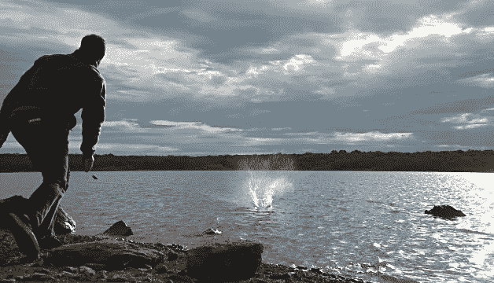

# 5 年后别人会怎么说你？

> 原文：<https://medium.com/hackernoon/what-will-others-say-about-you-in-5-years-ca569e83dfba>

在我大学四年级准备工作面试的时候，我每天都要检查一些常见的面试问题。

然而，有一个问题总是难倒我。

**你认为自己 5 年后会怎样？**

五年是一段很长的时间。他们想听什么？他们想让我签一份对公司忠诚十年的保证书吗？他们希望人们退出吗？上商学院？我渴望什么样的工作或职位才能让自己听起来雄心勃勃？他们真的在乎吗？

有一天，我不再考虑如何在面试中给人留下深刻印象，而是仔细思考我将在哪里看到我的职业生涯。我回想起大学四年级前的五年——作为一名高中毕业生，我想学习历史、写作和外语，并有可能成为外交官或教师。从那时到现在发生了什么变化？

在我确立这些目标后的五年里，我看到了自己的改变。我越来越需要挑战。新的发明、产业和机会以独特的方式呈现。我学到了我讨厌的东西。我的不安全感油然而生。我意识到什么让我厌烦，什么让我着迷，什么让我发笑，什么驱使我的求知欲。我学会了如何与人交往，如何与不同类型的人产生共鸣，以及如何从头开始建立信任。

具有讽刺意味的是，如果你在高中问我五年后会在哪里，我可能会提到一个职业或行业。我不会提及个人、社会或智力的成长。

你总是在某个职位或行业焦点的镜头里看到自己。你很少把自己视为你想要体现的那种人。

《赫芬顿邮报》的创始人阿里安娜·赫芬顿谈到了超越金钱和权力的成功的重新定义，包括幸福、智慧以及我们的惊奇和给予的能力。在这篇文章中，赫芬顿质疑我们世界的大多数人是通过简历还是悼词来传承他们的遗产。

> “不管一个人花了多少时间在两端燃烧蜡烛，追逐成功的有毒定义，并普遍错过了生活，悼词总是关于其他东西:他们给予了什么，他们如何联系，他们对周围真实的人的生活有多重要，小小的善意，毕生的激情以及什么让他们发笑。”

在奥巴马总统对资深参议员泰德·肯尼迪的赞颂中，有一小部分演讲集中在他的立法成就上。相反，它充满了这样的轶事:

在 9 月 11 日之后的日子里，泰迪特意亲自打电话给该州 177 个在袭击中失去亲人的家庭。

*【他】是那个总是第一个拿起电话说“我为你的损失感到难过，”或者“我希望你感觉好点，”或者“我能帮上什么忙”的朋友和同事*

*当他们因为六岁的泰迪不知道三角帆是什么而把他扔下船时，他又回到船上学习驾驶。*

虽然这无疑改善了他作为我们时代最伟大的立法者之一的遗产，但这也给了他人性的新视角。

当我现在考虑这个五年问题时，我用一种不同的方式来描述它:

5 年后别人会怎么说你？

也许他们会提到商业上的成功或运动。也许他们会参考创业倾向。但是当你是一个成功的合作伙伴时，如果和你一起工作让人难以忍受或者处处碰壁，这有关系吗？如果你熬夜计算数据是以牺牲有意义的关系为代价的，这有关系吗？如果你是一个成功的企业家，如果你的朋友几个月没见你，这有关系吗？

除了为我想去的地方或 2021 年我想去的地方设定目标，我还想考虑我想成为什么类型的人。

当我考虑我的成功衡量标准时，我会考虑新的晋升、职位和荣誉，它们会影响我的职业生涯。我也考虑职业生涯之外的个人成长——这些成就是否继续帮助我成为更好的学生、同事、朋友和人类。

事实是，很乱。没有人喜欢考虑这个模糊的指标。为什么幸福、智慧和我们奉献的能力也能推动我们成功？很暧昧。它很懒。它不像筹集的美元或阅读的书籍那样容易衡量。然而，这是我们最持久的衡量标准。

你如何衡量好奇心、快乐和付出？

想想你欣赏什么类型的人，为什么欣赏他们。想想你最好的朋友，以及你为什么欣赏他们。想想你最喜欢的同事或最有影响力的导师——他们对待你们关系的方式中，什么是重要的？

想想是什么让你好奇——当你需要专注于工作时，是什么把你吸引到互联网的黑暗角落？你发现自己渴望成为哪个领域的权威？在教别人的过程中，你在哪里最大化了自己的潜力？

想想什么能让你快乐，休息好，并能建立你的人际关系。多少小时的睡眠对你最合适？什么让你起鸡皮疙瘩？什么让你微笑？

你不必在今天或明天找到这些。但是每天，除了你的职业阶梯，你可以从更多的方面反思你和你想成为的人之间的差距。

玛娅·安杰洛曾经说过:“我明白了，人们会忘记你说过的话，会忘记你做过的事，但人们永远不会忘记你带给他们的感受。”

**五年后别人会怎么说你？**

*Kushaan 是 IBM 驻华盛顿特区的顾问。他的兴趣是战略咨询、企业家精神、社交媒体以及技术与社会影响的交叉。他喜欢写关于生活、职业见解、社交技术和企业环境的博客。如果你喜欢这篇文章，请在 twitter 上关注他:*[*@ kushaanshah*](https://www.twitter.com/kushaanshah)*或者点击顶部的“关注”查看更多关于 Medium 的文章。*

> [黑客中午](http://bit.ly/Hackernoon)是黑客如何开始他们的下午。我们是 AMI 家庭的一员。我们现在[接受投稿](http://bit.ly/hackernoonsubmission)并乐意[讨论广告&赞助](mailto:partners@amipublications.com)机会。
> 
> 如果你喜欢这个故事，我们推荐你阅读我们的[最新科技故事](http://bit.ly/hackernoonlatestt)和[趋势科技故事](https://hackernoon.com/trending)。直到下一次，不要把世界的现实想当然！

