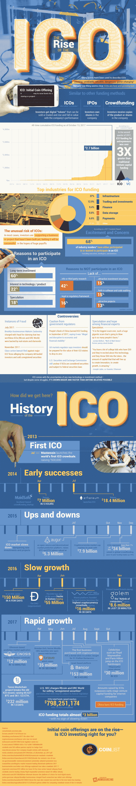

# 关于 ICO 你需要知道什么

> 原文：<https://medium.com/hackernoon/what-you-need-to-know-about-ico-bd59a957a358>

Mastercoin 于 2013 年推出了第一个 ICO，即首次发行硬币。他们很早就取得了成功，总共筹集了 50 万美元。今天，ICOs 是一个 30 亿美元的企业，创下了最高收入项目的记录，Tezos 在 13 天内筹集了 2.32 亿美元。

基于加密货币的快速增长，ico(初始硬币发行)有一种不同的回报投资者的方法。与投资者拥有公司股份的首次公开募股(IPO)不同，ico 的投资者获得了可以出售和交易的数字代币。这些代币反映了公司的业绩，价值会有很大的波动。

由于其新的和目前不受监管的结构，ico 可能难以驾驭。从欺诈的可能性和缺乏第三方研究来看，投资 ICO 比其他可靠的投资方法更像是一场赌博。华尔街之狼乔丹·贝尔福特称之为“有史以来最大的骗局”

到目前为止，ico 短暂的生命中经历了起起落落，但在去年显示出巨大的指数增长，并且没有放缓的迹象。请看这张信息图，了解更多关于 ico 的[增长以及这对投资的未来意味着什么。](https://coinlist.me/icos/ico-history)

