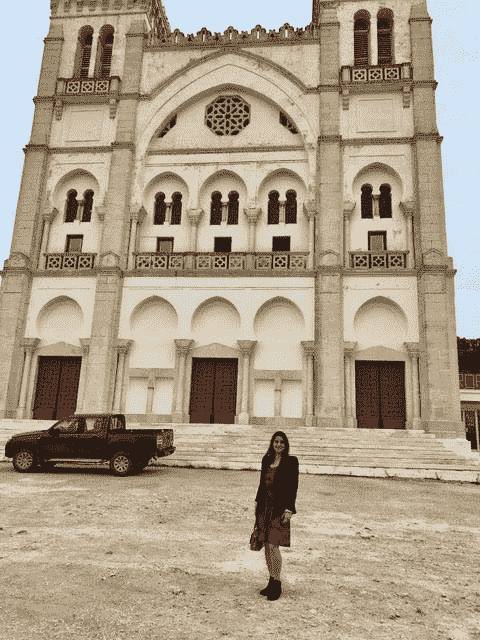
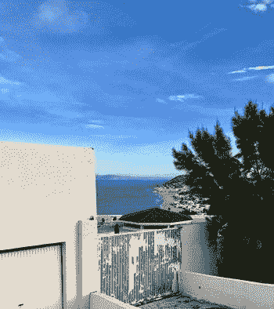
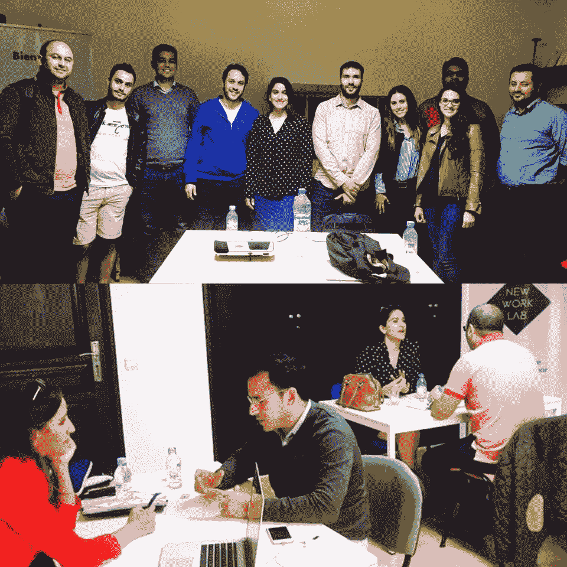
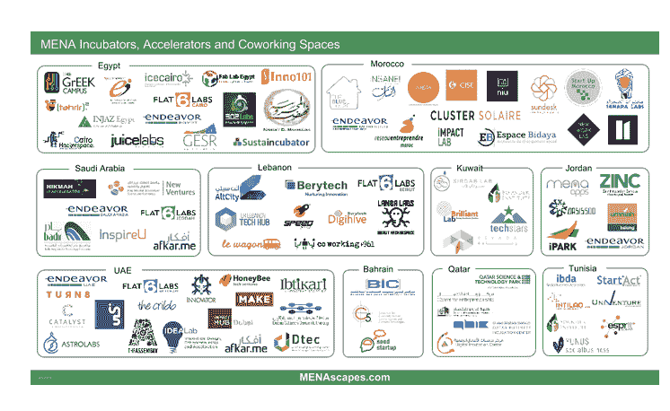
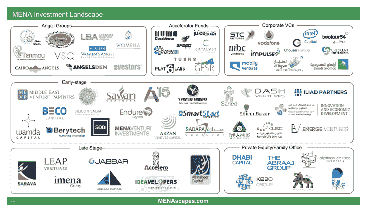
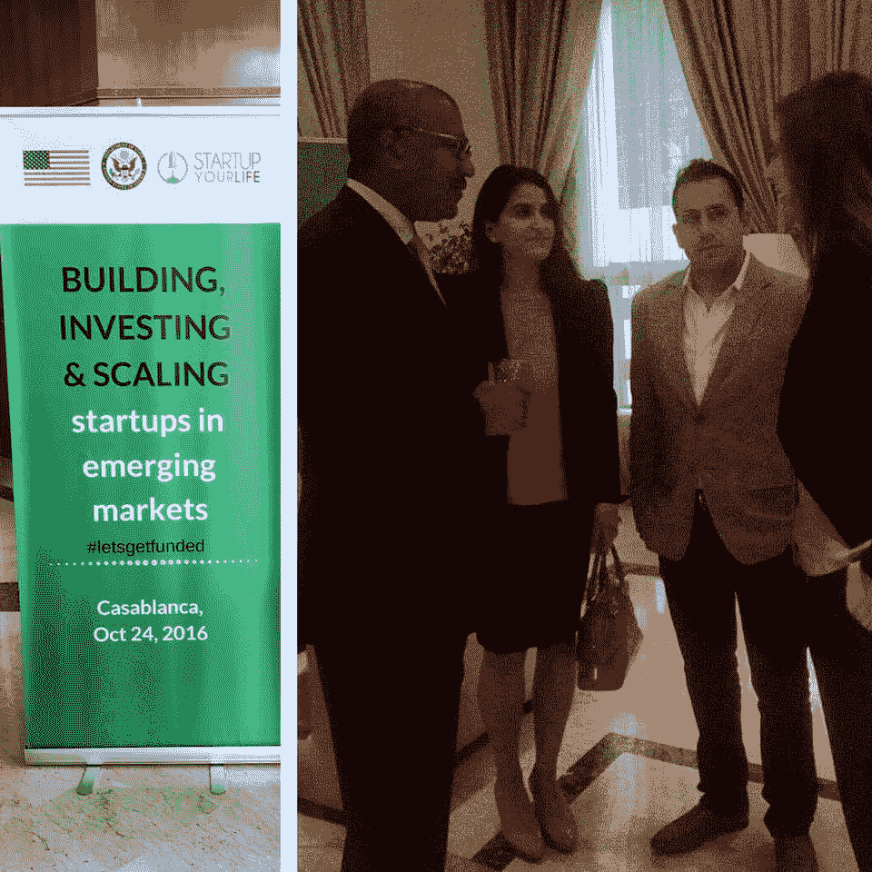
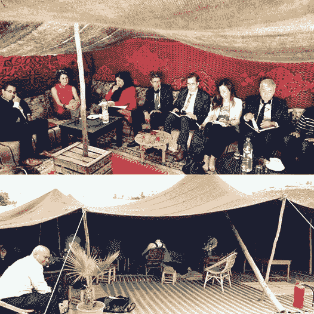
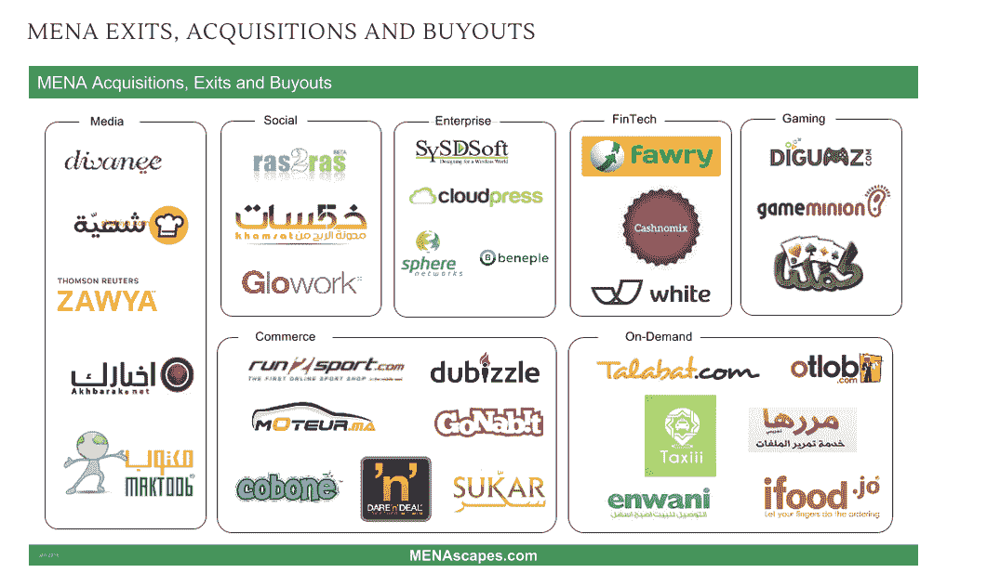

# 投资北非创业公司你需要知道什么

> 原文：<https://medium.com/hackernoon/what-you-need-to-know-about-investing-in-north-african-startups-9961ffff439c>

在突尼斯，我对出租车司机说:“在我需要演讲之前，我还有 20 分钟，所以如果你能带我简短地游览迦太基，我将不胜感激。”。

“哦，小姐，你需要 20 多分钟才能看到迦太基。最少两个小时，”他用阿拉伯语回答。

“嗯，开快点”，我回答。

— — — — — — — -

中东和西方测量时间的方式完全不同。在东方，时间是以事件来衡量的，即“今晚让我们聚在一起吃晚饭”而不是“让我们在这个确切的时间在这个特定的餐馆见面”。

不用说，我确实按时做了报告，但只是在和我的出租车司机热情地解释了几次关于时间和准时的问题后，我才得以表达我的观点。

(**Pictured**: Me at the ancient ruins of Carthage)

虽然在我们理解对方之前需要一些校准，但我们都给了对方我们想要的。他成了我的摄影师，以闪电般的速度开车带我来到迦太基最重要的景点前，我给了他想要的钱——一个公平的交易。

## **有时候，只需要一点耐心和发现，就能理解我们起初可能会误解的事情。**

公平地说，中东是世界上最被误解的地区之一，尤其是考虑到该地区所有的旅行限制和政治不稳定。作为第一代伊拉克裔美国人，我去过无数中东国家，并在其中一个国家短暂居住过，我对那里的人民、文化和他们的思维方式形成了一些看法。

但只是在最近的北非之行中，作为美国国务院主办的企业家代表团的一员，我才真正有机会探索中东地区的创业生态系统，坦率地说，我在那里花的时间较少；即突尼斯和摩洛哥。

作为美国国务院议长代表团的一员，我们应邀主持研讨会、辅导会议，并与突尼斯和摩洛哥的政府官员、私人和机构投资者进行对话。(埃及也有蓬勃发展的创业生态系统，但在这次特别的旅行中，我们只关注突尼斯和摩洛哥)。

**此行有三个目的:**

(1)在难以获得资本的情况下促进众筹；

(2)促进天使投资/风险资本，以鼓励富有的摩洛哥人和突尼斯人投资创业公司，并就如何制定商业计划和改进其推销方式向年轻企业家提供建议；而且，

(3)与创业公司和企业家分享技术知识

简而言之，在美国国务院和当地大使馆的支持下，我们的目标是为创业公司、投资者和监管官员创造一个教育、合作和增长的平台。

**国务院代表团**

今天，我加入了 [**TechWadi**](https://techwadi.org/) 的董事会，这是最大的非营利组织，通过他们的项目和网络在中东和硅谷之间架起了一座桥梁。“Wadi”这个词在阿拉伯语中的字面意思是“山谷”。TechWadi 是由一群非常成功的创始人和风险投资人在近 10 年前创立的，他们希望在美国和整个中东建立一个技术合作平台。

除了董事会席位，我还被要求将我的产品营销、成长型营销和上市知识与有抱负的企业家和科技创始人分享。我和来自迪拜和谢里夫巴达维的天使投资集团 [**WOMENA**](http://womena.co/) 的 Chantalle Dumonceaux 在一起，她专注于建立一个[**500 Startups**](http://500.co/)MENA(中东北非)基金。

我试图分享这次旅行的概况，以及关于企业家精神的状况以及政府和投资者在当今北非生态系统中的作用的一些总体想法。*免责声明:*我只是触及了讨论的表面，我的目标是让您从更高的层面了解当今存在的监管、投资和创业机会及障碍。

# **突尼斯&摩洛哥**

## 突尼斯

首先，你可能想知道，突尼斯在哪里？虽然突尼斯没有像埃及和摩洛哥等其他北非国家那样受到媒体的关注，但突尼斯拥有一些最美丽的风景和历史遗迹，如我前面提到的迦太基古城遗址。突尼斯位于利比亚和阿尔及利亚之间，人口约 1100 万。

在访问了近 15 个中东国家后，我的第一反应是惊讶于这个国家与其邻国相比是如此的进步和自由。当走过臭名昭著的西迪布赛义德时，我很容易把一些风景误认为是希腊的某个地方。

(**Pictured:** Tunis, Tunisia)

## 摩洛哥

摩洛哥的创业生态系统比突尼斯大，人口约 3000 万。他们加大了对创业公司的投入，并发布了专门针对该国创业生态系统增长的具体激励措施。今天，与该地区自阿拉伯之春以来受到影响的其他国家相比，摩洛哥因为经历了和平时期而被称为“坏邻居中最好的房子”。

在我们的旅行中，我们大部分时间都在卡萨布兰卡，然后是拉巴特，并与美国大使馆的合作伙伴[**startup your life**](http://startupyourlife.org/)**[——](http://startupyourlife.org/)密切合作，这是一个专门致力于建立摩洛哥初创科技生态系统的组织。关于与美国驻摩洛哥大使德怀特·布什的 200 多人会议的新闻剪辑可以在 [**这里**](https://www.youtube.com/watch?v=tEqD1FqVMxw) 找到。**

## *****创业*****

**虽然突尼斯和摩洛哥在殖民化后都受到亲法势力的影响，但它们都有着非洲-欧洲-中东的令人困惑的身份。甚至在他们的对话中也是如此:我们遇到的几乎所有企业家都懂三种语言，会说阿拉伯语、法语和英语。该国在这一地理位置上具有独特的优势和劣势，可能会利用这一位置或使自己边缘化。**

**突尼斯和摩洛哥之间的另一个共同点是两国的企业家精神，这种精神因年轻一代对技术和社交媒体参与的热爱而蓬勃发展，充满激情、新想法、勇气和信息交流。**

****

****(Pictured:** Workshops with entrepreneurs in Morocco)**

****

****MENA (Middle East & North Africa) Ecosystem Map of Accelerators & Co-working spaces****

**在这两个国家，我们遇到的许多创业创始人和团队都在法国或欧洲其他地方接受过教育。我们在这两个国家听取了一些更老练的加速器毕业生和海外侨民的一个又一个演讲。总的来说，他们对如何制定可靠的商业计划和产品发布的理解程度给我留下了深刻的印象。**

**我在这两个国家发现的一个问题是，一些初创公司只关注自己的增长市场，而没有放眼大非洲、欧洲或更远的地方。虽然在一个市场开始小规模测试，然后在其他市场推出产品通常是正常的，但我通常发现，许多人在制定商业计划时都抱着这样的心态，即他们的产品只会在他们的国家销售。**

**考虑到每个国家的人口规模(突尼斯:约 1100 万，摩洛哥:约 3000 万)，这一事实本身就足以抵消任何真正的全球规模的计划。在我们的研讨会之后，我们遇到的初创公司意识到，在推出产品或服务时，他们需要扩大市场范围，并更加全球化。**

## *****政府&投资*****

**这两个国家的监管影响似乎是北非初创企业发展的最大障碍之一。**

**突尼斯初创企业成长的最大障碍是一项规定，即投资于该国的外国资本不能转移到国外。此外，迄今为止，外国公司不能在突尼斯本地初创企业中拥有多数股权。这对任何外国投资者来说都是一个主要的危险信号，政府应该尽一切努力消除外国投资的障碍。**

****

**MENA Ecosystem Map Investment Landscape***

**摩洛哥的投资环境比突尼斯稍微更有利于投资者，因为他们允许资本进出该国，并保证初创公司 60%的风险投资损失。然而，仍然有法律限制向国外转移货币资金。**

**从企业家的角度来看，今天两国的政府立法对于创业生态系统来说过于官僚和缓慢，并且经常阻碍产品路线图。在一个陈旧的技术基础设施环境中创造一种产品已经够困难的了，例如，政府关于专利的法律将成为这两个市场中许多行业的瓶颈。**

## **推荐**

**创业领域的新想法通常通过直接实施来测试，这在严格的规则和监管下很难实现。我们建议政府放松监管，允许更大的整体实验环境，以便创业公司可以向前发展。**

****

***(****Pictured:***Conference in Casablanca with Dwight Bush, the Ambassador to Morocco.)**

****

****(Pictured:** A meeting with top institutional investors in a Bedouin tent. Translator present.)**

## *****退出*****

**是的，在中东和北非已经有出口。然而，摩洛哥和突尼西亚两地**的退出仍有待观察**。这些国家存在一个先有鸡还是先有蛋的问题，因为投资者害怕把钱投入没有鸡和蛋的生态系统。大公司对收购本地公司不太感兴趣，这加剧了问题。**

****

**MENA Exits, Acquisitions, and Buyouts***

## *****我的主要收获*****

**来自西方和其他成熟经济体的科技移民正成群结队地回到北非地区，这对该地区的创业生态系统来说是一个充满希望的迹象。一些最聪明的头脑正在意识到在一个处于令人兴奋的转变边缘的地区等待着他们的机会。**

**我个人的观察是，中东人的血液里有创业精神。他们作为一个社区社会的悠久历史至今仍将物物交换、谈判和说服作为一种生活方式。这在露天市场、麦地那和无数的小企业主身上显而易见，他们可以用复杂的策略吸引你考虑他们的产品。**

**我离开北非时，从我在该地区遇到的企业家眼中看到了希望和兴奋的曙光，感觉自己发生了某种变化。如果有公平的成功机会，我个人认为一个伟大的创业生态系统的要素已经存在。随着政府和投资者采取正确的行动，正确地混合这些成分，结果将是深远的，menascapes 滑坡可能在短短几年内变得像今天的 adtech lumascape 滑坡一样拥挤。**

**东西方在文化、语言和商业上的差异非常大，但是随着时间、耐心和理解，我们可能会发现相似之处远远多于不同之处。**

**在那里的时候，我意识到北非的企业家和今天硅谷的企业家没有什么不同。***事实上，尽管他们获得信息、指导和资本的机会有限，但他们成功和忍耐的能力将证明他们的足智多谋、勇气和决心。*****

**我祝他们一切顺利，并期待听到有关退出、收购和在该地区推出更多产品的消息。**

**如果你对北非的创业生态有什么疑问，请联系我 [**@Yasmeen_BT**](https://twitter.com/Yasmeen_BT) 或者 [**@Selbadawi**](https://twitter.com/selbadawi) 谁在500 Startups 建立 MENA 基金。**

**如果你能访问我的 [**页面**](https://www.patreon.com/user?u=3682035) **，我将不胜感激。****

****由谢里夫·巴达维创建的 Menascapes.com(开源)***

************

> **[黑客中午](http://bit.ly/Hackernoon)是黑客如何开始他们的下午。我们是 [@AMI](http://bit.ly/atAMIatAMI) 家庭的一员。我们现在[接受投稿](http://bit.ly/hackernoonsubmission)，并乐意[讨论广告&赞助](mailto:partners@amipublications.com)机会。**
> 
> **如果你喜欢这个故事，我们推荐你阅读我们的[最新科技故事](http://bit.ly/hackernoonlatestt)和[趋势科技故事](https://hackernoon.com/trending)。直到下一次，不要把世界的现实想当然！**

****