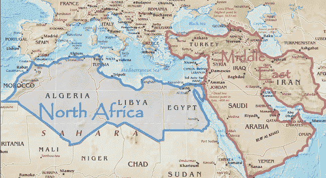
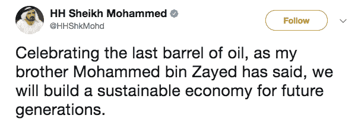
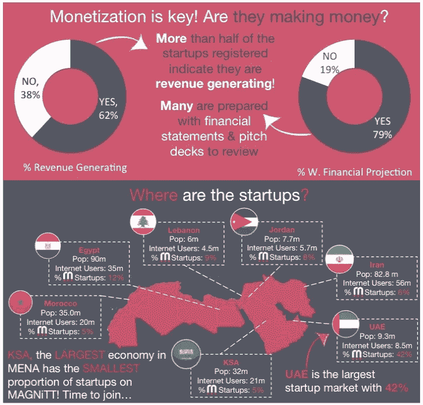
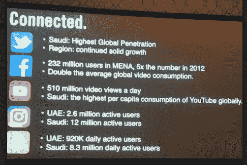
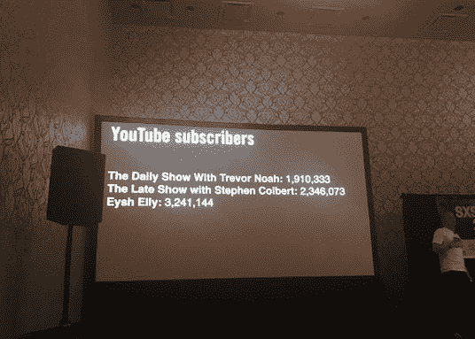
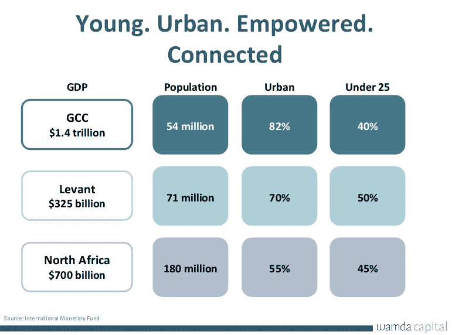
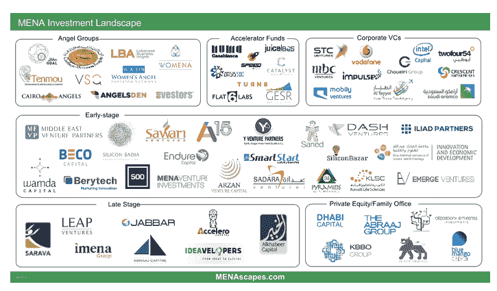

# 关于中东创业空间，你需要知道什么

> 原文：<https://medium.com/hackernoon/what-you-need-to-know-about-the-middle-east-startup-space-85eda475f96d>

今年早些时候亚马逊收购电子商务公司 Souq.com 成为全球新闻，但在中东以外，人们对该地区的创业生态系统以及生活在那里的人们的数字足迹知之甚少。

当人们想到中东时，石油和相对政治不稳定的时刻经常浮现在西方人的脑海中。虽然我同意有少数国家的经济在过去几年因石油而增长，但这些国家最近通过投资于替代收入来源和产业而摆脱了这种依赖。

"最后一桶石油从地下取出的那一天，是我们要庆祝的一天."——HH 谢赫·穆罕默德·本·扎耶德在推特上

至于政治不稳定的说法，有 22 个阿拉伯国家，尽管其中一些国家肯定存在政治动荡，但这不应阻止人们注意到大中东北非(MENA)地区大多数国家的科技崛起。

## **中东创业生态系统有什么令人兴奋的地方**

如果你今年在发达国家创业，你可能不会感到离开去硅谷寻求资金或获得新人才的巨大压力。十年前，其他国家的创业公司在本国获得资金几乎是闻所未闻的，找到合适的人来帮助自己建立和发展公司即使不是不可能，也是非常困难的。

近年来，全球许多主要发达国家都出现了创业中心&社区。政府和本地风投正在资助和投资本地初创企业，对于那些希望加入或建立一家初创企业的年轻有抱负的企业家，有许多激励措施和项目。

*中东也没有什么不同。*约旦、黎巴嫩、阿联酋、埃及、沙特等国家都跟随了这一新的范式转变，我们已经看到从加速器到孵化器和创业项目(见生态系统图)的新创业生态系统参与者在整个地区涌现。中东和北非地区的许多重要投资者和政府正果断地将资金投入到他们认为有机会的地方，并将资金投入到中东各行各业的新企业中，从[电子商务](https://uae.souq.com/ae-en/)，金融科技，数字媒体[交通](https://www.careem.com/dubai/node)，甚至[加密货币](https://bitoasis.net/en/)。

Source: Magnitt

中东和北非地区顶级风险投资公司 Wamda Capital 的董事长 Fadi Ghandour 上周表示，他在 2016 年听取了超过 700 家初创公司的推介，今年有望听取近 1200 个推介。而且这些创业公司很多已经在赚钱了。 [Magnitt，](https://www.magnitt.com/state-startups-2016)一个研究平台报告称，该地区超过一半的初创公司正在创造收入。

Source: Magnitt

## **中东年轻、有才华、有人脉&热情**

中东科技创业生态系统的独特优势在于连通性、该地区的人口结构以及人们探索新想法和商业风险的不懈热情。中东的智能手机渗透率目前为 80–90 %,预计到 2020 年，这些趋势将达到 100%的渗透率。

该地区的人口高度向年轻化倾斜。该地区近 68%的人口年龄在 34 岁以下，许多国家有近一半的人口年龄在 25 岁以下。对于任何一个在中东呆过的人来说，你会注意到谈话是该地区的一种艺术形式，并且经常会发现阿拉伯人在一天的任何时候都在从事这种艺术形式。小企业创业在该地区并不新鲜，许多父母是企业主的孩子正在网上学习这些技能。

如果你把年轻人口与智能手机的高渗透率结合起来，你会发现人们每天任何时候都在网上进行数字化交易——甚至比我们在美国还要多。

随着他们越来越依赖于技术，我们看到越来越多的初创技术公司为精通技术的人群的需求构建解决方案只是时间问题。

## 阿拉伯人就是喜欢没完没了的对话——无论是线下还是线上。

根据 [Yousef Tuqan](http://schedule.sxsw.com/2017/speakers/414) 今年早些时候在 SxSW 上发表的关于品牌如何与阿拉伯数字一代联系的演讲，我冒昧地从他的演讲中捕捉了几张照片，证明了我之前的观点:

根据这些统计数据，沙特拥有全球最高的 Twitter 渗透率，以及全球最高的 YouTube 人均消费。中东和北非地区的视频消费是全球平均水平的两倍，当前的人口趋势证明，与这些平台的互动只会继续上升。

事实上，被阿拉伯人称为“阿拉伯特雷弗·诺亚”的艾什·艾莉的 YouTube 用户比特雷弗·诺亚本人还多。甚至还有科尔伯特！

## 中东人口约 3.5 亿，目前 GDP 为 2.5 万亿(来源:国际货币基金组织)，令人惊讶地超过了印度等国的 2.2 万亿 GDP。

下面，Wamda Capital 的主席 Fadi Ghandour 在我们的年度 TechWadi 会议上展示了他的发现。国内生产总值按中东地区细分:海湾国家、黎凡特和北非。

如果你看一下整体 GDP 和人口，再加上在该地区的投资，你会发现中东只是创业生态系统发展上升趋势的开始。[一家研究机构 Magnitt](https://www.magnitt.com/) 最近追踪到该地区有超过 3000 家活跃的创业公司。

该地区充满了年轻而有才华的企业家，你可以在网上找到他们，与他们交谈、交易，并不断发展技术生态系统。

下面是中东和北非投资前景生态系统图，提供了该地区目前活跃的投资公司类型的快照。

尽管亚马逊收购 Souq.com 成为今年的头条新闻，但这不应被视为一次性退出。中东北非地区甚至硅谷的公司，如 [500 Startups](https://techcrunch.com/2017/05/09/500-startups-closes-15m-fund-to-back-founders-in-the-middle-east-and-north-africa/) 都在投资中东北非地区的初创科技公司。

这仅仅是中东北非创业生态系统的开始，我们应该期待在未来几年看到更多像 Souq.com 这样的收购。

感谢 [Wamda Capital](http://wamdacapital.com/) 的董事长 Fadi Ghanour，他分享了许多对本文有贡献的见解和想法。我还想感谢 SxSW 的 Yousef Tuqan 在他关于阿拉伯世界的数字连接的演讲中分享的见解。

## 如果你对走向市场非常感兴趣，**我最近创建了两个新的在线课程:“** [**什么是产品营销**](https://bit.ly/2MKCFR5) **”和“** [**推出你的产品。**](https://product-marketing-go-to-market.teachable.com/p/launch-your-product-the-essential-go-to-market-course/?preview=logged_out) **”的必备市场课程。**

## 我的书"[产品营销被揭穿。亚马逊上有重要的上市指南"](https://www.amazon.com/dp/1718968124/ref=sr_1_44?ie=UTF8&qid=1535685326&sr=8-44&keywords=product+marketing)！

