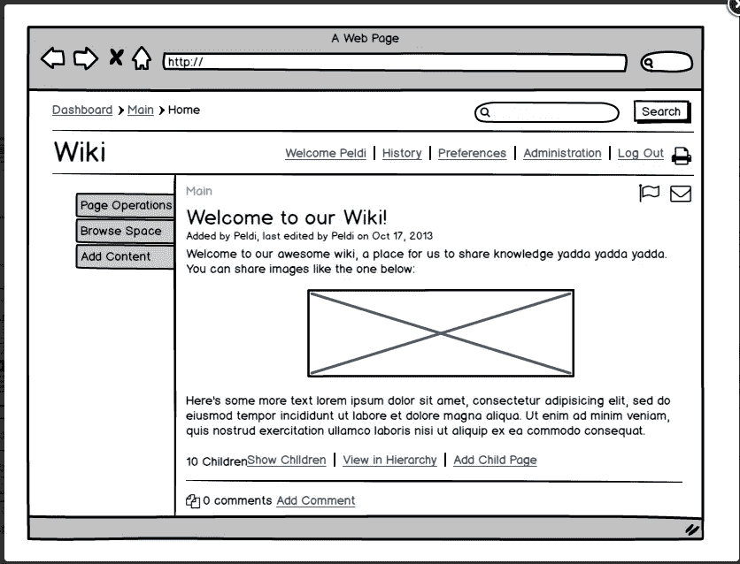
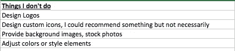

# 雇佣设计师之前你需要知道的事情(UI/UX)

> 原文：<https://medium.com/hackernoon/what-you-need-to-know-before-you-hire-a-designer-ui-ux-4892bdd0307e>

[Photo credit](https://www.studentsforliberty.org/2017/05/28/understanding-opportunity-costs-might-just-solve-fight-neighbour/)

让我们澄清事实。我是一个对设计一无所知的企业家。我想，多亏了丰富的经验和一些伟大的设计师的帮助，我才过得更好。当我开始我的企业家之旅时，我刚刚体验过那些不专注于 UI 或 UX 设计的产品。它们都是“功能第一”的产品，使用起来很痛苦。他们为我们的客户解决了痛点，所以我们继续构建功能，而不担心体验。对于十年前的企业产品来说，这是很常见的。市场上的选择有限，而且由大玩家主导。看着客户与产品斗争的经历一直伴随着我。这让我从第一天起就在我们的[初创企业](https://hackernoon.com/tagged/start-up)推动一个强大的设计焦点。当我第一次开始时，我没想到这个过程会如此复杂。有很多问题我都是通过反复试验才找到答案的。我最近和另一家初创公司的创始团队聊过，意识到他们的情况完全一样。我帮助他们学习。

这是一篇为希望投资他们的用户界面和 UX 的公司写的文章。它是为遇到设计挑战的技术人员的设计师设计的。它是为那些不知道从哪里开始设计流程的初创企业准备的。

这篇文章将帮助企业家回答以下问题:

*   找设计师之前要整理什么？
*   你需要什么样的设计师？
*   如何提炼你的需求并向设计师阐明？
*   对设计师有什么期望？
*   你的交付成果应该是什么样的？

这篇文章将帮助设计师回答以下问题:

*   如何向设计挑战阐明你的交付物？
*   如何为你要交付的东西设定界限？
*   如何教育当事人让大家的生活更轻松？

重要的事情先来。UI/视觉设计、UX 和品牌设计的区别。我把 UI 和视觉结合成一个，因为我不想纠结于细微的差别。

**UX 设计师:**了解用户行为以及他们会对你的产品做什么。他们与产品经理密切合作。他们设计你的用户对你的产品的旅程。这包括屏幕流程，决定重要的东西应该出现在哪里，错误信息中的语言等等。基本上，任何涉及了解用户心理的事情&行动。UX 的设计师通常制作一个低到中等保真度的线框。它详细说明了信息将如何在应用程序、导航、行动号召和消息传递中流动。UX 设计师将更注重体验，而不是视觉吸引力。

UI/视觉设计师:这些设计师通常会在 UX 设计完成后开始工作。他们决定产品必须如何设计，按钮应该如何显示，应该使用什么样的设计模式，导航条应该是什么颜色，应该使用什么样的图标等等。他们给你的低保真度原型注入生命。很多时候，他们与 UX 的设计师一起工作，并产生互动。交互设计是另一个主题，有专门研究交互的设计师，但作为一个初创企业，我怀疑你是否有能力在每个专业领域进行投资，所以，和我在一起吧。

**品牌设计师:**这些设计师设计你的标志、产品手册、启动图标、演示模板、社交媒体广告图片、t 恤等。基本上，任何与你的品牌有关的东西。它们将有助于你通过色彩和其他视觉元素向用户展示自己的身份。

你应该先雇佣哪个设计师？

品牌设计师。在做其他事情之前，你需要一个标志来标记和确定你的品牌的调色板。我的建议是不要走极端。找一个像样的设计师来设计你的标志和品牌标识，但不要试图涵盖未来 5 年的一切，你可能会在 5 个月内倒闭。考虑最重要的客户群、行业以及在哪里展示你的标志是很重要的。这对你的设计师来说是一个重要的输入。

接下来，去找 UX 设计师，如果可能的话，找一个 UI/UX 设计师(两者兼而有之)

如果你的基本品牌身份被冻结，UX 设计师将有一个调色板工作。对于低保真度的原型来说，颜色并不重要，它们通常是纸上草图或在 Balsamiq 等工具上创建的。这是 Balsamiq 模型的样子:

[Photo credit](http://www.queppelin.com/2016/12/10-best-wireframe-tools/)

如果你的 UX 设计师也做你的视觉设计，品牌必须提前冻结。

现在让我们谈谈细节。

**自由 UX 设计师对你的产品有好处吗？**

你的产品的 UX 是一个连续的过程。如果你使用敏捷和精益的方法，你就处于一个不断变化的状态。您正在学习，并通过几次小的迭代对您的产品进行更改。通常情况下，你会希望 UX 设计师是核心团队的一部分，这样他们就可以根据你对产品所做的改变来设计你的屏幕和功能。

话虽如此，但找到合适的设计师并不容易。这有几个原因。最常见的一个是，设计师往往不喜欢被束缚在一个组织中。他们更喜欢自由职业的路线，尝试不同的项目。

假设你没有雇佣，下一个选择就是找一个能帮你的自由职业者。一个好的自由职业者可能很贵，因为他/她的技能是有价格的。与其雇一个差的，不如干脆不雇。

我如何找到合适的设计师？

这是一个棘手的问题。有很多设计师想冒充 UX 设计师。他们通过创造基于[行为](https://www.behance.net/)行为&行为[行为](https://dribbble.com/)的产品概念来制作漂亮的投资组合。透过表面，你会发现这些设计[并没有基于任何坚实的原则](/pixelpoint/why-i-hate-your-fake-redesign-177a626d7f95)。警惕这些。一个好的经验法则是查看投资组合并阅读项目流程的详细说明。如果对流量和用户研究的关注是粗略的，那就远离它。

一个好的 UI/UX 设计师总是会问很多关于用户的问题，以及产品功能的每个细节应该如何帮助增加价值。如果设计师没有这么做，那你就找错人了。

**我如何决定自由职业者的范围？**

如何决定范围取决于参与的类型(下一个问题将详细介绍)，但是您应该知道自己想要什么样的流程。

例如，假设您正在构建一个购买古董笔的 MVP 电子商务网站。您已经通过之前的测试验证了市场需求，现在想要开发一个产品。您需要以下功能/流程:

*   能够看到销售笔的列表页面
*   点击一个项目并查看详细信息的能力
*   结帐的能力

对于版本 1，没有与支付提供商集成。货币兑换通过货到付款机制进行，在这种机制下，送货员确认收到了钱。这个高层次的范围是对话的开始，有助于更好地构建范围。从这些流程中，设计师可以推断出至少有 3 个页面，一个列表页面，一个产品详情页面和一个结账页面。利用这一点，设计师将提出下一组问题:

*   用户需要看到的关于笔的最重要的信息是什么？(品牌/图像/笔型/生产年份/价格？)
*   用户在列表页面上需要搜索功能吗？
*   你考虑过滤镜吗？
*   我们希望在产品详情页面上显示什么？
*   是否希望在每个详细页面的底部显示类似的产品？
*   您想向用户显示哪种通知？

那些线路上的东西。设计师也可能会问你一些问题来填写用户移情图。使用您提供的所有信息，设计师将确定工作范围，并向您发送一份建议书。

我应该选择固定价格投标还是远期货币合同？

同样，如果范围被冻结(对于一个 MVP，如果这意味着仅仅是一个月的功能价值，那就这样吧),然后选择一个固定价格的合同。如果你的工作范围不固定，那就选择时间和金钱合同，也就是现收现付。

**设计师将交付什么，我如何评估工作的完成情况？**

通常，我们期望从 UI/UX 设计师那里得到的结果是可点击的高保真原型。原因有两个:

*   它有助于可视化实际产品，并允许您与客户一起测试它。
*   它可以作为开发人员开始工作的规范

对开发人员来说，什么是规格？

UI 开发人员通常不会决定屏幕应该是什么样子或者东西应该放在哪里，那是设计师的工作。开发人员有一系列不同的问题。他们担心必须使用什么技术来实现所需的功能，他们担心性能，他们担心如何高效地构建接下来的 20 个屏幕，他们担心如何在不同的设备上呈现事物等。他们的工作是确保机器运转顺畅。

他们需要设计团队的移交，这样他们就可以轻松访问以下信息，而不必进行第二次猜测:

*   每个元素的颜色
*   字体和样式(粗体、半粗体、斜体、常规)
*   交互和外观——按钮被按下时是什么样子，当屏幕加载时会发生什么，当你在网格中选择一行时，它与其他行有什么区别，等等。

有很多工具可以做到这一点，我使用[视觉](http://invisionapp.com)来构建我的原型。我无法告诉你我有多喜欢它。如果设计师使用 Sketch 或 Photoshop，也有插件将样式拉入[检查](https://www.invisionapp.com/feature/inspect)。开发人员实际上可以看到每个元素的 CSS 样本。像 Vision 和 Sketch 这样的工具的伟大之处在于社区。你可以学习和获取任何你能想象到的信息。有像漫威和其他几个替代者。这两个漫威广告都提供有限项目的免费计划。作为一个初创企业，你不能要求更多。

我应该抛弃设计师，转而采用 DIY 方法吗？

如果你的核心团队中有人愿意提升技能，学习一些设计原则&继承衣钵，然后去 DIY。首先，你可以聘请一位设计师，他能把基本的东西放在适当的位置。然后在你前进的过程中建立这些原则。如果你选择像材料设计这样的设计模式，有很好的文档可以帮助你学习。一个简单的 UI 方法是从市场上购买一个好的 bootstrap 主题，用它开始你的 MVP 开发。当你知道你的生意有吸引力时，你可以雇佣一个设计师来重新设计产品。和你的工程团队一起检查这种方法，如果偏离主题的努力是巨大的，你就有问题了。

**我的长期考虑是什么？**

用户界面和 UX 对你的产品非常重要。即使你的产品非常适合市场，糟糕的用户体验最终也会拖你的后腿。拥有一个优秀的设计团队并不是一件好事，而是一个伟大产品的必备条件。如果你是一家初创公司，你会在每次冲刺时建立许多新功能，这意味着新的屏幕和流程。在组织中嵌入设计功能之前，你等待的时间越长，你的设计债务就越大。如果你找了一个固定范围的自由职业者，想想接下来的冲刺阶段你要做什么。

我如何向设计师提供反馈？

这是一个棘手的问题。总的来说，当你向任何人提供反馈时，不要含糊其辞。以下是一些常见的模式:

*   *“我不喜欢这样，做点什么，让它好看点。”*这是差评。这就像有人没有描述问题就记录了一个 bug。你不知道该修什么。你需要能够指出你到底不喜欢什么。
*   *“把扣子做成这样。”*指出你不喜欢的，不要告诉设计师怎么修。你雇佣他们做这项工作是因为他们擅长这项工作，你的反馈是一种要求，而不是解决方案。
*   *“看看这个网站，我想让它变成这样。”不要纠结于你所看到的事情。您不想创建副本。设计师通常会要求一些类似的产品，以便他们了解你所处的空间。这并不意味着你必须根据这些产品来评估他们的工作。*

现在你知道设计是一个科学的过程。别再把它当成嬉皮士画公交车了:)

[Photo credit](https://pixabay.com/vi/hippie-van-vw-ng%C6%B0%E1%BB%9Di-c%E1%BA%AFm-tr%E1%BA%A1i-1203391/)

**当一个没有任何设计背景的技术团队接近设计师时，他们需要知道什么**

从个人经验来看，寻找一个设计师是艰难的。这就是我们冻结瞄准镜的原因。没有范围冻结，我们无法从设计师那里得到报价。显然，我们不想签订一份无期限的合同。全职雇佣不是一个选择，因为当时我们都不是全职员工。每次，我们都必须向某人解释这个概念，我们让他们在 NDA 上签名。这是一个很大的开销，在 20 次失败的尝试后，我们终于解决了这个问题。我必须补充的是，很多设计师甚至没有回复我们。没有一个自由职业者愿意和一个随时可能破产和拖欠付款的有抱负的企业家一起工作。

最后，我们找到了一个有 18 年经验的人，他愿意和我们一起工作。谢天谢地，他对我们很有耐心，不像一些年轻的设计师。我花了很多时间和他讨论事情，并自己挑选一些设计来补充他的工作。这对我们来说是一个巨大的学习过程。这里有一些给遇到像我们这样的人的设计师的建议。

首先，没有以前的设计经验，不要指望团队接近你，明确他们想要什么。事实上，更多的时候，他们会对设计师到底应该传递什么感到困惑。

更糟糕的是，很多设计师都非常傲慢，对待开发者就像对待低等生物一样。我见过开发团队和设计团队之间的冷战局面。这在很大程度上是由于对另一方的所作所为缺乏了解。

**给设计师的一些提示:**

**为你的工作设定清晰的界限:**如果有事情你没有做，向团队解释。有一个标准的清单，列出你要做和不做的事情。

Sample Checklist

**接触决策者:**通常，有人与设计师互动，另一个人审查工作。这造成了极大的不便。你正在和某人讨论，但是每次你想出设计的时候，它都被扔给你。一定要有决策权。

**解释你的方法:**解释你将如何提出你的第一个版本，你将接受哪些部分的反馈&你将如何在那里迭代。企业家可能会认为你会在 sprints 中与工程团队一起工作。在开始迭代特性和细节之前，您可能更喜欢充实最初的概念。很好，设定期望值。

**不要把自己当外人:**把自己嵌入核心团队。确保最终结果符合你对产品外观的设想。这是大多数设计工作失败的地方。设计被交付，然后开发孤立地发生(特别是。在自由职业者的场景中)。作为一名设计师，你应该尽最大努力留下来，展示你对结果的承诺。你的产出不是你的项目本身，而是产品。

**教育开发团队:**巧妙地做到这一点。向他们展示你的工作实例以及可能出现的失误。向他们展示你将交付什么，以及他们如何获取。请最终接收者(前端开发团队)审查可交付成果。

我有机会和一些伟大的设计师一起工作，他们中的一些人成为了我的朋友和导师。我仍然是一个业余爱好者，但设计是我所学到的最充实和有趣的事情之一。
希望这篇帖子有所帮助。如果你喜欢读它，点击下面的心形图标，和其他可能觉得有用的人分享。

> [黑客中午](http://bit.ly/Hackernoon)是黑客如何开始他们的下午。我们是 [@AMI](http://bit.ly/atAMIatAMI) 家庭的一员。我们现在[接受投稿](http://bit.ly/hackernoonsubmission)，并乐意[讨论广告&赞助](mailto:partners@amipublications.com)机会。
> 
> 如果你喜欢这个故事，我们推荐你阅读我们的[最新科技故事](http://bit.ly/hackernoonlatestt)和[趋势科技故事](https://hackernoon.com/trending)。直到下一次，不要把世界的现实想当然！

