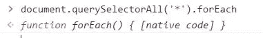
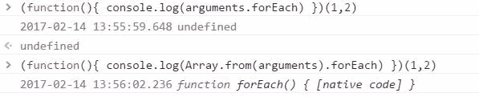
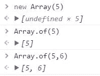
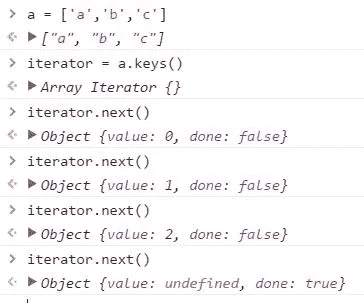
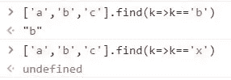
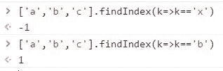
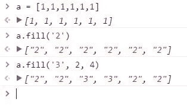
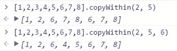

# 关于 ES6 阵列，您应该知道什么

> 原文：<https://medium.com/hackernoon/what-you-should-know-about-es6-arrays-34b2a166aaed>


任何[编程](https://hackernoon.com/tagged/programming)语言最重要的特性之一，数组在 [JavaScript](https://hackernoon.com/tagged/javascript) ES6 中有几个长期要求的特性更新。

例如，像 *Array.from* 和 *Array.of、*这样的新方法为数组数据类型提供了新的功能。

# **来自**

允许您从其他类型的集合创建数组，以便您可以利用集合中不可用的数组功能。

最常见的用例之一是选择一组 DOM 节点。

```
Array.from(document.querySelectorAll('*'))  // returns Array
```

由于 document.querySelectorAll 返回一个 NodeCollection，而不是一个数组，所以不能使用像 forEach 这样的数组函数。在过去，这是行不通的:

```
document.querySelectorAll('*').forEach(...) // fails[].slice.call(document.querySelectorAll('*'), ...) // workaround
```

将集合提供给 slice 之类的数组原型方法是一种常见的解决方法，但在 ES6 中不再需要。

但是，对于 DOM 节点集合，您可能不需要它。在 Chrome 中，DOM 节点集合本身确实有一个 forEach 方法。



所以这个问题很可能已经成为过去。另一个我们可能想转换成数组的对象是参数。



我们现在可以对参数使用内置数组函数。

也可以用 Array.from 代替 Array.map 来映射元素。

```
Array.from(document.querySelectorAll(‘*’), console.log)
```

另一种有用的技术是使用 Array.from 来填充新数组。

```
Array.from(new Array(5), k=>'val')
// ['val','val','val','val','val']
```

# 数组. of

可用作数组构造函数的替代方法，当传递一个数字时，会将该值创建为数组中的一个元素，而不是创建该数量的元素—这正是数组构造函数的工作。



# Array.keys，Array.values，Array.entries

这些方法分别为数组的键、值和条目返回迭代器。。可以调用 next()来推进数组。

这些键是数组的索引。



Array.values 允许您迭代数组值，Array.entries 允许您迭代数组条目。

但是，Chrome 和其他浏览器并不完全支持 Array.values 和 Array.entires，所以您可能还不想在代码中使用它们。

# 数组.查找

简单地用一个函数在数组中查找一个元素，如果不存在就返回 undefined。



# Array.findIndex

与 Array.find 类似，返回找到元素的索引，或-1。



# 数组.填充

用一个值填充数组，并带有可选的开始和结束索引。具有签名 **Array.fill(value，start，end)**



# Array.copyWithin

允许您将元素块复制到数组的其他部分。具有签名 **Array.copyWithin(target，start，end)**

目标是要复制的元素索引。Start 和 end 是可选的，是要复制的元素。



这里，第三个元素(目标索引=2)将从元素索引 5 开始复制。

在第二个示例中，end 值为 6 表示只复制了一个元素(索引 5–6)。

在下一版本的 JavaScript (ES7)中，还会有更多的数组函数。目前，这些新方法为程序员使用数组提供了新的解决方案。

[](http://bit.ly/HackernoonFB)[](https://goo.gl/k7XYbx)[](https://goo.gl/4ofytp)

> [黑客中午](http://bit.ly/Hackernoon)是黑客如何开始他们的下午。我们是 [@AMI](http://bit.ly/atAMIatAMI) 家庭的一员。我们现在[接受投稿](http://bit.ly/hackernoonsubmission)，并乐意[讨论广告&赞助](mailto:partners@amipublications.com)机会。
> 
> 如果你喜欢这个故事，我们推荐你阅读我们的[最新科技故事](http://bit.ly/hackernoonlatestt)和[趋势科技故事](https://hackernoon.com/trending)。直到下一次，不要把世界的现实想当然！

