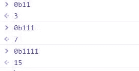
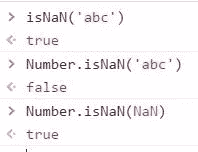
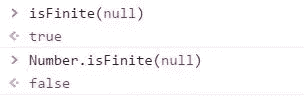
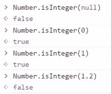
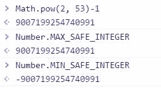
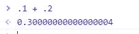

# 关于 ES6 JavaScript 中的数字，你应该知道什么

> 原文：<https://medium.com/hackernoon/what-you-should-know-about-numbers-in-es6-javascript-7370be6b3469>

数据类型*编号*在 [JavaScript](https://hackernoon.com/tagged/javascript) 中有多种用途。从 ES6 开始， *Number* 进行了大量改进，帮助[程序员](https://hackernoon.com/tagged/programmer)节省时间并高效编码。下面是 ES6 为我们最喜欢的数据类型带来的一些新特性。

# 二进制和八进制文字

首先，程序员现在可以使用前缀来表示 ES6 中不同的数字系统。

所以对于表示二进制数，可以用**前缀 *0b*** 表示八进制数，可以用**前缀 *0o*** 。

# **号。南**

*号。NaN 不同于其全球同行。在比较之前，它不通过数字(值)转换它的输入。*

*号。如果提供的值是 NaN，则 NaN* 返回。

令人困惑的是，***NaN = = = number***

所以，***type of value = = = number***，并不能准确的告诉你 value 是否是一个数字。它给出了所有数和 NaN 的集合

所以，更准确的判断 value 是否为数字的方法是:
***type of value = = = ' number '&&！*number . isnan(值)**

当然，解决值被错误地描述为数字的其他方法包括，***Number(x)= = = x***它将仅对数字返回 true。

# 数字是有限的

*Number.isFinite* 也不同于全局 isFinite，因为 *Number.isFinite* 在评估之前不通过 Number(value)转换值。

全局 isFinite 将非数字计算为有限！
这是因为全局 isFinite 在求值之前将值强制转换为数字(value)。

例如，非数字转换为数字可以等于 0。 ***数量(空)==0***

*Number.isFinite* 在这方面更胜一筹。

# 数字. isInteger

这是 ES6 中的新功能，它将确定一个数字是否是整数。没有对 Number()进行强制转换，所以可以肯定 null 之类的非数字将计算为 false。

# Number.parseInt

*Number.parseInt* 和 *Number.parseFloat* 的行为与它们的*全局*对应物完全一样，没有例外。

# *数量。MAX_SAFE_INTEGER，数字。最小 _ 安全 _ 整数*

这些表示在 JavaScript 实现中可以安全而精确地表示的最大和最小的数字，这受到 2⁵ -1 的 IEEE 浮点限制(IEEE 754)的限制

当然，最小安全整数是最大数的*负*。记住计算机是如何在内存中存储数字的。

# 编号:isSafeInteger

如果提供的数字介于上述最小值和最大值之间，则 Number.isSafeInteger 只返回。

# 号码。希腊语字母之第五字

当系统不能足够准确地表示浮点(十进制)数字时，JavaScript 中会出现舍入错误。例如，令人震惊的是
***.1 加. 2 不等于. 3！***

*号。ε*为计算提供了可接受的误差范围。因此，可用于确定可接受的误差范围，如下所示:

ES6 中的数字已经有了很大的进步，虽然仍有改进的空间，但像这样的增强有助于使 ES6 比以前的 JavaScript 版本更好。

> [黑客中午](http://bit.ly/Hackernoon)是黑客如何开始他们的下午。我们是这个家庭的一员。我们现在[接受投稿](http://bit.ly/hackernoonsubmission)并乐意[讨论广告&赞助](mailto:partners@amipublications.com)机会。
> 
> 如果你喜欢这个故事，我们推荐你阅读我们的[最新科技故事](http://bit.ly/hackernoonlatestt)和[趋势科技故事](https://hackernoon.com/trending)。直到下一次，不要把世界的现实想当然！

