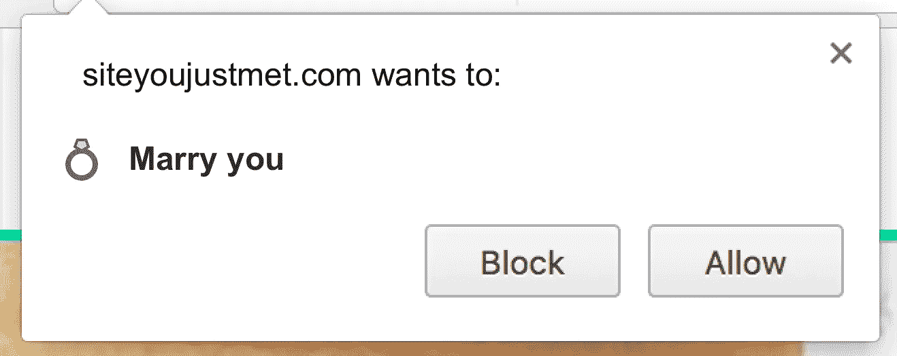
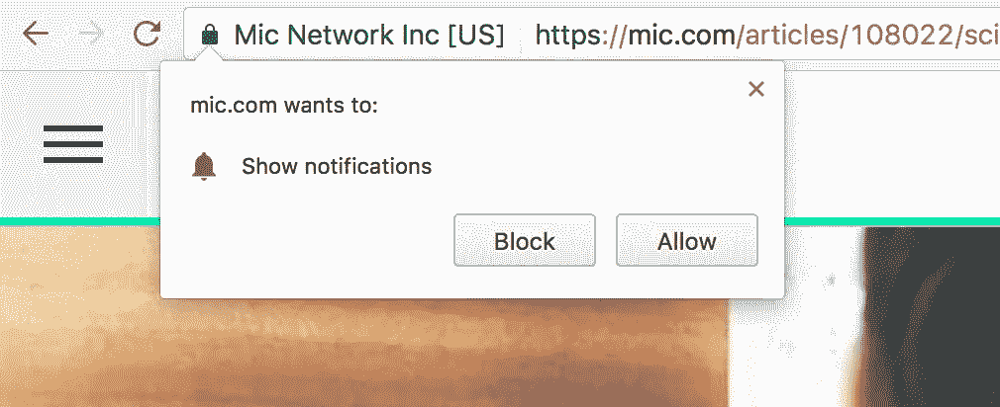
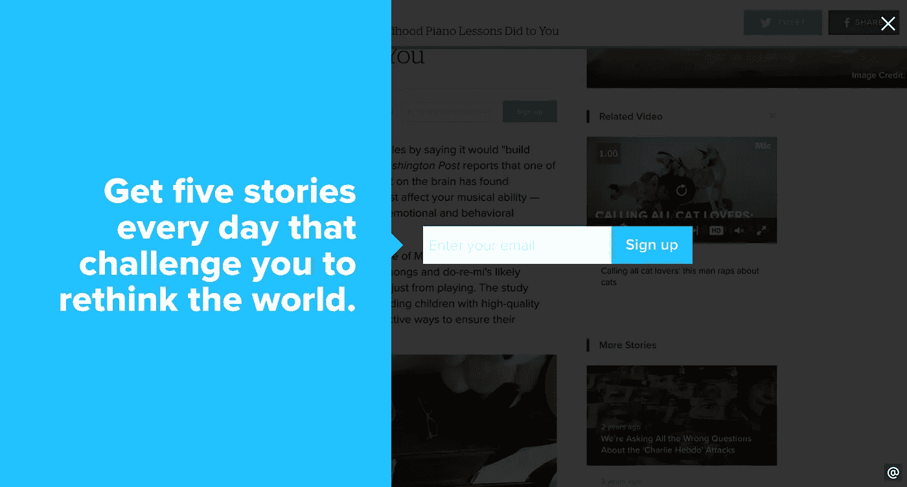
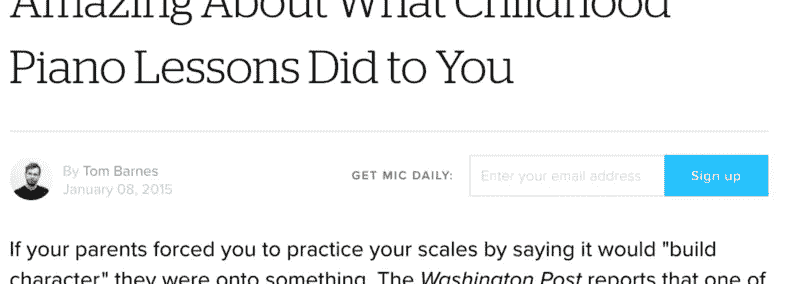
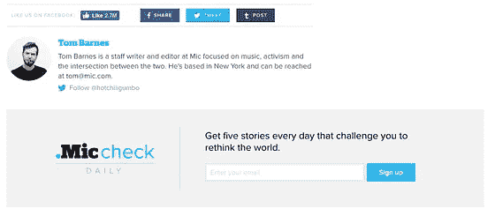

# 你的产品能从约会中学到什么

> 原文：<https://medium.com/hackernoon/what-your-product-can-learn-from-dating-cd95d2bbf77e>

> 约会的基本原则:不要在第一次约会时告诉你的约会对象你爱他们。
> 
> 产品的基本原则:不要在用户到达你的网站后就告诉他们你想永远联系他们

《我如何遇见你母亲》有一个 20 秒钟的完美例子来说明这一点:

[https://youtu.be/dE-lsrft1c8](https://youtu.be/dE-lsrft1c8)(先导集)

有很多网站我可以选择，但 mic.com 是今天的罪魁祸首。

# **《我想我爱上你了》**

我点击了一篇[关于儿童音乐训练的众多好处的文章](https://mic.com/articles/108022/science-just-discovered-something-amazing-about-what-childhood-piano-lessons-did-to-you#.9uXi2BkIm)，因为它听起来很有趣。我收到浏览器通知警告:

我保存我的[浏览器](https://hackernoon.com/tagged/browser)通知，用于我珍视的网站(例如 [ProductHunt](https://hackernoon.com/tagged/producthunt) )。所以，不用了，谢谢，我刚到这里，还没看过别的。

然后(在鼠标离开页面时)，我被邀请加入他们的电子邮件列表:

写得好。真的很棒。但是还是那句话。我刚到这里。我在试着读这篇文章。我能看看吗？

我还在页面上看到多个邀请

4 invites for their mailing list

那个最后的邀请(作者简历旁)是我最后看完文章后看到的第一个。这是我第六次被邀请让 mic.com 和我交流。

# **为什么这是一个问题**

我明白了。

我敢肯定，这些都提高了 mic.com 的电子邮件捕获率。但这并不意味着它在大背景下有效。我非常有兴趣了解他们的邮件打开率、邮件点击率以及邮件点击后的参与度。

当涉及到请求通知许可时，在移动设备上就更糟了。UserOnboard.com 的 Samuel Hulick 在他的许多拆解中很好地谈到了这一点。太多时候我想，“不，新游戏-我只是-检查出，我不想你打扰我玩你所有的时间。”

# **应该发生什么**

尊重是游戏的名字。时机是强大的。等到我写完文章，直到你问我加入你的邮件列表。一旦我加入了您的电子邮件列表，请提示我浏览器通知。

仅仅优化漏斗的顶部可能会以牺牲漏斗中更下游的步骤为代价。不要对整个漏斗过程视而不见。**优化整个漏斗。适时的邀请服务于用户，让他们感到兴趣和兴奋。**

**随着您对用户的尊重、认可和交付价值，下漏斗参与度会增加。**

在这两个漏斗中，我更喜欢第二个:

The first funnel might have great conversion on step 1, but if step 2 is your real goal, then I would take the second funnel.

不要在你的用户到达的第一秒就告诉他们你爱他们，想和他们结婚。相反，等待合适的时机邀请用户分享、订阅或做出其他承诺。如果你不这样做，你会得到这样的反应:

加入[我的时事通讯](https://ryanseamons.com/)，在那里我会分享一些实用的链接和我所了解到的关于产品和育儿的建议。也可以在 [LinkedIn](https://linkedin.com/in/ryanseamons) 或 [Twitter](https://twitter.com/ryanseamons) 上向我问好。

**附加阅读**

不要在第一次约会就向她求婚

[5 个你可能都不知道自己犯过的入职错误](https://blog.prototypr.io/5-onboarding-mistakes-you-might-not-even-know-youve-made-913c63f33b26#.p7wmkr1zl) (Appsee)

[车载用户](http://www.useronboard.com/)(塞缪尔·胡利克)

[你的用户体验是否会让你的客户失去兴趣？(尼尔·斯尼芬)](https://thegood.com/insights/bad-user-experience/)