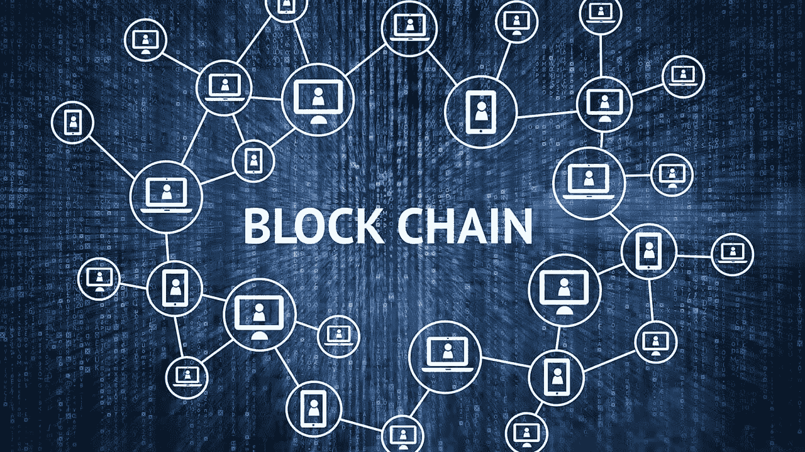

# 这个叫区块链的流行语到底是什么？

> 原文：<https://medium.com/hackernoon/whats-exactly-this-buzzword-called-blockchain-ca1b40667a0f>

目前，科技行业的每个人都在谈论*加密货币。*

*投资者、开发者和企业家，每个人都在关注加密领域。对于新手来说，理解炒作的内容可能是一件痛苦的事情。为什么每个人都对[加密货币](https://hackernoon.com/tagged/cryptocurrencies)及其背后的技术，新的流行词… [**区块链**](https://www.blockchain.com/) 着迷。*

*那么到底是什么技术让比特币(和其他加密货币)如此特别，为什么包括我在内的这么多人认为加密货币将改变世界。*

**

*[Some popular Cryptos](https://news4c.com/financial-crypto-crisis-today-as-the-crypto-market-crashed-drastically/)*

*答案是(你猜对了)**区块链。***

*通俗地说，[区块链](https://hackernoon.com/tagged/blockchain)就像一个公共的不可变文档，可以记录任何地方发生的任何类型的交易。我说的公开是指，不是由一个权威机构来监督它的工作，而是一个大的网络来确保一切都以一种有效和安全的方式工作。*

*一个很好的类比是，你不是把你所有的重要文件都放在一个柜子里，而是在你每个朋友的住处都放一份。这样，没有一个权威机构作为信任的来源，而是整个网络为你的文件提供安全保障。*

*这种方法有可能消除我们交易中的所有中间商。支付门户、电子商务网站、银行甚至政府，我们的日常交易将不再需要中央权威。*

## ***但是区块链是如何记录一笔交易的呢？***

*很高兴你问了，我前面提到的网络实际上是一个负责区块链的社区。这个节点社区是维护区块链的人，而不是实际进行交易的人。对于每个事务，都有一个相应的块。*

*一个块可以有 4-5 个事务。网络的任何节点都可以将该块添加到区块链中。但是许多节点可以同时添加一个块，因此为了避免这个难题，我们添加了**工作证明(PoW)** 的概念。*

*为了添加块，每个节点必须执行涉及资源的高级计算。所以在比特币中，平均 10 分钟就做一个区块。*

**

*[Representation of the Blockchain network](https://hackernoon.com/how-crypto-startups-are-changing-finance-right-now-6882574a6ccb)*

*考虑到计算水平，两个节点同时开发一个块的可能性非常小。然而，如果发生类似的事情，它会在过程中得到纠正，因为最长的区块链被认为是有效的。*

*由于数据块是加密的，因此无法在以后更改其内容，但可以查看。此外，由于每个块通过散列与下一个块链接，因此创建了加密数据的安全不可编辑 ***链*** 。*

*该区块所需的计算所涉及的处理时间可以外包，这些人可以用数字货币支付报酬。这叫做**采矿**。*

## *那么比特币是什么？*

*比特币通过我们处理金钱的方式做到了这一点。它是一种点对点的去中心化数字货币。这意味着，区块链是用来记录交易的，没有银行或政府对此负责。这是区块链使用的第一个也是最受欢迎的例子。*

*但不仅限于钱。区块链什么都能用。从众筹到维护健康记录，它可以为各种用例实现，并消除所有中间机构。这里有一个惊人的例子，说明它是如何像 Kickstarter 那样被用来筹集资金的:*

*[通过以太众筹](https://www.financemagnates.com/cryptocurrency/news/bancor-crowdsale-raises-140-million-less-three-hours/)*

*就像 Kickstarter 上发生的一次众筹一样，这次融资使用了以太币(而不是美元)，以太币的一种数字货币。*

*Etherereum 为众筹玩主机。人们付钱给它，然后它把钱转到筹款晚会上。每一笔交易都由以太坊管理，也就是说，只是由区块链提供动力的一段代码。是不是很酷？*

## *区块链还有其他应用吗？*

*是的，它是！意识到区块链的巨大潜力，我们大多数主要银行已经走到一起，利用它们来跟踪自己的记录。*

*它的应用不仅限于金融领域。医疗保健和法律是使用区块链可以改变整个架构的许多领域中的一部分。*

*你问的非金融行业如何？答案是**智能合约**。智能合同是一个误称，因为它只是一个管理合同的计算机协议，但它不是真正的合同。*

*如果有人不遵守智能合同的法律，你没有任何权力可以投诉。但它仍然很棒，因为它考虑到了所有这些情况。让我解释一下:*

*以前，对于每个不同的应用程序，都需要不同的区块链。交易数字货币用不同的区块链，交易大麻用不同的。另一个问题是，如果你付了钱，如何确保你能拿到那包大麻？如果他不遵守规则呢。智能合同解决了这两个问题。*

**

*One stop for all transactions*

*通过它们，您可以将不同的区块链添加到单个区块链中，即，不必为每次使用创建单独的区块链，只需在原始区块链的一个区块上附加一个新链即可。为了维护这个新的链，可以使用旧的或新的网络。*

*现在我们来讨论第二个问题。当我们从亚马逊买东西时，我们向亚马逊付款，然后亚马逊将钱转给卖家，作为回报，我们得到了我们想要的产品。*

*如果卖家无法发货，亚马逊会向我们退款。同样，如果我们不付款，就不会发货。在这种情况下，Amazon 充当管理流程平稳运行的中央权威。*

*智能合约也会发生同样的情况。双方根据智能合同的规则进行交易，这些规则是公开的，任何人都可以阅读。如果交易失败，这笔钱将退还给有关各方。如果交易成功，无可辩驳的记录将被添加到区块链中，该记录在未来无法编辑，但肯定可以作为证据访问。这就是为什么智能合同在未来可以(也将会)用于文件目的，从财产买卖到司法使用。*

*我希望这篇文章能让你对区块链的工作有所了解。尽管这项强大的技术还需要大量的研究，但它的前景肯定是光明的！*

**最初发表于*[*【adityarohilla.com】*](https://adityarohilla.com/2017/12/20/whats-a-blockchain/)*。关注我更多这样的文章！**