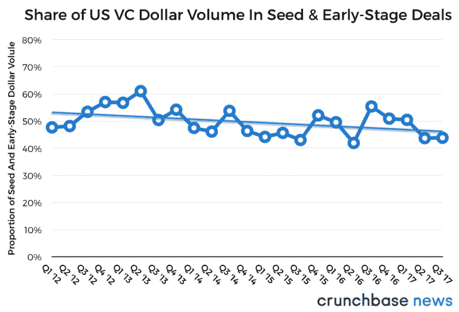
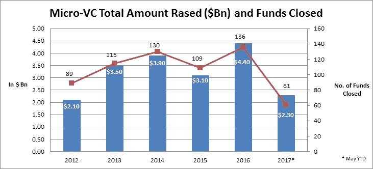
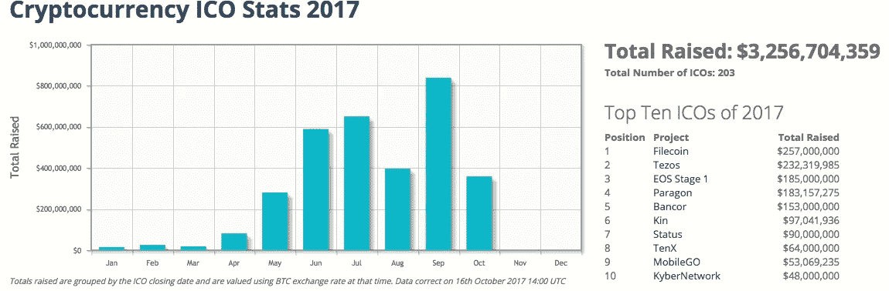
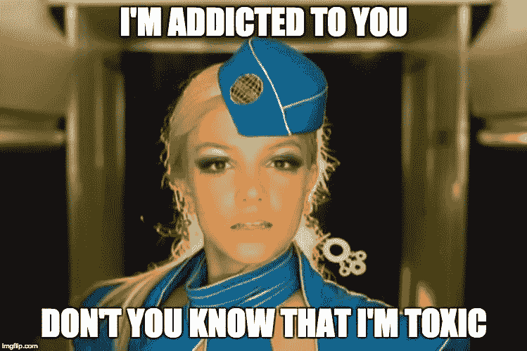

# 风险投资领域现在发生了什么？

> 原文：<https://medium.com/hackernoon/whats-going-on-in-venture-capital-right-now-e5eca9f0920b>

Pretty sure this is how everyone feels right now…

I️看过几篇文章，说[种子投资下滑](https://news.crunchbase.com/news/q3-2017-global-report-vc-deal-dollar-volume-projected-reach-post-dot-com-highs/)，[风投有毒](https://techcrunch.com/2017/10/26/toxic-vc-and-the-marginal-dollar-problem/)，[ico 是下一个大事件](https://news.crunchbase.com/news/icos-race-ahead-seed-capital-falters/)。因此，I️希望打破这种状况，彻底改变当前的气候，这样我们才能明智地向前迈进。

# 种子投资正在下降。

现在这似乎是真的，虽然没有明显下降，但也略有下降。考虑到筹集的小额种子基金(1 亿美元)正处于历史高点，这似乎很奇怪，难道不应该部署更多资本吗？

[https://news.crunchbase.com/news/top-heavy-us-vc-market-may-lose-footing-early-stage-deals-slip-away/](https://news.crunchbase.com/news/top-heavy-us-vc-market-may-lose-footing-early-stage-deals-slip-away/)

[https://medium.com/@Samirkaji/what-you-need-to-know-before-raising-a-micro-vc-fund-today-bbc34fb5f3f1](/@Samirkaji/what-you-need-to-know-before-raising-a-micro-vc-fund-today-bbc34fb5f3f1)

I️对造成这种情况的原因有一些理论:

1.  我们已经进入了早期投资者疲劳期。随着现在退出(IPO/M&A)时间的延长，多年前的投资者正在放缓脚步，直到他们获得一些流动性，而没有足够的新资本填补空缺。大多数投资者实际上并没有通过投资赚钱，所以不要指望他们中的大多数人会继续投资。
2.  但 2016 年有如此多的小额基金募集……是的，这看起来很奇怪，但我相信这是新基金经理的行为特征。首次投资的基金经理需要证明他们能够挑选出赢家，所以他们非常挑剔，不想马上投入所有资金。他们有 2-3 年的时间(基金跑道)来展示高 IRR，也就是说他们的投资筹集了另一轮资金，现在估值更高了，以让他们的有限合伙人满意。是的，基金也需要牵引力！
3.  如此多的后期资本和三大科技公司。我相信你已经读过我们传说中的独角兽公司数亿美元融资的疯狂头条。这些轮次吸引了最优秀的人才，他们可能会创办新公司，吓退其他潜在创始人参与竞争，并延迟流动性以释放资本。然后我们有谷歌、脸书和亚马逊，它们几乎统治着每一个行业，而且没有放缓的迹象。
4.  一些轮次/投资没有宣布和/或被推迟。这应该只是下降的一小部分，因为创始人不想宣布他们已经筹集了资金，以等待他们更大的战略公关爆炸或不让他们的竞争对手知道。我们有一些这样的投资。

# 那么 ICOs 就是答案吗？

我不知道，也不认为有人知道，但这是当前投资/政治气候的一个症状。

[https://www.coinschedule.com/stats.php](https://www.coinschedule.com/stats.php)

正如我之前提到的，我认为我们正处于早期疲劳期，因为我们无法以足够快的速度找到新的投资者。ICO 投资者是新投资者，他们填补了一个不同的空白，因为他们不接受股权或债务，而是某种与公司“成功”相关的数字令牌。为什么 pre-product/rev 初创公司需要在这么早的时候仅仅凭借一份白皮书就筹集到这么多资金？我还是不知道，我还没有喝过 kool-aid，很快就会通过大量的得与失的尝试/错误来找到答案。

[https://twitter.com/zaoyang/status/924089947845312513](https://twitter.com/zaoyang/status/924089947845312513)

我上个月看到了这条推文，显示了有多少 cyrpto 持有人可以投资 ico(是的，大部分是 BTC，因为很多 ico 都是以太坊)。这还没有考虑到所有的风投/传统投资者也在注入资金，所以我无法量化新旧的重叠，但我向你保证它会出现在丑陋的维恩图 CB Insights 列表中。

这方面仍然没有任何规定。我 100%地认为，除了他们的两项起诉和对代言 ICO 的名人的警告之外，SEC 很快会宣布一些事情。这将如何影响该行业？再次不知道，但要小心！

这是一个 ico 的列表，他们总共筹集了超过 35 亿美元！

[https://www . crunchbase . com/lists/initial-coin-offerings/63b 641 b 7-423 e-49cc-8961-c95f 9113 ddca/funding _ rounds](https://www.crunchbase.com/lists/initial-coin-offerings/63b641b7-423e-49cc-8961-c95f9113ddca/funding_rounds)

# 显然风投有毒，小心！

Changed the lyrics a little.

> 风险投资应该贴上警告标签。根据我们的经验，风险投资扼杀的创业公司比客户采用缓慢、技术债务和联合创始人内讧加起来还要多。

这句话引自一位经验丰富且颇具影响力的风险投资人 [Eric Paley](https://twitter.com/epaley) ，top a fund[Founder Collective](http://www.foundercollective.com/)的管理合伙人，在他最近的 [Techcrunch 文章](https://techcrunch.com/2017/10/26/toxic-vc-and-the-marginal-dollar-problem/)中。我只做了两年的种子，不像他那样在更大的层面上交易，但这是非常轶事，很难证明。在早期阶段，我们通常说金钱、自我和贪婪摧毁了大多数初创公司，但似乎当流动性后来成为一个更大的问题时，风投们希望确保他们的未来(优步是一个主要的例子)。

他真的做了很好的工作，打破了一些风投如何伤害初创公司，因为资本不能解决所有问题或他们的高期望。我只是不希望每个人都引用这样的标题:我们不利于商业，拿走我们的资本会让你公司的未来处于危险之中。

为了更好地理解投资者/天使/风投，这里有两篇文章解释了我们的业务是如何运作的，我们投资什么/为什么投资，以及我们的商业模式如何没有真正改变。

 [## 70 年的风险投资创新

### 风险投资有多老？可能和第一个猎人/采集者一样古老。然而，直到 20 世纪中叶，它…

techcrunch.com](https://techcrunch.com/2017/11/09/70-years-of-vc-innovation/)  [## 风险资本家在哪里投资，为什么

### 寻求融资的企业家经常被告知，投资者喜欢把东西放在家里。是真的吗…

techcrunch.com](https://techcrunch.com/2017/11/09/local-loyalty-where-venture-capitalists-invest-and-why/) 

如果你喜欢这篇文章，并希望我写得更多，请鼓掌并分享！纽约风险投资伙伴(NYVP.com)在大多数行业拥有超过 30 项早期种子期投资。

