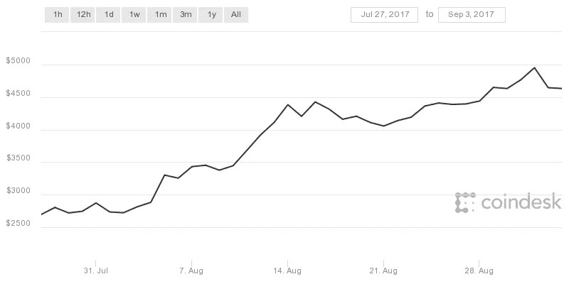
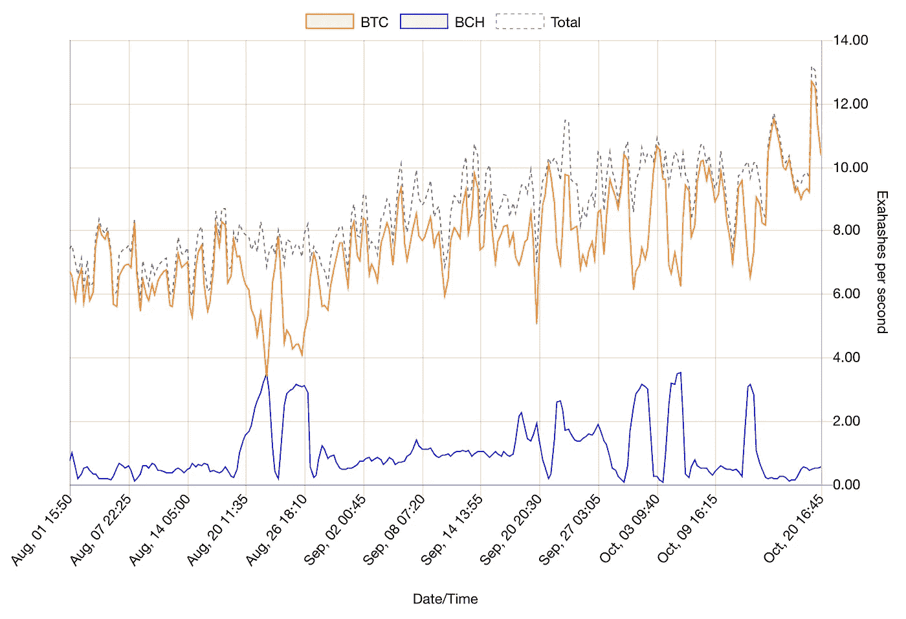
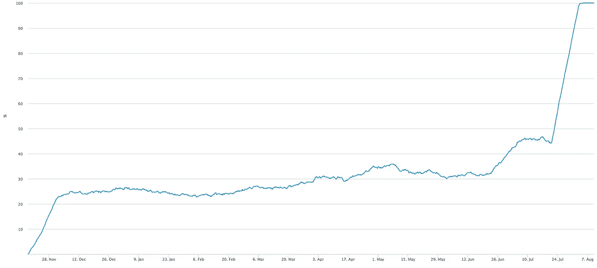
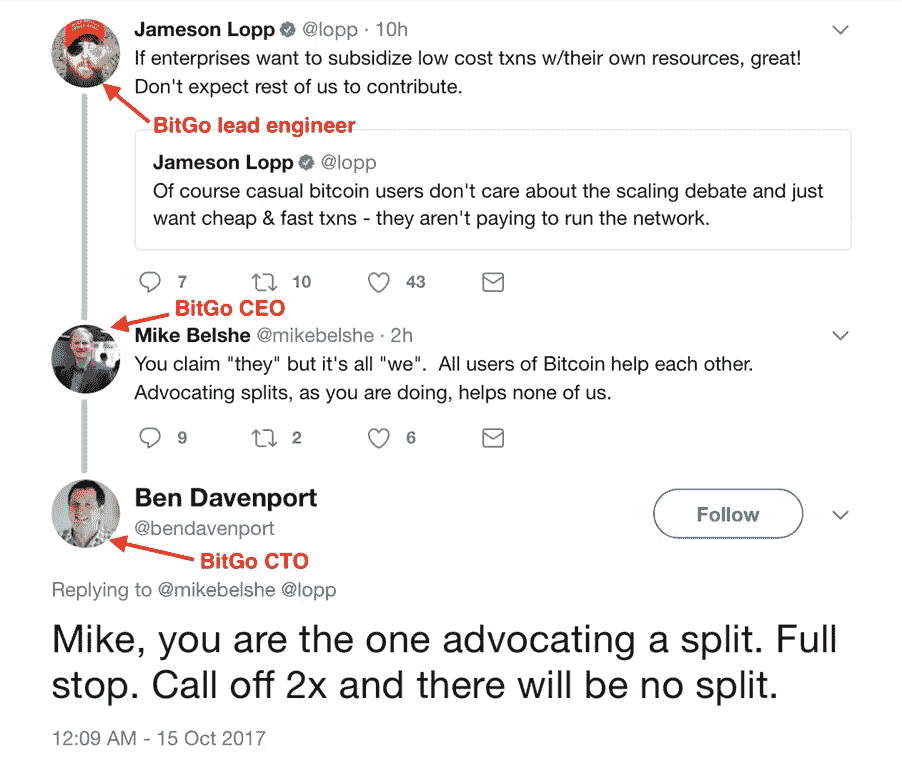

# 比特币分叉(再次)会发生什么？

> 原文：<https://medium.com/hackernoon/whats-going-to-happen-when-bitcoin-forks-again-eef7a088a6d9>

缩放争论已经肆虐多年，现在[比特币](https://hackernoon.com/tagged/bitcoin) [网络](https://hackernoon.com/tagged/network)将在 494，784 块([大约 11 月 16 日](https://bashco.github.io/2x_Countdown/))再次分叉，作为著名的“[纽约协议](/@DCGco/bitcoin-scaling-agreement-at-consensus-2017-133521fe9a77)”的结果。

8 月 1 日比特币现金(BCH)推出[，比特币社区经历了第一次硬分叉。这是比特币历史上的一个重大事件，可能导致了 BTC 价格从大约 2800 美元迅速飙升至大约 4800 美元(8 月 31 日](/@jimmysong/bitcoin-cash-what-you-need-to-know-c25df28995cf)):

*Hard to complain when the price does that!*

这一次，情况有所不同。

**比特币现金硬分叉**

当 BCH 启动时，它让社区有些吃惊。由于发射的最后一分钟的性质，未来会发生什么还有一些不确定性。比特币现金使用相同的地址格式(1aBcD…代表单键地址)，在分叉时共享相同的交易历史(从而共享余额)，并且具有非常相似的软件，因此它看起来和感觉上都很像普通的比特币。

当时和现在的最大区别在于:

1.  社区中只有极少数人支持比特币现金。不管你对区块大小有什么看法，[隔离证人有一大堆好处](https://bitcoincore.org/en/2016/01/26/segwit-benefits/)，比特币现金不怕麻烦地移除了那些代码(还有 [RBF](https://bitcoincore.org/en/faq/optin_rbf/) )。比特币现金旨在为那些不喜欢常规比特币发展方向的人提供一种替代选择。
2.  当时没有主要玩家认为比特币现金是真正的比特币，尽管罗杰·维尔的 bitcoin.com 最近提出了这种说法。它在交易所被列为 BCH。值得注意的是，关于“比特币现金”和“bcash”的名称一直存在一些分歧。
3.  比特币现金实现了一种叫做强双向重放保护的东西，这意味着在比特币网络上发生的交易不能在比特币现金网络上重放，反之亦然。

比特币现金并没有直接试图取代比特币，而是提供了一条不同的道路。这样做的结果是，两条链条可以和平共处，这大概就是所发生的情况。比特币现金现在可以实现它认为最好的各种变化，而不必获得更大的比特币社区的批准，这正是他们正在做的事情。

我认为，与之前相比，分手后双方似乎都更开心了。

**重放保护**

Segwit2x 硬分叉(或者我称之为 B2X 前进)没有强大的重放保护。最初，它没有重放保护，然后[杰夫·加济克增加了选择加入重放保护](https://github.com/btc1/bitcoin/commit/a3c41256984bf11d95a560ae89c0fcbadfbe73dc)(很好的解释[这里是](https://bitcointechtalk.com/how-segwit2x-replay-protection-works-1a5e41767103))，他后来在比特币核心开发者发现一个安全漏洞后移除了这个[。Garzik 目前有另一个提议，只给 B2X 添加弱重放保护。这是有意设计的:](https://github.com/btc1/bitcoin/commit/98c0af58c29efbecba25818adb5531fa8c3d0506)

Who is doing the“breaking” depends on which you think is the “real” bitcoin.

这意味着，当在一个区块链上交易时，最终用户必须非常小心，以确保他们不会意外地在另一个上损失资金。例如， [Bittrex 目前的跨链政策是仅退还超过 5000 美元的交易](https://support.bittrex.com/hc/en-us/articles/115000961172)(同时收取 0.1%的 BTC 费用)，这实际上是一个相当好的结果，因为您最终可能会收回大部分资金。每家比特币服务公司都将不得不争先恐后地编写定制的会计和交易管理软件来处理这一问题，尽管至少他们已经做好了这样做的准备。紧张气氛如此之高，以至于一名软件工程师最近被打了[并发布了以下内容:](https://techcrunch.com/2017/10/17/bitcoin-engineer-jameson-lopp-swatted-by-angry-crypto-fans/)

Standard bitcoin software engineer desk configuration. Using a mousepad with an optical mouse is a bizarre setup, but who am I to judge?

即使没有强大的重放保护，精明的钱包用户也有可能构建不能在另一个链上重放的交易。这是通过确保您的事务包含一个输入来实现的，该输入在硬分叉后跟踪其部分血统到块奖励事务。这样，交易在另一个链上将是无效的。管理这个过程非常困难，特别是对于访问区块链数据有限的轻客户端。

**投资者**

投资者赋予了比特币网络价值。和黄金一样，比特币几乎没有内在价值，只值别人愿意支付的价格。[投资者目前对比特币核心的估值比 B2X 高出约 6 倍](https://www.reddit.com/r/Bitcoin/comments/77b042/both_b2x_futures_markets_have_2x_at_015_btc_why/dokfbyz/):

You’re going to need a big tinfoil hat to explain this away

虽然预测市场是不完美的(由于交易对手风险、流动性、[偏差合约](/@olivierjanss/why-bitfinexs-chain-split-tokens-are-completely-biased-towards-the-small-block-side-again-698395bae619)等)，但它们是我们最好的预测者。多个预测市场的投资者一致认为比特币核心的价值将远远超过 B2X。

**矿工**

目前， [~85%的比特币区块表示，他们希望看到 Segwit2x](https://coin.dance/blocks) 的推出。请记住，信号是没有约束力的，众所周知，矿工信号的软件，他们实际上并不运行。从历史上看，全区块链的矿商总是追求利润:

The peaks in BCH mining are miners hopping over from BTC to BCH and back after each BCH Emergency Difficulty Adjustment (EDA) kicks in ([source](https://fork.lol/pow/hashrate)).

除了极端意识形态的情况，矿工们把他们的权力指向最有利可图的地方。运行他们的设备会产生他们必须支付的可变成本，所以矿工们有额外的动机跟着钱走。

请记住，segwit 在矿工中的支持率数月来一直徘徊在 30%左右，几乎在一夜之间飙升。虽然矿商可能会发出一个信号，但在紧要关头，他们历来都避免站在链条断裂的错误一边:

Segwit activaition looked very unlikely to meet the required 80% threshold for a long time ([source](https://blockchain.info/charts/bip-9-segwit))

**开发者**

如果你检查一下[Bt C1 回购](https://github.com/btc1/bitcoin)上的提交，你会发现它并没有被非常积极地开发。相比[熙熙攘攘的比特币核心回购](https://github.com/bitcoin/bitcoin/)，简直就是鬼城。

B2X 支持者的一个常见论点是，比特币核心的贡献者(大部分是无偿的)将在分叉后开始为 B2X 做出贡献。那纯粹是幻想:

Click the tweet to see the overwhelming statements backing this up

B2X 押注它将吸引新人才，但我不会屏息以待。这是一个非常复杂的协议，有一个陡峭的学习曲线。

从一个拥有经验丰富的团队和长期稳定软件记录的加密货币转向一个几乎没有开发者的新货币，这是一个大胆的举动。

**负外部性**

自从比特币现金分叉以来，事情进展顺利，很容易相信未来的硬分叉也会同样成功。请记住，分开的硬叉子会导致许多问题:

*   *命名*:有了比特币、比特币现金、B2X，还有(很快)[比特币黄金](https://bitcointechtalk.com/bitcoin-gold-what-you-need-to-know-8b3e645be409)，新人就变得很难理解是怎么回事了。
*   *用户体验*:这些区块链不仅交易历史相同，而且地址格式相同，会导致用户将资金汇错区块链！
*   *税收*:目前还不清楚监管机构是否会将这些视为空投(可能需要纳税)或股票分割(不需要纳税)。
*   *隐私*:由于多个区块链现在共享相同的交易历史，一个区块链上的未来交易可能会泄露另一个的隐私信息。这很难管理。
*   *公司支持*:许多服务实际上被迫支持他们本来不会支持的替代服务，包括额外的工程、会计、安全和支持工作。这甚至可能不是这些服务的选择，因为有人可能会说，他们有信托责任传递持有最终用户私钥的成果。
*   *安全性*:拥有世界上大量高性能的 SHA256 ASICs，更容易对比特币发起 51%的攻击。顺便提一下，比特币现金执行不力的紧急难度调整(EDA)导致区块链之间不必要的权力波动，但这主要只会伤害比特币现金。
*   *区块链膨胀*:如何防止重放交易的不确定性可能会导致用户在花费资金之前在自己的钱包之间分割交易中的硬币，对一个(或两个)区块链造成一点污染。

上一次，想要用更大的块(比特币现金)与 segwit(比特币核心)进行扩展的人之间存在巨大的信仰差异。这一次，两派争论的是一个相对较小的差异(1MB 对 2MB 基本数据块)，而这发生在我们刚刚有效地将有效数据块容量增加一倍之后(通过 segwit)。这场辩论实际上是我们认为比特币应该如何改变，以及我们认为谁有能力改变它。

这是好是坏？

Yikes

**那么，会发生什么呢？**

我真希望我能预测未来！我不确定，但以下是我的最佳猜测…

**会有停机时间**

比特币服务将在硬盘分叉之前自愿停止网络交易，并在之后的一段时间内保持沉默，等待尘埃落定。可能有大量的交易机会，这些机会只对在各种托管服务中持有预注资余额的用户可用。

**比特币核心(遗产)链不会死**

在不太可能的最坏情况下，比特币区块链实际上被降低到 15%的哈希功率，它将更难使用。大约 10 分钟的阻塞现在需要 [~67 分钟](https://www.google.com/search?q=10+%2F+15%25)，这将极大地限制交易吞吐量，并导致交易费用上升。通常需要两周(2016 个方块)的难度调整现在需要 [13+周](https://www.google.com/search?q=2016*10+minutes+%2F+15%25+in+weeks&oq=2016*10+minutes+%2F+15%25+in+weeks)，所以这些缓慢的方块时间(和低吞吐量)会持续一段时间。这可不好。虽然用户的交易体验在几个月内会很糟糕，但[霍德尔斯](https://www.urbandictionary.com/define.php?term=hodl)不会受到影响(支持传统比特币的人群)。请记住，为了真正挖掘 B2X，你必须安装新软件(而不是继续运行旧软件来挖掘比特币)。

*以上假设矿工不关心自己的利润。*如果预测市场可信，分叉后的比特币核心将价值~ 6 倍的钱。即使是强大的卡特尔也会试图经营一些(大多数？)在传统的比特币网络上匿名使用其哈希功能，以获得一些甜蜜的利润。在经历了令人痛苦的 2016 个区块之后，传统比特币的难度将会下降(假设 hashpower 没有变化)，从而使传统比特币挖掘成为一项更好的交易(假设价格没有变化)。

**比特币的支持者一直非常热情，并将继续如此**

有[很多公司不喜欢 B2X](http://segwit.party/nya/) 并且比特币核心拥有狂热的用户群，他们中的许多人运行自己的完整节点。

*然而，如果期货市场是错的，传统比特币的价值远低于 B2X，这将极大地改变格局。开采比特币可能会变得无利可图，以至于比特币停止流通，因为开采一块比特币太过昂贵。到那时，传统比特币存活的唯一方式就是证明工作发生了变化(也就是核选项):*

This is the potential problem [bitcoin gold](http://btcgpu.org/) is trying to solve. Premature optimization or useful insurance policy?

**B2X 连锁似乎有可能推出**

B2X 得到了该领域一些最大公司的支持(廉价的链上交易会更好地服务于这些公司的业务):BitPay、blockchain.info、比特币基地、Xapo、ShapeShift 等等。B2X 也有 [~85%矿工](https://coin.dance/blocks)的支持。

这是多年争论的高潮，这关系到很多人的骄傲和自负。这已经成为一个有点情绪化的问题。简单的对话很快升级为幼稚的辱骂:

This is the CEO of a company that may be worth $1 BN! Who would’ve thought a discussion on blockchain scaling would be NSFW?

**B2X 链条可能会很快死亡**

尽管不太可能，但鉴于纽约协议的签署者数量，B2X 的支持者相当沉默。许多强烈喜欢更大块的人在此之前很久就离开了生态系统，从事其他项目，如比特币现金和替代币。

除了杰夫·加齐克，今天很难找到积极倡导 B2X 的杰出比特币创造者。Xapo 和比特币基地是著名的 NYA 签署者，并且各自发表声明(见 [Xapo 在此](https://blog.xapo.com/about-the-bitcoin-segwit2x-update/)和[比特币基地在此](https://blog.coinbase.com/update-on-the-bitcoin-segwit2x-hard-fork-69426f14bc85))关于他们将如何支持用户的两个分叉，但是最近他们都没有积极地表示支持 B2X。令我感到惊讶的是，一些私下与我交谈的 NYA 参与者不想公开发表声明(请记住，这是一个非常分裂的社区，社交媒体不幸变得有点有毒)。如果他们中的任何人愿意，我很乐意在这里发表他们。

BitGo 首席执行官 Mike Belshe 刚刚发表了一篇支持 Segwit2x 的文章，称之为“[保持社区团结](/@mikebelshe/keeping-the-community-together-5c4dcda7aeb4)”，尽管[该公司似乎存在分歧](https://www.reddit.com/r/Bitcoin/comments/76fp7p/bitgo_is_a_weird_company/):

Is this what your water cooler conversations are like at the office?

[罗杰·弗(又名“比特币耶稣”)同意交易 1000 BTC(！)1000 只 B2X](https://twitter.com/SatoshiLite/status/921701035491573761) 分布在较小的鲸群中，本·达文波特、查理·李、亚历克斯·莫科斯和图尔·德米斯特:

Kids growing up these days are going to be very confused when they learn that gambling is in fact illegal.

Trace Meyer 出价 25000 BTC(！)贸易，罗杰没有回应:

That’s like a gazillion satoshis!

B2X 押注于拥有多数哈希能力，SPV 节点将紧随其后。如果多数哈希功能不成功，B2X 硬币的价值如期货市场预测的那样低，那么对矿商来说，在哈希上花费资源可能不值得。没有紧急难度调整，B2X 可能会被 DOA。

**重播保护将是一个问题**

虽然比特币服务应该足够智能，能够保护自己免受交易重放的影响，但一些管理自己私钥的用户会无意中让自己的交易重放。期待在 reddit、twitter 和其他地方看到大量关于赔钱的恐怖故事。希望大多数公司(最终)会退还这些交易中的大部分，但 P2P 用户可能不会这么慷慨。

不幸的是，这里的赢家将是 altcoins:(

**当尘埃落定，指责开始了**

分叉结束后，衡量成功的最佳标准将是价格。

如果新的 Segwit2x 硬币比传统比特币更值钱，它就赢了。旧硬币仍将被一些信徒使用，而新的 segwit2x 硬币可能会被冠以真正的比特币。这两个阵营之间会有很多怨恨，但好消息是他们可以分道扬镳了。Segwit2x 阵营将能够宣布胜利，并为为什么首先需要缺乏重播保护进行辩护。那些反对多数派 hardfork 的人将被贴上比特币敌人的标签，并因阻碍进步而遭到诋毁。

如果新的 Segwit2x 硬币的价值低于传统比特币，那么它就输了。新硬币可能仍被一些信徒使用，或者完全消亡。这两个阵营之间将会有很多的怨恨，core 将会有更多的软实力来引导协议的前进方向。我们可能会看到[新特性](https://bitcoincore.org/en/2015/12/23/capacity-increases-faq/)的快速发布(聚合的 schnorr 签名、merklized 抽象语法树、侧链、IBLT、弱块等等)。少数派 hardfork 的支持者将被贴上比特币敌人的标签，并因阻碍进步而遭到诋毁。

Honey badger don’t care… about which fork you favor.

给我买些爆米花

这将是一场精彩的演出。将会有关于哪个是真正的比特币的争论，一个/两个分叉的价格可能会崩溃或反弹，阻塞时间将会减少，矿工可能会跳槽(并对此撒谎！)，仓促推出的新软件可能会有 bug，等等。

The 21st century equivalent of a soldier’s war drum. Are you intimidated?

**免责声明**

请记住，这种情况是不断变化的。令人惊讶的是，我们距离比特币网络有史以来最大的变化只有不到一个月的时间，仍然不知道 B2X 上将存在什么(如果有的话)重播保护。比特币核心在做出改变时一直非常缓慢和谨慎，强烈倾向于向后兼容，而 B2X 则采取了不同的方式。

我们处在一个未知的领域，拥有一种目前价值近 1000 亿美元的货币。

That’s a lot of money! Only a cartoon madman would be cavalier about that.

感谢所有评论和评论这篇文章的人。