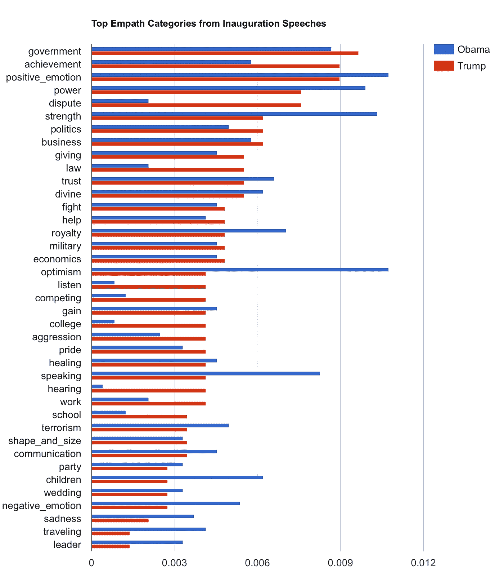

# 就职演说有什么内容？基于 Empath 的词汇分析

> 原文：<https://medium.com/hackernoon/whats-in-an-inauguration-speech-a-lexical-analysis-via-empath-bf9a5eb90b76>

去年我们发表了文本分析工具 Empath，它有幸获得了中国大学的最佳论文奖。Empath 允许研究人员在比现有词汇更大的类别集上分析文本(例如，“暴力”、“抑郁”或“政治”)，它可以使用基于[神经嵌入](https://papers.nips.cc/paper/5021-distributed-representations-of-words-and-phrases-and-their-compositionality.pdf)和[众包](https://en.wikipedia.org/wiki/Crowdsourcing)的模型按需生成新的词汇。

我们已经将 Empath 作为开源 [Python 库](https://github.com/Ejhfast/empath-client)发布，我们希望有更多的研究人员将它应用到他们的工作中。鉴于最近媒体对特朗普总统在就职演说中使用的前所未有的语言的讨论，这似乎是一个展示 Empath 能做什么的好机会。

那么，我们应该如何分析一篇就职演说呢？我们可能会问很多问题，但我将重点关注特朗普总统的就职演讲与奥巴马总统的不同之处，因为他在 2009 年开始了他的第一个任期。一般来说，采用比较的观点会使词汇分析更容易解释。比如，考虑一下这些说法:*“特朗普的讲话很愤怒”**“特朗普的讲话比奥巴马的讲话更愤怒”。愤怒言论的门槛并不明确(这有点哲学意味:在什么程度上我们认为一个言论是愤怒的？)，但是很容易判断一个演讲是否比另一个演讲更让 T21 生气。在这种情况下，我们的比较会问:Empath 在特朗普演讲中识别的信号与奥巴马演讲中的相同信号相比如何？*

首先，我下载了两次就职演说的文字记录。你可以在这里找到川普总统的，在这里找到欧巴马总统的。然后，我使用 Empath 库编写了一个简短的 [Python](https://hackernoon.com/tagged/python) 脚本。

上图中，Empath 浏览了每篇演讲中的单词，并计算了属于其词汇类别的单词数。例如，单词“流血”将增加伤害和暴力*的类别，或者单词“希望”将增加乐观*和积极情绪*的类别。***

然后，我将得到的分类计数输入到 [Google Docs](https://docs.google.com/spreadsheets/d/16_Oz4zW1xBkvh2jKgnuit5vdneLx5VLhNw_1qut04PQ/edit?usp=sharing) 中，经过一段时间的数据争论，我得出了下面的图表:

Here the x-axis depicts a normalized word count for each category (the number of words that fall into each category, divided by the the total number of words in the speech).

那么，我们该怎么做呢？我的第一反应是，在许多方面，这些演讲是相似的。例如，川普和欧巴马都使用强烈暗示*政府*、*积极情绪*、*权力、力量*和*政治*的语言。在较小的程度上，这两个演讲还传达了你可能会看到的其他信号，比如军事**经济**工作*或者恐怖主义*。无论是谁发表就职演说，都有一定的传统。**

**但是演讲之间的差异也是引人注目的。虽然两位总统都采用了成就的语言(例如，“赢”或“完成”)，但特朗普比奥巴马更经常使用这些词。同样，奥巴马的演讲包含相对较少的*争议*(如“不同意”、“坚持己见”或“战斗”)或*侵略*(如“危险”、“愤怒】)*、*、特朗普的演讲在这些信号中要强烈得多。另一方面，与川普相比，欧巴马的演讲包含了大量的*乐观主义*，尽管总体而言，欧巴马的演讲传达了类似的积极情绪*。***

**你会在其他地方找到对个别段落更细致入微的考虑，但这里是特朗普总统演讲的摘录，我认为它代表了整体基调:**

> **在我们的市中心，母亲和儿童陷入贫困；锈迹斑斑的工厂像墓碑一样散布在我们国家的风景中；一个资金充裕的教育体系，却让我们年轻漂亮的学生被剥夺了知识；犯罪、帮派和毒品夺走了太多人的生命，剥夺了我们国家如此多未实现的潜力。**
> 
> **这场美国大屠杀就在这里停止，现在就停止。**

**同样的，节选自奥巴马总统的:**

> **今天，我们聚集在一起，因为我们选择了希望而不是恐惧，选择了团结而不是冲突和不和。在这一天，我们来宣布结束琐碎的不满和虚假的承诺，结束长期以来扼杀我们政治的相互指责和陈旧的教条。我们仍然是一个年轻的国家。但是用圣经的话说，是时候抛弃幼稚的东西了。重申我们持久精神的时候到了；选择我们更好的历史；让这份珍贵的礼物、这种崇高的理念代代相传:上帝赐予的承诺，即人人平等、人人自由、人人都有机会追求最大程度的幸福。**

**现在，也许你已经读过这些演讲了；也许你有自己的解读。但是 Empath 的主要好处是，你可以发现高层次的词汇信号*，而不需要仔细观察演讲*。在这里，这可能看起来很懒惰:当你只是关心翻译两篇演讲时，很容易就能把它们都读完。但是随着你感兴趣的文本变得越来越大——例如，Reddit 上的[数百万条评论](https://arxiv.org/pdf/1609.00425v1.pdf)，或者《纽约时报》发表的每一篇文章——自己阅读和解释所有文本变得不可能。这时，像 Empath 这样的工具就可以介入，帮助您进行分析。**

************

> **[黑客中午](http://bit.ly/Hackernoon)是黑客如何开始他们的下午。我们是 [@AMI](http://bit.ly/atAMIatAMI) 家庭的一员。我们现在[接受投稿](http://bit.ly/hackernoonsubmission)并乐意[讨论广告&赞助](mailto:partners@amipublications.com)机会。**
> 
> **如果你喜欢这个故事，我们推荐你阅读我们的[最新科技故事](http://bit.ly/hackernoonlatestt)和[趋势科技故事](https://hackernoon.com/trending)。直到下一次，不要把世界的现实想当然！**

****