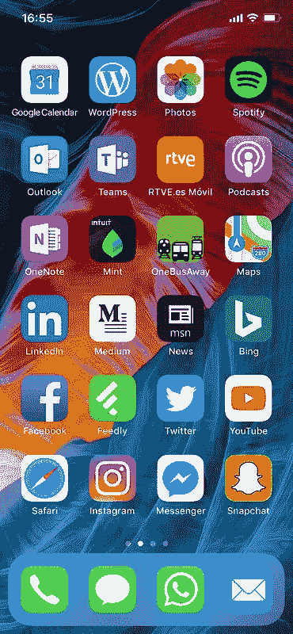

# 我手机的主屏幕上有什么？

> 原文：<https://medium.com/hackernoon/whats-in-my-phone-s-home-screen-ffc9fede52ed>

2017 年就要结束了，所以我想谈谈今年占据了我手机上最重要空间的应用程序，以及我是否认为它们明年还会存在。

先说我的主屏幕截图:

我根据使用频率将应用程序放在主屏幕上。我尽量减少去主屏幕其他页面的次数，所以这些是真正让我坚持下去的应用。但是，所有这些应用对我的日常技术工作同样重要吗？明年他们还会留在这么突出的位置吗？让我们把它们分成几类。

**联系朋友&家人**

Messages、WhatsApp、Facebook Messenger 和 Mail 对于与家人和朋友保持联系绝对至关重要，尤其是那些在其他国家的人。我确信我会把它们留在身边，因为它们是我每天早上检查的第一件事。

脸书、Instagram 和 Snapchat 已经成为 2017 年一个有趣迁移的一部分:我的大多数[朋友不再在脸书](https://geekonrecord.com/2017/02/18/why-did-you-stop-posting-on-facebook/)上发帖，并在他们的帖子有 24 小时有效期的应用程序上变得更加活跃。到目前为止，我的大多数朋友都在选择 Instagram，可能是因为它有一个经典的永恒帖子简介；在被 Instagram 大举收购后，Snapchat 将很难恢复，所以如果 Snapchat 在接下来的一年里没有在我的手机上出现，我不会感到惊讶。

**消费娱乐内容&新闻**

我不再将 Twitter 或 YouTube 视为简单的社交网络；我使用这些应用程序来阅读新闻和媒体内容。我可以看到世界上的流行趋势，或者我可以关注我想要的创作者，并获得与我的兴趣直接匹配的内容。Twitter 没有死(即使你不用它来联系朋友)，YouTube 也不会被 Snapchat 取代(至少在未来一年内不会),成为我的主要视频提供商。

Feedly、LinkedIn 和 MSN News(我习惯在一个地方阅读许多西班牙报纸)也让我了解信息，但它们通常是我日常工作中的第二来源。Feedly 在那里是因为我在那里保存我的旧 RSS 收藏([安息吧，Google Reader](https://googleblog.blogspot.com/2013/03/a-second-spring-of-cleaning.html) )，它是最有可能一年都做不到的应用程序。

现在，关于播客应用程序:我承认这听起来可能很奇怪，但我第一次听播客是在几个月前。考虑到播客是一种相对古老的音频广播形式，这可能令人惊讶，但我没有找到令人信服的理由来尝试它，直到我发现了这个令人惊叹的播客。然后，我向脸书寻求播客推荐，我的朋友们给了我足够多的标题供我使用。这个应用程序是一个守护者。

**工具**

这一类别也很重要，但如果市场上出现更好的替代产品，单个应用很容易被替代。我使用许多苹果股票应用程序，因为它们集成在 iOS 中，但我并不太喜欢它们。事实上，我已经替换了一些第一方应用程序:用 OneNote 替换了 Notes，用 Google Calendar 替换了 Calendar，用 Spotify 替换了 Music。

我对苹果地图又爱又恨:谷歌地图有更好的内容，但我喜欢苹果的设计，它通常能找到我要找的东西。我在 2017 年期间至少在谷歌地图和苹果地图之间来回切换了两次，所以我们可以正式称这是一个未解决的情况。

WordPress 和 Medium 是我基本的博客工具:尽管 geekonrecord.com 在 WordPress.com、[举办，我也在 Medium](/@geekonrecord) 发表文章(2017 年 10 月，我开始在 [Medium 的 Breathe 刊物](/@breathe.publication)上发表我的一些文章)。可以肯定地说，只要我继续写作，这些应用程序就会一直留在我的主屏幕上。

**工作**

这听起来可能是我主屏幕上最无聊的部分，但作为一名微软员工，我喜欢使用 Outlook 这样的应用程序，这是一个比苹果邮件应用程序好得多的电子邮件客户端(我用这两个程序来区分我的个人和工作邮件)，或者 Teams，这是微软对 Slack 的回应。

下一步是什么？明年我的主屏幕上会出现哪些新应用？随着增强现实(AR)的普及，我希望在 2018 年看到新的令人兴奋的应用程序:社交媒体和 AR 之间的成功交叉可能会极大地改变哪些应用程序停留在宝贵的主屏幕上。未来不会来得太快。

你喜欢这篇文章吗？ [**每月订阅**](https://geekonrecord.com/subscribe/) **一篇新帖。**

*图片来自我自己的手机，壁纸由**提供*

**原载于 2017 年 12 月 4 日*[*geekonrecord.com*](https://geekonrecord.com/2017/12/04/whats-in-my-phones-home-screen/)*。**